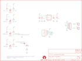

Contents
========

* [PRS10995 > GPS Evaluation Board GP-2106](#prs10995--gps-evaluation-board-gp-2106)
	* [Schematic](#schematic)
	* [PCB](#pcb)
	* [Interactive BOM](#interactive-bom)
	* [OOMP Parts](#oomp-parts)
	* [Images](#images)
	* [Tags](#tags)
  
![][im]
# PRS10995 > GPS Evaluation Board GP-2106

- ID: PROJ-SPAR-10995-STAN-01
- Hex ID: PRS10995
- Name: Sparkfun
- Description: Sparkfun
- Long Link: [http://oom.lt/PROJ-SPAR-10995-STAN-01](http://oom.lt/PROJ-SPAR-10995-STAN-01)
- Short Link: [http://oom.lt/PRS10995](http://oom.lt/PRS10995)

## Schematic
  

## PCB
  

## Interactive BOM

- Interactive BOM page: [ibom.html](https://htmlpreview.github.io/?https://github.com/oomlout/oomlout_OOMP_projects/blob/main/PROJ-SPAR-10995-STAN-01/kicad/bom/ibom.html)

## OOMP Parts
  

|OOMP Parts|
| :---: |
|C1 C1,CAPC-0402-X-UF1-01|
|C2 C2,CAPX-UNMATCHED-X-UF10-01|
|C3 C3,CAPC-0402-X-UF1D-01|
|C4 C4,CAPX-UNMATCHED-X-UF10-01|
|JP1 JP1,HEAD-I01-X-PI01-01|
|JP6 JP6,UNMATCHED-UNMATCHED-X-UNMATCHED-01|
|JP7 JP7,HEAD-I01-X-PI01-01|
|[LED1 LEDS-0603-G-STAN-01 SMD (0603) Green LED](https://github.com/oomlout/oomlout_OOMP_parts/tree/main/LEDS-0603-G-STAN-01/)|
|Q1 Q1,UNMATCHED-SO23-X-UNMATCHED-01|
|Q2 Q2,UNMATCHED-SO23-X-UNMATCHED-01|
|Q3 Q3,UNMATCHED-SO23-X-UNMATCHED-01|
|Q4 Q4,UNMATCHED-SO23-X-UNMATCHED-01|
|[R1 RESE-0402-X-O103-01 SMD (0402) 10k Ohm Resistor](https://github.com/oomlout/oomlout_OOMP_parts/tree/main/RESE-0402-X-O103-01/)|
|[R2 RESE-0402-X-O103-01 SMD (0402) 10k Ohm Resistor](https://github.com/oomlout/oomlout_OOMP_parts/tree/main/RESE-0402-X-O103-01/)|
|[R3 RESE-0402-X-O103-01 SMD (0402) 10k Ohm Resistor](https://github.com/oomlout/oomlout_OOMP_parts/tree/main/RESE-0402-X-O103-01/)|
|[R4 RESE-0402-X-O103-01 SMD (0402) 10k Ohm Resistor](https://github.com/oomlout/oomlout_OOMP_parts/tree/main/RESE-0402-X-O103-01/)|
|[R5 RESE-0402-X-O103-01 SMD (0402) 10k Ohm Resistor](https://github.com/oomlout/oomlout_OOMP_parts/tree/main/RESE-0402-X-O103-01/)|
|[R6 RESE-0402-X-O103-01 SMD (0402) 10k Ohm Resistor](https://github.com/oomlout/oomlout_OOMP_parts/tree/main/RESE-0402-X-O103-01/)|
|[R7 RESE-0402-X-O103-01 SMD (0402) 10k Ohm Resistor](https://github.com/oomlout/oomlout_OOMP_parts/tree/main/RESE-0402-X-O103-01/)|
|[R8 RESE-0402-X-O103-01 SMD (0402) 10k Ohm Resistor](https://github.com/oomlout/oomlout_OOMP_parts/tree/main/RESE-0402-X-O103-01/)|
|R9 R9,RESE-0402-X-UNMATCHED-01|
|S1 S1,UNMATCHED-UNMATCHED-X-UNMATCHED-01|
|U1 U1,UNMATCHED-UNMATCHED-X-UNMATCHED-01|
|U2 U2,UNMATCHED-UNMATCHED-X-UNMATCHED-01|

## Images
  
  

|kicadPcb3d|kicadPcb3dFront|kicadPcb3dBack|eagleImage|eagleSchemImage|
| :---: | :---: | :---: | :---: | :---: |
||||||

## Tags

- hexID: PRS10995
- oompType: PROJ
- oompSize: SPAR
- oompColor: 10995
- oompDesc: STAN
- oompIndex: 01
- oompName: GPS Evaluation Board GP-2106
- sources: All source files from https://github.com/sparkfun/GPS_Evaluation_Board_GP-2106 (source licence details in srcLicense.md)
- linkBuyPage: https://www.sparkfun.com/products/10995
- oompID: PROJ-SPAR-10995-STAN-01
- oompParts: C1,CAPC-0402-X-UF1-01
- oompParts: C2,CAPX-UNMATCHED-X-UF10-01
- oompParts: C3,CAPC-0402-X-UF1D-01
- oompParts: C4,CAPX-UNMATCHED-X-UF10-01
- oompParts: JP1,HEAD-I01-X-PI01-01
- oompParts: JP6,UNMATCHED-UNMATCHED-X-UNMATCHED-01
- oompParts: JP7,HEAD-I01-X-PI01-01
- oompParts: LED1,LEDS-0603-G-STAN-01
- oompParts: Q1,UNMATCHED-SO23-X-UNMATCHED-01
- oompParts: Q2,UNMATCHED-SO23-X-UNMATCHED-01
- oompParts: Q3,UNMATCHED-SO23-X-UNMATCHED-01
- oompParts: Q4,UNMATCHED-SO23-X-UNMATCHED-01
- oompParts: R1,RESE-0402-X-O103-01
- oompParts: R2,RESE-0402-X-O103-01
- oompParts: R3,RESE-0402-X-O103-01
- oompParts: R4,RESE-0402-X-O103-01
- oompParts: R5,RESE-0402-X-O103-01
- oompParts: R6,RESE-0402-X-O103-01
- oompParts: R7,RESE-0402-X-O103-01
- oompParts: R8,RESE-0402-X-O103-01
- oompParts: R9,RESE-0402-X-UNMATCHED-01
- oompParts: S1,UNMATCHED-UNMATCHED-X-UNMATCHED-01
- oompParts: U1,UNMATCHED-UNMATCHED-X-UNMATCHED-01
- oompParts: U2,UNMATCHED-UNMATCHED-X-UNMATCHED-01
- rawParts: C1,1uF,CAP0402-CAP,0402-CAP,Capacitor,,
- rawParts: C2,10uF,CAP_POL1206,EIA3216,Capacitor Polarized,,
- rawParts: C3,0.1uF,CAP0402-CAP,0402-CAP,Capacitor,,
- rawParts: C4,10uF,CAP_POL1206,EIA3216,Capacitor Polarized,,
- rawParts: JP1,M01PTH,M01PTH,1X01,Header 1,,
- rawParts: JP2,STAND-OFF,STAND-OFF,STAND-OFF,Stand Off,,
- rawParts: JP3,STAND-OFF,STAND-OFF,STAND-OFF,Stand Off,,
- rawParts: JP4,LOGO-SFESK,LOGO-SFESK,SFE-LOGO-FLAME,Spark Fun Electronics PCB Logo,,
- rawParts: JP5,LOGO-SFENEW,LOGO-SFENEW,SFE-NEW-WEBLOGO,Spark Fun Electronics PCB Logo,,
- rawParts: JP6,FTDI_BASICPTH,FTDI_BASICPTH,FTDI_BASIC,FTDI Basic: 3.3V and 5V,,
- rawParts: JP7,M01PTH,M01PTH,1X01,Header 1,,
- rawParts: JP8,FIDUCIALUFIDUCIAL,FIDUCIALUFIDUCIAL,MICRO-FIDUCIAL,Fiducial Alignment Points,,
- rawParts: JP9,FIDUCIALUFIDUCIAL,FIDUCIALUFIDUCIAL,MICRO-FIDUCIAL,Fiducial Alignment Points,,
- rawParts: LED1,red,LED0603,LED-0603,LEDs,,
- rawParts: Q1,MOSFET-NCHANNELSMD,MOSFET-NCHANNELSMD,SOT23-3,,,
- rawParts: Q2,MOSFET-NCHANNELSMD,MOSFET-NCHANNELSMD,SOT23-3,,,
- rawParts: Q3,MOSFET-NCHANNELSMD,MOSFET-NCHANNELSMD,SOT23-3,,,
- rawParts: Q4,MOSFET-NCHANNELSMD,MOSFET-NCHANNELSMD,SOT23-3,,,
- rawParts: R1,10k,RESISTOR0402-RES,0402-RES,Resistor,,
- rawParts: R2,10k,RESISTOR0402-RES,0402-RES,Resistor,,
- rawParts: R3,10k,RESISTOR0402-RES,0402-RES,Resistor,,
- rawParts: R4,10k,RESISTOR0402-RES,0402-RES,Resistor,,
- rawParts: R5,10k,RESISTOR0402-RES,0402-RES,Resistor,,
- rawParts: R6,10k,RESISTOR0402-RES,0402-RES,Resistor,,
- rawParts: R7,10k,RESISTOR0402-RES,0402-RES,Resistor,,
- rawParts: R8,10k,RESISTOR0402-RES,0402-RES,Resistor,,
- rawParts: R9,0.27,RESISTOR0402-RES,0402-RES,Resistor,,
- rawParts: S1,SWITCH-MOMENTARY-2SMD,SWITCH-MOMENTARY-2SMD,TACTILE_SWITCH_SMD,,,
- rawParts: SJ1,SOLDERJUMPERTRACE,SOLDERJUMPERTRACE,SJ_2S-TRACE,Solder Jumper,,
- rawParts: U$7,OSHW-LOGOS,OSHW-LOGOS,OSHW-LOGO-S,Open Source Hardware Logo This logo indicates the piece of hardware it is found on incorporates a OSHW license and/or adheres to the definition of open source hardware found here: http://freedomdefined.org/OSHW,,
- rawParts: U$8,CREATIVE_COMMONS,CREATIVE_COMMONS,CREATIVE_COMMONS,,,
- rawParts: U1,GP-2106,GP-2106,GP-2106,GP-2106 GPS SiRF IV,,
- rawParts: U2,V_REG_LDOSMD2,V_REG_LDOSMD2,SC70,Voltage Regulator LDO,,

[im]: kicadPcb3d_450.png
