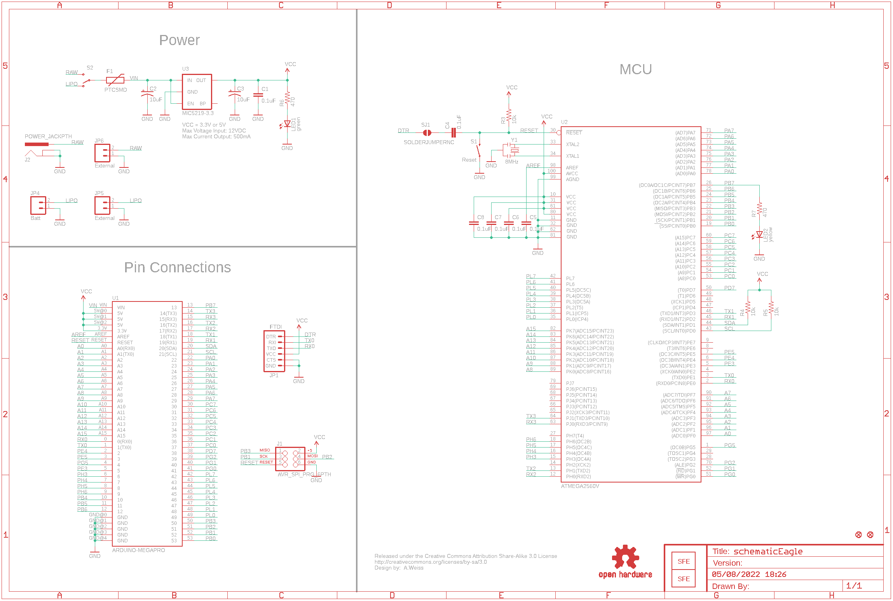
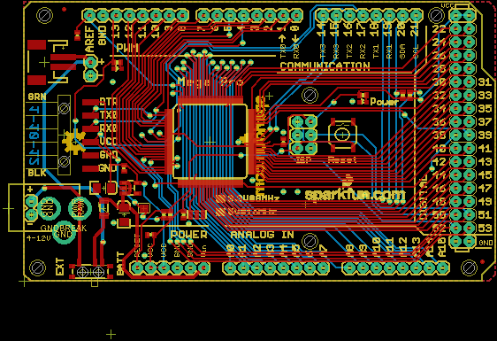
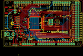
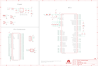

Contents
========

* [PRS11007 > Mega Pro](#prs11007--mega-pro)
	* [Schematic](#schematic)
	* [PCB](#pcb)
	* [OOMP Parts](#oomp-parts)
	* [Images](#images)
	* [Tags](#tags)
  
![][im]
# PRS11007 > Mega Pro

- ID: PROJ-SPAR-11007-STAN-01
- Hex ID: PRS11007
- Name: Sparkfun
- Description: Sparkfun
- Long Link: [http://oom.lt/PROJ-SPAR-11007-STAN-01](http://oom.lt/PROJ-SPAR-11007-STAN-01)
- Short Link: [http://oom.lt/PRS11007](http://oom.lt/PRS11007)

## Schematic
  

## PCB
  

## OOMP Parts
  

|OOMP Parts|
| :---: |
|CAPC-0402-X-UF1D-01 C1, C4, C5, C6, C7, C8|
|CAPT-3216-X-UF10-01 C2, C3|
|REFU-1206-X-UNMATCHED-01 F1|
|UNMATCHED-UNMATCHED-X-UNMATCHED-01 J1, S1, S2, U1, U2, Y1|
|[DCJP-21D-X-STAN-01  2.1 mm DC Jack  J2](https://github.com/oomlout/oomlout_OOMP_parts/tree/main/DCJP-21D-X-STAN-01/)|
|[HEAD-I01-X-PI06-01  2.54 mm 6 Pin Header  JP1](https://github.com/oomlout/oomlout_OOMP_parts/tree/main/HEAD-I01-X-PI06-01/)|
|HEAD-I01-X-UNMATCHED-01 JP4|
|[HEAD-I01-X-PI02-01  2.54 mm 2 Pin Header  JP5, JP6](https://github.com/oomlout/oomlout_OOMP_parts/tree/main/HEAD-I01-X-PI02-01/)|
|[LEDS-0603-G-STAN-01  SMD (0603) Green LED  LED1](https://github.com/oomlout/oomlout_OOMP_parts/tree/main/LEDS-0603-G-STAN-01/)|
|[LEDS-0603-Y-STAN-01  SMD (0603) Yellow LED  LED2](https://github.com/oomlout/oomlout_OOMP_parts/tree/main/LEDS-0603-Y-STAN-01/)|
|[RESE-0402-X-O103-01  SMD (0402) 10k Ohm Resistor  R3, R4, R5](https://github.com/oomlout/oomlout_OOMP_parts/tree/main/RESE-0402-X-O103-01/)|
|[RESE-0402-X-O471-01  SMD (0402) 470 Ohm Resistor  R6, R7](https://github.com/oomlout/oomlout_OOMP_parts/tree/main/RESE-0402-X-O471-01/)|
|UNMATCHED-SO235-X-UNMATCHED-01 U3|

## Images
  
  

|kicadPcb3d|kicadPcb3dFront|kicadPcb3dBack|eagleImage|eagleSchemImage|
| :---: | :---: | :---: | :---: | :---: |
||||||

## Tags

- hexID: PRS11007
- oompType: PROJ
- oompSize: SPAR
- oompColor: 11007
- oompDesc: STAN
- oompIndex: 01
- oompName: Mega Pro
- sources: All source files from https://github.com/sparkfun/Mega_Pro (source licence details in srcLicense.md)
- linkBuyPage: https://www.sparkfun.com/products/11007
- oompID: PROJ-SPAR-11007-STAN-01
- oompParts: C1,CAPC-0402-X-UF1D-01
- oompParts: C2,CAPT-3216-X-UF10-01
- oompParts: C3,CAPT-3216-X-UF10-01
- oompParts: C4,CAPC-0402-X-UF1D-01
- oompParts: C5,CAPC-0402-X-UF1D-01
- oompParts: C6,CAPC-0402-X-UF1D-01
- oompParts: C7,CAPC-0402-X-UF1D-01
- oompParts: C8,CAPC-0402-X-UF1D-01
- oompParts: F1,REFU-1206-X-UNMATCHED-01
- oompParts: J1,UNMATCHED-UNMATCHED-X-UNMATCHED-01
- oompParts: J2,DCJP-21D-X-STAN-01
- oompParts: JP1,HEAD-I01-X-PI06-01
- oompParts: JP4,HEAD-I01-X-UNMATCHED-01
- oompParts: JP5,HEAD-I01-X-PI02-01
- oompParts: JP6,HEAD-I01-X-PI02-01
- oompParts: LED1,LEDS-0603-G-STAN-01
- oompParts: LED2,LEDS-0603-Y-STAN-01
- oompParts: R3,RESE-0402-X-O103-01
- oompParts: R4,RESE-0402-X-O103-01
- oompParts: R5,RESE-0402-X-O103-01
- oompParts: R6,RESE-0402-X-O471-01
- oompParts: R7,RESE-0402-X-O471-01
- oompParts: S1,UNMATCHED-UNMATCHED-X-UNMATCHED-01
- oompParts: S2,UNMATCHED-UNMATCHED-X-UNMATCHED-01
- oompParts: U1,UNMATCHED-UNMATCHED-X-UNMATCHED-01
- oompParts: U2,UNMATCHED-UNMATCHED-X-UNMATCHED-01
- oompParts: U3,UNMATCHED-SO235-X-UNMATCHED-01
- oompParts: Y1,UNMATCHED-UNMATCHED-X-UNMATCHED-01
- rawParts: C1,0.1uF,CAP0402-CAP,0402-CAP,Capacitor,,
- rawParts: C2,10uF,CAP_POL1206,EIA3216,Capacitor Polarized,,
- rawParts: C3,10uF,CAP_POL1206,EIA3216,Capacitor Polarized,,
- rawParts: C4,0.1uF,CAP0402-CAP,0402-CAP,Capacitor,,
- rawParts: C5,0.1uF,CAP0402-CAP,0402-CAP,Capacitor,,
- rawParts: C6,0.1uF,CAP0402-CAP,0402-CAP,Capacitor,,
- rawParts: C7,0.1uF,CAP0402-CAP,0402-CAP,Capacitor,,
- rawParts: C8,0.1uF,CAP0402-CAP,0402-CAP,Capacitor,,
- rawParts: F1,PTCSMD,PTCSMD,PTC-1206,Resettable Fuse PTC,,
- rawParts: J1,AVR_SPI_PRG_6PTH,AVR_SPI_PRG_6PTH,2X3,AVR ISP 6 Pin,,
- rawParts: J2,POWER_JACKPTH,POWER_JACKPTH,POWER_JACK_PTH,Power Jack,,
- rawParts: JP1,FTDI,ARDUINO_SERIAL_PROGRAMSMD,1X06-SMD,,,
- rawParts: JP2,LOGO-SFENEW,LOGO-SFENEW,SFE-NEW-WEBLOGO,Spark Fun Electronics PCB Logo,,
- rawParts: JP3,LOGO-SFENEW,LOGO-SFENEW,SFE-NEW-WEBLOGO,Spark Fun Electronics PCB Logo,,
- rawParts: JP4,Batt,M02-JST-2MM-SMT,JST-2-SMD,Header 2,,
- rawParts: JP5,External,M02PTH,1X02,Header 2,,
- rawParts: JP6,External,M02PTH,1X02,Header 2,,
- rawParts: JP7,FIDUCIAL1X2.5,FIDUCIAL1X2.5,FIDUCIAL-1X2.5,Fiducial Alignment Points,,
- rawParts: JP8,FIDUCIAL1X2.5,FIDUCIAL1X2.5,FIDUCIAL-1X2.5,Fiducial Alignment Points,,
- rawParts: LED1,green,LED0603,LED-0603,LEDs,,
- rawParts: LED2,yellow,LED0603,LED-0603,LEDs,,
- rawParts: R3,10k,RESISTOR0402-RES,0402-RES,Resistor,,
- rawParts: R4,10k,RESISTOR0402-RES,0402-RES,Resistor,,
- rawParts: R5,10k,RESISTOR0402-RES,0402-RES,Resistor,,
- rawParts: R6,470,RESISTOR0402-RES,0402-RES,Resistor,,
- rawParts: R7,470,RESISTOR0402-RES,0402-RES,Resistor,,
- rawParts: S1,SWITCH-MOMENTARY-2SMD,SWITCH-MOMENTARY-2SMD,TACTILE_SWITCH_SMD,,,
- rawParts: S2,,SWITCH-SPST-SMD-A,SWITCH-SPST-SMD-A,SPST Switch,,
- rawParts: SJ1,SOLDERJUMPERNC,SOLDERJUMPERNC,SJ_2S,Solder Jumper,,
- rawParts: U$1,OSHW-LOGOM,OSHW-LOGOM,OSHW-LOGO-M,Open Source Hardware Logo This logo indicates the piece of hardware it is found on incorporates a OSHW license and/or adheres to the definition of open source hardware found here: http://freedomdefined.org/OSHW,,
- rawParts: U$2,CREATIVE_COMMONS,CREATIVE_COMMONS,CREATIVE_COMMONS,,,
- rawParts: U1,ARDUINO-MEGAPRO,ARDUINO-MEGAPRO,ARDUINO_MEGA-PRO,Arduino Mega footprint connections,,
- rawParts: U2,ATMEGA2560AU,ATMEGA2560AU,TQFP100,MICROCONTROLLER,,
- rawParts: U3,V_REG_LDOSMD,V_REG_LDOSMD,SOT23-5,Voltage Regulator LDO,,
- rawParts: Y1,RESONATORSMD,RESONATORSMD,RESONATOR-SMD,Resonator,,

[im]: kicadPcb3d_450.png
