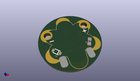
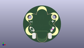
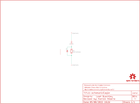

Contents
========

* [PRS11008 > Sparkfun](#prs11008--sparkfun)
	* [Images](#images)
	* [Tags](#tags)
  
![][im]
# PRS11008 > Sparkfun

- ID: PROJ-SPAR-11008-STAN-01
- Hex ID: PRS11008
- Name: Sparkfun
- Description: Sparkfun

## Images
  
  

|kicadPcb3d|kicadPcb3dFront|kicadPcb3dBack|eagleImage|eagleSchemImage|
| :---: | :---: | :---: | :---: | :---: |
||||||

## Tags

- hexID: PRS11008
- oompType: PROJ
- oompSize: SPAR
- oompColor: 11008
- oompDesc: STAN
- oompIndex: 01
- oompName: LilyPad Vibe Board
- sources: All source files from https://github.com/sparkfun/LilyPad_Vibe_Board (source licence details in srcLicense.md)
- linkBuyPage: https://www.sparkfun.com/products/11008
- oompID: PROJ-SPAR-11008-STAN-01
- oompParts: D1,UNMATCHED-UNMATCHED-UNMATCHED-UNMATCHED-UNMATCHED
- oompParts: FRAME1,UNMATCHED-UNMATCHED-UNMATCHED-UNMATCHED-UNMATCHED
- oompParts: LOGO1,UNMATCHED-UNMATCHED-UNMATCHED-UNMATCHED-UNMATCHED
- oompParts: M1,UNMATCHED-UNMATCHED-UNMATCHED-UNMATCHED-UNMATCHED
- oompParts: R1,UNMATCHED-UNMATCHED-UNMATCHED-UNMATCHED-UNMATCHED
- oompParts: U$2,UNMATCHED-UNMATCHED-UNMATCHED-UNMATCHED-UNMATCHED
- oompParts: VIBE+,UNMATCHED-UNMATCHED-UNMATCHED-UNMATCHED-UNMATCHED
- oompParts: VIBE-,UNMATCHED-UNMATCHED-UNMATCHED-UNMATCHED-UNMATCHED
- oompParts: VIBE1,UNMATCHED-UNMATCHED-UNMATCHED-UNMATCHED-UNMATCHED
- oompParts: VIBE2,UNMATCHED-UNMATCHED-UNMATCHED-UNMATCHED-UNMATCHED
- oompParts: VIBE3,UNMATCHED-UNMATCHED-UNMATCHED-UNMATCHED-UNMATCHED
- oompParts: VIBE4,UNMATCHED-UNMATCHED-UNMATCHED-UNMATCHED-UNMATCHED
- rawParts: D1,,DIODESOD,SOD-323,Diode,,,
- rawParts: FRAME1,FRAME-LETTER,FRAME-LETTER,CREATIVE_COMMONS,Schematic Frame,,,
- rawParts: LOGO1,OSHW-LOGOS,OSHW-LOGOS,OSHW-LOGO-S,Open Source Hardware Logo This logo indicates the piece of hardware it is found on incorporates a OSHW license and/or adheres to the definition of open source hardware found here: http://freedomdefined.org/OSHW,,,
- rawParts: M1,MOTORSMD,MOTORSMD,VIBE-MOTOR-10MM-SMD,Vibration Motor,,,
- rawParts: R1,33,33K-1%,0603-RES,33k-ohm SMT,RES-08416,33k,
- rawParts: U$2,LOGO-LPLP,LOGO-LPLP,LOGO-LILYPAD,,,,
- rawParts: VIBE+,SEWTAP6,SEWTAP6,PETAL-SMALL-2SIDE,,,,
- rawParts: VIBE-,SEWTAP6,SEWTAP6,PETAL-SMALL-2SIDE,,,,
- rawParts: VIBE1,SEWTAP-NOHOLE2,SEWTAP-NOHOLE2,PETAL-NOHOLE-2SIDE,,,,
- rawParts: VIBE2,SEWTAP-NOHOLEW-MASK,SEWTAP-NOHOLEW-MASK,PETAL-NOHOLE-2SIDE-SPECIAL-W-MASK,,,,
- rawParts: VIBE3,SEWTAP-NOHOLE2,SEWTAP-NOHOLE2,PETAL-NOHOLE-2SIDE,,,,
- rawParts: VIBE4,SEWTAP-NOHOLE2,SEWTAP-NOHOLE2,PETAL-NOHOLE-2SIDE,,,,

[im]: kicadPcb3d_450.png
