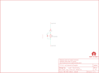

Contents
========

* [PRS11008 > LilyPad Vibe Board](#prs11008--lilypad-vibe-board)
	* [Schematic](#schematic)
	* [PCB](#pcb)
	* [Interactive BOM](#interactive-bom)
	* [OOMP Parts](#oomp-parts)
	* [Images](#images)
	* [Tags](#tags)
  
![][im]
# PRS11008 > LilyPad Vibe Board

- ID: PROJ-SPAR-11008-STAN-01
- Hex ID: PRS11008
- Name: Sparkfun
- Description: Sparkfun
- Long Link: [http://oom.lt/PROJ-SPAR-11008-STAN-01](http://oom.lt/PROJ-SPAR-11008-STAN-01)
- Short Link: [http://oom.lt/PRS11008](http://oom.lt/PRS11008)

## Schematic
  

## PCB
  

## Interactive BOM

- Interactive BOM page: [ibom.html](https://htmlpreview.github.io/?https://github.com/oomlout/oomlout_OOMP_projects/blob/main/PROJ-SPAR-11008-STAN-01/kicad/bom/ibom.html)

## OOMP Parts
  

|OOMP ID|Name|Identifier|
| :---: | :---: | :---: |
|DIOD-S323-X-UNMATCHED-01||D1|
|UNMATCHED-UNMATCHED-X-UNMATCHED-01||M1|
|[RESE-0603-X-O330-01](https://github.com/oomlout/oomlout_OOMP_parts/tree/main/RESE-0603-X-O330-01/)|[SMD (0603) 33 Ohm Resistor](https://github.com/oomlout/oomlout_OOMP_parts/tree/main/RESE-0603-X-O330-01/)|[R1](https://github.com/oomlout/oomlout_OOMP_parts/tree/main/RESE-0603-X-O330-01/)|

## Images
  
  

|bominteractivefront|bominteractiveback|kicadPcb3d|kicadPcb3dFront|kicadPcb3dBack|kicadSchem|eagleImage|eagleSchemImage|pcbdraw|pcbdrawback|
| :---: | :---: | :---: | :---: | :---: | :---: | :---: | :---: | :---: | :---: |
|||||||||||

## Tags

- hexID: PRS11008
- oompType: PROJ
- oompSize: SPAR
- oompColor: 11008
- oompDesc: STAN
- oompIndex: 01
- oompName: LilyPad Vibe Board
- sources: All source files from https://github.com/sparkfun/LilyPad_Vibe_Board (source licence details in srcLicense.md)
- linkBuyPage: https://www.sparkfun.com/products/11008
- oompID: PROJ-SPAR-11008-STAN-01
- oompParts: D1,DIOD-S323-X-UNMATCHED-01
- oompParts: M1,UNMATCHED-UNMATCHED-X-UNMATCHED-01
- oompParts: R1,RESE-0603-X-O330-01
- rawParts: D1,,DIODESOD,SOD-323,Diode,,,
- rawParts: FRAME1,FRAME-LETTER,FRAME-LETTER,CREATIVE_COMMONS,Schematic Frame,,,
- rawParts: LOGO1,OSHW-LOGOS,OSHW-LOGOS,OSHW-LOGO-S,Open Source Hardware Logo This logo indicates the piece of hardware it is found on incorporates a OSHW license and/or adheres to the definition of open source hardware found here: http://freedomdefined.org/OSHW,,,
- rawParts: M1,MOTORSMD,MOTORSMD,VIBE-MOTOR-10MM-SMD,Vibration Motor,,,
- rawParts: R1,33,33K-1%,0603-RES,33k-ohm SMT,RES-08416,33k,
- rawParts: U$2,LOGO-LPLP,LOGO-LPLP,LOGO-LILYPAD,,,,
- rawParts: VIBE+,SEWTAP6,SEWTAP6,PETAL-SMALL-2SIDE,,,,
- rawParts: VIBE-,SEWTAP6,SEWTAP6,PETAL-SMALL-2SIDE,,,,
- rawParts: VIBE1,SEWTAP-NOHOLE2,SEWTAP-NOHOLE2,PETAL-NOHOLE-2SIDE,,,,
- rawParts: VIBE2,SEWTAP-NOHOLEW-MASK,SEWTAP-NOHOLEW-MASK,PETAL-NOHOLE-2SIDE-SPECIAL-W-MASK,,,,
- rawParts: VIBE3,SEWTAP-NOHOLE2,SEWTAP-NOHOLE2,PETAL-NOHOLE-2SIDE,,,,
- rawParts: VIBE4,SEWTAP-NOHOLE2,SEWTAP-NOHOLE2,PETAL-NOHOLE-2SIDE,,,,

[im]: kicadPcb3d_450.png
