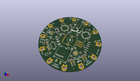
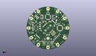
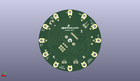
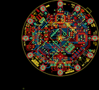
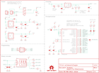

Contents
========

* [PRS11013 > Sparkfun](#prs11013--sparkfun)
	* [Images](#images)
	* [Tags](#tags)
  
![][im]
# PRS11013 > Sparkfun

- ID: PROJ-SPAR-11013-STAN-01
- Hex ID: PRS11013
- Name: Sparkfun
- Description: Sparkfun

## Images
  
  

|kicadPcb3d|kicadPcb3dFront|kicadPcb3dBack|eagleImage|eagleSchemImage|
| :---: | :---: | :---: | :---: | :---: |
||||||

## Tags

- hexID: PRS11013
- oompType: PROJ
- oompSize: SPAR
- oompColor: 11013
- oompDesc: STAN
- oompIndex: 01
- oompName: LilyPad MP3 Player
- sources: All source files from https://github.com/sparkfun/LilyPad_MP3_Player (source licence details in srcLicense.md)
- linkBuyPage: https://www.sparkfun.com/products/11013
- oompID: PROJ-SPAR-11013-STAN-01
- oompParts: C1,UNMATCHED-UNMATCHED-UNMATCHED-UNMATCHED-UNMATCHED
- oompParts: C2,UNMATCHED-UNMATCHED-UNMATCHED-UNMATCHED-UNMATCHED
- oompParts: C3,UNMATCHED-UNMATCHED-UNMATCHED-UNMATCHED-UNMATCHED
- oompParts: C4,UNMATCHED-UNMATCHED-UNMATCHED-UNMATCHED-UNMATCHED
- oompParts: C5,UNMATCHED-UNMATCHED-UNMATCHED-UNMATCHED-UNMATCHED
- oompParts: C6,UNMATCHED-UNMATCHED-UNMATCHED-UNMATCHED-UNMATCHED
- oompParts: C7,UNMATCHED-UNMATCHED-UNMATCHED-UNMATCHED-UNMATCHED
- oompParts: C8,UNMATCHED-UNMATCHED-UNMATCHED-UNMATCHED-UNMATCHED
- oompParts: C9,UNMATCHED-UNMATCHED-UNMATCHED-UNMATCHED-UNMATCHED
- oompParts: C10,UNMATCHED-UNMATCHED-UNMATCHED-UNMATCHED-UNMATCHED
- oompParts: C11,UNMATCHED-UNMATCHED-UNMATCHED-UNMATCHED-UNMATCHED
- oompParts: C12,UNMATCHED-UNMATCHED-UNMATCHED-UNMATCHED-UNMATCHED
- oompParts: C13,UNMATCHED-UNMATCHED-UNMATCHED-UNMATCHED-UNMATCHED
- oompParts: C14,UNMATCHED-UNMATCHED-UNMATCHED-UNMATCHED-UNMATCHED
- oompParts: C15,UNMATCHED-UNMATCHED-UNMATCHED-UNMATCHED-UNMATCHED
- oompParts: C16,UNMATCHED-UNMATCHED-UNMATCHED-UNMATCHED-UNMATCHED
- oompParts: C17,UNMATCHED-UNMATCHED-UNMATCHED-UNMATCHED-UNMATCHED
- oompParts: C18,UNMATCHED-UNMATCHED-UNMATCHED-UNMATCHED-UNMATCHED
- oompParts: C19,UNMATCHED-UNMATCHED-UNMATCHED-UNMATCHED-UNMATCHED
- oompParts: C20,UNMATCHED-UNMATCHED-UNMATCHED-UNMATCHED-UNMATCHED
- oompParts: C21,UNMATCHED-UNMATCHED-UNMATCHED-UNMATCHED-UNMATCHED
- oompParts: C22,UNMATCHED-UNMATCHED-UNMATCHED-UNMATCHED-UNMATCHED
- oompParts: C23,UNMATCHED-UNMATCHED-UNMATCHED-UNMATCHED-UNMATCHED
- oompParts: C24,UNMATCHED-UNMATCHED-UNMATCHED-UNMATCHED-UNMATCHED
- oompParts: C25,UNMATCHED-UNMATCHED-UNMATCHED-UNMATCHED-UNMATCHED
- oompParts: C26,UNMATCHED-UNMATCHED-UNMATCHED-UNMATCHED-UNMATCHED
- oompParts: C27,UNMATCHED-UNMATCHED-UNMATCHED-UNMATCHED-UNMATCHED
- oompParts: C28,UNMATCHED-UNMATCHED-UNMATCHED-UNMATCHED-UNMATCHED
- oompParts: C29,UNMATCHED-UNMATCHED-UNMATCHED-UNMATCHED-UNMATCHED
- oompParts: C30,UNMATCHED-UNMATCHED-UNMATCHED-UNMATCHED-UNMATCHED
- oompParts: C31,UNMATCHED-UNMATCHED-UNMATCHED-UNMATCHED-UNMATCHED
- oompParts: C32,UNMATCHED-UNMATCHED-UNMATCHED-UNMATCHED-UNMATCHED
- oompParts: C33,UNMATCHED-UNMATCHED-UNMATCHED-UNMATCHED-UNMATCHED
- oompParts: D1,UNMATCHED-UNMATCHED-UNMATCHED-UNMATCHED-UNMATCHED
- oompParts: JP1,UNMATCHED-UNMATCHED-UNMATCHED-UNMATCHED-UNMATCHED
- oompParts: JP2,UNMATCHED-UNMATCHED-UNMATCHED-UNMATCHED-UNMATCHED
- oompParts: JP3,UNMATCHED-UNMATCHED-UNMATCHED-UNMATCHED-UNMATCHED
- oompParts: JP4,UNMATCHED-UNMATCHED-UNMATCHED-UNMATCHED-UNMATCHED
- oompParts: JP5,UNMATCHED-UNMATCHED-UNMATCHED-UNMATCHED-UNMATCHED
- oompParts: JP6,UNMATCHED-UNMATCHED-UNMATCHED-UNMATCHED-UNMATCHED
- oompParts: L1,UNMATCHED-UNMATCHED-UNMATCHED-UNMATCHED-UNMATCHED
- oompParts: L2,UNMATCHED-UNMATCHED-UNMATCHED-UNMATCHED-UNMATCHED
- oompParts: L3,UNMATCHED-UNMATCHED-UNMATCHED-UNMATCHED-UNMATCHED
- oompParts: L4,UNMATCHED-UNMATCHED-UNMATCHED-UNMATCHED-UNMATCHED
- oompParts: LED1,UNMATCHED-UNMATCHED-UNMATCHED-UNMATCHED-UNMATCHED
- oompParts: LED2,UNMATCHED-UNMATCHED-UNMATCHED-UNMATCHED-UNMATCHED
- oompParts: LOGO1,UNMATCHED-UNMATCHED-UNMATCHED-UNMATCHED-UNMATCHED
- oompParts: LOGO2,UNMATCHED-UNMATCHED-UNMATCHED-UNMATCHED-UNMATCHED
- oompParts: LOGO3,UNMATCHED-UNMATCHED-UNMATCHED-UNMATCHED-UNMATCHED
- oompParts: R1,UNMATCHED-UNMATCHED-UNMATCHED-UNMATCHED-UNMATCHED
- oompParts: R1X,UNMATCHED-UNMATCHED-UNMATCHED-UNMATCHED-UNMATCHED
- oompParts: R2,UNMATCHED-UNMATCHED-UNMATCHED-UNMATCHED-UNMATCHED
- oompParts: R3,UNMATCHED-UNMATCHED-UNMATCHED-UNMATCHED-UNMATCHED
- oompParts: R4,UNMATCHED-UNMATCHED-UNMATCHED-UNMATCHED-UNMATCHED
- oompParts: R5,UNMATCHED-UNMATCHED-UNMATCHED-UNMATCHED-UNMATCHED
- oompParts: R6,UNMATCHED-UNMATCHED-UNMATCHED-UNMATCHED-UNMATCHED
- oompParts: R7,UNMATCHED-UNMATCHED-UNMATCHED-UNMATCHED-UNMATCHED
- oompParts: R8,UNMATCHED-UNMATCHED-UNMATCHED-UNMATCHED-UNMATCHED
- oompParts: R9,UNMATCHED-UNMATCHED-UNMATCHED-UNMATCHED-UNMATCHED
- oompParts: R10,UNMATCHED-UNMATCHED-UNMATCHED-UNMATCHED-UNMATCHED
- oompParts: R11,UNMATCHED-UNMATCHED-UNMATCHED-UNMATCHED-UNMATCHED
- oompParts: R12,UNMATCHED-UNMATCHED-UNMATCHED-UNMATCHED-UNMATCHED
- oompParts: R13,UNMATCHED-UNMATCHED-UNMATCHED-UNMATCHED-UNMATCHED
- oompParts: R14,UNMATCHED-UNMATCHED-UNMATCHED-UNMATCHED-UNMATCHED
- oompParts: R15,UNMATCHED-UNMATCHED-UNMATCHED-UNMATCHED-UNMATCHED
- oompParts: R16,UNMATCHED-UNMATCHED-UNMATCHED-UNMATCHED-UNMATCHED
- oompParts: R18,UNMATCHED-UNMATCHED-UNMATCHED-UNMATCHED-UNMATCHED
- oompParts: R19,UNMATCHED-UNMATCHED-UNMATCHED-UNMATCHED-UNMATCHED
- oompParts: R20,UNMATCHED-UNMATCHED-UNMATCHED-UNMATCHED-UNMATCHED
- oompParts: R21,UNMATCHED-UNMATCHED-UNMATCHED-UNMATCHED-UNMATCHED
- oompParts: R22,UNMATCHED-UNMATCHED-UNMATCHED-UNMATCHED-UNMATCHED
- oompParts: R24,UNMATCHED-UNMATCHED-UNMATCHED-UNMATCHED-UNMATCHED
- oompParts: R25,UNMATCHED-UNMATCHED-UNMATCHED-UNMATCHED-UNMATCHED
- oompParts: R26,UNMATCHED-UNMATCHED-UNMATCHED-UNMATCHED-UNMATCHED
- oompParts: S1,UNMATCHED-UNMATCHED-UNMATCHED-UNMATCHED-UNMATCHED
- oompParts: S2,UNMATCHED-UNMATCHED-UNMATCHED-UNMATCHED-UNMATCHED
- oompParts: SJ1,UNMATCHED-UNMATCHED-UNMATCHED-UNMATCHED-UNMATCHED
- oompParts: SJ2,UNMATCHED-UNMATCHED-UNMATCHED-UNMATCHED-UNMATCHED
- oompParts: SJ3,UNMATCHED-UNMATCHED-UNMATCHED-UNMATCHED-UNMATCHED
- oompParts: SJ4,UNMATCHED-UNMATCHED-UNMATCHED-UNMATCHED-UNMATCHED
- oompParts: SJ5,UNMATCHED-UNMATCHED-UNMATCHED-UNMATCHED-UNMATCHED
- oompParts: ST1,UNMATCHED-UNMATCHED-UNMATCHED-UNMATCHED-UNMATCHED
- oompParts: ST2,UNMATCHED-UNMATCHED-UNMATCHED-UNMATCHED-UNMATCHED
- oompParts: ST3,UNMATCHED-UNMATCHED-UNMATCHED-UNMATCHED-UNMATCHED
- oompParts: ST4,UNMATCHED-UNMATCHED-UNMATCHED-UNMATCHED-UNMATCHED
- oompParts: ST5,UNMATCHED-UNMATCHED-UNMATCHED-UNMATCHED-UNMATCHED
- oompParts: ST6,UNMATCHED-UNMATCHED-UNMATCHED-UNMATCHED-UNMATCHED
- oompParts: ST7,UNMATCHED-UNMATCHED-UNMATCHED-UNMATCHED-UNMATCHED
- oompParts: ST8,UNMATCHED-UNMATCHED-UNMATCHED-UNMATCHED-UNMATCHED
- oompParts: ST9,UNMATCHED-UNMATCHED-UNMATCHED-UNMATCHED-UNMATCHED
- oompParts: ST10,UNMATCHED-UNMATCHED-UNMATCHED-UNMATCHED-UNMATCHED
- oompParts: ST11,UNMATCHED-UNMATCHED-UNMATCHED-UNMATCHED-UNMATCHED
- oompParts: ST12,UNMATCHED-UNMATCHED-UNMATCHED-UNMATCHED-UNMATCHED
- oompParts: TP1,UNMATCHED-UNMATCHED-UNMATCHED-UNMATCHED-UNMATCHED
- oompParts: TP2,UNMATCHED-UNMATCHED-UNMATCHED-UNMATCHED-UNMATCHED
- oompParts: TP3,UNMATCHED-UNMATCHED-UNMATCHED-UNMATCHED-UNMATCHED
- oompParts: TP4,UNMATCHED-UNMATCHED-UNMATCHED-UNMATCHED-UNMATCHED
- oompParts: TP5,UNMATCHED-UNMATCHED-UNMATCHED-UNMATCHED-UNMATCHED
- oompParts: TP6,UNMATCHED-UNMATCHED-UNMATCHED-UNMATCHED-UNMATCHED
- oompParts: TP7,UNMATCHED-UNMATCHED-UNMATCHED-UNMATCHED-UNMATCHED
- oompParts: TP8,UNMATCHED-UNMATCHED-UNMATCHED-UNMATCHED-UNMATCHED
- oompParts: TP9,UNMATCHED-UNMATCHED-UNMATCHED-UNMATCHED-UNMATCHED
- oompParts: TP10,UNMATCHED-UNMATCHED-UNMATCHED-UNMATCHED-UNMATCHED
- oompParts: TP11,UNMATCHED-UNMATCHED-UNMATCHED-UNMATCHED-UNMATCHED
- oompParts: TP12,UNMATCHED-UNMATCHED-UNMATCHED-UNMATCHED-UNMATCHED
- oompParts: TP13,UNMATCHED-UNMATCHED-UNMATCHED-UNMATCHED-UNMATCHED
- oompParts: TP14,UNMATCHED-UNMATCHED-UNMATCHED-UNMATCHED-UNMATCHED
- oompParts: U$1,UNMATCHED-UNMATCHED-UNMATCHED-UNMATCHED-UNMATCHED
- oompParts: U$4,UNMATCHED-UNMATCHED-UNMATCHED-UNMATCHED-UNMATCHED
- oompParts: U$12,UNMATCHED-UNMATCHED-UNMATCHED-UNMATCHED-UNMATCHED
- oompParts: U1,UNMATCHED-UNMATCHED-UNMATCHED-UNMATCHED-UNMATCHED
- oompParts: U2,UNMATCHED-UNMATCHED-UNMATCHED-UNMATCHED-UNMATCHED
- oompParts: U3,UNMATCHED-UNMATCHED-UNMATCHED-UNMATCHED-UNMATCHED
- oompParts: U4,UNMATCHED-UNMATCHED-UNMATCHED-UNMATCHED-UNMATCHED
- oompParts: U5,UNMATCHED-UNMATCHED-UNMATCHED-UNMATCHED-UNMATCHED
- oompParts: U6,UNMATCHED-UNMATCHED-UNMATCHED-UNMATCHED-UNMATCHED
- oompParts: U7,UNMATCHED-UNMATCHED-UNMATCHED-UNMATCHED-UNMATCHED
- oompParts: Y1,UNMATCHED-UNMATCHED-UNMATCHED-UNMATCHED-UNMATCHED
- oompParts: Y2,UNMATCHED-UNMATCHED-UNMATCHED-UNMATCHED-UNMATCHED
- rawParts: C1,0.1uF,CAP0402-CAP,0402-CAP,Capacitor,,
- rawParts: C2,47uF,CAP_POL3528,EIA3528,Capacitor Polarized,,
- rawParts: C3,1uF,CAP0402-CAP,0402-CAP,Capacitor,,
- rawParts: C4,0.1uF,CAP0402-CAP,0402-CAP,Capacitor,,
- rawParts: C5,10uF,CAP_POL1206,EIA3216,Capacitor Polarized,,
- rawParts: C6,0.1uF,CAP0402-CAP,0402-CAP,Capacitor,,
- rawParts: C7,10uF,CAP_POL1206,EIA3216,Capacitor Polarized,,
- rawParts: C8,0.1uF,CAP0402-CAP,0402-CAP,Capacitor,,
- rawParts: C9,4.7uF,CAP0402-CAP,0402-CAP,Capacitor,,
- rawParts: C10,4.7uF,CAP0402-CAP,0402-CAP,Capacitor,,
- rawParts: C11,22pF,CAP0402-CAP,0402-CAP,Capacitor,,
- rawParts: C12,22pF,CAP0402-CAP,0402-CAP,Capacitor,,
- rawParts: C13,1uF,CAP0402-CAP,0402-CAP,Capacitor,,
- rawParts: C14,10nF,CAP0402-CAP,0402-CAP,Capacitor,,
- rawParts: C15,10nF,CAP0402-CAP,0402-CAP,Capacitor,,
- rawParts: C16,47nF,CAP0402-CAP,0402-CAP,Capacitor,,
- rawParts: C17,470pF,CAP0402-CAP,0402-CAP,Capacitor,,
- rawParts: C18,0.1uF,CAP0402-CAP,0402-CAP,Capacitor,,
- rawParts: C19,0.1uF,CAP0402-CAP,0402-CAP,Capacitor,,
- rawParts: C20,0.1uF,CAP0402-CAP,0402-CAP,Capacitor,,
- rawParts: C21,0.1uF,CAP0402-CAP,0402-CAP,Capacitor,,
- rawParts: C22,10uF,CAP_POL1206,EIA3216,Capacitor Polarized,,
- rawParts: C23,0.1uF,CAP0402-CAP,0402-CAP,Capacitor,,
- rawParts: C24,0.1uF,CAP0402-CAP,0402-CAP,Capacitor,,
- rawParts: C25,0.1uF,CAP0402-CAP,0402-CAP,Capacitor,,
- rawParts: C26,1uF,CAP0402-CAP,0402-CAP,Capacitor,,
- rawParts: C27,1uF,CAP0402-CAP,0402-CAP,Capacitor,,
- rawParts: C28,1uF,CAP0402-CAP,0402-CAP,Capacitor,,
- rawParts: C29,1uF,CAP0402-CAP,0402-CAP,Capacitor,,
- rawParts: C30,1nF,CAP0402-CAP,0402-CAP,Capacitor,,
- rawParts: C31,1nF,CAP0402-CAP,0402-CAP,Capacitor,,
- rawParts: C32,1nF,CAP0402-CAP,0402-CAP,Capacitor,,
- rawParts: C33,1nF,CAP0402-CAP,0402-CAP,Capacitor,,
- rawParts: D1,,DIODE-SCHOTTKY,SOD-523,Commonly MBRA140.,,
- rawParts: JP1,LiPo,M02-JST-2MM-SMT,JST-2-SMD,Header 2,,
- rawParts: JP2,FTDI,ARDUINO_SERIAL_PROGRAMSMD,1X06-SMD,,,
- rawParts: JP3,POWER,M02PTH,1X02,Header 2,,
- rawParts: JP4,PROG,AVR_SPI_PRG_6NS,2X3-NS,AVR ISP 6 Pin,,
- rawParts: JP5,HEADPHONE,AUDIO-JACK2SMD,AUDIO-JACK-3.5MM-SMD,,,
- rawParts: JP6,LOGO-SFENW2,LOGO-SFENW2,SFE-NEW-WEB,Spark Fun Electronics PCB Logo,,
- rawParts: JP7,FIDUCIALUFIDUCIAL,FIDUCIALUFIDUCIAL,MICRO-FIDUCIAL,Fiducial Alignment Points,,
- rawParts: JP8,FIDUCIALUFIDUCIAL,FIDUCIALUFIDUCIAL,MICRO-FIDUCIAL,Fiducial Alignment Points,,
- rawParts: L1,,INDUCTOR0805,0805,Inductors,,
- rawParts: L2,,INDUCTOR0805,0805,Inductors,,
- rawParts: L3,,INDUCTOR0805,0805,Inductors,,
- rawParts: L4,,INDUCTOR0805,0805,Inductors,,
- rawParts: LED1,RED,LED0603,LED-0603,LEDs,,
- rawParts: LED2,YELLOW,LED0603,LED-0603,LEDs,,
- rawParts: LOGO1,LOGO-SFESK,LOGO-SFESK,SFE-LOGO-FLAME,Spark Fun Electronics PCB Logo,,
- rawParts: LOGO2,LOGO-SFENEW,LOGO-SFENEW,SFE-NEW-WEBLOGO,Spark Fun Electronics PCB Logo,,
- rawParts: LOGO3,LOGO-SFESK,LOGO-SFESK,SFE-LOGO-FLAME,Spark Fun Electronics PCB Logo,,
- rawParts: R1,2K,RESISTOR0402-RES,0402-RES,Resistor,,
- rawParts: R1X,DNP,RESISTORAXIAL-0.3,AXIAL-0.3,Resistor,,
- rawParts: R2,1K,RESISTOR0402-RES,0402-RES,Resistor,,
- rawParts: R3,10K,RESISTOR0402-RES,0402-RES,Resistor,,
- rawParts: R4,1M,RESISTOR0402-RES,0402-RES,Resistor,,
- rawParts: R5,100k,RESISTOR0402-RES,0402-RES,Resistor,,
- rawParts: R6,100k,RESISTOR0402-RES,0402-RES,Resistor,,
- rawParts: R7,100k,RESISTOR0402-RES,0402-RES,Resistor,,
- rawParts: R8,330,RESISTOR0402-RES,0402-RES,Resistor,,
- rawParts: R9,330,RESISTOR0402-RES,0402-RES,Resistor,,
- rawParts: R10,20,RESISTOR0402-RES,0402-RES,Resistor,,
- rawParts: R11,20,RESISTOR0402-RES,0402-RES,Resistor,,
- rawParts: R12,10,RESISTOR0402-RES,0402-RES,Resistor,,
- rawParts: R13,100k,RESISTOR0402-RES,0402-RES,Resistor,,
- rawParts: R14,100k,RESISTOR0402-RES,0402-RES,Resistor,,
- rawParts: R15,100k,RESISTOR0402-RES,0402-RES,Resistor,,
- rawParts: R16,100k,RESISTOR0402-RES,0402-RES,Resistor,,
- rawParts: R18,4.7K,RESISTOR0402-RES,0402-RES,Resistor,,
- rawParts: R19,4.7K,RESISTOR0402-RES,0402-RES,Resistor,,
- rawParts: R20,1K,RESISTOR0402-RES,0402-RES,Resistor,,
- rawParts: R21,2K,RESISTOR0402-RES,0402-RES,Resistor,,
- rawParts: R22,10K,RESISTOR0402-RES,0402-RES,Resistor,,
- rawParts: R24,330,RESISTOR0402-RES,0402-RES,Resistor,,
- rawParts: R25,330,RESISTOR0402-RES,0402-RES,Resistor,,
- rawParts: R26,330,RESISTOR0402-RES,0402-RES,Resistor,,
- rawParts: S1,POWER,AYZ0202,AYZ0202,SPDT Slide Switch,,
- rawParts: S2,EC12PLRGBSDVBF-D,ENCODER_3LED_CA,ENCODER_LED_3,,,
- rawParts: SJ1,,SOLDERJUMPERNO,SJ_2S-NO,Solder Jumper,,
- rawParts: SJ2,,SOLDERJUMPERNO,SJ_2S-NO,Solder Jumper,,
- rawParts: SJ3,,SOLDERJUMPERNO,SJ_2S-NO,Solder Jumper,,
- rawParts: SJ4,,SOLDERJUMPERNO,SJ_2S-NO,Solder Jumper,,
- rawParts: SJ5,,SOLDERJUMPERNO,SJ_2S-NO,Solder Jumper,,
- rawParts: ST1,TRIG2/SDA,SEWTAP9,PETAL-LONG-1-2SIDE,,,
- rawParts: ST2,TRIG3/SCL,SEWTAP9,PETAL-LONG-1-2SIDE,,,
- rawParts: ST3,TRIG4/TXO,SEWTAP9,PETAL-LONG-1-2SIDE,,,
- rawParts: ST4,TRIG5/RXI,SEWTAP9,PETAL-LONG-1-2SIDE,,,
- rawParts: ST5,SPKL-,SEWTAP9,PETAL-LONG-1-2SIDE,,,
- rawParts: ST6,SPKL+,SEWTAP9,PETAL-LONG-1-2SIDE,,,
- rawParts: ST7,SPKR-,SEWTAP9,PETAL-LONG-1-2SIDE,,,
- rawParts: ST8,SPKR+,SEWTAP9,PETAL-LONG-1-2SIDE,,,
- rawParts: ST9,3.3V,SEWTAP9,PETAL-LONG-1-2SIDE,,,
- rawParts: ST10,VIN,SEWTAP9,PETAL-LONG-1-2SIDE,,,
- rawParts: ST11,GND,SEWTAP9,PETAL-LONG-1-2SIDE,,,
- rawParts: ST12,TRIG1,SEWTAP9,PETAL-LONG-1-2SIDE,,,
- rawParts: TP1,TRIG1,TEST-POINT-PTH-LARGE,1X01NS,,,
- rawParts: TP2,TRIG2/SDA,TEST-POINT-PTH-LARGE,1X01NS,,,
- rawParts: TP3,TRIG3/SCL,TEST-POINT-PTH-LARGE,1X01NS,,,
- rawParts: TP4,TRIG4/TXO,TEST-POINT-PTH-LARGE,1X01NS,,,
- rawParts: TP5,TRIG5/RXI,TEST-POINT-PTH-LARGE,1X01NS,,,
- rawParts: TP6,SPKL-,TEST-POINT-PTH-LARGE,1X01NS,,,
- rawParts: TP7,SPKL+,TEST-POINT-PTH-LARGE,1X01NS,,,
- rawParts: TP8,SPKR-,TEST-POINT-PTH-LARGE,1X01NS,,,
- rawParts: TP9,SPKR+,TEST-POINT-PTH-LARGE,1X01NS,,,
- rawParts: TP10,3.3V,TEST-POINT-PTH-LARGE,1X01NS,,,
- rawParts: TP11,VIN,TEST-POINT-PTH-LARGE,1X01NS,,,
- rawParts: TP12,GND,TEST-POINT-PTH-LARGE,1X01NS,,,
- rawParts: TP13,DTR,TEST-POINT3X5,PAD.03X.05,,,
- rawParts: TP14,1.8V,TEST-POINT3X5,PAD.03X.05,,,
- rawParts: U$1,LOGO-LPLP,LOGO-LPLP,LOGO-LILYPAD,,,
- rawParts: U$4,OSHW-LOGOM,OSHW-LOGOM,OSHW-LOGO-M,Open Source Hardware Logo This logo indicates the piece of hardware it is found on incorporates a OSHW license and/or adheres to the definition of open source hardware found here: http://freedomdefined.org/OSHW,,
- rawParts: U$12,CREATIVE_COMMONS,CREATIVE_COMMONS,CREATIVE_COMMONS,,,
- rawParts: U1,ATMEGA328,ATMEGA168,TQFP32-08,,,
- rawParts: U2,MCP73831,MCP73831,SOT23-5,Microchips MCP73831,,
- rawParts: U3,MIC5219 3.3V,V_REG_LDOSMD,SOT23-5,Voltage Regulator LDO,,
- rawParts: U4,VS1053,VS1033,LQFP-48,,,
- rawParts: U5,SP6214 1.8V,V_REG_LDOSMD2,SC70,Voltage Regulator LDO,,
- rawParts: U6,TPA2016D2RTJ,TPA2016D2RTJ,QFN-20-0.5MM,2.8-W/Ch Stereo Class-D Audio Amplifier with I2C volume control, DRC and AGC,,
- rawParts: U7,USD-SOCKET,USD-SOCKETNEW,MICRO-SD-SOCKET-PP,microSD Socket,,
- rawParts: Y1,8MHz,RESONATORSMD,RESONATOR-SMD,Resonator,,
- rawParts: Y2,12.288MHz,CRYSTAL5X3,CRYSTAL-SMD-5X3,Crystals,,

[im]: kicadPcb3d_450.png
