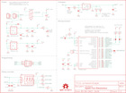

Contents
========

* [PRS11013 > Sparkfun](#prs11013--sparkfun)
	* [Schematic](#schematic)
	* [Interactive BOM](#interactive-bom)
	* [OOMP Parts](#oomp-parts)
	* [Images](#images)
	* [Tags](#tags)
  
![][im]
# PRS11013 > Sparkfun

- ID: PROJ-SPAR-11013-STAN-01
- Hex ID: PRS11013
- Name: Sparkfun
- Description: Sparkfun
- Long Link: [http://oom.lt/PROJ-SPAR-11013-STAN-01](http://oom.lt/PROJ-SPAR-11013-STAN-01)
- Short Link: [http://oom.lt/PRS11013](http://oom.lt/PRS11013)

## Schematic
  

## Interactive BOM

- Interactive BOM page: [ibom.html](https://htmlpreview.github.io/?https://github.com/oomlout/oomlout_OOMP_projects/blob/main/PROJ-SPAR-11013-STAN-01/kicad/bom/ibom.html)

## OOMP Parts
  

|OOMP Parts|
| :---: |
|C1,CAPC-0402-X-NF100-01,C1,0.1uF,CAP0402-CAP,0402-CAP,Capacitor,,|
|C2,CAPX-UNMATCHED-X-UF47-01,C2,47uF,CAP_POL3528,EIA3528,Capacitor Polarized,,|
|C3,CAPC-0402-X-UF1-01,C3,1uF,CAP0402-CAP,0402-CAP,Capacitor,,|
|C4,CAPC-0402-X-NF100-01,C4,0.1uF,CAP0402-CAP,0402-CAP,Capacitor,,|
|C5,CAPX-UNMATCHED-X-UF10-01,C5,10uF,CAP_POL1206,EIA3216,Capacitor Polarized,,|
|C6,CAPC-0402-X-NF100-01,C6,0.1uF,CAP0402-CAP,0402-CAP,Capacitor,,|
|C7,CAPX-UNMATCHED-X-UF10-01,C7,10uF,CAP_POL1206,EIA3216,Capacitor Polarized,,|
|C8,CAPC-0402-X-NF100-01,C8,0.1uF,CAP0402-CAP,0402-CAP,Capacitor,,|
|C9,CAPC-0402-X-UNMATCHED-01,C9,4.7uF,CAP0402-CAP,0402-CAP,Capacitor,,|
|C10,CAPC-0402-X-UNMATCHED-01,C10,4.7uF,CAP0402-CAP,0402-CAP,Capacitor,,|
|C11,CAPC-0402-X-UNMATCHED-01,C11,22pF,CAP0402-CAP,0402-CAP,Capacitor,,|
|C12,CAPC-0402-X-UNMATCHED-01,C12,22pF,CAP0402-CAP,0402-CAP,Capacitor,,|
|C13,CAPC-0402-X-UF1-01,C13,1uF,CAP0402-CAP,0402-CAP,Capacitor,,|
|C14,CAPC-0402-X-UNMATCHED-01,C14,10nF,CAP0402-CAP,0402-CAP,Capacitor,,|
|C15,CAPC-0402-X-UNMATCHED-01,C15,10nF,CAP0402-CAP,0402-CAP,Capacitor,,|
|C16,CAPC-0402-X-UNMATCHED-01,C16,47nF,CAP0402-CAP,0402-CAP,Capacitor,,|
|C17,CAPC-0402-X-UNMATCHED-01,C17,470pF,CAP0402-CAP,0402-CAP,Capacitor,,|
|C18,CAPC-0402-X-NF100-01,C18,0.1uF,CAP0402-CAP,0402-CAP,Capacitor,,|
|C19,CAPC-0402-X-NF100-01,C19,0.1uF,CAP0402-CAP,0402-CAP,Capacitor,,|
|C20,CAPC-0402-X-NF100-01,C20,0.1uF,CAP0402-CAP,0402-CAP,Capacitor,,|
|C21,CAPC-0402-X-NF100-01,C21,0.1uF,CAP0402-CAP,0402-CAP,Capacitor,,|
|C22,CAPX-UNMATCHED-X-UF10-01,C22,10uF,CAP_POL1206,EIA3216,Capacitor Polarized,,|
|C23,CAPC-0402-X-NF100-01,C23,0.1uF,CAP0402-CAP,0402-CAP,Capacitor,,|
|C24,CAPC-0402-X-NF100-01,C24,0.1uF,CAP0402-CAP,0402-CAP,Capacitor,,|
|C25,CAPC-0402-X-NF100-01,C25,0.1uF,CAP0402-CAP,0402-CAP,Capacitor,,|
|C26,CAPC-0402-X-UF1-01,C26,1uF,CAP0402-CAP,0402-CAP,Capacitor,,|
|C27,CAPC-0402-X-UF1-01,C27,1uF,CAP0402-CAP,0402-CAP,Capacitor,,|
|C28,CAPC-0402-X-UF1-01,C28,1uF,CAP0402-CAP,0402-CAP,Capacitor,,|
|C29,CAPC-0402-X-UF1-01,C29,1uF,CAP0402-CAP,0402-CAP,Capacitor,,|
|C30,CAPC-0402-X-UNMATCHED-01,C30,1nF,CAP0402-CAP,0402-CAP,Capacitor,,|
|C31,CAPC-0402-X-UNMATCHED-01,C31,1nF,CAP0402-CAP,0402-CAP,Capacitor,,|
|C32,CAPC-0402-X-UNMATCHED-01,C32,1nF,CAP0402-CAP,0402-CAP,Capacitor,,|
|C33,CAPC-0402-X-UNMATCHED-01,C33,1nF,CAP0402-CAP,0402-CAP,Capacitor,,|
|D1,DIOD-UNMATCHED-X-UNMATCHED-01,D1,,DIODE-SCHOTTKY,SOD-523,Commonly MBRA140.,,|
|JP1,UNMATCHED-UNMATCHED-X-UNMATCHED-01,JP1,LiPo,M02-JST-2MM-SMT,JST-2-SMD,Header 2,,|
|JP2,HEAD-I01-X-PI06-01,JP2,FTDI,ARDUINO_SERIAL_PROGRAMSMD,1X06-SMD,,,|
|JP3,HEAD-I01-X-PI02-01,JP3,POWER,M02PTH,1X02,Header 2,,|
|JP4,UNMATCHED-UNMATCHED-X-UNMATCHED-01,JP4,PROG,AVR_SPI_PRG_6NS,2X3-NS,AVR ISP 6 Pin,,|
|JP5,UNMATCHED-UNMATCHED-X-UNMATCHED-01,JP5,HEADPHONE,AUDIO-JACK2SMD,AUDIO-JACK-3.5MM-SMD,,,|
|L1,UNMATCHED-0805-X-UNMATCHED-01,JP6,LOGO-SFENW2,LOGO-SFENW2,SFE-NEW-WEB,Spark Fun Electronics PCB Logo,,|
|L2,UNMATCHED-0805-X-UNMATCHED-01,JP7,FIDUCIALUFIDUCIAL,FIDUCIALUFIDUCIAL,MICRO-FIDUCIAL,Fiducial Alignment Points,,|
|L3,UNMATCHED-0805-X-UNMATCHED-01,JP8,FIDUCIALUFIDUCIAL,FIDUCIALUFIDUCIAL,MICRO-FIDUCIAL,Fiducial Alignment Points,,|
|L4,UNMATCHED-0805-X-UNMATCHED-01,L1,,INDUCTOR0805,0805,Inductors,,|
|LED1,LEDS-0603-G-STAN-01,L2,,INDUCTOR0805,0805,Inductors,,|
|LED2,LEDS-0603-G-STAN-01,L3,,INDUCTOR0805,0805,Inductors,,|
|R1,RESE-0402-X-O202-01,L4,,INDUCTOR0805,0805,Inductors,,|
|R2,RESE-0402-X-O102-01,LED1,RED,LED0603,LED-0603,LEDs,,|
|R3,RESE-0402-X-O103-01,LED2,YELLOW,LED0603,LED-0603,LEDs,,|
|R4,RESE-0402-X-O105-01,LOGO1,LOGO-SFESK,LOGO-SFESK,SFE-LOGO-FLAME,Spark Fun Electronics PCB Logo,,|
|R5,RESE-0402-X-O1003-01,LOGO2,LOGO-SFENEW,LOGO-SFENEW,SFE-NEW-WEBLOGO,Spark Fun Electronics PCB Logo,,|
|R6,RESE-0402-X-O1003-01,LOGO3,LOGO-SFESK,LOGO-SFESK,SFE-LOGO-FLAME,Spark Fun Electronics PCB Logo,,|
|R7,RESE-0402-X-O1003-01,R1,2K,RESISTOR0402-RES,0402-RES,Resistor,,|
|R8,RESE-0402-X-O331-01,R1X,DNP,RESISTORAXIAL-0.3,AXIAL-0.3,Resistor,,|
|R9,RESE-0402-X-O331-01,R2,1K,RESISTOR0402-RES,0402-RES,Resistor,,|
|R10,RESE-0402-X-O21-01,R3,10K,RESISTOR0402-RES,0402-RES,Resistor,,|
|R11,RESE-0402-X-O21-01,R4,1M,RESISTOR0402-RES,0402-RES,Resistor,,|
|R12,RESE-0402-X-O11-01,R5,100k,RESISTOR0402-RES,0402-RES,Resistor,,|
|R13,RESE-0402-X-O1003-01,R6,100k,RESISTOR0402-RES,0402-RES,Resistor,,|
|R14,RESE-0402-X-O1003-01,R7,100k,RESISTOR0402-RES,0402-RES,Resistor,,|
|R15,RESE-0402-X-O1003-01,R8,330,RESISTOR0402-RES,0402-RES,Resistor,,|
|R16,RESE-0402-X-O1003-01,R9,330,RESISTOR0402-RES,0402-RES,Resistor,,|
|R18,RESE-0402-X-O472-01,R10,20,RESISTOR0402-RES,0402-RES,Resistor,,|
|R19,RESE-0402-X-O472-01,R11,20,RESISTOR0402-RES,0402-RES,Resistor,,|
|R20,RESE-0402-X-O102-01,R12,10,RESISTOR0402-RES,0402-RES,Resistor,,|
|R21,RESE-0402-X-O202-01,R13,100k,RESISTOR0402-RES,0402-RES,Resistor,,|
|R22,RESE-0402-X-O103-01,R14,100k,RESISTOR0402-RES,0402-RES,Resistor,,|
|R24,RESE-0402-X-O331-01,R15,100k,RESISTOR0402-RES,0402-RES,Resistor,,|
|R25,RESE-0402-X-O331-01,R16,100k,RESISTOR0402-RES,0402-RES,Resistor,,|
|R26,RESE-0402-X-O331-01,R18,4.7K,RESISTOR0402-RES,0402-RES,Resistor,,|
|S1,UNMATCHED-UNMATCHED-X-UNMATCHED-01,R19,4.7K,RESISTOR0402-RES,0402-RES,Resistor,,|
|S2,UNMATCHED-UNMATCHED-X-UNMATCHED-01,R20,1K,RESISTOR0402-RES,0402-RES,Resistor,,|
|ST1,UNMATCHED-UNMATCHED-X-UNMATCHED-01,R21,2K,RESISTOR0402-RES,0402-RES,Resistor,,|
|ST2,UNMATCHED-UNMATCHED-X-UNMATCHED-01,R22,10K,RESISTOR0402-RES,0402-RES,Resistor,,|
|ST3,UNMATCHED-UNMATCHED-X-UNMATCHED-01,R24,330,RESISTOR0402-RES,0402-RES,Resistor,,|
|ST4,UNMATCHED-UNMATCHED-X-UNMATCHED-01,R25,330,RESISTOR0402-RES,0402-RES,Resistor,,|
|ST5,UNMATCHED-UNMATCHED-X-UNMATCHED-01,R26,330,RESISTOR0402-RES,0402-RES,Resistor,,|
|ST6,UNMATCHED-UNMATCHED-X-UNMATCHED-01,S1,POWER,AYZ0202,AYZ0202,SPDT Slide Switch,,|
|ST7,UNMATCHED-UNMATCHED-X-UNMATCHED-01,S2,EC12PLRGBSDVBF-D,ENCODER_3LED_CA,ENCODER_LED_3,,,|
|ST8,UNMATCHED-UNMATCHED-X-UNMATCHED-01,SJ1,,SOLDERJUMPERNO,SJ_2S-NO,Solder Jumper,,|
|ST9,UNMATCHED-UNMATCHED-X-UNMATCHED-01,SJ2,,SOLDERJUMPERNO,SJ_2S-NO,Solder Jumper,,|
|ST10,UNMATCHED-UNMATCHED-X-UNMATCHED-01,SJ3,,SOLDERJUMPERNO,SJ_2S-NO,Solder Jumper,,|
|ST11,UNMATCHED-UNMATCHED-X-UNMATCHED-01,SJ4,,SOLDERJUMPERNO,SJ_2S-NO,Solder Jumper,,|
|ST12,UNMATCHED-UNMATCHED-X-UNMATCHED-01,SJ5,,SOLDERJUMPERNO,SJ_2S-NO,Solder Jumper,,|
|TP1,UNMATCHED-UNMATCHED-X-UNMATCHED-01,ST1,TRIG2/SDA,SEWTAP9,PETAL-LONG-1-2SIDE,,,|
|TP2,UNMATCHED-UNMATCHED-X-UNMATCHED-01,ST2,TRIG3/SCL,SEWTAP9,PETAL-LONG-1-2SIDE,,,|
|TP3,UNMATCHED-UNMATCHED-X-UNMATCHED-01,ST3,TRIG4/TXO,SEWTAP9,PETAL-LONG-1-2SIDE,,,|
|TP4,UNMATCHED-UNMATCHED-X-UNMATCHED-01,ST4,TRIG5/RXI,SEWTAP9,PETAL-LONG-1-2SIDE,,,|
|TP5,UNMATCHED-UNMATCHED-X-UNMATCHED-01,ST5,SPKL-,SEWTAP9,PETAL-LONG-1-2SIDE,,,|
|TP6,UNMATCHED-UNMATCHED-X-UNMATCHED-01,ST6,SPKL+,SEWTAP9,PETAL-LONG-1-2SIDE,,,|
|TP7,UNMATCHED-UNMATCHED-X-UNMATCHED-01,ST7,SPKR-,SEWTAP9,PETAL-LONG-1-2SIDE,,,|
|TP8,UNMATCHED-UNMATCHED-X-UNMATCHED-01,ST8,SPKR+,SEWTAP9,PETAL-LONG-1-2SIDE,,,|
|TP9,UNMATCHED-UNMATCHED-X-UNMATCHED-01,ST9,3.3V,SEWTAP9,PETAL-LONG-1-2SIDE,,,|
|TP10,UNMATCHED-UNMATCHED-X-UNMATCHED-01,ST10,VIN,SEWTAP9,PETAL-LONG-1-2SIDE,,,|
|TP11,UNMATCHED-UNMATCHED-X-UNMATCHED-01,ST11,GND,SEWTAP9,PETAL-LONG-1-2SIDE,,,|
|TP12,UNMATCHED-UNMATCHED-X-UNMATCHED-01,ST12,TRIG1,SEWTAP9,PETAL-LONG-1-2SIDE,,,|
|TP13,UNMATCHED-UNMATCHED-X-UNMATCHED-01,TP1,TRIG1,TEST-POINT-PTH-LARGE,1X01NS,,,|
|TP14,UNMATCHED-UNMATCHED-X-UNMATCHED-01,TP2,TRIG2/SDA,TEST-POINT-PTH-LARGE,1X01NS,,,|
|U$12,UNMATCHED-UNMATCHED-X-UNMATCHED-01,TP3,TRIG3/SCL,TEST-POINT-PTH-LARGE,1X01NS,,,|
|U1,UNMATCHED-UNMATCHED-X-UNMATCHED-01,TP4,TRIG4/TXO,TEST-POINT-PTH-LARGE,1X01NS,,,|
|U2,UNMATCHED-SO235-X-UNMATCHED-01,TP5,TRIG5/RXI,TEST-POINT-PTH-LARGE,1X01NS,,,|
|U3,UNMATCHED-SO235-X-UNMATCHED-01,TP6,SPKL-,TEST-POINT-PTH-LARGE,1X01NS,,,|
|U4,UNMATCHED-UNMATCHED-X-UNMATCHED-01,TP7,SPKL+,TEST-POINT-PTH-LARGE,1X01NS,,,|
|U5,UNMATCHED-UNMATCHED-X-UNMATCHED-01,TP8,SPKR-,TEST-POINT-PTH-LARGE,1X01NS,,,|
|U6,UNMATCHED-UNMATCHED-X-UNMATCHED-01,TP9,SPKR+,TEST-POINT-PTH-LARGE,1X01NS,,,|
|U7,UNMATCHED-UNMATCHED-X-UNMATCHED-01,TP10,3.3V,TEST-POINT-PTH-LARGE,1X01NS,,,|
|Y1,UNMATCHED-UNMATCHED-X-UNMATCHED-01,TP11,VIN,TEST-POINT-PTH-LARGE,1X01NS,,,|
|Y2,UNMATCHED-UNMATCHED-X-UNMATCHED-01,TP12,GND,TEST-POINT-PTH-LARGE,1X01NS,,,|

## Images
  
  

|kicadPcb3d|kicadPcb3dFront|kicadPcb3dBack|eagleImage|eagleSchemImage|
| :---: | :---: | :---: | :---: | :---: |
||||||

## Tags

- hexID: PRS11013
- oompType: PROJ
- oompSize: SPAR
- oompColor: 11013
- oompDesc: STAN
- oompIndex: 01
- oompName: LilyPad MP3 Player
- sources: All source files from https://github.com/sparkfun/LilyPad_MP3_Player (source licence details in srcLicense.md)
- linkBuyPage: https://www.sparkfun.com/products/11013
- oompID: PROJ-SPAR-11013-STAN-01
- oompParts: C1,CAPC-0402-X-NF100-01
- oompParts: C2,CAPX-UNMATCHED-X-UF47-01
- oompParts: C3,CAPC-0402-X-UF1-01
- oompParts: C4,CAPC-0402-X-NF100-01
- oompParts: C5,CAPX-UNMATCHED-X-UF10-01
- oompParts: C6,CAPC-0402-X-NF100-01
- oompParts: C7,CAPX-UNMATCHED-X-UF10-01
- oompParts: C8,CAPC-0402-X-NF100-01
- oompParts: C9,CAPC-0402-X-UNMATCHED-01
- oompParts: C10,CAPC-0402-X-UNMATCHED-01
- oompParts: C11,CAPC-0402-X-UNMATCHED-01
- oompParts: C12,CAPC-0402-X-UNMATCHED-01
- oompParts: C13,CAPC-0402-X-UF1-01
- oompParts: C14,CAPC-0402-X-UNMATCHED-01
- oompParts: C15,CAPC-0402-X-UNMATCHED-01
- oompParts: C16,CAPC-0402-X-UNMATCHED-01
- oompParts: C17,CAPC-0402-X-UNMATCHED-01
- oompParts: C18,CAPC-0402-X-NF100-01
- oompParts: C19,CAPC-0402-X-NF100-01
- oompParts: C20,CAPC-0402-X-NF100-01
- oompParts: C21,CAPC-0402-X-NF100-01
- oompParts: C22,CAPX-UNMATCHED-X-UF10-01
- oompParts: C23,CAPC-0402-X-NF100-01
- oompParts: C24,CAPC-0402-X-NF100-01
- oompParts: C25,CAPC-0402-X-NF100-01
- oompParts: C26,CAPC-0402-X-UF1-01
- oompParts: C27,CAPC-0402-X-UF1-01
- oompParts: C28,CAPC-0402-X-UF1-01
- oompParts: C29,CAPC-0402-X-UF1-01
- oompParts: C30,CAPC-0402-X-UNMATCHED-01
- oompParts: C31,CAPC-0402-X-UNMATCHED-01
- oompParts: C32,CAPC-0402-X-UNMATCHED-01
- oompParts: C33,CAPC-0402-X-UNMATCHED-01
- oompParts: D1,DIOD-UNMATCHED-X-UNMATCHED-01
- oompParts: JP1,UNMATCHED-UNMATCHED-X-UNMATCHED-01
- oompParts: JP2,HEAD-I01-X-PI06-01
- oompParts: JP3,HEAD-I01-X-PI02-01
- oompParts: JP4,UNMATCHED-UNMATCHED-X-UNMATCHED-01
- oompParts: JP5,UNMATCHED-UNMATCHED-X-UNMATCHED-01
- oompParts: L1,UNMATCHED-0805-X-UNMATCHED-01
- oompParts: L2,UNMATCHED-0805-X-UNMATCHED-01
- oompParts: L3,UNMATCHED-0805-X-UNMATCHED-01
- oompParts: L4,UNMATCHED-0805-X-UNMATCHED-01
- oompParts: LED1,LEDS-0603-G-STAN-01
- oompParts: LED2,LEDS-0603-G-STAN-01
- oompParts: R1,RESE-0402-X-O202-01
- oompParts: R2,RESE-0402-X-O102-01
- oompParts: R3,RESE-0402-X-O103-01
- oompParts: R4,RESE-0402-X-O105-01
- oompParts: R5,RESE-0402-X-O1003-01
- oompParts: R6,RESE-0402-X-O1003-01
- oompParts: R7,RESE-0402-X-O1003-01
- oompParts: R8,RESE-0402-X-O331-01
- oompParts: R9,RESE-0402-X-O331-01
- oompParts: R10,RESE-0402-X-O21-01
- oompParts: R11,RESE-0402-X-O21-01
- oompParts: R12,RESE-0402-X-O11-01
- oompParts: R13,RESE-0402-X-O1003-01
- oompParts: R14,RESE-0402-X-O1003-01
- oompParts: R15,RESE-0402-X-O1003-01
- oompParts: R16,RESE-0402-X-O1003-01
- oompParts: R18,RESE-0402-X-O472-01
- oompParts: R19,RESE-0402-X-O472-01
- oompParts: R20,RESE-0402-X-O102-01
- oompParts: R21,RESE-0402-X-O202-01
- oompParts: R22,RESE-0402-X-O103-01
- oompParts: R24,RESE-0402-X-O331-01
- oompParts: R25,RESE-0402-X-O331-01
- oompParts: R26,RESE-0402-X-O331-01
- oompParts: S1,UNMATCHED-UNMATCHED-X-UNMATCHED-01
- oompParts: S2,UNMATCHED-UNMATCHED-X-UNMATCHED-01
- oompParts: ST1,UNMATCHED-UNMATCHED-X-UNMATCHED-01
- oompParts: ST2,UNMATCHED-UNMATCHED-X-UNMATCHED-01
- oompParts: ST3,UNMATCHED-UNMATCHED-X-UNMATCHED-01
- oompParts: ST4,UNMATCHED-UNMATCHED-X-UNMATCHED-01
- oompParts: ST5,UNMATCHED-UNMATCHED-X-UNMATCHED-01
- oompParts: ST6,UNMATCHED-UNMATCHED-X-UNMATCHED-01
- oompParts: ST7,UNMATCHED-UNMATCHED-X-UNMATCHED-01
- oompParts: ST8,UNMATCHED-UNMATCHED-X-UNMATCHED-01
- oompParts: ST9,UNMATCHED-UNMATCHED-X-UNMATCHED-01
- oompParts: ST10,UNMATCHED-UNMATCHED-X-UNMATCHED-01
- oompParts: ST11,UNMATCHED-UNMATCHED-X-UNMATCHED-01
- oompParts: ST12,UNMATCHED-UNMATCHED-X-UNMATCHED-01
- oompParts: TP1,UNMATCHED-UNMATCHED-X-UNMATCHED-01
- oompParts: TP2,UNMATCHED-UNMATCHED-X-UNMATCHED-01
- oompParts: TP3,UNMATCHED-UNMATCHED-X-UNMATCHED-01
- oompParts: TP4,UNMATCHED-UNMATCHED-X-UNMATCHED-01
- oompParts: TP5,UNMATCHED-UNMATCHED-X-UNMATCHED-01
- oompParts: TP6,UNMATCHED-UNMATCHED-X-UNMATCHED-01
- oompParts: TP7,UNMATCHED-UNMATCHED-X-UNMATCHED-01
- oompParts: TP8,UNMATCHED-UNMATCHED-X-UNMATCHED-01
- oompParts: TP9,UNMATCHED-UNMATCHED-X-UNMATCHED-01
- oompParts: TP10,UNMATCHED-UNMATCHED-X-UNMATCHED-01
- oompParts: TP11,UNMATCHED-UNMATCHED-X-UNMATCHED-01
- oompParts: TP12,UNMATCHED-UNMATCHED-X-UNMATCHED-01
- oompParts: TP13,UNMATCHED-UNMATCHED-X-UNMATCHED-01
- oompParts: TP14,UNMATCHED-UNMATCHED-X-UNMATCHED-01
- oompParts: U$12,UNMATCHED-UNMATCHED-X-UNMATCHED-01
- oompParts: U1,UNMATCHED-UNMATCHED-X-UNMATCHED-01
- oompParts: U2,UNMATCHED-SO235-X-UNMATCHED-01
- oompParts: U3,UNMATCHED-SO235-X-UNMATCHED-01
- oompParts: U4,UNMATCHED-UNMATCHED-X-UNMATCHED-01
- oompParts: U5,UNMATCHED-UNMATCHED-X-UNMATCHED-01
- oompParts: U6,UNMATCHED-UNMATCHED-X-UNMATCHED-01
- oompParts: U7,UNMATCHED-UNMATCHED-X-UNMATCHED-01
- oompParts: Y1,UNMATCHED-UNMATCHED-X-UNMATCHED-01
- oompParts: Y2,UNMATCHED-UNMATCHED-X-UNMATCHED-01
- rawParts: C1,0.1uF,CAP0402-CAP,0402-CAP,Capacitor,,
- rawParts: C2,47uF,CAP_POL3528,EIA3528,Capacitor Polarized,,
- rawParts: C3,1uF,CAP0402-CAP,0402-CAP,Capacitor,,
- rawParts: C4,0.1uF,CAP0402-CAP,0402-CAP,Capacitor,,
- rawParts: C5,10uF,CAP_POL1206,EIA3216,Capacitor Polarized,,
- rawParts: C6,0.1uF,CAP0402-CAP,0402-CAP,Capacitor,,
- rawParts: C7,10uF,CAP_POL1206,EIA3216,Capacitor Polarized,,
- rawParts: C8,0.1uF,CAP0402-CAP,0402-CAP,Capacitor,,
- rawParts: C9,4.7uF,CAP0402-CAP,0402-CAP,Capacitor,,
- rawParts: C10,4.7uF,CAP0402-CAP,0402-CAP,Capacitor,,
- rawParts: C11,22pF,CAP0402-CAP,0402-CAP,Capacitor,,
- rawParts: C12,22pF,CAP0402-CAP,0402-CAP,Capacitor,,
- rawParts: C13,1uF,CAP0402-CAP,0402-CAP,Capacitor,,
- rawParts: C14,10nF,CAP0402-CAP,0402-CAP,Capacitor,,
- rawParts: C15,10nF,CAP0402-CAP,0402-CAP,Capacitor,,
- rawParts: C16,47nF,CAP0402-CAP,0402-CAP,Capacitor,,
- rawParts: C17,470pF,CAP0402-CAP,0402-CAP,Capacitor,,
- rawParts: C18,0.1uF,CAP0402-CAP,0402-CAP,Capacitor,,
- rawParts: C19,0.1uF,CAP0402-CAP,0402-CAP,Capacitor,,
- rawParts: C20,0.1uF,CAP0402-CAP,0402-CAP,Capacitor,,
- rawParts: C21,0.1uF,CAP0402-CAP,0402-CAP,Capacitor,,
- rawParts: C22,10uF,CAP_POL1206,EIA3216,Capacitor Polarized,,
- rawParts: C23,0.1uF,CAP0402-CAP,0402-CAP,Capacitor,,
- rawParts: C24,0.1uF,CAP0402-CAP,0402-CAP,Capacitor,,
- rawParts: C25,0.1uF,CAP0402-CAP,0402-CAP,Capacitor,,
- rawParts: C26,1uF,CAP0402-CAP,0402-CAP,Capacitor,,
- rawParts: C27,1uF,CAP0402-CAP,0402-CAP,Capacitor,,
- rawParts: C28,1uF,CAP0402-CAP,0402-CAP,Capacitor,,
- rawParts: C29,1uF,CAP0402-CAP,0402-CAP,Capacitor,,
- rawParts: C30,1nF,CAP0402-CAP,0402-CAP,Capacitor,,
- rawParts: C31,1nF,CAP0402-CAP,0402-CAP,Capacitor,,
- rawParts: C32,1nF,CAP0402-CAP,0402-CAP,Capacitor,,
- rawParts: C33,1nF,CAP0402-CAP,0402-CAP,Capacitor,,
- rawParts: D1,,DIODE-SCHOTTKY,SOD-523,Commonly MBRA140.,,
- rawParts: JP1,LiPo,M02-JST-2MM-SMT,JST-2-SMD,Header 2,,
- rawParts: JP2,FTDI,ARDUINO_SERIAL_PROGRAMSMD,1X06-SMD,,,
- rawParts: JP3,POWER,M02PTH,1X02,Header 2,,
- rawParts: JP4,PROG,AVR_SPI_PRG_6NS,2X3-NS,AVR ISP 6 Pin,,
- rawParts: JP5,HEADPHONE,AUDIO-JACK2SMD,AUDIO-JACK-3.5MM-SMD,,,
- rawParts: JP6,LOGO-SFENW2,LOGO-SFENW2,SFE-NEW-WEB,Spark Fun Electronics PCB Logo,,
- rawParts: JP7,FIDUCIALUFIDUCIAL,FIDUCIALUFIDUCIAL,MICRO-FIDUCIAL,Fiducial Alignment Points,,
- rawParts: JP8,FIDUCIALUFIDUCIAL,FIDUCIALUFIDUCIAL,MICRO-FIDUCIAL,Fiducial Alignment Points,,
- rawParts: L1,,INDUCTOR0805,0805,Inductors,,
- rawParts: L2,,INDUCTOR0805,0805,Inductors,,
- rawParts: L3,,INDUCTOR0805,0805,Inductors,,
- rawParts: L4,,INDUCTOR0805,0805,Inductors,,
- rawParts: LED1,RED,LED0603,LED-0603,LEDs,,
- rawParts: LED2,YELLOW,LED0603,LED-0603,LEDs,,
- rawParts: LOGO1,LOGO-SFESK,LOGO-SFESK,SFE-LOGO-FLAME,Spark Fun Electronics PCB Logo,,
- rawParts: LOGO2,LOGO-SFENEW,LOGO-SFENEW,SFE-NEW-WEBLOGO,Spark Fun Electronics PCB Logo,,
- rawParts: LOGO3,LOGO-SFESK,LOGO-SFESK,SFE-LOGO-FLAME,Spark Fun Electronics PCB Logo,,
- rawParts: R1,2K,RESISTOR0402-RES,0402-RES,Resistor,,
- rawParts: R1X,DNP,RESISTORAXIAL-0.3,AXIAL-0.3,Resistor,,
- rawParts: R2,1K,RESISTOR0402-RES,0402-RES,Resistor,,
- rawParts: R3,10K,RESISTOR0402-RES,0402-RES,Resistor,,
- rawParts: R4,1M,RESISTOR0402-RES,0402-RES,Resistor,,
- rawParts: R5,100k,RESISTOR0402-RES,0402-RES,Resistor,,
- rawParts: R6,100k,RESISTOR0402-RES,0402-RES,Resistor,,
- rawParts: R7,100k,RESISTOR0402-RES,0402-RES,Resistor,,
- rawParts: R8,330,RESISTOR0402-RES,0402-RES,Resistor,,
- rawParts: R9,330,RESISTOR0402-RES,0402-RES,Resistor,,
- rawParts: R10,20,RESISTOR0402-RES,0402-RES,Resistor,,
- rawParts: R11,20,RESISTOR0402-RES,0402-RES,Resistor,,
- rawParts: R12,10,RESISTOR0402-RES,0402-RES,Resistor,,
- rawParts: R13,100k,RESISTOR0402-RES,0402-RES,Resistor,,
- rawParts: R14,100k,RESISTOR0402-RES,0402-RES,Resistor,,
- rawParts: R15,100k,RESISTOR0402-RES,0402-RES,Resistor,,
- rawParts: R16,100k,RESISTOR0402-RES,0402-RES,Resistor,,
- rawParts: R18,4.7K,RESISTOR0402-RES,0402-RES,Resistor,,
- rawParts: R19,4.7K,RESISTOR0402-RES,0402-RES,Resistor,,
- rawParts: R20,1K,RESISTOR0402-RES,0402-RES,Resistor,,
- rawParts: R21,2K,RESISTOR0402-RES,0402-RES,Resistor,,
- rawParts: R22,10K,RESISTOR0402-RES,0402-RES,Resistor,,
- rawParts: R24,330,RESISTOR0402-RES,0402-RES,Resistor,,
- rawParts: R25,330,RESISTOR0402-RES,0402-RES,Resistor,,
- rawParts: R26,330,RESISTOR0402-RES,0402-RES,Resistor,,
- rawParts: S1,POWER,AYZ0202,AYZ0202,SPDT Slide Switch,,
- rawParts: S2,EC12PLRGBSDVBF-D,ENCODER_3LED_CA,ENCODER_LED_3,,,
- rawParts: SJ1,,SOLDERJUMPERNO,SJ_2S-NO,Solder Jumper,,
- rawParts: SJ2,,SOLDERJUMPERNO,SJ_2S-NO,Solder Jumper,,
- rawParts: SJ3,,SOLDERJUMPERNO,SJ_2S-NO,Solder Jumper,,
- rawParts: SJ4,,SOLDERJUMPERNO,SJ_2S-NO,Solder Jumper,,
- rawParts: SJ5,,SOLDERJUMPERNO,SJ_2S-NO,Solder Jumper,,
- rawParts: ST1,TRIG2/SDA,SEWTAP9,PETAL-LONG-1-2SIDE,,,
- rawParts: ST2,TRIG3/SCL,SEWTAP9,PETAL-LONG-1-2SIDE,,,
- rawParts: ST3,TRIG4/TXO,SEWTAP9,PETAL-LONG-1-2SIDE,,,
- rawParts: ST4,TRIG5/RXI,SEWTAP9,PETAL-LONG-1-2SIDE,,,
- rawParts: ST5,SPKL-,SEWTAP9,PETAL-LONG-1-2SIDE,,,
- rawParts: ST6,SPKL+,SEWTAP9,PETAL-LONG-1-2SIDE,,,
- rawParts: ST7,SPKR-,SEWTAP9,PETAL-LONG-1-2SIDE,,,
- rawParts: ST8,SPKR+,SEWTAP9,PETAL-LONG-1-2SIDE,,,
- rawParts: ST9,3.3V,SEWTAP9,PETAL-LONG-1-2SIDE,,,
- rawParts: ST10,VIN,SEWTAP9,PETAL-LONG-1-2SIDE,,,
- rawParts: ST11,GND,SEWTAP9,PETAL-LONG-1-2SIDE,,,
- rawParts: ST12,TRIG1,SEWTAP9,PETAL-LONG-1-2SIDE,,,
- rawParts: TP1,TRIG1,TEST-POINT-PTH-LARGE,1X01NS,,,
- rawParts: TP2,TRIG2/SDA,TEST-POINT-PTH-LARGE,1X01NS,,,
- rawParts: TP3,TRIG3/SCL,TEST-POINT-PTH-LARGE,1X01NS,,,
- rawParts: TP4,TRIG4/TXO,TEST-POINT-PTH-LARGE,1X01NS,,,
- rawParts: TP5,TRIG5/RXI,TEST-POINT-PTH-LARGE,1X01NS,,,
- rawParts: TP6,SPKL-,TEST-POINT-PTH-LARGE,1X01NS,,,
- rawParts: TP7,SPKL+,TEST-POINT-PTH-LARGE,1X01NS,,,
- rawParts: TP8,SPKR-,TEST-POINT-PTH-LARGE,1X01NS,,,
- rawParts: TP9,SPKR+,TEST-POINT-PTH-LARGE,1X01NS,,,
- rawParts: TP10,3.3V,TEST-POINT-PTH-LARGE,1X01NS,,,
- rawParts: TP11,VIN,TEST-POINT-PTH-LARGE,1X01NS,,,
- rawParts: TP12,GND,TEST-POINT-PTH-LARGE,1X01NS,,,
- rawParts: TP13,DTR,TEST-POINT3X5,PAD.03X.05,,,
- rawParts: TP14,1.8V,TEST-POINT3X5,PAD.03X.05,,,
- rawParts: U$1,LOGO-LPLP,LOGO-LPLP,LOGO-LILYPAD,,,
- rawParts: U$4,OSHW-LOGOM,OSHW-LOGOM,OSHW-LOGO-M,Open Source Hardware Logo This logo indicates the piece of hardware it is found on incorporates a OSHW license and/or adheres to the definition of open source hardware found here: http://freedomdefined.org/OSHW,,
- rawParts: U$12,CREATIVE_COMMONS,CREATIVE_COMMONS,CREATIVE_COMMONS,,,
- rawParts: U1,ATMEGA328,ATMEGA168,TQFP32-08,,,
- rawParts: U2,MCP73831,MCP73831,SOT23-5,Microchips MCP73831,,
- rawParts: U3,MIC5219 3.3V,V_REG_LDOSMD,SOT23-5,Voltage Regulator LDO,,
- rawParts: U4,VS1053,VS1033,LQFP-48,,,
- rawParts: U5,SP6214 1.8V,V_REG_LDOSMD2,SC70,Voltage Regulator LDO,,
- rawParts: U6,TPA2016D2RTJ,TPA2016D2RTJ,QFN-20-0.5MM,2.8-W/Ch Stereo Class-D Audio Amplifier with I2C volume control, DRC and AGC,,
- rawParts: U7,USD-SOCKET,USD-SOCKETNEW,MICRO-SD-SOCKET-PP,microSD Socket,,
- rawParts: Y1,8MHz,RESONATORSMD,RESONATOR-SMD,Resonator,,
- rawParts: Y2,12.288MHz,CRYSTAL5X3,CRYSTAL-SMD-5X3,Crystals,,

[im]: kicadPcb3d_450.png
