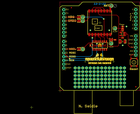

Contents
========

* [PROJ-SPAR-11018-STAN-01>RFM22 Shield-434MHz](#proj-spar-11018-stan-01rfm22-shield-434mhz)
	* [Images](#images)
	* [Interactive BOM](#interactive-bom)
	* [OOMP Parts](#oomp-parts)
	* [Tags](#tags)
  
![][im]
# PROJ-SPAR-11018-STAN-01>RFM22 Shield-434MHz

- ID: PROJ-SPAR-11018-STAN-01
- Hex ID: PRS11018
- Name: RFM22 Shield-434MHz
- Description: 

## Images
  
  

|eagleImage|
| :---: |
||

## Interactive BOM

- Interactive BOM page: [ibom.html](kicad/bom/ibom.html)

## OOMP Parts
  

|OOMP Parts|
| :---: |
|CAPC-UNMATCHED-X-UF10-V25, C1, 41.91, 33.019999999999996, 180,C1, 10uF, EIA3216, SparkFun, (1.65, 1.3), R180|
|CAPC-0402-X-NF100-V50, C2, 41.91, 35.559999999999995, 0,C2, 0.1uF, 0402-CAP, SparkFun, (1.65, 1.4), R0|
|CAPC-0402-X-NF100-V50, C3, 20.32, 30.479999999999997, 90,C3, 0.1uF, 0402-CAP, SparkFun, (0.8, 1.2), R90|
|CAPE-0402-X-UNMATCHED-01, C4, 41.91, 40.64, 0,C4, 470pF, 0402-CAP, SparkFun, (1.65, 1.6), R0|
|UNMATCHED-UNMATCHED-X-UNMATCHED-01, JP1, 15.239999999999998, 27.94, 0,JP1, 1X01, SparkFun, (0.6, 1.1), R0|
|UNMATCHED-UNMATCHED-X-UNMATCHED-01, JP2, 34.29, 57.15, 0,JP2, Antenna, 1X01, SparkFun, (1.35, 2.25), R0|
|UNMATCHED-UNMATCHED-X-UNMATCHED-01, JP3, 34.29, 31.75, 0,JP3, 1X01, SparkFun, (1.35, 1.25), R0|
|UNMATCHED-UNMATCHED-X-UNMATCHED-01, JP4, 15.239999999999998, 46.99, 0,JP4, 1X01, SparkFun, (0.6, 1.85), R0|
|UNMATCHED-UNMATCHED-X-UNMATCHED-01, JP5, 36.83, 41.91, 0,JP5, 1X01, SparkFun, (1.45, 1.65), R0|
|UNMATCHED-UNMATCHED-X-UNMATCHED-01, JP6, 15.239999999999998, 49.529999999999994, 0,JP6, 1X01, SparkFun, (0.6, 1.95), R0|
|UNMATCHED-UNMATCHED-X-UNMATCHED-01, JP7, 50.8, 2.54, 0,JP7, FIDUCIALUFIDUCIAL, MICRO-FIDUCIAL, SparkFun, (2, 0.1), R0|
|UNMATCHED-UNMATCHED-X-UNMATCHED-01, JP8, 7.619999999999999, 55.88, 0,JP8, FIDUCIALUFIDUCIAL, MICRO-FIDUCIAL, SparkFun, (0.3, 2.2), R0|
|UNMATCHED-0603-X-UNMATCHED-01, LED1, 41.91, 43.18, 270,LED1, Red, LED-0603, SparkFun, (1.65, 1.7), R270|
|<table><tr><td></td><td> R1</td><td>[RESE-0402-X-O103-01 SMD (0402) 10k Ohm Resistor](https://github.com/oomlout/oomlout_OOMP_parts/tree/main/RESE-0402-X-O103-01/)</td><td>[R42103](https://github.com/oomlout/oomlout_OOMP_parts/tree/main/RESE-0402-X-O103-01/)</td></tr></table>|
|RESE-0402-X-O331-01, R2, 41.91, 41.91, 180,R2, 330, 0402-RES, SparkFun, (1.65, 1.65), R180|
|UNMATCHED-UNMATCHED-X-UNMATCHED-01, S2, 49.529999999999994, 19.049999999999997, 270,S2, Reset, TACTILE_SWITCH_SMD, SparkFun, (1.95, 0.75), R270|
|UNMATCHED-UNMATCHED-X-UNMATCHED-01, SJ1, 12.7, 27.94, 0,SJ1, NC, SJ_2S-TRACE, SparkFun, (0.5, 1.1), R0|
|UNMATCHED-UNMATCHED-X-UNMATCHED-01, SJ2, 34.29, 34.29, 90,SJ2, NO, SJ_2S-NO, SparkFun, (1.35, 1.35), R90|
|UNMATCHED-UNMATCHED-X-UNMATCHED-01, SJ3, 12.7, 46.99, 0,SJ3, NC, SJ_2S-TRACE, SparkFun, (0.5, 1.85), R0|
|UNMATCHED-UNMATCHED-X-UNMATCHED-01, SJ4, 12.7, 49.529999999999994, 0,SJ4, NC, SJ_2S-TRACE, SparkFun, (0.5, 1.95), R0|
|UNMATCHED-UNMATCHED-X-UNMATCHED-01, U1, 41.91, 38.099999999999994, 90,U1, MIC5202-3.3V, SOT23-5, SparkFun, (1.65, 1.5), R90|
|UNMATCHED-UNMATCHED-X-UNMATCHED-01, U2, 26.669999999999998, 45.72, 270,U2, RFM22, RFM22-XXX-S2, SparkFun, (1.05, 1.8), R270|
|ERROR, U3 74HC4050 LVL, 0, 0, 0,U3, 74HC4050, LVL, CONVERTER, SO016, SparkFun, (1.05, 1.2), R0|
|UNMATCHED-UNMATCHED-X-UNMATCHED-01, U4, 0.0, 0.0, 0,U4, ARDUINO_SHIELD, DUEMILANOVE_SHIELD_NOHOLES, SparkFun, (0, 0), R0|

## Tags

- hexID: PRS11018
- oompType: PROJ
- oompSize: SPAR
- oompColor: 11018
- oompDesc: STAN
- oompIndex: 01
- oompName: RFM22 Shield-434MHz
- sources: All source files from https://github.com/sparkfun/RFM22_Shield-434MHz (source licence details in srcLicense.md)
- linkBuyPage: https://www.sparkfun.com/products/11018
- oompPart: CAPC-UNMATCHED-X-UF10-V25, C1, 41.91, 33.019999999999996, 180
- oompPart: CAPC-0402-X-NF100-V50, C2, 41.91, 35.559999999999995, 0
- oompPart: CAPC-0402-X-NF100-V50, C3, 20.32, 30.479999999999997, 90
- oompPart: CAPE-0402-X-UNMATCHED-01, C4, 41.91, 40.64, 0
- oompPart: UNMATCHED-UNMATCHED-X-UNMATCHED-01, JP1, 15.239999999999998, 27.94, 0
- oompPart: UNMATCHED-UNMATCHED-X-UNMATCHED-01, JP2, 34.29, 57.15, 0
- oompPart: UNMATCHED-UNMATCHED-X-UNMATCHED-01, JP3, 34.29, 31.75, 0
- oompPart: UNMATCHED-UNMATCHED-X-UNMATCHED-01, JP4, 15.239999999999998, 46.99, 0
- oompPart: UNMATCHED-UNMATCHED-X-UNMATCHED-01, JP5, 36.83, 41.91, 0
- oompPart: UNMATCHED-UNMATCHED-X-UNMATCHED-01, JP6, 15.239999999999998, 49.529999999999994, 0
- oompPart: UNMATCHED-UNMATCHED-X-UNMATCHED-01, JP7, 50.8, 2.54, 0
- oompPart: UNMATCHED-UNMATCHED-X-UNMATCHED-01, JP8, 7.619999999999999, 55.88, 0
- oompPart: UNMATCHED-0603-X-UNMATCHED-01, LED1, 41.91, 43.18, 270
- oompPart: RESE-0402-X-O103-01, R1, 36.83, 34.29, 180
- oompPart: RESE-0402-X-O331-01, R2, 41.91, 41.91, 180
- oompPart: UNMATCHED-UNMATCHED-X-UNMATCHED-01, S2, 49.529999999999994, 19.049999999999997, 270
- oompPart: UNMATCHED-UNMATCHED-X-UNMATCHED-01, SJ1, 12.7, 27.94, 0
- oompPart: UNMATCHED-UNMATCHED-X-UNMATCHED-01, SJ2, 34.29, 34.29, 90
- oompPart: UNMATCHED-UNMATCHED-X-UNMATCHED-01, SJ3, 12.7, 46.99, 0
- oompPart: UNMATCHED-UNMATCHED-X-UNMATCHED-01, SJ4, 12.7, 49.529999999999994, 0
- oompPart: UNMATCHED-UNMATCHED-X-UNMATCHED-01, U1, 41.91, 38.099999999999994, 90
- oompPart: UNMATCHED-UNMATCHED-X-UNMATCHED-01, U2, 26.669999999999998, 45.72, 270
- oompPart: ERROR, U3 74HC4050 LVL, 0, 0, 0
- oompPart: UNMATCHED-UNMATCHED-X-UNMATCHED-01, U4, 0.0, 0.0, 0
- rawPart: C1, 10uF, EIA3216, SparkFun, (1.65, 1.3), R180
- rawPart: C2, 0.1uF, 0402-CAP, SparkFun, (1.65, 1.4), R0
- rawPart: C3, 0.1uF, 0402-CAP, SparkFun, (0.8, 1.2), R90
- rawPart: C4, 470pF, 0402-CAP, SparkFun, (1.65, 1.6), R0
- rawPart: JP1, 1X01, SparkFun, (0.6, 1.1), R0
- rawPart: JP2, Antenna, 1X01, SparkFun, (1.35, 2.25), R0
- rawPart: JP3, 1X01, SparkFun, (1.35, 1.25), R0
- rawPart: JP4, 1X01, SparkFun, (0.6, 1.85), R0
- rawPart: JP5, 1X01, SparkFun, (1.45, 1.65), R0
- rawPart: JP6, 1X01, SparkFun, (0.6, 1.95), R0
- rawPart: JP7, FIDUCIALUFIDUCIAL, MICRO-FIDUCIAL, SparkFun, (2, 0.1), R0
- rawPart: JP8, FIDUCIALUFIDUCIAL, MICRO-FIDUCIAL, SparkFun, (0.3, 2.2), R0
- rawPart: LED1, Red, LED-0603, SparkFun, (1.65, 1.7), R270
- rawPart: R1, 10K, 0402-RES, SparkFun, (1.45, 1.35), R180
- rawPart: R2, 330, 0402-RES, SparkFun, (1.65, 1.65), R180
- rawPart: S2, Reset, TACTILE_SWITCH_SMD, SparkFun, (1.95, 0.75), R270
- rawPart: SJ1, NC, SJ_2S-TRACE, SparkFun, (0.5, 1.1), R0
- rawPart: SJ2, NO, SJ_2S-NO, SparkFun, (1.35, 1.35), R90
- rawPart: SJ3, NC, SJ_2S-TRACE, SparkFun, (0.5, 1.85), R0
- rawPart: SJ4, NC, SJ_2S-TRACE, SparkFun, (0.5, 1.95), R0
- rawPart: U1, MIC5202-3.3V, SOT23-5, SparkFun, (1.65, 1.5), R90
- rawPart: U2, RFM22, RFM22-XXX-S2, SparkFun, (1.05, 1.8), R270
- rawPart: U3, 74HC4050, LVL, CONVERTER, SO016, SparkFun, (1.05, 1.2), R0
- rawPart: U4, ARDUINO_SHIELD, DUEMILANOVE_SHIELD_NOHOLES, SparkFun, (0, 0), R0

[im]: eagleImage_450.png
