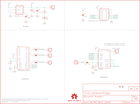

Contents
========

* [PRS11018 > Sparkfun](#prs11018--sparkfun)
	* [Schematic](#schematic)
	* [Interactive BOM](#interactive-bom)
	* [OOMP Parts](#oomp-parts)
	* [Images](#images)
	* [Tags](#tags)
  
![][im]
# PRS11018 > Sparkfun

- ID: PROJ-SPAR-11018-STAN-01
- Hex ID: PRS11018
- Name: Sparkfun
- Description: Sparkfun
- Long Link: [http://oom.lt/PROJ-SPAR-11018-STAN-01](http://oom.lt/PROJ-SPAR-11018-STAN-01)
- Short Link: [http://oom.lt/PRS11018](http://oom.lt/PRS11018)

## Schematic
  

## Interactive BOM

- Interactive BOM page: [ibom.html](https://htmlpreview.github.io/?https://github.com/oomlout/oomlout_OOMP_projects/blob/main/PROJ-SPAR-11018-STAN-01/kicad/bom/ibom.html)

## OOMP Parts
  

|OOMP Parts|
| :---: |
|C1,CAPX-UNMATCHED-X-UF10-01,C1,10uF,CAP_POL1206,EIA3216,Capacitor Polarized,,|
|C2,CAPC-0402-X-NF100-01,C2,0.1uF,CAP0402-CAP,0402-CAP,Capacitor,,|
|C3,CAPC-0402-X-NF100-01,C3,0.1uF,CAP0402-CAP,0402-CAP,Capacitor,,|
|C4,CAPC-0402-X-UNMATCHED-01,C4,470pF,CAP0402-CAP,0402-CAP,Capacitor,,|
|JP1,HEAD-I01-X-PI01-01,JP1,,M01PTH,1X01,Header 1,,|
|JP2,HEAD-I01-X-PI01-01,JP2,Antenna,M01PTH,1X01,Header 1,,|
|JP3,HEAD-I01-X-PI01-01,JP3,,M01PTH,1X01,Header 1,,|
|JP4,HEAD-I01-X-PI01-01,JP4,,M01PTH,1X01,Header 1,,|
|JP5,HEAD-I01-X-PI01-01,JP5,,M01PTH,1X01,Header 1,,|
|JP6,HEAD-I01-X-PI01-01,JP6,,M01PTH,1X01,Header 1,,|
|LED1,LEDS-0603-G-STAN-01,JP7,FIDUCIALUFIDUCIAL,FIDUCIALUFIDUCIAL,MICRO-FIDUCIAL,Fiducial Alignment Points,,|
|R1,RESE-0402-X-O103-01,JP8,FIDUCIALUFIDUCIAL,FIDUCIALUFIDUCIAL,MICRO-FIDUCIAL,Fiducial Alignment Points,,|
|R2,RESE-0402-X-O331-01,LED1,Red,LED0603,LED-0603,LEDs,,|
|S2,UNMATCHED-UNMATCHED-X-UNMATCHED-01,R1,10K,RESISTOR0402-RES,0402-RES,Resistor,,|
|U$3,UNMATCHED-UNMATCHED-X-UNMATCHED-01,R2,330,RESISTOR0402-RES,0402-RES,Resistor,,|
|U1,UNMATCHED-SO235-X-UNMATCHED-01,S2,Reset,SWITCH-MOMENTARY-2SMD,TACTILE_SWITCH_SMD,,,|
|U2,UNMATCHED-UNMATCHED-X-UNMATCHED-01,SJ1,NC,SOLDERJUMPERTRACE,SJ_2S-TRACE,Solder Jumper,,|
|U3,UNMATCHED-UNMATCHED-X-UNMATCHED-01,SJ2,NO,SOLDERJUMPERNO,SJ_2S-NO,Solder Jumper,,|
|U4,UNMATCHED-UNMATCHED-X-UNMATCHED-01,SJ3,NC,SOLDERJUMPERTRACE,SJ_2S-TRACE,Solder Jumper,,|

## Images
  
  

|kicadPcb3d|kicadPcb3dFront|kicadPcb3dBack|eagleImage|eagleSchemImage|
| :---: | :---: | :---: | :---: | :---: |
||||||

## Tags

- hexID: PRS11018
- oompType: PROJ
- oompSize: SPAR
- oompColor: 11018
- oompDesc: STAN
- oompIndex: 01
- oompName: RFM22 Shield-434MHz
- sources: All source files from https://github.com/sparkfun/RFM22_Shield-434MHz (source licence details in srcLicense.md)
- linkBuyPage: https://www.sparkfun.com/products/11018
- oompID: PROJ-SPAR-11018-STAN-01
- oompParts: C1,CAPX-UNMATCHED-X-UF10-01
- oompParts: C2,CAPC-0402-X-NF100-01
- oompParts: C3,CAPC-0402-X-NF100-01
- oompParts: C4,CAPC-0402-X-UNMATCHED-01
- oompParts: JP1,HEAD-I01-X-PI01-01
- oompParts: JP2,HEAD-I01-X-PI01-01
- oompParts: JP3,HEAD-I01-X-PI01-01
- oompParts: JP4,HEAD-I01-X-PI01-01
- oompParts: JP5,HEAD-I01-X-PI01-01
- oompParts: JP6,HEAD-I01-X-PI01-01
- oompParts: LED1,LEDS-0603-G-STAN-01
- oompParts: R1,RESE-0402-X-O103-01
- oompParts: R2,RESE-0402-X-O331-01
- oompParts: S2,UNMATCHED-UNMATCHED-X-UNMATCHED-01
- oompParts: U$3,UNMATCHED-UNMATCHED-X-UNMATCHED-01
- oompParts: U1,UNMATCHED-SO235-X-UNMATCHED-01
- oompParts: U2,UNMATCHED-UNMATCHED-X-UNMATCHED-01
- oompParts: U3,UNMATCHED-UNMATCHED-X-UNMATCHED-01
- oompParts: U4,UNMATCHED-UNMATCHED-X-UNMATCHED-01
- rawParts: C1,10uF,CAP_POL1206,EIA3216,Capacitor Polarized,,
- rawParts: C2,0.1uF,CAP0402-CAP,0402-CAP,Capacitor,,
- rawParts: C3,0.1uF,CAP0402-CAP,0402-CAP,Capacitor,,
- rawParts: C4,470pF,CAP0402-CAP,0402-CAP,Capacitor,,
- rawParts: JP1,,M01PTH,1X01,Header 1,,
- rawParts: JP2,Antenna,M01PTH,1X01,Header 1,,
- rawParts: JP3,,M01PTH,1X01,Header 1,,
- rawParts: JP4,,M01PTH,1X01,Header 1,,
- rawParts: JP5,,M01PTH,1X01,Header 1,,
- rawParts: JP6,,M01PTH,1X01,Header 1,,
- rawParts: JP7,FIDUCIALUFIDUCIAL,FIDUCIALUFIDUCIAL,MICRO-FIDUCIAL,Fiducial Alignment Points,,
- rawParts: JP8,FIDUCIALUFIDUCIAL,FIDUCIALUFIDUCIAL,MICRO-FIDUCIAL,Fiducial Alignment Points,,
- rawParts: LED1,Red,LED0603,LED-0603,LEDs,,
- rawParts: R1,10K,RESISTOR0402-RES,0402-RES,Resistor,,
- rawParts: R2,330,RESISTOR0402-RES,0402-RES,Resistor,,
- rawParts: S2,Reset,SWITCH-MOMENTARY-2SMD,TACTILE_SWITCH_SMD,,,
- rawParts: SJ1,NC,SOLDERJUMPERTRACE,SJ_2S-TRACE,Solder Jumper,,
- rawParts: SJ2,NO,SOLDERJUMPERNO,SJ_2S-NO,Solder Jumper,,
- rawParts: SJ3,NC,SOLDERJUMPERTRACE,SJ_2S-TRACE,Solder Jumper,,
- rawParts: SJ4,NC,SOLDERJUMPERTRACE,SJ_2S-TRACE,Solder Jumper,,
- rawParts: U$1,OSHW-LOGOS,OSHW-LOGOS,OSHW-LOGO-S,Open Source Hardware Logo This logo indicates the piece of hardware it is found on incorporates a OSHW license and/or adheres to the definition of open source hardware found here: http://freedomdefined.org/OSHW,,
- rawParts: U$3,CREATIVE_COMMONS,CREATIVE_COMMONS,CREATIVE_COMMONS,,,
- rawParts: U$7,LOGO-SFENEW,LOGO-SFENEW,SFE-NEW-WEBLOGO,Spark Fun Electronics PCB Logo,,
- rawParts: U$8,LOGO-SFENEW,LOGO-SFENEW,SFE-NEW-WEBLOGO,Spark Fun Electronics PCB Logo,,
- rawParts: U1,MIC5202-3.3V,V_REG_LDOSMD,SOT23-5,Voltage Regulator LDO,,
- rawParts: U2,RFM22,RFM22SMD,RFM22-XXX-S2,Description: The RFM22 is a low-power, low cost radio that is capable of operating in the 434MHz and 900MHz open bands. Its frequency is software defined and there are some very good libraries written for it.,,
- rawParts: U3,74HC4050 LVL CONVERTER,HEX_CONVERTER,SO016,,,
- rawParts: U4,ARDUINO_SHIELD,ARDUINO_SHIELDNOHOLES,DUEMILANOVE_SHIELD_NOHOLES,,,

[im]: kicadPcb3d_450.png
