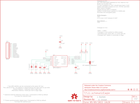

Contents
========

* [PRS11028 > MPU-6050 Breakout](#prs11028--mpu-6050-breakout)
	* [Schematic](#schematic)
	* [PCB](#pcb)
	* [Interactive BOM](#interactive-bom)
	* [OOMP Parts](#oomp-parts)
	* [Images](#images)
	* [Tags](#tags)
  
![][im]
# PRS11028 > MPU-6050 Breakout

- ID: PROJ-SPAR-11028-STAN-01
- Hex ID: PRS11028
- Name: Sparkfun
- Description: Sparkfun
- Long Link: [http://oom.lt/PROJ-SPAR-11028-STAN-01](http://oom.lt/PROJ-SPAR-11028-STAN-01)
- Short Link: [http://oom.lt/PRS11028](http://oom.lt/PRS11028)

## Schematic
  

## PCB
  

## Interactive BOM

- Interactive BOM page: [ibom.html](https://htmlpreview.github.io/?https://github.com/oomlout/oomlout_OOMP_projects/blob/main/PROJ-SPAR-11028-STAN-01/kicad/bom/ibom.html)

## OOMP Parts
  

|OOMP Parts|
| :---: |
|C1 C1,CAPC-0603-X-UF1D-01|
|C2 C2,CAPC-0603-X-PF22D-01|
|C3 C3,CAPC-0603-X-UF1D-01|
|C4 C4,CAPC-0603-X-NF10-01|
|[JP6 HEAD-I01-X-PI10-01 2.54 mm 10 Pin Header](https://github.com/oomlout/oomlout_OOMP_parts/tree/main/HEAD-I01-X-PI10-01/)|
|[R1 RESE-0603-X-O103-01 SMD (0603) 10k Ohm Resistor](https://github.com/oomlout/oomlout_OOMP_parts/tree/main/RESE-0603-X-O103-01/)|
|[R2 RESE-0603-X-O103-01 SMD (0603) 10k Ohm Resistor](https://github.com/oomlout/oomlout_OOMP_parts/tree/main/RESE-0603-X-O103-01/)|
|U1 U1,UNMATCHED-UNMATCHED-X-UNMATCHED-01|

## Images
  
  

|kicadPcb3d|kicadPcb3dFront|kicadPcb3dBack|eagleImage|eagleSchemImage|
| :---: | :---: | :---: | :---: | :---: |
||||||

## Tags

- hexID: PRS11028
- oompType: PROJ
- oompSize: SPAR
- oompColor: 11028
- oompDesc: STAN
- oompIndex: 01
- oompName: MPU-6050 Breakout
- sources: All source files from https://github.com/sparkfun/MPU-6050_Breakout (source licence details in srcLicense.md)
- linkBuyPage: https://www.sparkfun.com/products/11028
- oompID: PROJ-SPAR-11028-STAN-01
- oompParts: C1,CAPC-0603-X-UF1D-01
- oompParts: C2,CAPC-0603-X-PF22D-01
- oompParts: C3,CAPC-0603-X-UF1D-01
- oompParts: C4,CAPC-0603-X-NF10-01
- oompParts: JP6,HEAD-I01-X-PI10-01
- oompParts: R1,RESE-0603-X-O103-01
- oompParts: R2,RESE-0603-X-O103-01
- oompParts: U1,UNMATCHED-UNMATCHED-X-UNMATCHED-01
- rawParts: C1,0.1uF,CAP0603-CAP,0603-CAP,Capacitor,,
- rawParts: C2,2.2nF,CAP0603-CAP,0603-CAP,Capacitor,,
- rawParts: C3,0.1uF,CAP0603-CAP,0603-CAP,Capacitor,,
- rawParts: C4,10nF,CAP0603-CAP,0603-CAP,Capacitor,,
- rawParts: FRAME1,FRAME-LETTER,FRAME-LETTER,CREATIVE_COMMONS,Schematic Frame,,
- rawParts: JP2,FIDUCIALUFIDUCIAL,FIDUCIALUFIDUCIAL,MICRO-FIDUCIAL,Fiducial Alignment Points,,
- rawParts: JP3,STAND-OFFTIGHT,STAND-OFFTIGHT,STAND-OFF-TIGHT,Stand Off,,
- rawParts: JP4,STAND-OFFTIGHT,STAND-OFFTIGHT,STAND-OFF-TIGHT,Stand Off,,
- rawParts: JP5,FIDUCIALUFIDUCIAL,FIDUCIALUFIDUCIAL,MICRO-FIDUCIAL,Fiducial Alignment Points,,
- rawParts: JP6,M10,M10,1X10,Header 10,,
- rawParts: R1,10k,RESISTOR0603-RES,0603-RES,Resistor,,
- rawParts: R2,10k,RESISTOR0603-RES,0603-RES,Resistor,,
- rawParts: SJ1,,SOLDERJUMPER_2WAYPASTE2&3,SJ_3_PASTE2&3,Solder Jumper,,
- rawParts: SJ2,,SOLDERJUMPERTRACE,SJ_2S-TRACE,Solder Jumper,,
- rawParts: SJ3,,SOLDERJUMPERTRACE,SJ_2S-TRACE,Solder Jumper,,
- rawParts: U$1,OSHW-LOGOS,OSHW-LOGOS,OSHW-LOGO-S,Open Source Hardware Logo This logo indicates the piece of hardware it is found on incorporates a OSHW license and/or adheres to the definition of open source hardware found here: http://freedomdefined.org/OSHW,,
- rawParts: U$5,REVISION,REVISION,REVISION,,,
- rawParts: U1,MPU-6050-1,MPU-6050-1,QFN-24-4MM2,,,

[im]: kicadPcb3d_450.png
