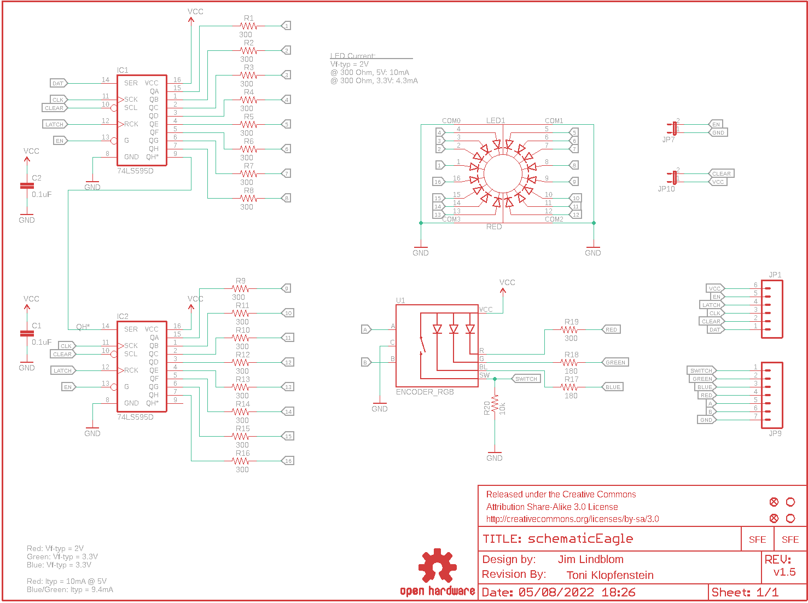
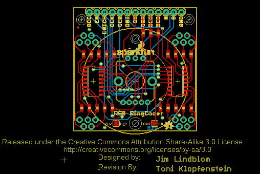
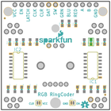
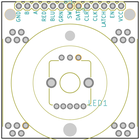
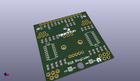
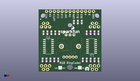
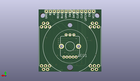
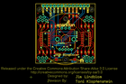

Contents
========

* [PRS11040 > LED RingCoder Breakout](#prs11040--led-ringcoder-breakout)
	* [Schematic](#schematic)
	* [PCB](#pcb)
	* [Interactive BOM](#interactive-bom)
	* [OOMP Parts](#oomp-parts)
	* [Images](#images)
	* [Tags](#tags)
  
![][im]
# PRS11040 > LED RingCoder Breakout

- ID: PROJ-SPAR-11040-STAN-01
- Hex ID: PRS11040
- Name: Sparkfun
- Description: Sparkfun
- Long Link: [http://oom.lt/PROJ-SPAR-11040-STAN-01](http://oom.lt/PROJ-SPAR-11040-STAN-01)
- Short Link: [http://oom.lt/PRS11040](http://oom.lt/PRS11040)

## Schematic
  

## PCB
  

## Interactive BOM

- Interactive BOM page: [ibom.html](https://htmlpreview.github.io/?https://github.com/oomlout/oomlout_OOMP_projects/blob/main/PROJ-SPAR-11040-STAN-01/kicad/bom/ibom.html)

## OOMP Parts
  

|OOMP Parts|
| :---: |
|[CAPC-0603-X-NF100-V50  SMD (0603) 100 nF Capacitor (Ceramic) 50v  C1, C2](https://github.com/oomlout/oomlout_OOMP_parts/tree/main/CAPC-0603-X-NF100-V50/)|
|UNMATCHED-UNMATCHED-X-UNMATCHED-01 IC1, IC2, JP7, JP10, U1|
|[HEAD-I01-X-PI06-01  2.54 mm 6 Pin Header  JP1](https://github.com/oomlout/oomlout_OOMP_parts/tree/main/HEAD-I01-X-PI06-01/)|
|[HEAD-I01-X-PI07-01  2.54 mm 7 Pin Header  JP9](https://github.com/oomlout/oomlout_OOMP_parts/tree/main/HEAD-I01-X-PI07-01/)|
|LEDS-UNMATCHED-R-STAN-01 LED1|
|[RESE-0603-X-O301-01  SMD (0603) 300 Ohm Resistor  R1, R2, R3, R4, R5, R6, R7, R8, R9, R10, R11, R12, R13, R14, R15, R16, R19](https://github.com/oomlout/oomlout_OOMP_parts/tree/main/RESE-0603-X-O301-01/)|
|RESE-0603-X-O181-01 R17, R18|
|[RESE-0603-X-O103-01  SMD (0603) 10k Ohm Resistor  R20](https://github.com/oomlout/oomlout_OOMP_parts/tree/main/RESE-0603-X-O103-01/)|

## Images
  
  

|bominteractivefront|bominteractiveback|kicadPcb3d|kicadPcb3dFront|kicadPcb3dBack|eagleImage|eagleSchemImage|
| :---: | :---: | :---: | :---: | :---: | :---: | :---: |
||||||||

## Tags

- hexID: PRS11040
- oompType: PROJ
- oompSize: SPAR
- oompColor: 11040
- oompDesc: STAN
- oompIndex: 01
- oompName: LED RingCoder Breakout
- sources: All source files from https://github.com/sparkfun/LED_RingCoder_Breakout (source licence details in srcLicense.md)
- linkBuyPage: https://www.sparkfun.com/products/11040
- oompID: PROJ-SPAR-11040-STAN-01
- oompParts: C1,CAPC-0603-X-NF100-V50
- oompParts: C2,CAPC-0603-X-NF100-V50
- oompParts: IC1,UNMATCHED-UNMATCHED-X-UNMATCHED-01
- oompParts: IC2,UNMATCHED-UNMATCHED-X-UNMATCHED-01
- oompParts: JP1,HEAD-I01-X-PI06-01
- oompParts: JP7,UNMATCHED-UNMATCHED-X-UNMATCHED-01
- oompParts: JP9,HEAD-I01-X-PI07-01
- oompParts: JP10,UNMATCHED-UNMATCHED-X-UNMATCHED-01
- oompParts: LED1,LEDS-UNMATCHED-R-STAN-01
- oompParts: R1,RESE-0603-X-O301-01
- oompParts: R2,RESE-0603-X-O301-01
- oompParts: R3,RESE-0603-X-O301-01
- oompParts: R4,RESE-0603-X-O301-01
- oompParts: R5,RESE-0603-X-O301-01
- oompParts: R6,RESE-0603-X-O301-01
- oompParts: R7,RESE-0603-X-O301-01
- oompParts: R8,RESE-0603-X-O301-01
- oompParts: R9,RESE-0603-X-O301-01
- oompParts: R10,RESE-0603-X-O301-01
- oompParts: R11,RESE-0603-X-O301-01
- oompParts: R12,RESE-0603-X-O301-01
- oompParts: R13,RESE-0603-X-O301-01
- oompParts: R14,RESE-0603-X-O301-01
- oompParts: R15,RESE-0603-X-O301-01
- oompParts: R16,RESE-0603-X-O301-01
- oompParts: R17,RESE-0603-X-O181-01
- oompParts: R18,RESE-0603-X-O181-01
- oompParts: R19,RESE-0603-X-O301-01
- oompParts: R20,RESE-0603-X-O103-01
- oompParts: U1,UNMATCHED-UNMATCHED-X-UNMATCHED-01
- rawParts: C1,0.1uF,0.1UF-25V(+80/-20%)(0603),0603-CAP,CAP-00810,CAP-00810,0.1uF,
- rawParts: C2,0.1uF,0.1UF-25V(+80/-20%)(0603),0603-CAP,CAP-00810,CAP-00810,0.1uF,
- rawParts: FRAME1,FRAME-LETTER,FRAME-LETTER,CREATIVE_COMMONS,Schematic Frame,,,
- rawParts: IC1,74LS595D,74LS595D,SO16,8-bit SHIFT REGISTER, output latch,,,
- rawParts: IC2,74LS595D,74LS595D,SO16,8-bit SHIFT REGISTER, output latch,,,
- rawParts: JP1,,M06SIP,1X06,Header 6,,,
- rawParts: JP2,LOGO-SFENW2,LOGO-SFENW2,SFE-NEW-WEB,Spark Fun Electronics PCB Logo,,,
- rawParts: JP3,STAND-OFF,STAND-OFF,STAND-OFF,Stand Off,,,
- rawParts: JP4,STAND-OFF,STAND-OFF,STAND-OFF,Stand Off,,,
- rawParts: JP5,FIDUCIAL1X2.5,FIDUCIAL1X2.5,FIDUCIAL-1X2.5,Fiducial Alignment Points,,,
- rawParts: JP6,LOGO-SFESK,LOGO-SFESK,SFE-LOGO-FLAME,Spark Fun Electronics PCB Logo,,,
- rawParts: JP7,,JUMPER-2SMD-NC,SJ_2S,Jumper,,,
- rawParts: JP8,FIDUCIAL1X2.5,FIDUCIAL1X2.5,FIDUCIAL-1X2.5,Fiducial Alignment Points,,,
- rawParts: JP9,,M07,1X07,Header 7,,,
- rawParts: JP10,,JUMPER-2SMD-NC,SJ_2S,Jumper,,,
- rawParts: LED1,RED,LED_RING,LED_RING,16 LED Ring,,,
- rawParts: R1,300,300OHM-1/10W-1%(0603),0603-RES,RES-10328,RES_10328,300,
- rawParts: R2,300,300OHM-1/10W-1%(0603),0603-RES,RES-10328,RES_10328,300,
- rawParts: R3,300,300OHM-1/10W-1%(0603),0603-RES,RES-10328,RES_10328,300,
- rawParts: R4,300,300OHM-1/10W-1%(0603),0603-RES,RES-10328,RES_10328,300,
- rawParts: R5,300,300OHM-1/10W-1%(0603),0603-RES,RES-10328,RES_10328,300,
- rawParts: R6,300,300OHM-1/10W-1%(0603),0603-RES,RES-10328,RES_10328,300,
- rawParts: R7,300,300OHM-1/10W-1%(0603),0603-RES,RES-10328,RES_10328,300,
- rawParts: R8,300,300OHM-1/10W-1%(0603),0603-RES,RES-10328,RES_10328,300,
- rawParts: R9,300,300OHM-1/10W-1%(0603),0603-RES,RES-10328,RES_10328,300,
- rawParts: R10,300,300OHM-1/10W-1%(0603),0603-RES,RES-10328,RES_10328,300,
- rawParts: R11,300,300OHM-1/10W-1%(0603),0603-RES,RES-10328,RES_10328,300,
- rawParts: R12,300,300OHM-1/10W-1%(0603),0603-RES,RES-10328,RES_10328,300,
- rawParts: R13,300,300OHM-1/10W-1%(0603),0603-RES,RES-10328,RES_10328,300,
- rawParts: R14,300,300OHM-1/10W-1%(0603),0603-RES,RES-10328,RES_10328,300,
- rawParts: R15,300,300OHM-1/10W-1%(0603),0603-RES,RES-10328,RES_10328,300,
- rawParts: R16,300,300OHM-1/10W-1%(0603),0603-RES,RES-10328,RES_10328,300,
- rawParts: R17,180,180OHM1/10W1%(0603),0603-RES,RES-08788,RES-08788,180,
- rawParts: R18,180,180OHM1/10W1%(0603),0603-RES,RES-08788,RES-08788,180,
- rawParts: R19,300,300OHM-1/10W-1%(0603),0603-RES,RES-10328,RES_10328,300,
- rawParts: R20,10k,10KOHM1/10W1%(0603)0603,0603-RES,RES-00824,RES-00824,10K,
- rawParts: U$1,REVISION,REVISION,REVISION,,,,
- rawParts: U$2,OSHW-LOGOS,OSHW-LOGOS,OSHW-LOGO-S,Open Source Hardware Logo This logo indicates the piece of hardware it is found on incorporates a OSHW license and/or adheres to the definition of open source hardware found here: http://freedomdefined.org/OSHW,,,
- rawParts: U1,ENCODER_RGB,ENCODER_RGB,ENCODER_LED_RGB,Illuminated Rotary Encoder w/ RGB LED and select switch,,,

[im]: kicadPcb3d_450.png
