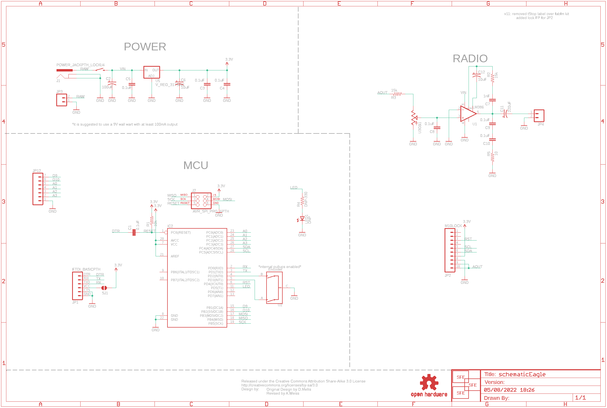
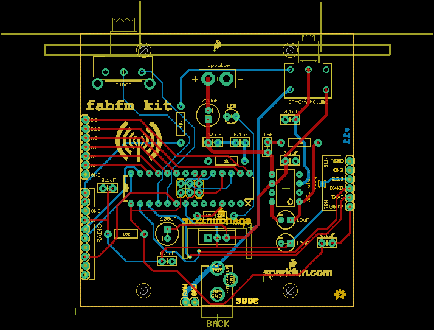
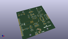
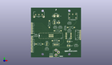
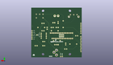
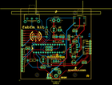
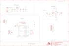

Contents
========

* [PRS11043 > fabFM-Kit](#prs11043--fabfm-kit)
	* [Schematic](#schematic)
	* [PCB](#pcb)
	* [Interactive BOM](#interactive-bom)
	* [OOMP Parts](#oomp-parts)
	* [Images](#images)
	* [Tags](#tags)
  
![][im]
# PRS11043 > fabFM-Kit

- ID: PROJ-SPAR-11043-STAN-01
- Hex ID: PRS11043
- Name: Sparkfun
- Description: Sparkfun
- Long Link: [http://oom.lt/PROJ-SPAR-11043-STAN-01](http://oom.lt/PROJ-SPAR-11043-STAN-01)
- Short Link: [http://oom.lt/PRS11043](http://oom.lt/PRS11043)

## Schematic
  

## PCB
  

## Interactive BOM

- Interactive BOM page: [ibom.html](https://htmlpreview.github.io/?https://github.com/oomlout/oomlout_OOMP_projects/blob/main/PROJ-SPAR-11043-STAN-01/kicad/bom/ibom.html)

## OOMP Parts
  

|OOMP Parts|
| :---: |
|C1 C1,CAPX-UNMATCHED-X-UF1D-01|
|C2 C2,CAPX-UNMATCHED-X-UF100-01|
|C3 C3,CAPX-UNMATCHED-X-UF1D-01|
|C4 C4,CAPX-UNMATCHED-X-UF1D-01|
|C5 C5,CAPX-UNMATCHED-X-UF1D-01|
|C6 C6,CAPX-UNMATCHED-X-UF10-01|
|C7 C7,CAPX-UNMATCHED-X-NF1-01|
|C8 C8,CAPX-UNMATCHED-X-UF1D-01|
|C9 C9,CAPX-UNMATCHED-X-UF1D-01|
|C10 C10,CAPX-UNMATCHED-X-UF1D-01|
|C11 C11,CAPX-UNMATCHED-X-UF220-01|
|C12 C12,CAPX-UNMATCHED-X-UF10-01|
|IC2 IC2,UNMATCHED-UNMATCHED-X-UNMATCHED-01|
|J1 J1,UNMATCHED-UNMATCHED-X-UNMATCHED-01|
|J2 J2,UNMATCHED-UNMATCHED-X-UNMATCHED-01|
|JP1 JP1,UNMATCHED-UNMATCHED-X-UNMATCHED-01|
|[JP2 HEAD-I01-X-PI10-01 2.54 mm 10 Pin Header](https://github.com/oomlout/oomlout_OOMP_parts/tree/main/HEAD-I01-X-PI10-01/)|
|[JP3 HEAD-I01-X-PI02-01 2.54 mm 2 Pin Header](https://github.com/oomlout/oomlout_OOMP_parts/tree/main/HEAD-I01-X-PI02-01/)|
|[JP4 HEAD-I01-X-PI02-01 2.54 mm 2 Pin Header](https://github.com/oomlout/oomlout_OOMP_parts/tree/main/HEAD-I01-X-PI02-01/)|
|[JP12 HEAD-I01-X-PI07-01 2.54 mm 7 Pin Header](https://github.com/oomlout/oomlout_OOMP_parts/tree/main/HEAD-I01-X-PI07-01/)|
|R1 R1,RESE-UNMATCHED-X-O103-01|
|R2 R2,RESE-UNMATCHED-X-O153-01|
|R3 R3,RESE-UNMATCHED-X-O153-01|
|R4 R4,RESE-UNMATCHED-X-UNMATCHED-01|
|R5 R5,RESE-UNMATCHED-X-O100-01|
|U1 U1,UNMATCHED-UNMATCHED-X-UNMATCHED-01|
|U2 U2,UNMATCHED-UNMATCHED-X-UNMATCHED-01|
|U3 U3,UNMATCHED-UNMATCHED-X-UNMATCHED-01|
|U5 U5,UNMATCHED-UNMATCHED-X-UNMATCHED-01|

## Images
  
  

|kicadPcb3d|kicadPcb3dFront|kicadPcb3dBack|eagleImage|eagleSchemImage|
| :---: | :---: | :---: | :---: | :---: |
||||||

## Tags

- hexID: PRS11043
- oompType: PROJ
- oompSize: SPAR
- oompColor: 11043
- oompDesc: STAN
- oompIndex: 01
- oompName: fabFM-Kit
- sources: All source files from https://github.com/sparkfun/fabFM-Kit (source licence details in srcLicense.md)
- linkBuyPage: https://www.sparkfun.com/products/11043
- oompID: PROJ-SPAR-11043-STAN-01
- oompParts: C1,CAPX-UNMATCHED-X-UF1D-01
- oompParts: C2,CAPX-UNMATCHED-X-UF100-01
- oompParts: C3,CAPX-UNMATCHED-X-UF1D-01
- oompParts: C4,CAPX-UNMATCHED-X-UF1D-01
- oompParts: C5,CAPX-UNMATCHED-X-UF1D-01
- oompParts: C6,CAPX-UNMATCHED-X-UF10-01
- oompParts: C7,CAPX-UNMATCHED-X-NF1-01
- oompParts: C8,CAPX-UNMATCHED-X-UF1D-01
- oompParts: C9,CAPX-UNMATCHED-X-UF1D-01
- oompParts: C10,CAPX-UNMATCHED-X-UF1D-01
- oompParts: C11,CAPX-UNMATCHED-X-UF220-01
- oompParts: C12,CAPX-UNMATCHED-X-UF10-01
- oompParts: IC2,UNMATCHED-UNMATCHED-X-UNMATCHED-01
- oompParts: J1,UNMATCHED-UNMATCHED-X-UNMATCHED-01
- oompParts: J2,UNMATCHED-UNMATCHED-X-UNMATCHED-01
- oompParts: JP1,UNMATCHED-UNMATCHED-X-UNMATCHED-01
- oompParts: JP2,HEAD-I01-X-PI10-01
- oompParts: JP3,HEAD-I01-X-PI02-01
- oompParts: JP4,HEAD-I01-X-PI02-01
- oompParts: JP12,HEAD-I01-X-PI07-01
- oompParts: R1,RESE-UNMATCHED-X-O103-01
- oompParts: R2,RESE-UNMATCHED-X-O153-01
- oompParts: R3,RESE-UNMATCHED-X-O153-01
- oompParts: R4,RESE-UNMATCHED-X-UNMATCHED-01
- oompParts: R5,RESE-UNMATCHED-X-O100-01
- oompParts: U1,UNMATCHED-UNMATCHED-X-UNMATCHED-01
- oompParts: U2,UNMATCHED-UNMATCHED-X-UNMATCHED-01
- oompParts: U3,UNMATCHED-UNMATCHED-X-UNMATCHED-01
- oompParts: U5,UNMATCHED-UNMATCHED-X-UNMATCHED-01
- rawParts: C1,0.1uF,CAPKIT,CAP-PTH-SMALL-KIT,Capacitor,,
- rawParts: C2,100uF,CAP_POLPTH1,CPOL-RADIAL-100UF-25V,Capacitor Polarized,,
- rawParts: C3,0.1uF,CAPKIT,CAP-PTH-SMALL-KIT,Capacitor,,
- rawParts: C4,0.1uF,CAPKIT,CAP-PTH-SMALL-KIT,Capacitor,,
- rawParts: C5,0.1uF,CAPKIT,CAP-PTH-SMALL-KIT,Capacitor,,
- rawParts: C6,10uF,CAP_POLPTH2,CPOL-RADIAL-10UF-25V,Capacitor Polarized,,
- rawParts: C7,1nF,CAPKIT,CAP-PTH-SMALL-KIT,Capacitor,,
- rawParts: C8,0.1uF,CAPKIT,CAP-PTH-SMALL-KIT,Capacitor,,
- rawParts: C9,0.1uF,CAPKIT,CAP-PTH-SMALL-KIT,Capacitor,,
- rawParts: C10,0.1uF,CAPKIT,CAP-PTH-SMALL-KIT,Capacitor,,
- rawParts: C11,220uF,CAP_POLPTH1,CPOL-RADIAL-100UF-25V,Capacitor Polarized,,
- rawParts: C12,10uF,CAP_POLPTH2,CPOL-RADIAL-10UF-25V,Capacitor Polarized,,
- rawParts: IC2,,ATMEGA328P_PDIP_EZ_PB0,DIL28-EZ-PB0,Polarized FP for kits with PB0 removed.,,
- rawParts: J1,POWER_JACKPTH_LOCK,POWER_JACKPTH_LOCK,POWER_JACK_PTH_LOCK,Power Jack,,
- rawParts: J2,AVR_SPI_PRG_6PTH,AVR_SPI_PRG_6PTH,2X3,AVR ISP 6 Pin,,
- rawParts: JP1,FTDI_BASICPTH,FTDI_BASICPTH,FTDI_BASIC,FTDI Basic: 3.3V and 5V,,
- rawParts: JP2,M10LOCK,M10LOCK,1X10_LOCK,Header 10,,
- rawParts: JP3,,M02PTH,1X02,Header 2,,
- rawParts: JP4,,M02PTH4,1X02_XTRA_BIG,Header 2,,
- rawParts: JP8,LOGO-SFESK,LOGO-SFESK,SFE-LOGO-FLAME,Spark Fun Electronics PCB Logo,,
- rawParts: JP9,LOGO-SFENEW,LOGO-SFENEW,SFE-NEW-WEBLOGO,Spark Fun Electronics PCB Logo,,
- rawParts: JP11,LOGO-SFENEW,LOGO-SFENEW,SFE-NEW-WEBLOGO,Spark Fun Electronics PCB Logo,,
- rawParts: JP12,,M07,1X07,Header 7,,
- rawParts: LED1,DNP,LED3MM,LED3MM,LEDs,,
- rawParts: R1,10k,RESISTORPTH-1/4W,AXIAL-0.4,Resistor,,
- rawParts: R2,15k,RESISTORPTH-1/4W,AXIAL-0.4,Resistor,,
- rawParts: R3,15k,RESISTORPTH-1/4W,AXIAL-0.4,Resistor,,
- rawParts: R4,DNP-330,RESISTORPTH-1/4W,AXIAL-0.4,Resistor,,
- rawParts: R5,10,RESISTORPTH-1/4W,AXIAL-0.4,Resistor,,
- rawParts: SJ1,SOLDERJUMPERNO,SOLDERJUMPERNO,SJ_2S-NO,Solder Jumper,,
- rawParts: U$1,OSHW-LOGOS,OSHW-LOGOS,OSHW-LOGO-S,Open Source Hardware Logo This logo indicates the piece of hardware it is found on incorporates a OSHW license and/or adheres to the definition of open source hardware found here: http://freedomdefined.org/OSHW,,
- rawParts: U$2,CREATIVE_COMMONS,CREATIVE_COMMONS,CREATIVE_COMMONS,,,
- rawParts: U1,LM386,LM386,DIP08,low voltage audio power amplifier,,
- rawParts: U2,Encoder,ENCODER-QUADRATURE,ENCODER-16MM-QUAD,quadrature encoder from Top-Up, part#EC16PHBF-B-20F-24-24C-16Y,,
- rawParts: U3,,POT_SWITCHPOT_PTH_SWITCH,POT_PTH_SWITCH,Potentiometer w/ switch.,,
- rawParts: U5,V_REG_317SINK,V_REG_317SINK,TO220-ADJ,Voltage Regulator,,

[im]: kicadPcb3d_450.png
