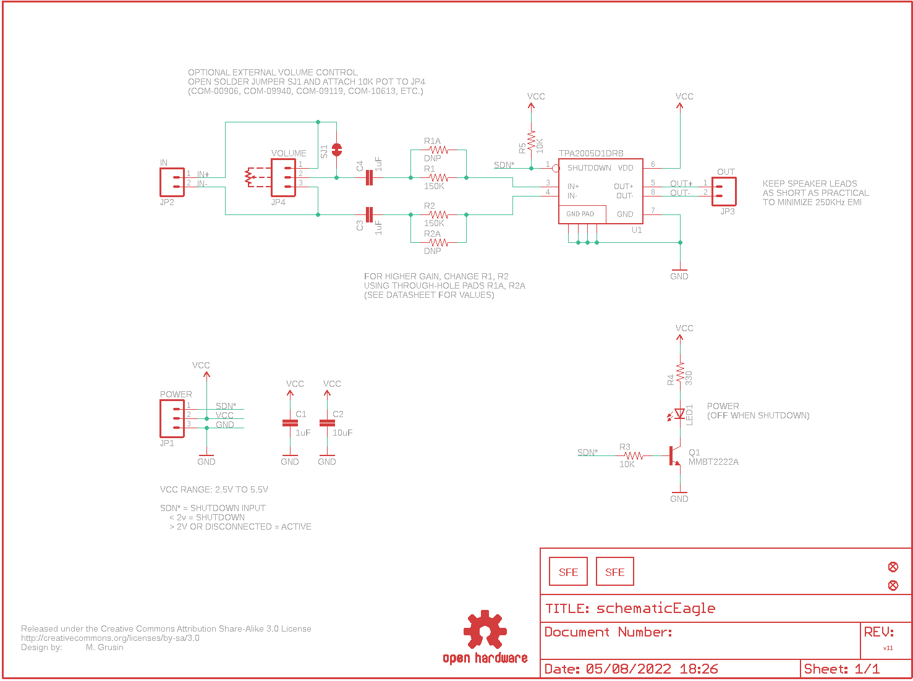
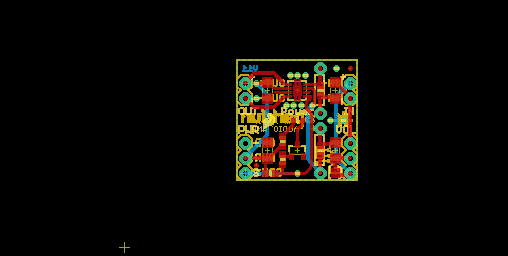
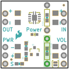
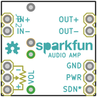
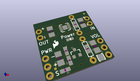
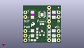
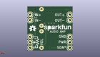
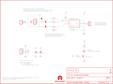
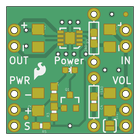
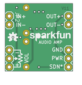

Contents
========

* [PRS11044 > Mono Audio Amp Breakout-TPA2005D1](#prs11044--mono-audio-amp-breakout-tpa2005d1)
	* [Schematic](#schematic)
	* [PCB](#pcb)
	* [Interactive BOM](#interactive-bom)
	* [OOMP Parts](#oomp-parts)
	* [Images](#images)
	* [Tags](#tags)
  
![][im]
# PRS11044 > Mono Audio Amp Breakout-TPA2005D1

- ID: PROJ-SPAR-11044-STAN-01
- Hex ID: PRS11044
- Name: Sparkfun
- Description: Sparkfun
- Long Link: [http://oom.lt/PROJ-SPAR-11044-STAN-01](http://oom.lt/PROJ-SPAR-11044-STAN-01)
- Short Link: [http://oom.lt/PRS11044](http://oom.lt/PRS11044)

## Schematic
  

## PCB
  

## Interactive BOM

- Interactive BOM page: [ibom.html](https://htmlpreview.github.io/?https://github.com/oomlout/oomlout_OOMP_projects/blob/main/PROJ-SPAR-11044-STAN-01/kicad/bom/ibom.html)

## OOMP Parts
  

|OOMP ID|Name|Identifier|
| :---: | :---: | :---: |
|CAPC-1206-X-UF1-01||C1, C3, C4|
|[CAPC-1206-X-UF10-V25](https://github.com/oomlout/oomlout_OOMP_parts/tree/main/CAPC-1206-X-UF10-V25/)|[SMD (1206) 10 uF Capacitor (Ceramic) 25v](https://github.com/oomlout/oomlout_OOMP_parts/tree/main/CAPC-1206-X-UF10-V25/)|[C2](https://github.com/oomlout/oomlout_OOMP_parts/tree/main/CAPC-1206-X-UF10-V25/)|
|[HEAD-I01-X-PI03-01](https://github.com/oomlout/oomlout_OOMP_parts/tree/main/HEAD-I01-X-PI03-01/)|[2.54 mm 3 Pin Header](https://github.com/oomlout/oomlout_OOMP_parts/tree/main/HEAD-I01-X-PI03-01/)|[JP1, JP4](https://github.com/oomlout/oomlout_OOMP_parts/tree/main/HEAD-I01-X-PI03-01/)|
|[HEAD-I01-X-PI02-01](https://github.com/oomlout/oomlout_OOMP_parts/tree/main/HEAD-I01-X-PI02-01/)|[2.54 mm 2 Pin Header](https://github.com/oomlout/oomlout_OOMP_parts/tree/main/HEAD-I01-X-PI02-01/)|[JP2, JP3](https://github.com/oomlout/oomlout_OOMP_parts/tree/main/HEAD-I01-X-PI02-01/)|
|[LEDS-0603-G-STAN-01](https://github.com/oomlout/oomlout_OOMP_parts/tree/main/LEDS-0603-G-STAN-01/)|[SMD (0603) Green LED](https://github.com/oomlout/oomlout_OOMP_parts/tree/main/LEDS-0603-G-STAN-01/)|[LED1](https://github.com/oomlout/oomlout_OOMP_parts/tree/main/LEDS-0603-G-STAN-01/)|
|UNMATCHED-SO23-X-UNMATCHED-01||Q1|
|RESE-0603-X-O1503-01||R1, R2|
|[RESE-0603-X-O103-01](https://github.com/oomlout/oomlout_OOMP_parts/tree/main/RESE-0603-X-O103-01/)|[SMD (0603) 10k Ohm Resistor](https://github.com/oomlout/oomlout_OOMP_parts/tree/main/RESE-0603-X-O103-01/)|[R3, R5](https://github.com/oomlout/oomlout_OOMP_parts/tree/main/RESE-0603-X-O103-01/)|
|[RESE-0603-X-O331-01](https://github.com/oomlout/oomlout_OOMP_parts/tree/main/RESE-0603-X-O331-01/)|[SMD (0603) 330 Ohm Resistor](https://github.com/oomlout/oomlout_OOMP_parts/tree/main/RESE-0603-X-O331-01/)|[R4](https://github.com/oomlout/oomlout_OOMP_parts/tree/main/RESE-0603-X-O331-01/)|
|UNMATCHED-UNMATCHED-X-UNMATCHED-01||U1|

## Images
  
  

|bominteractivefront|bominteractiveback|kicadPcb3d|kicadPcb3dFront|kicadPcb3dBack|eagleImage|eagleSchemImage|pcbdraw|pcbdrawback|
| :---: | :---: | :---: | :---: | :---: | :---: | :---: | :---: | :---: |
||||||||||

## Tags

- hexID: PRS11044
- oompType: PROJ
- oompSize: SPAR
- oompColor: 11044
- oompDesc: STAN
- oompIndex: 01
- oompName: Mono Audio Amp Breakout-TPA2005D1
- sources: All source files from https://github.com/sparkfun/Mono_Audio_Amp_Breakout-TPA2005D1 (source licence details in srcLicense.md)
- linkBuyPage: https://www.sparkfun.com/products/11044
- oompID: PROJ-SPAR-11044-STAN-01
- oompParts: C1,CAPC-1206-X-UF1-01
- oompParts: C2,CAPC-1206-X-UF10-V25
- oompParts: C3,CAPC-1206-X-UF1-01
- oompParts: C4,CAPC-1206-X-UF1-01
- oompParts: JP1,HEAD-I01-X-PI03-01
- oompParts: JP2,HEAD-I01-X-PI02-01
- oompParts: JP3,HEAD-I01-X-PI02-01
- oompParts: JP4,HEAD-I01-X-PI03-01
- oompParts: LED1,LEDS-0603-G-STAN-01
- oompParts: Q1,UNMATCHED-SO23-X-UNMATCHED-01
- oompParts: R1,RESE-0603-X-O1503-01
- oompParts: R2,RESE-0603-X-O1503-01
- oompParts: R3,RESE-0603-X-O103-01
- oompParts: R4,RESE-0603-X-O331-01
- oompParts: R5,RESE-0603-X-O103-01
- oompParts: U1,UNMATCHED-UNMATCHED-X-UNMATCHED-01
- rawParts: C1,1uF,CAP1206,1206,Capacitor,,
- rawParts: C2,10uF,CAP1206,1206,Capacitor,,
- rawParts: C3,1uF,CAP1206,1206,Capacitor,,
- rawParts: C4,1uF,CAP1206,1206,Capacitor,,
- rawParts: JP1,POWER,M03PTH,1X03,Header 3,,
- rawParts: JP2,IN,M02PTH,1X02,Header 2,,
- rawParts: JP3,OUT,M02PTH,1X02,Header 2,,
- rawParts: JP4,VOLUME,M03PTH,1X03,Header 3,,
- rawParts: JP5,FIDUCIALUFIDUCIAL,FIDUCIALUFIDUCIAL,MICRO-FIDUCIAL,Fiducial Alignment Points,,
- rawParts: JP6,FIDUCIALUFIDUCIAL,FIDUCIALUFIDUCIAL,MICRO-FIDUCIAL,Fiducial Alignment Points,,
- rawParts: LED1,,LED0603,LED-0603,LEDs,,
- rawParts: LOGO1,LOGO-SFENW2,LOGO-SFENW2,SFE-NEW-WEB,Spark Fun Electronics PCB Logo,,
- rawParts: LOGO2,LOGO-SFESK,LOGO-SFESK,SFE-LOGO-FLAME,Spark Fun Electronics PCB Logo,,
- rawParts: Q1,MMBT2222A,TRANSISTOR_NPNSOT23-3,SOT23-3,Transistor NPN,,
- rawParts: R1,150K,RESISTOR0603-RES,0603-RES,Resistor,,
- rawParts: R1A,DNP,RESISTORAXIAL-0.3,AXIAL-0.3,Resistor,,
- rawParts: R2,150K,RESISTOR0603-RES,0603-RES,Resistor,,
- rawParts: R2A,DNP,RESISTORAXIAL-0.3,AXIAL-0.3,Resistor,,
- rawParts: R3,10K,RESISTOR0603-RES,0603-RES,Resistor,,
- rawParts: R4,330,RESISTOR0603-RES,0603-RES,Resistor,,
- rawParts: R5,10K,RESISTOR0603-RES,0603-RES,Resistor,,
- rawParts: SJ1,,SOLDERJUMPERNC2,SJ_2S-NOTRACE,Solder Jumper,,
- rawParts: U$1,CREATIVE_COMMONS,CREATIVE_COMMONS,CREATIVE_COMMONS,,,
- rawParts: U$2,OSHW-LOGOS,OSHW-LOGOS,OSHW-LOGO-S,Open Source Hardware Logo This logo indicates the piece of hardware it is found on incorporates a OSHW license and/or adheres to the definition of open source hardware found here: http://freedomdefined.org/OSHW,,
- rawParts: U1,TPA2005D1DRB,TPA2005D1DRB,QFN-8_PAD,1.4W MONO CLASS-D AUDIO POWER AMPLIFIER,,

[im]: kicadPcb3d_450.png
