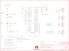

Contents
========

* [PRS11058 > Venus GPS SMA Connector](#prs11058--venus-gps-sma-connector)
	* [Schematic](#schematic)
	* [PCB](#pcb)
	* [Interactive BOM](#interactive-bom)
	* [OOMP Parts](#oomp-parts)
	* [Images](#images)
	* [Tags](#tags)
  
![][im]
# PRS11058 > Venus GPS SMA Connector

- ID: PROJ-SPAR-11058-STAN-01
- Hex ID: PRS11058
- Name: Sparkfun
- Description: Sparkfun
- Long Link: [http://oom.lt/PROJ-SPAR-11058-STAN-01](http://oom.lt/PROJ-SPAR-11058-STAN-01)
- Short Link: [http://oom.lt/PRS11058](http://oom.lt/PRS11058)

## Schematic
  

## PCB
  

## Interactive BOM

- Interactive BOM page: [ibom.html](https://htmlpreview.github.io/?https://github.com/oomlout/oomlout_OOMP_projects/blob/main/PROJ-SPAR-11058-STAN-01/kicad/bom/ibom.html)

## OOMP Parts
  

|OOMP Parts|
| :---: |
|C1 C1,CAPC-0402-X-UF1D-01|
|C2 C2,CAPX-UNMATCHED-X-UF10-01|
|C3 C3,CAPC-0402-X-UF1-01|
|C4 C4,CAPC-0402-X-PF22-01|
|C5 C5,CAPC-0402-X-UF1D-01|
|D1 D1,DIOD-S323-X-UNMATCHED-01|
|[JP1 HEAD-I01-X-PI04-01 2.54 mm 4 Pin Header](https://github.com/oomlout/oomlout_OOMP_parts/tree/main/HEAD-I01-X-PI04-01/)|
|[JP2 HEAD-I01-X-PI04-01 2.54 mm 4 Pin Header](https://github.com/oomlout/oomlout_OOMP_parts/tree/main/HEAD-I01-X-PI04-01/)|
|[JP3 HEAD-I01-X-PI04-01 2.54 mm 4 Pin Header](https://github.com/oomlout/oomlout_OOMP_parts/tree/main/HEAD-I01-X-PI04-01/)|
|[JP4 HEAD-I01-X-PI04-01 2.54 mm 4 Pin Header](https://github.com/oomlout/oomlout_OOMP_parts/tree/main/HEAD-I01-X-PI04-01/)|
|JP5 JP5,UNMATCHED-UNMATCHED-X-UNMATCHED-01|
|L1 L1,UNMATCHED-0402-X-UNMATCHED-01|
|[LED1 LEDS-0603-G-STAN-01 SMD (0603) Green LED](https://github.com/oomlout/oomlout_OOMP_parts/tree/main/LEDS-0603-G-STAN-01/)|
|R1 R1,RESE-0402-X-O333-01|
|[R2 RESE-0402-X-O103-01 SMD (0402) 10k Ohm Resistor](https://github.com/oomlout/oomlout_OOMP_parts/tree/main/RESE-0402-X-O103-01/)|
|R3 R3,RESE-0402-X-O331-01|
|R4 R4,RESE-0402-X-O331-01|
|[R6 RESE-0402-X-O103-01 SMD (0402) 10k Ohm Resistor](https://github.com/oomlout/oomlout_OOMP_parts/tree/main/RESE-0402-X-O103-01/)|
|R7 R7,RESE-UNMATCHED-X-UNMATCHED-01|
|U1 U1,UNMATCHED-UNMATCHED-X-UNMATCHED-01|

## Images
  
  

|kicadPcb3d|kicadPcb3dFront|kicadPcb3dBack|eagleImage|eagleSchemImage|
| :---: | :---: | :---: | :---: | :---: |
||||||

## Tags

- hexID: PRS11058
- oompType: PROJ
- oompSize: SPAR
- oompColor: 11058
- oompDesc: STAN
- oompIndex: 01
- oompName: Venus GPS SMA Connector
- sources: All source files from https://github.com/sparkfun/Venus_GPS_SMA_Connector (source licence details in srcLicense.md)
- linkBuyPage: https://www.sparkfun.com/products/11058
- oompID: PROJ-SPAR-11058-STAN-01
- oompParts: C1,CAPC-0402-X-UF1D-01
- oompParts: C2,CAPX-UNMATCHED-X-UF10-01
- oompParts: C3,CAPC-0402-X-UF1-01
- oompParts: C4,CAPC-0402-X-PF22-01
- oompParts: C5,CAPC-0402-X-UF1D-01
- oompParts: D1,DIOD-S323-X-UNMATCHED-01
- oompParts: JP1,HEAD-I01-X-PI04-01
- oompParts: JP2,HEAD-I01-X-PI04-01
- oompParts: JP3,HEAD-I01-X-PI04-01
- oompParts: JP4,HEAD-I01-X-PI04-01
- oompParts: JP5,UNMATCHED-UNMATCHED-X-UNMATCHED-01
- oompParts: L1,UNMATCHED-0402-X-UNMATCHED-01
- oompParts: LED1,LEDS-0603-G-STAN-01
- oompParts: R1,RESE-0402-X-O333-01
- oompParts: R2,RESE-0402-X-O103-01
- oompParts: R3,RESE-0402-X-O331-01
- oompParts: R4,RESE-0402-X-O331-01
- oompParts: R6,RESE-0402-X-O103-01
- oompParts: R7,RESE-UNMATCHED-X-UNMATCHED-01
- oompParts: U1,UNMATCHED-UNMATCHED-X-UNMATCHED-01
- rawParts: C1,0.1uF,CAP0402-CAP,0402-CAP,Capacitor,,
- rawParts: C2,10uF,CAP_POL1206,EIA3216,Capacitor Polarized,,
- rawParts: C3,1uF,CAP0402-CAP,0402-CAP,Capacitor,,
- rawParts: C4,22pF,CAP0402-CAP,0402-CAP,Capacitor,,
- rawParts: C5,0.1uF,CAP0402-CAP,0402-CAP,Capacitor,,
- rawParts: C7,DNP,CAP_POLEN_J2,EN_J2,Capacitor Polarized,,
- rawParts: D1,BAS16,DIODESOD,SOD-323,Diode,,
- rawParts: JP1,MAIN,M04PTH,1X04,Header 4,,
- rawParts: JP2,MISC,M04PTH,1X04,Header 4,,
- rawParts: JP3,SPI,M04PTH,1X04,Header 4,,
- rawParts: JP4,AUX,M04PTH,1X04,Header 4,,
- rawParts: JP5,SMA_EDGE,SMA_EDGE,SMA-EDGE,SMA Antenna Connector,,
- rawParts: JP6,FIDUCIALUFIDUCIAL,FIDUCIALUFIDUCIAL,MICRO-FIDUCIAL,Fiducial Alignment Points,,
- rawParts: JP7,FIDUCIALUFIDUCIAL,FIDUCIALUFIDUCIAL,MICRO-FIDUCIAL,Fiducial Alignment Points,,
- rawParts: L1,33nH,INDUCTOR0402,C0402,Inductors,,
- rawParts: LED1,Red,LED0603,LED-0603,LEDs,,
- rawParts: LOGO1,LOGO-SFESK,LOGO-SFESK,SFE-LOGO-FLAME,Spark Fun Electronics PCB Logo,,
- rawParts: LOGO2,LOGO-SFESK,LOGO-SFESK,SFE-LOGO-FLAME,Spark Fun Electronics PCB Logo,,
- rawParts: LOGO3,LOGO-SFENW2,LOGO-SFENW2,SFE-NEW-WEB,Spark Fun Electronics PCB Logo,,
- rawParts: R1,33k,RESISTOR0402-RES,0402-RES,Resistor,,
- rawParts: R2,10k,RESISTOR0402-RES,0402-RES,Resistor,,
- rawParts: R3,330,RESISTOR0402-RES,0402-RES,Resistor,,
- rawParts: R4,330,RESISTOR0402-RES,0402-RES,Resistor,,
- rawParts: R6,10K,RESISTOR0402-RES,0402-RES,Resistor,,
- rawParts: R7,0,GND-JUMP,GND-JUMP,Zero-Ohm trace for connecting different ground planes at a single point.,,
- rawParts: SJ1,BTS,SOLDERJUMPER_2WAYPASTE2&3,SJ_3_PASTE2&3,Solder Jumper,,
- rawParts: SJ2,PSE,SOLDERJUMPER_2WAYPASTE2&3,SJ_3_PASTE2&3,Solder Jumper,,
- rawParts: SJ3,BAT,SOLDERJUMPERNC,SJ_2S,Solder Jumper,,
- rawParts: U$4,OSHW-LOGOS,OSHW-LOGOS,OSHW-LOGO-S,Open Source Hardware Logo This logo indicates the piece of hardware it is found on incorporates a OSHW license and/or adheres to the definition of open source hardware found here: http://freedomdefined.org/OSHW,,
- rawParts: U$5,CREATIVE_COMMONS,CREATIVE_COMMONS,CREATIVE_COMMONS,,,
- rawParts: U1,VENUS638FLPX-L,VENUS638FLPX-L,VENUS638FLPX,Venus638FLPX-L GPS Receiver,,

[im]: kicadPcb3d_450.png
