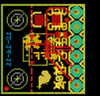
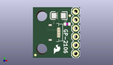
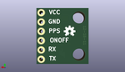
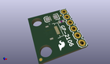

Contents
========

* [PROJ-SPAR-11073-STAN-01>GP-2106 Breakout](#proj-spar-11073-stan-01gp-2106-breakout)
	* [Images](#images)
	* [Interactive BOM](#interactive-bom)
	* [OOMP Parts](#oomp-parts)
	* [Tags](#tags)
  
![][im]
# PROJ-SPAR-11073-STAN-01>GP-2106 Breakout

- ID: PROJ-SPAR-11073-STAN-01
- Hex ID: PRS11073
- Name: GP-2106 Breakout
- Description: 

## Images
  
  

|eagleImage|kicadPcb3dFront|kicadPcb3dBack|kicadPcb3d|
| :---: | :---: | :---: | :---: |
|||||

## Interactive BOM

- Interactive BOM page: [ibom.html](kicad/bom/ibom.html)

## OOMP Parts
  

|OOMP Parts|
| :---: |
|CAPC-0402-X-UNMATCHED-01, C1, 10.16, 10.16, 0,C1, 1uF, 0402-CAP, SparkFun, (0.4, 0.4), R0|
|CAPC-UNMATCHED-X-UNMATCHED-01, C2, 7.619999999999999, 12.7, 180,C2, 10uF, EIA3216, SparkFun, (0.3, 0.5), R180|
|<table><tr><td></td><td> JP1</td><td>[HEAD-I01-X-PI06-01 2.54 mm 6 Pin Header](https://github.com/oomlout/oomlout_OOMP_parts/tree/main/HEAD-I01-X-PI06-01/)</td><td>[H06](https://github.com/oomlout/oomlout_OOMP_parts/tree/main/HEAD-I01-X-PI06-01/)</td></tr></table>|
|UNMATCHED-UNMATCHED-X-UNMATCHED-01, U1, 7.619999999999999, 7.619999999999999, 270,U1, GP-2106, GP-2106, SparkFun, (0.3, 0.3), R270|

## Tags

- hexID: PRS11073
- oompType: PROJ
- oompSize: SPAR
- oompColor: 11073
- oompDesc: STAN
- oompIndex: 01
- oompName: GP-2106 Breakout
- sources: All source files from https://github.com/sparkfun/GP-2106_Breakout (source licence details in srcLicense.md)
- linkBuyPage: https://www.sparkfun.com/products/11073
- oompID: PROJ-SPAR-11073-STAN-01
- oompPart: CAPC-0402-X-UNMATCHED-01, C1, 10.16, 10.16, 0
- oompPart: CAPC-UNMATCHED-X-UNMATCHED-01, C2, 7.619999999999999, 12.7, 180
- oompPart: HEAD-I01-X-PI06-01, JP1, 12.7, 13.97, 270
- oompPart: SKIP-UNMATCHED-X-UNMATCHED-01, JP5, 10.921999999999999, 12.7, 0
- oompPart: SKIP-UNMATCHED-X-UNMATCHED-01, JP6, 0.7111999999999999, 0.8128, 0
- oompPart: UNMATCHED-UNMATCHED-X-UNMATCHED-01, U1, 7.619999999999999, 7.619999999999999, 270
- rawPart: C1, 1uF, 0402-CAP, SparkFun, (0.4, 0.4), R0
- rawPart: C2, 10uF, EIA3216, SparkFun, (0.3, 0.5), R180
- rawPart: JP1, 1X06, SparkFun, (0.5, 0.55), R270
- rawPart: JP5, FIDUCIALUFIDUCIAL, MICRO-FIDUCIAL, SparkFun, (0.43, 0.5), R0
- rawPart: JP6, FIDUCIALUFIDUCIAL, MICRO-FIDUCIAL, SparkFun, (0.028, 0.032), R0
- rawPart: U1, GP-2106, GP-2106, SparkFun, (0.3, 0.3), R270

[im]: kicadPcb3d_450.png
