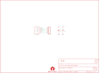

Contents
========

* [PRS11073 > GP-2106 Breakout](#prs11073--gp-2106-breakout)
	* [Schematic](#schematic)
	* [PCB](#pcb)
	* [Interactive BOM](#interactive-bom)
	* [OOMP Parts](#oomp-parts)
	* [Images](#images)
	* [Tags](#tags)
  
![][im]
# PRS11073 > GP-2106 Breakout

- ID: PROJ-SPAR-11073-STAN-01
- Hex ID: PRS11073
- Name: Sparkfun
- Description: Sparkfun
- Long Link: [http://oom.lt/PROJ-SPAR-11073-STAN-01](http://oom.lt/PROJ-SPAR-11073-STAN-01)
- Short Link: [http://oom.lt/PRS11073](http://oom.lt/PRS11073)

## Schematic
  

## PCB
  

## Interactive BOM

- Interactive BOM page: [ibom.html](https://htmlpreview.github.io/?https://github.com/oomlout/oomlout_OOMP_projects/blob/main/PROJ-SPAR-11073-STAN-01/kicad/bom/ibom.html)

## OOMP Parts
  

|OOMP Parts|
| :---: |
|[CAPC-0402-X-UF1-V63D  SMD (0402) 1 uF Capacitor (Ceramic) 6.3v  C1](https://github.com/oomlout/oomlout_OOMP_parts/tree/main/CAPC-0402-X-UF1-V63D/)|
|CAPT-3216-X-UF10-01 C2|
|[HEAD-I01-X-PI06-01  2.54 mm 6 Pin Header  JP1](https://github.com/oomlout/oomlout_OOMP_parts/tree/main/HEAD-I01-X-PI06-01/)|
|UNMATCHED-UNMATCHED-X-UNMATCHED-01 U1|

## Images
  
  

|bominteractivefront|bominteractiveback|kicadPcb3d|kicadPcb3dFront|kicadPcb3dBack|eagleImage|eagleSchemImage|pcbdraw|pcbdrawback|
| :---: | :---: | :---: | :---: | :---: | :---: | :---: | :---: | :---: |
||||||||||

## Tags

- hexID: PRS11073
- oompType: PROJ
- oompSize: SPAR
- oompColor: 11073
- oompDesc: STAN
- oompIndex: 01
- oompName: GP-2106 Breakout
- sources: All source files from https://github.com/sparkfun/GP-2106_Breakout (source licence details in srcLicense.md)
- linkBuyPage: https://www.sparkfun.com/products/11073
- oompID: PROJ-SPAR-11073-STAN-01
- oompParts: C1,CAPC-0402-X-UF1-V63D
- oompParts: C2,CAPT-3216-X-UF10-01
- oompParts: JP1,HEAD-I01-X-PI06-01
- oompParts: U1,UNMATCHED-UNMATCHED-X-UNMATCHED-01
- rawParts: C1,1uF,CAP0402-CAP,0402-CAP,Capacitor,,
- rawParts: C2,10uF,CAP_POL1206,EIA3216,Capacitor Polarized,,
- rawParts: JP1,,M06SIP,1X06,Header 6,,
- rawParts: JP2,STAND-OFF,STAND-OFF,STAND-OFF,Stand Off,,
- rawParts: JP3,STAND-OFF,STAND-OFF,STAND-OFF,Stand Off,,
- rawParts: JP4,LOGO-SFESK,LOGO-SFESK,SFE-LOGO-FLAME,Spark Fun Electronics PCB Logo,,
- rawParts: JP5,FIDUCIALUFIDUCIAL,FIDUCIALUFIDUCIAL,MICRO-FIDUCIAL,Fiducial Alignment Points,,
- rawParts: JP6,FIDUCIALUFIDUCIAL,FIDUCIALUFIDUCIAL,MICRO-FIDUCIAL,Fiducial Alignment Points,,
- rawParts: U$1,OSHW-LOGOS,OSHW-LOGOS,OSHW-LOGO-S,Open Source Hardware Logo This logo indicates the piece of hardware it is found on incorporates a OSHW license and/or adheres to the definition of open source hardware found here: http://freedomdefined.org/OSHW,,
- rawParts: U1,GP-2106,GP-2106,GP-2106,GP-2106 GPS SiRF IV,,

[im]: kicadPcb3d_450.png
