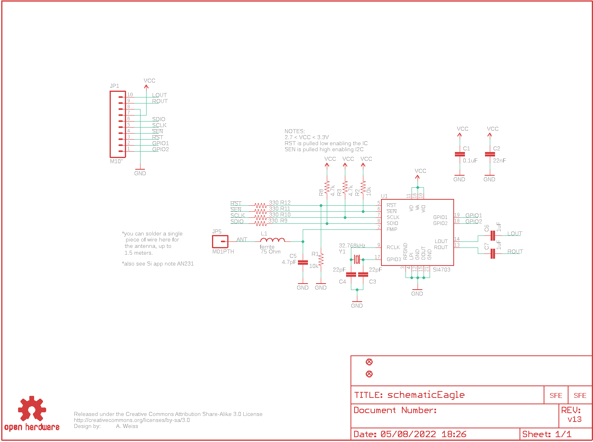
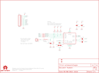

Contents
========

* [PRS11083 > Sparkfun](#prs11083--sparkfun)
	* [Schematic](#schematic)
	* [Interactive BOM](#interactive-bom)
	* [OOMP Parts](#oomp-parts)
	* [Images](#images)
	* [Tags](#tags)
  
![][im]
# PRS11083 > Sparkfun

- ID: PROJ-SPAR-11083-STAN-01
- Hex ID: PRS11083
- Name: Sparkfun
- Description: Sparkfun
- Long Link: [http://oom.lt/PROJ-SPAR-11083-STAN-01](http://oom.lt/PROJ-SPAR-11083-STAN-01)
- Short Link: [http://oom.lt/PRS11083](http://oom.lt/PRS11083)

## Schematic
  

## Interactive BOM

- Interactive BOM page: [ibom.html](https://htmlpreview.github.io/?https://github.com/oomlout/oomlout_OOMP_projects/blob/main/PROJ-SPAR-11083-STAN-01/kicad/bom/ibom.html)

## OOMP Parts
  

|OOMP Parts|
| :---: |
|C1,CAPC-0402-X-NF100-01,C1,0.1uF,CAP0402-CAP,0402-CAP,Capacitor,,|
|C2,CAPC-0402-X-UNMATCHED-01,C2,22nF,CAP0402-CAP,0402-CAP,Capacitor,,|
|C3,CAPC-0402-X-UNMATCHED-01,C3,22pF,CAP0402-CAP,0402-CAP,Capacitor,,|
|C4,CAPC-0402-X-UNMATCHED-01,C4,22pF,CAP0402-CAP,0402-CAP,Capacitor,,|
|C5,CAPC-0402-X-UNMATCHED-01,C5,4.7pF,CAP0402-CAP,0402-CAP,Capacitor,,|
|C6,CAPC-0402-X-UF1-01,C6,1uF,CAP0402-CAP,0402-CAP,Capacitor,,|
|C7,CAPC-0402-X-UF1-01,C7,1uF,CAP0402-CAP,0402-CAP,Capacitor,,|
|JP1,HEAD-I01-X-PI10-01,JP1,M10,M10,1X10,Header 10,,|
|JP5,HEAD-I01-X-PI01-01,JP2,LOGO-SFENW2,LOGO-SFENW2,SFE-NEW-WEB,Spark Fun Electronics PCB Logo,,|
|L1,UNMATCHED-0402-X-UNMATCHED-01,JP3,LOGO-SFESK,LOGO-SFESK,SFE-LOGO-FLAME,Spark Fun Electronics PCB Logo,,|
|R1,RESE-0402-X-O103-01,JP4,FIDUCIALUFIDUCIAL,FIDUCIALUFIDUCIAL,MICRO-FIDUCIAL,Fiducial Alignment Points,,|
|R2,RESE-0402-X-O103-01,JP5,M01PTH,M01PTH,1X01,Header 1,,|
|R3,RESE-0402-X-UNMATCHED-01,JP6,FIDUCIALUFIDUCIAL,FIDUCIALUFIDUCIAL,MICRO-FIDUCIAL,Fiducial Alignment Points,,|
|R8,RESE-0402-X-UNMATCHED-01,L1,ferrite,INDUCTOR0402,C0402,Inductors,75 Ohm,|
|R9,RESE-0402-X-O331-01,R1,10k,RESISTOR0402-RES,0402-RES,Resistor,,|
|R10,RESE-0402-X-O331-01,R2,10k,RESISTOR0402-RES,0402-RES,Resistor,,|
|R11,RESE-0402-X-O331-01,R3,4.7k,RESISTOR0402-RES,0402-RES,Resistor,,|
|R12,RESE-0402-X-O331-01,R8,4.7k,RESISTOR0402-RES,0402-RES,Resistor,,|
|U$1,UNMATCHED-UNMATCHED-X-UNMATCHED-01,R9,330,RESISTOR0402-RES,0402-RES,Resistor,,|
|U1,UNMATCHED-UNMATCHED-X-UNMATCHED-01,R10,330,RESISTOR0402-RES,0402-RES,Resistor,,|
|Y1,UNMATCHED-UNMATCHED-X-UNMATCHED-01,R11,330,RESISTOR0402-RES,0402-RES,Resistor,,|

## Images
  
  

|kicadPcb3d|kicadPcb3dFront|kicadPcb3dBack|eagleImage|eagleSchemImage|
| :---: | :---: | :---: | :---: | :---: |
||||||

## Tags

- hexID: PRS11083
- oompType: PROJ
- oompSize: SPAR
- oompColor: 11083
- oompDesc: STAN
- oompIndex: 01
- oompName: FM Tuner Basic Breakout-Si4703
- sources: All source files from https://github.com/sparkfun/FM_Tuner_Basic_Breakout-Si4703 (source licence details in srcLicense.md)
- linkBuyPage: https://www.sparkfun.com/products/11083
- oompID: PROJ-SPAR-11083-STAN-01
- oompParts: C1,CAPC-0402-X-NF100-01
- oompParts: C2,CAPC-0402-X-UNMATCHED-01
- oompParts: C3,CAPC-0402-X-UNMATCHED-01
- oompParts: C4,CAPC-0402-X-UNMATCHED-01
- oompParts: C5,CAPC-0402-X-UNMATCHED-01
- oompParts: C6,CAPC-0402-X-UF1-01
- oompParts: C7,CAPC-0402-X-UF1-01
- oompParts: JP1,HEAD-I01-X-PI10-01
- oompParts: JP5,HEAD-I01-X-PI01-01
- oompParts: L1,UNMATCHED-0402-X-UNMATCHED-01
- oompParts: R1,RESE-0402-X-O103-01
- oompParts: R2,RESE-0402-X-O103-01
- oompParts: R3,RESE-0402-X-UNMATCHED-01
- oompParts: R8,RESE-0402-X-UNMATCHED-01
- oompParts: R9,RESE-0402-X-O331-01
- oompParts: R10,RESE-0402-X-O331-01
- oompParts: R11,RESE-0402-X-O331-01
- oompParts: R12,RESE-0402-X-O331-01
- oompParts: U$1,UNMATCHED-UNMATCHED-X-UNMATCHED-01
- oompParts: U1,UNMATCHED-UNMATCHED-X-UNMATCHED-01
- oompParts: Y1,UNMATCHED-UNMATCHED-X-UNMATCHED-01
- rawParts: C1,0.1uF,CAP0402-CAP,0402-CAP,Capacitor,,
- rawParts: C2,22nF,CAP0402-CAP,0402-CAP,Capacitor,,
- rawParts: C3,22pF,CAP0402-CAP,0402-CAP,Capacitor,,
- rawParts: C4,22pF,CAP0402-CAP,0402-CAP,Capacitor,,
- rawParts: C5,4.7pF,CAP0402-CAP,0402-CAP,Capacitor,,
- rawParts: C6,1uF,CAP0402-CAP,0402-CAP,Capacitor,,
- rawParts: C7,1uF,CAP0402-CAP,0402-CAP,Capacitor,,
- rawParts: JP1,M10,M10,1X10,Header 10,,
- rawParts: JP2,LOGO-SFENW2,LOGO-SFENW2,SFE-NEW-WEB,Spark Fun Electronics PCB Logo,,
- rawParts: JP3,LOGO-SFESK,LOGO-SFESK,SFE-LOGO-FLAME,Spark Fun Electronics PCB Logo,,
- rawParts: JP4,FIDUCIALUFIDUCIAL,FIDUCIALUFIDUCIAL,MICRO-FIDUCIAL,Fiducial Alignment Points,,
- rawParts: JP5,M01PTH,M01PTH,1X01,Header 1,,
- rawParts: JP6,FIDUCIALUFIDUCIAL,FIDUCIALUFIDUCIAL,MICRO-FIDUCIAL,Fiducial Alignment Points,,
- rawParts: L1,ferrite,INDUCTOR0402,C0402,Inductors,75 Ohm,
- rawParts: R1,10k,RESISTOR0402-RES,0402-RES,Resistor,,
- rawParts: R2,10k,RESISTOR0402-RES,0402-RES,Resistor,,
- rawParts: R3,4.7k,RESISTOR0402-RES,0402-RES,Resistor,,
- rawParts: R8,4.7k,RESISTOR0402-RES,0402-RES,Resistor,,
- rawParts: R9,330,RESISTOR0402-RES,0402-RES,Resistor,,
- rawParts: R10,330,RESISTOR0402-RES,0402-RES,Resistor,,
- rawParts: R11,330,RESISTOR0402-RES,0402-RES,Resistor,,
- rawParts: R12,330,RESISTOR0402-RES,0402-RES,Resistor,,
- rawParts: U$1,CREATIVE_COMMONS,CREATIVE_COMMONS,CREATIVE_COMMONS,Creative Commons License summary,,
- rawParts: U$3,OSHW-LOGOS,OSHW-LOGOS,OSHW-LOGO-S,Open Source Hardware Logo This logo indicates the piece of hardware it is found on incorporates a OSHW license and/or adheres to the definition of open source hardware found here: http://freedomdefined.org/OSHW,,
- rawParts: U1,SI4703,SPARKFUN_SI470X,SPARKFUN_SI470X,Description: This is a powerful FM receiver IC. Tested with Si4703. You really only need SEN, RST, SCLK, and SDIO to get a full FM radio working. Antenna comes from headphone jack. See breakout board on SparkFun website for more information.,,
- rawParts: Y1,32.768kHz,CRYSTAL32-SMD,CRYSTAL-32KHZ-SMD,Crystals,,

[im]: kicadPcb3d_450.png
