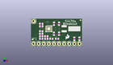
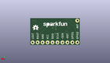
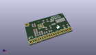

Contents
========

* [PROJ-SPAR-11083-STAN-01>FM Tuner Basic Breakout-Si4703](#proj-spar-11083-stan-01fm-tuner-basic-breakout-si4703)
	* [Images](#images)
	* [Interactive BOM](#interactive-bom)
	* [Tags](#tags)
  
![][im]
# PROJ-SPAR-11083-STAN-01>FM Tuner Basic Breakout-Si4703

- ID: PROJ-SPAR-11083-STAN-01
- Hex ID: PRS11083
- Name: FM Tuner Basic Breakout-Si4703
- Description: 

## Images
  
  

|eagleImage|kicadPcb3dFront|kicadPcb3dBack|kicadPcb3d|
| :---: | :---: | :---: | :---: |
|||||

## Interactive BOM

- Interactive BOM page: [ibom.html](kicad/bom/ibom.html)

## Tags

- hexID: PRS11083
- oompType: PROJ
- oompSize: SPAR
- oompColor: 11083
- oompDesc: STAN
- oompIndex: 01
- oompName: FM Tuner Basic Breakout-Si4703
- sources: All source files from https://github.com/sparkfun/FM_Tuner_Basic_Breakout-Si4703 (source licence details in srcLicense.md)
- linkBuyPage: https://www.sparkfun.com/products/11083
- oompID: PROJ-SPAR-11083-STAN-01
- oompParts: C1,UNMATCHED-UNMATCHED-UNMATCHED-UNMATCHED-UNMATCHED
- oompParts: C2,UNMATCHED-UNMATCHED-UNMATCHED-UNMATCHED-UNMATCHED
- oompParts: C3,UNMATCHED-UNMATCHED-UNMATCHED-UNMATCHED-UNMATCHED
- oompParts: C4,UNMATCHED-UNMATCHED-UNMATCHED-UNMATCHED-UNMATCHED
- oompParts: C5,UNMATCHED-UNMATCHED-UNMATCHED-UNMATCHED-UNMATCHED
- oompParts: C6,UNMATCHED-UNMATCHED-UNMATCHED-UNMATCHED-UNMATCHED
- oompParts: C7,UNMATCHED-UNMATCHED-UNMATCHED-UNMATCHED-UNMATCHED
- oompParts: JP1,UNMATCHED-UNMATCHED-UNMATCHED-UNMATCHED-UNMATCHED
- oompParts: JP2,UNMATCHED-UNMATCHED-UNMATCHED-UNMATCHED-UNMATCHED
- oompParts: JP3,UNMATCHED-UNMATCHED-UNMATCHED-UNMATCHED-UNMATCHED
- oompParts: JP5,UNMATCHED-UNMATCHED-UNMATCHED-UNMATCHED-UNMATCHED
- oompParts: L1,UNMATCHED-UNMATCHED-UNMATCHED-UNMATCHED-UNMATCHED
- oompParts: R1,UNMATCHED-UNMATCHED-UNMATCHED-UNMATCHED-UNMATCHED
- oompParts: R2,UNMATCHED-UNMATCHED-UNMATCHED-UNMATCHED-UNMATCHED
- oompParts: R3,UNMATCHED-UNMATCHED-UNMATCHED-UNMATCHED-UNMATCHED
- oompParts: R8,UNMATCHED-UNMATCHED-UNMATCHED-UNMATCHED-UNMATCHED
- oompParts: R9,UNMATCHED-UNMATCHED-UNMATCHED-UNMATCHED-UNMATCHED
- oompParts: R10,UNMATCHED-UNMATCHED-UNMATCHED-UNMATCHED-UNMATCHED
- oompParts: R11,UNMATCHED-UNMATCHED-UNMATCHED-UNMATCHED-UNMATCHED
- oompParts: R12,UNMATCHED-UNMATCHED-UNMATCHED-UNMATCHED-UNMATCHED
- oompParts: U$1,UNMATCHED-UNMATCHED-UNMATCHED-UNMATCHED-UNMATCHED
- oompParts: U$3,UNMATCHED-UNMATCHED-UNMATCHED-UNMATCHED-UNMATCHED
- oompParts: U1,UNMATCHED-UNMATCHED-UNMATCHED-UNMATCHED-UNMATCHED
- oompParts: Y1,UNMATCHED-UNMATCHED-UNMATCHED-UNMATCHED-UNMATCHED
- rawParts: C1,0.1uF,CAP0402-CAP,0402-CAP,Capacitor,,
- rawParts: C2,22nF,CAP0402-CAP,0402-CAP,Capacitor,,
- rawParts: C3,22pF,CAP0402-CAP,0402-CAP,Capacitor,,
- rawParts: C4,22pF,CAP0402-CAP,0402-CAP,Capacitor,,
- rawParts: C5,4.7pF,CAP0402-CAP,0402-CAP,Capacitor,,
- rawParts: C6,1uF,CAP0402-CAP,0402-CAP,Capacitor,,
- rawParts: C7,1uF,CAP0402-CAP,0402-CAP,Capacitor,,
- rawParts: JP1,M10,M10,1X10,Header 10,,
- rawParts: JP2,LOGO-SFENW2,LOGO-SFENW2,SFE-NEW-WEB,Spark Fun Electronics PCB Logo,,
- rawParts: JP3,LOGO-SFESK,LOGO-SFESK,SFE-LOGO-FLAME,Spark Fun Electronics PCB Logo,,
- rawParts: JP4,FIDUCIALUFIDUCIAL,FIDUCIALUFIDUCIAL,MICRO-FIDUCIAL,Fiducial Alignment Points,,
- rawParts: JP5,M01PTH,M01PTH,1X01,Header 1,,
- rawParts: JP6,FIDUCIALUFIDUCIAL,FIDUCIALUFIDUCIAL,MICRO-FIDUCIAL,Fiducial Alignment Points,,
- rawParts: L1,ferrite,INDUCTOR0402,C0402,Inductors,75 Ohm,
- rawParts: R1,10k,RESISTOR0402-RES,0402-RES,Resistor,,
- rawParts: R2,10k,RESISTOR0402-RES,0402-RES,Resistor,,
- rawParts: R3,4.7k,RESISTOR0402-RES,0402-RES,Resistor,,
- rawParts: R8,4.7k,RESISTOR0402-RES,0402-RES,Resistor,,
- rawParts: R9,330,RESISTOR0402-RES,0402-RES,Resistor,,
- rawParts: R10,330,RESISTOR0402-RES,0402-RES,Resistor,,
- rawParts: R11,330,RESISTOR0402-RES,0402-RES,Resistor,,
- rawParts: R12,330,RESISTOR0402-RES,0402-RES,Resistor,,
- rawParts: U$1,CREATIVE_COMMONS,CREATIVE_COMMONS,CREATIVE_COMMONS,Creative Commons License summary,,
- rawParts: U$3,OSHW-LOGOS,OSHW-LOGOS,OSHW-LOGO-S,Open Source Hardware Logo This logo indicates the piece of hardware it is found on incorporates a OSHW license and/or adheres to the definition of open source hardware found here: http://freedomdefined.org/OSHW,,
- rawParts: U1,SI4703,SPARKFUN_SI470X,SPARKFUN_SI470X,Description: This is a powerful FM receiver IC. Tested with Si4703. You really only need SEN, RST, SCLK, and SDIO to get a full FM radio working. Antenna comes from headphone jack. See breakout board on SparkFun website for more information.,,
- rawParts: Y1,32.768kHz,CRYSTAL32-SMD,CRYSTAL-32KHZ-SMD,Crystals,,

[im]: kicadPcb3d_450.png
