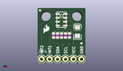
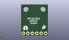
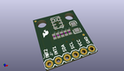

Contents
========

* [PROJ-SPAR-11084-STAN-01>MPL3115A2 Breakout](#proj-spar-11084-stan-01mpl3115a2-breakout)
	* [Images](#images)
	* [Interactive BOM](#interactive-bom)
	* [OOMP Parts](#oomp-parts)
	* [Tags](#tags)
  
![][im]
# PROJ-SPAR-11084-STAN-01>MPL3115A2 Breakout

- ID: PROJ-SPAR-11084-STAN-01
- Hex ID: PRS11084
- Name: MPL3115A2 Breakout
- Description: 

## Images
  
  

|eagleImage|kicadPcb3dFront|kicadPcb3dBack|kicadPcb3d|
| :---: | :---: | :---: | :---: |
|||||

## Interactive BOM

- Interactive BOM page: [ibom.html](kicad/bom/ibom.html)

## OOMP Parts
  

|OOMP Parts|
| :---: |
|CAPC-0402-X-NF100-V50, C1, 8.889999999999999, 8.889999999999999, 270,C1, 0.1uF, 0402-CAP, SparkFun, (0.35, 0.35), R270|
|CAPC-UNMATCHED-X-UNMATCHED-01, C2, 12.7, 10.16, 90,C2, 10uF, EIA3216, SparkFun, (0.5, 0.4), R90|
|CAPC-0402-X-NF100-V50, C3, 7.619999999999999, 8.889999999999999, 270,C3, 0.1uF, 0402-CAP, SparkFun, (0.3, 0.35), R270|
|CAPC-0402-X-UNMATCHED-01, C4, 10.16, 8.889999999999999, 270,C4, 1uF, 0402-CAP, SparkFun, (0.4, 0.35), R270|
|<table><tr><td></td><td> JP4</td><td>[HEAD-I01-X-PI06-01 2.54 mm 6 Pin Header](https://github.com/oomlout/oomlout_OOMP_parts/tree/main/HEAD-I01-X-PI06-01/)</td><td>[H06](https://github.com/oomlout/oomlout_OOMP_parts/tree/main/HEAD-I01-X-PI06-01/)</td></tr></table>|
|RESE-0402-X-UNMATCHED-01, R1, 6.35, 8.889999999999999, 270,R1, 1k, 0402-RES, SparkFun, (0.25, 0.35), R270|
|RESE-0402-X-UNMATCHED-01, R2, 5.08, 8.889999999999999, 270,R2, 1k, 0402-RES, SparkFun, (0.2, 0.35), R270|
|UNMATCHED-UNMATCHED-X-UNMATCHED-01, U1, 7.619999999999999, 13.97, 180,U1, MPL3115A2LGA8, LGA8, SparkFun-Sensors, (0.3, 0.55), R180|

## Tags

- hexID: PRS11084
- oompType: PROJ
- oompSize: SPAR
- oompColor: 11084
- oompDesc: STAN
- oompIndex: 01
- oompName: MPL3115A2 Breakout
- sources: All source files from https://github.com/sparkfun/MPL3115A2_Breakout (source licence details in srcLicense.md)
- linkBuyPage: https://www.sparkfun.com/products/11084
- oompPart: CAPC-0402-X-NF100-V50, C1, 8.889999999999999, 8.889999999999999, 270
- oompPart: CAPC-UNMATCHED-X-UNMATCHED-01, C2, 12.7, 10.16, 90
- oompPart: CAPC-0402-X-NF100-V50, C3, 7.619999999999999, 8.889999999999999, 270
- oompPart: CAPC-0402-X-UNMATCHED-01, C4, 10.16, 8.889999999999999, 270
- oompPart: HEAD-I01-X-PI06-01, JP4, 1.27, 1.27, 0
- oompPart: SKIP-UNMATCHED-X-UNMATCHED-01, JP6, 13.97, 6.35, 0
- oompPart: SKIP-UNMATCHED-X-UNMATCHED-01, JP7, 0.7619999999999999, 17.018, 0
- oompPart: RESE-0402-X-UNMATCHED-01, R1, 6.35, 8.889999999999999, 270
- oompPart: RESE-0402-X-UNMATCHED-01, R2, 5.08, 8.889999999999999, 270
- oompPart: UNMATCHED-UNMATCHED-X-UNMATCHED-01, U1, 7.619999999999999, 13.97, 180
- rawPart: C1, 0.1uF, 0402-CAP, SparkFun, (0.35, 0.35), R270
- rawPart: C2, 10uF, EIA3216, SparkFun, (0.5, 0.4), R90
- rawPart: C3, 0.1uF, 0402-CAP, SparkFun, (0.3, 0.35), R270
- rawPart: C4, 1uF, 0402-CAP, SparkFun, (0.4, 0.35), R270
- rawPart: JP4, 1X06, SparkFun, (0.05, 0.05), R0
- rawPart: JP6, FIDUCIALUFIDUCIAL, MICRO-FIDUCIAL, SparkFun, (0.55, 0.25), R0
- rawPart: JP7, FIDUCIALUFIDUCIAL, MICRO-FIDUCIAL, SparkFun, (0.03, 0.67), R0
- rawPart: R1, 1k, 0402-RES, SparkFun, (0.25, 0.35), R270
- rawPart: R2, 1k, 0402-RES, SparkFun, (0.2, 0.35), R270
- rawPart: U1, MPL3115A2LGA8, LGA8, SparkFun-Sensors, (0.3, 0.55), R180
- oompID: PROJ-SPAR-11084-STAN-01

[im]: kicadPcb3d_450.png
