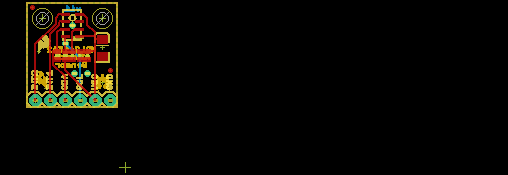
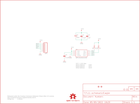

Contents
========

* [PRS11084 > MPL3115A2 Breakout](#prs11084--mpl3115a2-breakout)
	* [Schematic](#schematic)
	* [PCB](#pcb)
	* [Interactive BOM](#interactive-bom)
	* [OOMP Parts](#oomp-parts)
	* [Images](#images)
	* [Tags](#tags)
  
![][im]
# PRS11084 > MPL3115A2 Breakout

- ID: PROJ-SPAR-11084-STAN-01
- Hex ID: PRS11084
- Name: Sparkfun
- Description: Sparkfun
- Long Link: [http://oom.lt/PROJ-SPAR-11084-STAN-01](http://oom.lt/PROJ-SPAR-11084-STAN-01)
- Short Link: [http://oom.lt/PRS11084](http://oom.lt/PRS11084)

## Schematic
  

## PCB
  

## Interactive BOM

- Interactive BOM page: [ibom.html](https://htmlpreview.github.io/?https://github.com/oomlout/oomlout_OOMP_projects/blob/main/PROJ-SPAR-11084-STAN-01/kicad/bom/ibom.html)

## OOMP Parts
  

|OOMP Parts|
| :---: |
|CAPC-0402-X-UF1D-01 C1, C3|
|CAPT-3216-X-UF10-01 C2|
|[CAPC-0402-X-UF1-V63D  SMD (0402) 1 uF Capacitor (Ceramic) 6.3v  C4](https://github.com/oomlout/oomlout_OOMP_parts/tree/main/CAPC-0402-X-UF1-V63D/)|
|[HEAD-I01-X-PI06-01  2.54 mm 6 Pin Header  JP4](https://github.com/oomlout/oomlout_OOMP_parts/tree/main/HEAD-I01-X-PI06-01/)|
|[RESE-0402-X-O102-01  SMD (0402) 1k Ohm Resistor  R1, R2](https://github.com/oomlout/oomlout_OOMP_parts/tree/main/RESE-0402-X-O102-01/)|
|UNMATCHED-UNMATCHED-X-UNMATCHED-01 U1|

## Images
  
  

|kicadPcb3d|kicadPcb3dFront|kicadPcb3dBack|eagleImage|eagleSchemImage|
| :---: | :---: | :---: | :---: | :---: |
||||||

## Tags

- hexID: PRS11084
- oompType: PROJ
- oompSize: SPAR
- oompColor: 11084
- oompDesc: STAN
- oompIndex: 01
- oompName: MPL3115A2 Breakout
- sources: All source files from https://github.com/sparkfun/MPL3115A2_Breakout (source licence details in srcLicense.md)
- linkBuyPage: https://www.sparkfun.com/products/11084
- oompID: PROJ-SPAR-11084-STAN-01
- oompParts: C1,CAPC-0402-X-UF1D-01
- oompParts: C2,CAPT-3216-X-UF10-01
- oompParts: C3,CAPC-0402-X-UF1D-01
- oompParts: C4,CAPC-0402-X-UF1-V63D
- oompParts: JP4,HEAD-I01-X-PI06-01
- oompParts: R1,RESE-0402-X-O102-01
- oompParts: R2,RESE-0402-X-O102-01
- oompParts: U1,UNMATCHED-UNMATCHED-X-UNMATCHED-01
- rawParts: C1,0.1uF,CAP0402-CAP,0402-CAP,Capacitor,,
- rawParts: C2,10uF,CAP_POL1206,EIA3216,Capacitor Polarized,,
- rawParts: C3,0.1uF,CAP0402-CAP,0402-CAP,Capacitor,,
- rawParts: C4,1uF,CAP0402-CAP,0402-CAP,Capacitor,,
- rawParts: JP1,LOGO-SFESK,LOGO-SFESK,SFE-LOGO-FLAME,Spark Fun Electronics PCB Logo,,
- rawParts: JP2,STAND-OFF,STAND-OFF,STAND-OFF,Stand Off,,
- rawParts: JP3,STAND-OFF,STAND-OFF,STAND-OFF,Stand Off,,
- rawParts: JP4,,M06SIP,1X06,Header 6,,
- rawParts: JP5,LOGO-SFESK,LOGO-SFESK,SFE-LOGO-FLAME,Spark Fun Electronics PCB Logo,,
- rawParts: JP6,FIDUCIALUFIDUCIAL,FIDUCIALUFIDUCIAL,MICRO-FIDUCIAL,Fiducial Alignment Points,,
- rawParts: JP7,FIDUCIALUFIDUCIAL,FIDUCIALUFIDUCIAL,MICRO-FIDUCIAL,Fiducial Alignment Points,,
- rawParts: R1,1k,RESISTOR0402-RES,0402-RES,Resistor,,
- rawParts: R2,1k,RESISTOR0402-RES,0402-RES,Resistor,,
- rawParts: U$1,OSHW-LOGOS,OSHW-LOGOS,OSHW-LOGO-S,Open Source Hardware Logo This logo indicates the piece of hardware it is found on incorporates a OSHW license and/or adheres to the definition of open source hardware found here: http://freedomdefined.org/OSHW,,
- rawParts: U$2,CREATIVE_COMMONS,CREATIVE_COMMONS,CREATIVE_COMMONS,,,
- rawParts: U1,MPL3115A2LGA8,MPL3115A2LGA8,LGA8,Altimeter/Pressure Sensor, I2C, 1.95V-3.6V supply, 50 to 110kPa,,

[im]: kicadPcb3d_450.png
