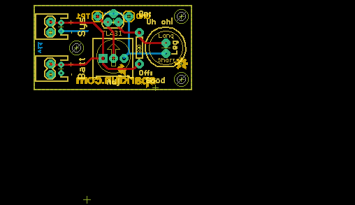
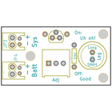
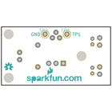
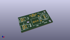
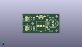
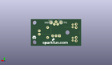
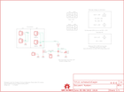

Contents
========

* [PRS11087 > Uh-Oh Battery Indicator](#prs11087--uh-oh-battery-indicator)
	* [Schematic](#schematic)
	* [PCB](#pcb)
	* [Interactive BOM](#interactive-bom)
	* [OOMP Parts](#oomp-parts)
	* [Images](#images)
	* [Tags](#tags)
  
![][im]
# PRS11087 > Uh-Oh Battery Indicator

- ID: PROJ-SPAR-11087-STAN-01
- Hex ID: PRS11087
- Name: Sparkfun
- Description: Sparkfun
- Long Link: [http://oom.lt/PROJ-SPAR-11087-STAN-01](http://oom.lt/PROJ-SPAR-11087-STAN-01)
- Short Link: [http://oom.lt/PRS11087](http://oom.lt/PRS11087)

## Schematic
  

## PCB
  

## Interactive BOM

- Interactive BOM page: [ibom.html](https://htmlpreview.github.io/?https://github.com/oomlout/oomlout_OOMP_projects/blob/main/PROJ-SPAR-11087-STAN-01/kicad/bom/ibom.html)

## OOMP Parts
  

|OOMP Parts|
| :---: |
|HEAD-I01-X-UNMATCHED-01 JP1, JP2|
|[HEAD-I01-X-PI02-01  2.54 mm 2 Pin Header  JP3, JP4](https://github.com/oomlout/oomlout_OOMP_parts/tree/main/HEAD-I01-X-PI02-01/)|
|LEDS-UNMATCHED-G-STAN-01 LED1|
|RESE-UNMATCHED-X-O331-01 R1|
|UNMATCHED-UNMATCHED-X-UNMATCHED-01 RADJ, U1|
|HEAD-I01-X-PI01-01 TP1, TP2|

## Images
  
  

|bominteractivefront|bominteractiveback|kicadPcb3d|kicadPcb3dFront|kicadPcb3dBack|eagleImage|eagleSchemImage|
| :---: | :---: | :---: | :---: | :---: | :---: | :---: |
||||||||

## Tags

- hexID: PRS11087
- oompType: PROJ
- oompSize: SPAR
- oompColor: 11087
- oompDesc: STAN
- oompIndex: 01
- oompName: Uh-Oh Battery Indicator
- sources: All source files from https://github.com/sparkfun/Uh-Oh_Battery_Indicator (source licence details in srcLicense.md)
- linkBuyPage: https://www.sparkfun.com/products/11087
- oompID: PROJ-SPAR-11087-STAN-01
- oompParts: JP1,HEAD-I01-X-UNMATCHED-01
- oompParts: JP2,HEAD-I01-X-UNMATCHED-01
- oompParts: JP3,HEAD-I01-X-PI02-01
- oompParts: JP4,HEAD-I01-X-PI02-01
- oompParts: LED1,LEDS-UNMATCHED-G-STAN-01
- oompParts: R1,RESE-UNMATCHED-X-O331-01
- oompParts: RADJ,UNMATCHED-UNMATCHED-X-UNMATCHED-01
- oompParts: TP1,HEAD-I01-X-PI01-01
- oompParts: TP2,HEAD-I01-X-PI01-01
- oompParts: U1,UNMATCHED-UNMATCHED-X-UNMATCHED-01
- rawParts: JP1,Battery,M02JST-PTH-2,JST-2-PTH,Header 2,,
- rawParts: JP2,System,M02JST-PTH-2,JST-2-PTH,Header 2,,
- rawParts: JP3,,M02PTH,1X02,Header 2,,
- rawParts: JP4,,M02PTH,1X02,Header 2,,
- rawParts: JP31,STAND-OFF,STAND-OFF,STAND-OFF,Stand Off,,
- rawParts: JP41,STAND-OFF,STAND-OFF,STAND-OFF,Stand Off,,
- rawParts: JP51,LOGO-SFENEW,LOGO-SFENEW,SFE-NEW-WEBLOGO,Spark Fun Electronics PCB Logo,,
- rawParts: JP61,STAND-OFF,STAND-OFF,STAND-OFF,Stand Off,,
- rawParts: LED1,Green,LED10MM2,LED10MM-2,LEDs,,
- rawParts: R1,330,RESISTORAXIAL-0.3,AXIAL-0.3,Resistor,,
- rawParts: RADJ,10K,TRIMPOT-PTH-KNOB,3386U,,,
- rawParts: TP1,TP1,M01PTH,1X01,Header 1,,
- rawParts: TP2,TP2,M01PTH,1X01,Header 1,,
- rawParts: U$1,OSHW-LOGOS,OSHW-LOGOS,OSHW-LOGO-S,Open Source Hardware Logo This logo indicates the piece of hardware it is found on incorporates a OSHW license and/or adheres to the definition of open source hardware found here: http://freedomdefined.org/OSHW,,
- rawParts: U$2,CREATIVE_COMMONS,CREATIVE_COMMONS,CREATIVE_COMMONS,,,
- rawParts: U1,TL431,TL431PTH,TO-92,,,

[im]: kicadPcb3d_450.png
