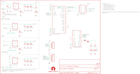

Contents
========

* [PRS11088 > Sparkfun](#prs11088--sparkfun)
	* [Schematic](#schematic)
	* [Interactive BOM](#interactive-bom)
	* [OOMP Parts](#oomp-parts)
	* [Images](#images)
	* [Tags](#tags)
  
![][im]
# PRS11088 > Sparkfun

- ID: PROJ-SPAR-11088-STAN-01
- Hex ID: PRS11088
- Name: Sparkfun
- Description: Sparkfun
- Long Link: [http://oom.lt/PROJ-SPAR-11088-STAN-01](http://oom.lt/PROJ-SPAR-11088-STAN-01)
- Short Link: [http://oom.lt/PRS11088](http://oom.lt/PRS11088)

## Schematic
  

## Interactive BOM

- Interactive BOM page: [ibom.html](https://htmlpreview.github.io/?https://github.com/oomlout/oomlout_OOMP_projects/blob/main/PROJ-SPAR-11088-STAN-01/kicad/bom/ibom.html)

## OOMP Parts
  

|OOMP Parts|
| :---: |
|C1,CAPX-UNMATCHED-X-UF10-01,C1,10uF,CAP_POL1206,EIA3216,Capacitor Polarized,,|
|C2,CAPX-UNMATCHED-X-UF10-01,C2,10uF,CAP_POL1206,EIA3216,Capacitor Polarized,,|
|C3,CAPC-0402-X-UF1-01,C3,1uF,CAP0402-CAP,0402-CAP,Capacitor,,|
|C4,CAPC-0402-X-NF100-01,C4,0.1uF,CAP0402-CAP,0402-CAP,Capacitor,,|
|C5,CAPC-0402-X-UF1-01,C5,1uF,CAP0402-CAP,0402-CAP,Capacitor,,|
|C6,CAPX-UNMATCHED-X-UF10-01,C6,10uF,CAP_POL1206,EIA3216,Capacitor Polarized,,|
|C7,CAPC-0402-X-NF100-01,C7,0.1uF,CAP0402-CAP,0402-CAP,Capacitor,,|
|C8,CAPC-0402-X-UF1-01,C8,1uF,CAP0402-CAP,0402-CAP,Capacitor,,|
|C9,CAPC-0402-X-UNMATCHED-01,C9,470nF,CAP0402-CAP,0402-CAP,Capacitor,,|
|C10,CAPC-0402-X-NF100-01,C10,0.1uF,CAP0402-CAP,0402-CAP,Capacitor,,|
|C11,CAPC-0402-X-UNMATCHED-01,C11,470nF,CAP0402-CAP,0402-CAP,Capacitor,,|
|C12,CAPX-UNMATCHED-X-UF10-01,C12,10uF,CAP_POL1206,EIA3216,Capacitor Polarized,,|
|C13,CAPC-0402-X-UF1-01,C13,1uF,CAP0402-CAP,0402-CAP,Capacitor,,|
|C14,CAPX-UNMATCHED-X-UF10-01,C14,10uF,CAP_POL1206,EIA3216,Capacitor Polarized,,|
|C15,CAPC-0402-X-NF100-01,C15,0.1uF,CAP0402-CAP,0402-CAP,Capacitor,,|
|C16,CAPC-0402-X-UNMATCHED-01,C16,470nF,CAP0402-CAP,0402-CAP,Capacitor,,|
|JP2,HEAD-I01-X-PI05-01,JP2,,M05PTH,1X05,Header 5,,|
|JP8,HEAD-I01-X-PI06-01,JP8,,M06SIP,1X06,Header 6,,|
|LED1,LEDS-0603-G-STAN-01,JP10,FIDUCIALUFIDUCIAL,FIDUCIALUFIDUCIAL,MICRO-FIDUCIAL,Fiducial Alignment Points,,|
|LED2,LEDS-0603-G-STAN-01,JP11,FIDUCIALUFIDUCIAL,FIDUCIALUFIDUCIAL,MICRO-FIDUCIAL,Fiducial Alignment Points,,|
|LED3,LEDS-0603-G-STAN-01,LED1,Red,LED0603,LED-0603,LEDs,,|
|R1,RESE-0402-X-O331-01,LED2,Blue,LED0603,LED-0603,LEDs,,|
|R2,RESE-0402-X-O103-01,LED3,Green,LED0603,LED-0603,LEDs,,|
|R3,RESE-0402-X-O331-01,R1,330,RESISTOR0402-RES,0402-RES,Resistor,,|
|R4,RESE-0402-X-O331-01,R2,10K,RESISTOR0402-RES,0402-RES,Resistor,,|
|U$2,UNMATCHED-UNMATCHED-X-UNMATCHED-01,R3,330,RESISTOR0402-RES,0402-RES,Resistor,,|
|U1,UNMATCHED-SO235-X-UNMATCHED-01,R4,330,RESISTOR0402-RES,0402-RES,Resistor,,|
|U2,UNMATCHED-SO235-X-UNMATCHED-01,SJ1,,SOLDERJUMPERTRACE,SJ_2S-TRACE,Solder Jumper,,|
|U3,UNMATCHED-UNMATCHED-X-UNMATCHED-01,SJ2,,SOLDERJUMPERTRACE,SJ_2S-TRACE,Solder Jumper,,|
|U4,UNMATCHED-UNMATCHED-X-UNMATCHED-01,U$1,LOGO-SFESK,LOGO-SFESK,SFE-LOGO-FLAME,Spark Fun Electronics PCB Logo,,|
|U5,UNMATCHED-UNMATCHED-X-UNMATCHED-01,U$2,CREATIVE_COMMONS,CREATIVE_COMMONS,CREATIVE_COMMONS,,,|
|U6,UNMATCHED-SO235-X-UNMATCHED-01,U$3,OSHW-LOGOS,OSHW-LOGOS,OSHW-LOGO-S,Open Source Hardware Logo This logo indicates the piece of hardware it is found on incorporates a OSHW license and/or adheres to the definition of open source hardware found here: http://freedomdefined.org/OSHW,,|
|U7,UNMATCHED-SO235-X-UNMATCHED-01,U$11,LOGO-SFENEW,LOGO-SFENEW,SFE-NEW-WEBLOGO,Spark Fun Electronics PCB Logo,,|

## Images
  
  

|kicadPcb3d|kicadPcb3dFront|kicadPcb3dBack|eagleImage|eagleSchemImage|
| :---: | :---: | :---: | :---: | :---: |
||||||

## Tags

- hexID: PRS11088
- oompType: PROJ
- oompSize: SPAR
- oompColor: 11088
- oompDesc: STAN
- oompIndex: 01
- oompName: Run-SPOT-Run
- sources: All source files from https://github.com/sparkfun/Run-SPOT-Run (source licence details in srcLicense.md)
- linkBuyPage: https://www.sparkfun.com/products/11088
- oompID: PROJ-SPAR-11088-STAN-01
- oompParts: C1,CAPX-UNMATCHED-X-UF10-01
- oompParts: C2,CAPX-UNMATCHED-X-UF10-01
- oompParts: C3,CAPC-0402-X-UF1-01
- oompParts: C4,CAPC-0402-X-NF100-01
- oompParts: C5,CAPC-0402-X-UF1-01
- oompParts: C6,CAPX-UNMATCHED-X-UF10-01
- oompParts: C7,CAPC-0402-X-NF100-01
- oompParts: C8,CAPC-0402-X-UF1-01
- oompParts: C9,CAPC-0402-X-UNMATCHED-01
- oompParts: C10,CAPC-0402-X-NF100-01
- oompParts: C11,CAPC-0402-X-UNMATCHED-01
- oompParts: C12,CAPX-UNMATCHED-X-UF10-01
- oompParts: C13,CAPC-0402-X-UF1-01
- oompParts: C14,CAPX-UNMATCHED-X-UF10-01
- oompParts: C15,CAPC-0402-X-NF100-01
- oompParts: C16,CAPC-0402-X-UNMATCHED-01
- oompParts: JP2,HEAD-I01-X-PI05-01
- oompParts: JP8,HEAD-I01-X-PI06-01
- oompParts: LED1,LEDS-0603-G-STAN-01
- oompParts: LED2,LEDS-0603-G-STAN-01
- oompParts: LED3,LEDS-0603-G-STAN-01
- oompParts: R1,RESE-0402-X-O331-01
- oompParts: R2,RESE-0402-X-O103-01
- oompParts: R3,RESE-0402-X-O331-01
- oompParts: R4,RESE-0402-X-O331-01
- oompParts: U$2,UNMATCHED-UNMATCHED-X-UNMATCHED-01
- oompParts: U1,UNMATCHED-SO235-X-UNMATCHED-01
- oompParts: U2,UNMATCHED-SO235-X-UNMATCHED-01
- oompParts: U3,UNMATCHED-UNMATCHED-X-UNMATCHED-01
- oompParts: U4,UNMATCHED-UNMATCHED-X-UNMATCHED-01
- oompParts: U5,UNMATCHED-UNMATCHED-X-UNMATCHED-01
- oompParts: U6,UNMATCHED-SO235-X-UNMATCHED-01
- oompParts: U7,UNMATCHED-SO235-X-UNMATCHED-01
- rawParts: C1,10uF,CAP_POL1206,EIA3216,Capacitor Polarized,,
- rawParts: C2,10uF,CAP_POL1206,EIA3216,Capacitor Polarized,,
- rawParts: C3,1uF,CAP0402-CAP,0402-CAP,Capacitor,,
- rawParts: C4,0.1uF,CAP0402-CAP,0402-CAP,Capacitor,,
- rawParts: C5,1uF,CAP0402-CAP,0402-CAP,Capacitor,,
- rawParts: C6,10uF,CAP_POL1206,EIA3216,Capacitor Polarized,,
- rawParts: C7,0.1uF,CAP0402-CAP,0402-CAP,Capacitor,,
- rawParts: C8,1uF,CAP0402-CAP,0402-CAP,Capacitor,,
- rawParts: C9,470nF,CAP0402-CAP,0402-CAP,Capacitor,,
- rawParts: C10,0.1uF,CAP0402-CAP,0402-CAP,Capacitor,,
- rawParts: C11,470nF,CAP0402-CAP,0402-CAP,Capacitor,,
- rawParts: C12,10uF,CAP_POL1206,EIA3216,Capacitor Polarized,,
- rawParts: C13,1uF,CAP0402-CAP,0402-CAP,Capacitor,,
- rawParts: C14,10uF,CAP_POL1206,EIA3216,Capacitor Polarized,,
- rawParts: C15,0.1uF,CAP0402-CAP,0402-CAP,Capacitor,,
- rawParts: C16,470nF,CAP0402-CAP,0402-CAP,Capacitor,,
- rawParts: JP2,,M05PTH,1X05,Header 5,,
- rawParts: JP8,,M06SIP,1X06,Header 6,,
- rawParts: JP10,FIDUCIALUFIDUCIAL,FIDUCIALUFIDUCIAL,MICRO-FIDUCIAL,Fiducial Alignment Points,,
- rawParts: JP11,FIDUCIALUFIDUCIAL,FIDUCIALUFIDUCIAL,MICRO-FIDUCIAL,Fiducial Alignment Points,,
- rawParts: LED1,Red,LED0603,LED-0603,LEDs,,
- rawParts: LED2,Blue,LED0603,LED-0603,LEDs,,
- rawParts: LED3,Green,LED0603,LED-0603,LEDs,,
- rawParts: R1,330,RESISTOR0402-RES,0402-RES,Resistor,,
- rawParts: R2,10K,RESISTOR0402-RES,0402-RES,Resistor,,
- rawParts: R3,330,RESISTOR0402-RES,0402-RES,Resistor,,
- rawParts: R4,330,RESISTOR0402-RES,0402-RES,Resistor,,
- rawParts: SJ1,,SOLDERJUMPERTRACE,SJ_2S-TRACE,Solder Jumper,,
- rawParts: SJ2,,SOLDERJUMPERTRACE,SJ_2S-TRACE,Solder Jumper,,
- rawParts: U$1,LOGO-SFESK,LOGO-SFESK,SFE-LOGO-FLAME,Spark Fun Electronics PCB Logo,,
- rawParts: U$2,CREATIVE_COMMONS,CREATIVE_COMMONS,CREATIVE_COMMONS,,,
- rawParts: U$3,OSHW-LOGOS,OSHW-LOGOS,OSHW-LOGO-S,Open Source Hardware Logo This logo indicates the piece of hardware it is found on incorporates a OSHW license and/or adheres to the definition of open source hardware found here: http://freedomdefined.org/OSHW,,
- rawParts: U$11,LOGO-SFENEW,LOGO-SFENEW,SFE-NEW-WEBLOGO,Spark Fun Electronics PCB Logo,,
- rawParts: U1,MIC5219-3.3,V_REG_LDOSMD,SOT23-5,Voltage Regulator LDO,,
- rawParts: U2,AP7311-1.8,V_REG_LDOSMD,SOT23-5,Voltage Regulator LDO,,
- rawParts: U3,74HC4050,HEX_CONVERTER,SO016,,,
- rawParts: U4,SPOT-CONNECT,SPOT-CONNECTSMD,SPOT-CONNECT,,,
- rawParts: U5,ARDUINO_SHIELD,ARDUINO_SHIELDNO_SILK,DUEMILANOVE_VIAS,,,
- rawParts: U6,MIC5219-3.0,V_REG_LDOSMD,SOT23-5,Voltage Regulator LDO,,
- rawParts: U7,MIC5219-3.0,V_REG_LDOSMD,SOT23-5,Voltage Regulator LDO,,

[im]: kicadPcb3d_450.png
