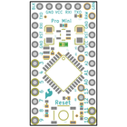
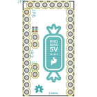
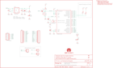
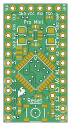
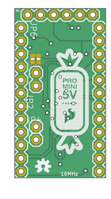

Contents
========

* [PRS11113 > Pro Mini Candy](#prs11113--pro-mini-candy)
	* [Schematic](#schematic)
	* [PCB](#pcb)
	* [Interactive BOM](#interactive-bom)
	* [OOMP Parts](#oomp-parts)
	* [Images](#images)
	* [Tags](#tags)
  
![][im]
# PRS11113 > Pro Mini Candy

- ID: PROJ-SPAR-11113-STAN-01
- Hex ID: PRS11113
- Name: Sparkfun
- Description: Sparkfun
- Long Link: [http://oom.lt/PROJ-SPAR-11113-STAN-01](http://oom.lt/PROJ-SPAR-11113-STAN-01)
- Short Link: [http://oom.lt/PRS11113](http://oom.lt/PRS11113)

## Schematic
  

## PCB
  

## Interactive BOM

- Interactive BOM page: [ibom.html](https://htmlpreview.github.io/?https://github.com/oomlout/oomlout_OOMP_projects/blob/main/PROJ-SPAR-11113-STAN-01/kicad/bom/ibom.html)

## OOMP Parts
  

|OOMP Parts|
| :---: |
|[CAPC-0402-X-NF100-V10  SMD (0402) 100 nF Capacitor (Ceramic) 10v  C1, C2, C3, C10](https://github.com/oomlout/oomlout_OOMP_parts/tree/main/CAPC-0402-X-NF100-V10/)|
|CAPT-3216-X-UF10-01 C13, C19|
|[LEDS-0603-G-STAN-01  SMD (0603) Green LED  D3](https://github.com/oomlout/oomlout_OOMP_parts/tree/main/LEDS-0603-G-STAN-01/)|
|[HEAD-I01-X-PI06-01  2.54 mm 6 Pin Header  JP1](https://github.com/oomlout/oomlout_OOMP_parts/tree/main/HEAD-I01-X-PI06-01/)|
|[HEAD-I01-X-PI02-01  2.54 mm 2 Pin Header  JP2](https://github.com/oomlout/oomlout_OOMP_parts/tree/main/HEAD-I01-X-PI02-01/)|
|HEAD-I01-X-PI01-01 JP3, JP4|
|[HEAD-I01-X-PI12-01  2.54 mm 12 Pin Header  JP6, JP7](https://github.com/oomlout/oomlout_OOMP_parts/tree/main/HEAD-I01-X-PI12-01/)|
|[LEDS-0603-R-STAN-01  SMD (0603) Red LED  LED1](https://github.com/oomlout/oomlout_OOMP_parts/tree/main/LEDS-0603-R-STAN-01/)|
|UNMATCHED-UNMATCHED-X-UNMATCHED-01 Q1, S2, U$2, U1|
|RESE-0402-X-UNMATCHED-01 R1, R3|
|[RESE-0402-X-O103-01  SMD (0402) 10k Ohm Resistor  R2, R11](https://github.com/oomlout/oomlout_OOMP_parts/tree/main/RESE-0402-X-O103-01/)|
|RESE-0402-X-O331-01 R6|
|VREG-SO235-X-KMIC5205-01 U2|

## Images
  
  

|bominteractivefront|bominteractiveback|kicadPcb3d|kicadPcb3dFront|kicadPcb3dBack|eagleImage|eagleSchemImage|pcbdraw|pcbdrawback|
| :---: | :---: | :---: | :---: | :---: | :---: | :---: | :---: | :---: |
||||||||||

## Tags

- hexID: PRS11113
- oompType: PROJ
- oompSize: SPAR
- oompColor: 11113
- oompDesc: STAN
- oompIndex: 01
- oompName: Pro Mini Candy
- sources: All source files from https://github.com/sparkfun/Pro_Mini_Candy (source licence details in srcLicense.md)
- linkBuyPage: https://www.sparkfun.com/products/11113
- oompID: PROJ-SPAR-11113-STAN-01
- oompParts: C1,CAPC-0402-X-NF100-V10
- oompParts: C2,CAPC-0402-X-NF100-V10
- oompParts: C3,CAPC-0402-X-NF100-V10
- oompParts: C10,CAPC-0402-X-NF100-V10
- oompParts: C13,CAPT-3216-X-UF10-01
- oompParts: C19,CAPT-3216-X-UF10-01
- oompParts: D3,LEDS-0603-G-STAN-01
- oompParts: JP1,HEAD-I01-X-PI06-01
- oompParts: JP2,HEAD-I01-X-PI02-01
- oompParts: JP3,HEAD-I01-X-PI01-01
- oompParts: JP4,HEAD-I01-X-PI01-01
- oompParts: JP6,HEAD-I01-X-PI12-01
- oompParts: JP7,HEAD-I01-X-PI12-01
- oompParts: LED1,LEDS-0603-R-STAN-01
- oompParts: Q1,UNMATCHED-UNMATCHED-X-UNMATCHED-01
- oompParts: R1,RESE-0402-X-UNMATCHED-01
- oompParts: R2,RESE-0402-X-O103-01
- oompParts: R3,RESE-0402-X-UNMATCHED-01
- oompParts: R6,RESE-0402-X-O331-01
- oompParts: R11,RESE-0402-X-O103-01
- oompParts: S2,UNMATCHED-UNMATCHED-X-UNMATCHED-01
- oompParts: U$2,UNMATCHED-UNMATCHED-X-UNMATCHED-01
- oompParts: U1,UNMATCHED-UNMATCHED-X-UNMATCHED-01
- oompParts: U2,VREG-SO235-X-KMIC5205-01
- rawParts: C1,0.1uF,CAP0402-CAP,0402-CAP,Capacitor,,
- rawParts: C2,0.1uF,CAP0402-CAP,0402-CAP,Capacitor,,
- rawParts: C3,0.1uF,CAP0402-CAP,0402-CAP,Capacitor,,
- rawParts: C10,0.1uF,CAP0402-CAP,0402-CAP,Capacitor,,
- rawParts: C13,10uF,CAP_POL1206,EIA3216,Capacitor Polarized,,
- rawParts: C19,10uF,CAP_POL1206,EIA3216,Capacitor Polarized,,
- rawParts: D3,Green,LED0603,LED-0603,LEDs,,
- rawParts: FRAME1,FRAME-LETTER,FRAME-LETTER,CREATIVE_COMMONS,Schematic Frame,,
- rawParts: JP1,FTDI Basic,ARDUINO_SERIAL_PROGRAMPTH,1X06,,,
- rawParts: JP2,,M02PTH,1X02,Header 2,,
- rawParts: JP3,,M01PTH,1X01,Header 1,,
- rawParts: JP4,,M01PTH,1X01,Header 1,,
- rawParts: JP5,FIDUCIALUFIDUCIAL,FIDUCIALUFIDUCIAL,MICRO-FIDUCIAL,Fiducial Alignment Points,,
- rawParts: JP6,,M12PTH,1X12,Header 12,,
- rawParts: JP7,,M12PTH,1X12,Header 12,,
- rawParts: JP8,FIDUCIALUFIDUCIAL,FIDUCIALUFIDUCIAL,MICRO-FIDUCIAL,Fiducial Alignment Points,,
- rawParts: LED1,Red,LED0603,LED-0603,LEDs,,
- rawParts: Q1,8/16/20MHz,RESONATORSMD,RESONATOR-SMD,Resonator,,
- rawParts: R1,,RESISTOR0402-RES,0402-RES,Resistor,,
- rawParts: R2,10K,RESISTOR0402-RES,0402-RES,Resistor,,
- rawParts: R3,,RESISTOR0402-RES,0402-RES,Resistor,,
- rawParts: R6,330,RESISTOR0402-RES,0402-RES,Resistor,,
- rawParts: R11,10K,RESISTOR0402-RES,0402-RES,Resistor,,
- rawParts: S2,Reset,TAC_SWITCHSMD,TACTILE_SWITCH_SMD,Momentary Switch,,
- rawParts: U$1,LOGO-SFESK,LOGO-SFESK,SFE-LOGO-FLAME,Spark Fun Electronics PCB Logo,,
- rawParts: U$2,PRO_MINI_CANDY,PRO_MINI_CANDY,PRO_MINI_CANDY,,,
- rawParts: U$3,OSHW-LOGOS,OSHW-LOGOS,OSHW-LOGO-S,Open Source Hardware Logo This logo indicates the piece of hardware it is found on incorporates a OSHW license and/or adheres to the definition of open source hardware found here: http://freedomdefined.org/OSHW,,
- rawParts: U1,ATMEGA328,ATMEGA168,TQFP32-08,,,
- rawParts: U2,MIC5205,V_REG_LDOSMD,SOT23-5,Voltage Regulator LDO,,

[im]: kicadPcb3d_450.png
