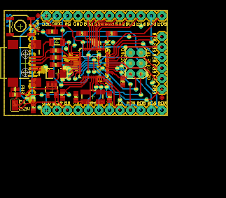
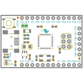
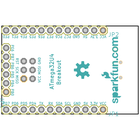

Contents
========

* [PRS11117 > 32U4 Breakout Board](#prs11117--32u4-breakout-board)
	* [Schematic](#schematic)
	* [PCB](#pcb)
	* [Interactive BOM](#interactive-bom)
	* [OOMP Parts](#oomp-parts)
	* [Images](#images)
	* [Tags](#tags)
  
![][im]
# PRS11117 > 32U4 Breakout Board

- ID: PROJ-SPAR-11117-STAN-01
- Hex ID: PRS11117
- Name: Sparkfun
- Description: Sparkfun
- Long Link: [http://oom.lt/PROJ-SPAR-11117-STAN-01](http://oom.lt/PROJ-SPAR-11117-STAN-01)
- Short Link: [http://oom.lt/PRS11117](http://oom.lt/PRS11117)

## Schematic
  

## PCB
  

## Interactive BOM

- Interactive BOM page: [ibom.html](https://htmlpreview.github.io/?https://github.com/oomlout/oomlout_OOMP_projects/blob/main/PROJ-SPAR-11117-STAN-01/kicad/bom/ibom.html)

## OOMP Parts
  

|OOMP Parts|
| :---: |
|[CAPC-0603-X-NF100-V50  SMD (0603) 100 nF Capacitor (Ceramic) 50v  C1, C6, C7, C9](https://github.com/oomlout/oomlout_OOMP_parts/tree/main/CAPC-0603-X-NF100-V50/)|
|CAPC-0603-X-PF18-01 C2, C3|
|[CAPC-0603-X-UF1-V25  SMD (0603) 1 uF Capacitor (Ceramic) 25v  C4, C5](https://github.com/oomlout/oomlout_OOMP_parts/tree/main/CAPC-0603-X-UF1-V25/)|
|CAPT-3216-X-UF10-01 C8|
|REFU-1206-X-UNMATCHED-01 F1|
|UNMATCHED-UNMATCHED-X-UNMATCHED-01 J1, S1, U1, X1, Y1|
|[HEAD-I01-X-PI12-01  2.54 mm 12 Pin Header  JP1, JP2](https://github.com/oomlout/oomlout_OOMP_parts/tree/main/HEAD-I01-X-PI12-01/)|
|[HEAD-I01-X-PI06-01  2.54 mm 6 Pin Header  JP3](https://github.com/oomlout/oomlout_OOMP_parts/tree/main/HEAD-I01-X-PI06-01/)|
|[LEDS-0603-G-STAN-01  SMD (0603) Green LED  LED1](https://github.com/oomlout/oomlout_OOMP_parts/tree/main/LEDS-0603-G-STAN-01/)|
|[RESE-0603-X-O103-01  SMD (0603) 10k Ohm Resistor  R1](https://github.com/oomlout/oomlout_OOMP_parts/tree/main/RESE-0603-X-O103-01/)|
|[RESE-0603-X-O220-01  SMD (0603) 22 Ohm Resistor  R2, R3](https://github.com/oomlout/oomlout_OOMP_parts/tree/main/RESE-0603-X-O220-01/)|
|[RESE-0603-X-O102-01  SMD (0603) 1k Ohm Resistor  R4](https://github.com/oomlout/oomlout_OOMP_parts/tree/main/RESE-0603-X-O102-01/)|
|UNMATCHED-SO235-X-UNMATCHED-01 U2|

## Images
  
  

|bominteractivefront|bominteractiveback|kicadPcb3d|kicadPcb3dFront|kicadPcb3dBack|eagleImage|eagleSchemImage|
| :---: | :---: | :---: | :---: | :---: | :---: | :---: |
||||||||

## Tags

- hexID: PRS11117
- oompType: PROJ
- oompSize: SPAR
- oompColor: 11117
- oompDesc: STAN
- oompIndex: 01
- oompName: 32U4 Breakout Board
- sources: All source files from https://github.com/sparkfun/32U4_Breakout_Board (source licence details in srcLicense.md)
- linkBuyPage: https://www.sparkfun.com/products/11117
- oompID: PROJ-SPAR-11117-STAN-01
- oompParts: C1,CAPC-0603-X-NF100-V50
- oompParts: C2,CAPC-0603-X-PF18-01
- oompParts: C3,CAPC-0603-X-PF18-01
- oompParts: C4,CAPC-0603-X-UF1-V25
- oompParts: C5,CAPC-0603-X-UF1-V25
- oompParts: C6,CAPC-0603-X-NF100-V50
- oompParts: C7,CAPC-0603-X-NF100-V50
- oompParts: C8,CAPT-3216-X-UF10-01
- oompParts: C9,CAPC-0603-X-NF100-V50
- oompParts: F1,REFU-1206-X-UNMATCHED-01
- oompParts: J1,UNMATCHED-UNMATCHED-X-UNMATCHED-01
- oompParts: JP1,HEAD-I01-X-PI12-01
- oompParts: JP2,HEAD-I01-X-PI12-01
- oompParts: JP3,HEAD-I01-X-PI06-01
- oompParts: LED1,LEDS-0603-G-STAN-01
- oompParts: R1,RESE-0603-X-O103-01
- oompParts: R2,RESE-0603-X-O220-01
- oompParts: R3,RESE-0603-X-O220-01
- oompParts: R4,RESE-0603-X-O102-01
- oompParts: S1,UNMATCHED-UNMATCHED-X-UNMATCHED-01
- oompParts: U1,UNMATCHED-UNMATCHED-X-UNMATCHED-01
- oompParts: U2,UNMATCHED-SO235-X-UNMATCHED-01
- oompParts: X1,UNMATCHED-UNMATCHED-X-UNMATCHED-01
- oompParts: Y1,UNMATCHED-UNMATCHED-X-UNMATCHED-01
- rawParts: C1,0.1uF,CAP0603-CAP,0603-CAP,Capacitor,,
- rawParts: C2,18pF,CAP0603-CAP,0603-CAP,Capacitor,,
- rawParts: C3,18pF,CAP0603-CAP,0603-CAP,Capacitor,,
- rawParts: C4,1uF,CAP0603-CAP,0603-CAP,Capacitor,,
- rawParts: C5,1uF,CAP0603-CAP,0603-CAP,Capacitor,,
- rawParts: C6,0.1uF,CAP0603-CAP,0603-CAP,Capacitor,,
- rawParts: C7,0.1uF,CAP0603-CAP,0603-CAP,Capacitor,,
- rawParts: C8,10uF,CAP_POL1206,EIA3216,Capacitor Polarized,,
- rawParts: C9,0.1uF,CAP0603-CAP,0603-CAP,Capacitor,,
- rawParts: F1,PTCSMD,PTCSMD,PTC-1206,Resettable Fuse PTC,,
- rawParts: J1,AVR_SPI_PRG,AVR_SPI_PRG_6PTH,2X3,AVR ISP 6 Pin,,
- rawParts: JP1,M12PTH,M12PTH,1X12,Header 12,,
- rawParts: JP2,M12PTH,M12PTH,1X12,Header 12,,
- rawParts: JP3,,M06SIP,1X06,Header 6,,
- rawParts: JP6,FIDUCIAL1X2,FIDUCIAL1X2,FIDUCIAL-1X2,Fiducial Alignment Points,,
- rawParts: JP7,FIDUCIAL1X2,FIDUCIAL1X2,FIDUCIAL-1X2,Fiducial Alignment Points,,
- rawParts: JP8,LOGO-SFENEW,LOGO-SFENEW,SFE-NEW-WEBLOGO,Spark Fun Electronics PCB Logo,,
- rawParts: LED1,Power,LED0603,LED-0603,LEDs,,
- rawParts: R1,10k,RESISTOR0603-RES,0603-RES,Resistor,,
- rawParts: R2,22,RESISTOR0603-RES,0603-RES,Resistor,,
- rawParts: R3,22,RESISTOR0603-RES,0603-RES,Resistor,,
- rawParts: R4,1k,RESISTOR0603-RES,0603-RES,Resistor,,
- rawParts: S1,SWITCH-SMD,SWITCH-MOMENTARY-2SMD,TACTILE_SWITCH_SMD,,,
- rawParts: SJ1,Power Select,SOLDERJUMPER_2WAYPASTE2&3,SJ_3_PASTE2&3,Solder Jumper,,
- rawParts: U$6,OSHW-LOGOM,OSHW-LOGOM,OSHW-LOGO-M,Open Source Hardware Logo This logo indicates the piece of hardware it is found on incorporates a OSHW license and/or adheres to the definition of open source hardware found here: http://freedomdefined.org/OSHW,,
- rawParts: U1,ATMEGA32U4,ATMEGA32U41:1,QFN-44-NOPAD_1:1,Atmel 44-pin 8-bit Microcontroller with 32KBytes of ISP Flash and USB Controller,,
- rawParts: U2,3.3V_REG_LDOSMD,V_REG_LDOSMD,SOT23-5,Voltage Regulator LDO,,
- rawParts: X1,USBSMD,USBSMD,USB-MINIB,USB Connectors,,
- rawParts: Y1,16MHz,CRYSTAL5X3,CRYSTAL-SMD-5X3,Crystals,,

[im]: kicadPcb3d_450.png
