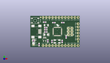
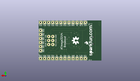
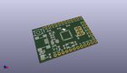

Contents
========

* [PROJ-SPAR-11117-STAN-01>32U4 Breakout Board](#proj-spar-11117-stan-0132u4-breakout-board)
	* [Images](#images)
	* [Interactive BOM](#interactive-bom)
	* [OOMP Parts](#oomp-parts)
	* [Tags](#tags)
  
![][im]
# PROJ-SPAR-11117-STAN-01>32U4 Breakout Board

- ID: PROJ-SPAR-11117-STAN-01
- Hex ID: PRS11117
- Name: 32U4 Breakout Board
- Description: 

## Images
  
  

|eagleImage|kicadPcb3dFront|kicadPcb3dBack|kicadPcb3d|
| :---: | :---: | :---: | :---: |
|||||

## Interactive BOM

- Interactive BOM page: [ibom.html](kicad/bom/ibom.html)

## OOMP Parts
  

|OOMP Parts|
| :---: |
|<table><tr><td></td><td> C1</td><td>[CAPC-0603-X-NF100-V50 SMD (0603) 100 nF Capacitor (Ceramic) 50v](https://github.com/oomlout/oomlout_OOMP_parts/tree/main/CAPC-0603-X-NF100-V50/)</td><td>[C6N100](https://github.com/oomlout/oomlout_OOMP_parts/tree/main/CAPC-0603-X-NF100-V50/)</td></tr></table>|
|CAPC-0603-X-UNMATCHED-01, C2, 25.4, 4.571999999999999, 90,C2, 18pF, 0603-CAP, SparkFun-Capacitors, (1, 0.18), R90|
|CAPC-0603-X-UNMATCHED-01, C3, 17.272000000000002, 4.571999999999999, 270,C3, 18pF, 0603-CAP, SparkFun-Capacitors, (0.68, 0.18), R270|
|CAPC-0603-X-UNMATCHED-01, C4, 12.318999999999999, 12.318999999999999, 180,C4, 1uF, 0603-CAP, SparkFun-Capacitors, (0.485, 0.485), R180|
|CAPC-0603-X-UNMATCHED-01, C5, 6.985, 2.032, 270,C5, 1uF, 0603-CAP, SparkFun-Capacitors, (0.275, 0.08), R270|
|<table><tr><td></td><td> C6</td><td>[CAPC-0603-X-NF100-V50 SMD (0603) 100 nF Capacitor (Ceramic) 50v](https://github.com/oomlout/oomlout_OOMP_parts/tree/main/CAPC-0603-X-NF100-V50/)</td><td>[C6N100](https://github.com/oomlout/oomlout_OOMP_parts/tree/main/CAPC-0603-X-NF100-V50/)</td></tr></table>|
|<table><tr><td></td><td> C7</td><td>[CAPC-0603-X-NF100-V50 SMD (0603) 100 nF Capacitor (Ceramic) 50v](https://github.com/oomlout/oomlout_OOMP_parts/tree/main/CAPC-0603-X-NF100-V50/)</td><td>[C6N100](https://github.com/oomlout/oomlout_OOMP_parts/tree/main/CAPC-0603-X-NF100-V50/)</td></tr></table>|
|CAPC-UNMATCHED-X-UNMATCHED-01, C8, 12.7, 10.16, 0,C8, 10uF, EIA3216, SparkFun, (0.5, 0.4), R0|
|<table><tr><td></td><td> C9</td><td>[CAPC-0603-X-NF100-V50 SMD (0603) 100 nF Capacitor (Ceramic) 50v](https://github.com/oomlout/oomlout_OOMP_parts/tree/main/CAPC-0603-X-NF100-V50/)</td><td>[C6N100](https://github.com/oomlout/oomlout_OOMP_parts/tree/main/CAPC-0603-X-NF100-V50/)</td></tr></table>|
|UNMATCHED-UNMATCHED-X-UNMATCHED-01, F1, 12.7, 17.779999999999998, 0,F1, PTCSMD, PTC-1206, SparkFun, (0.5, 0.7), R0|
|UNMATCHED-UNMATCHED-X-UNMATCHED-01, J1, 33.019999999999996, 10.16, 90,J1, AVR_SPI_PRG, 2X3, SparkFun, (1.3, 0.4), R90|
|<table><tr><td></td><td> JP1</td><td>[HEAD-I01-X-PI12-01 2.54 mm 12 Pin Header](https://github.com/oomlout/oomlout_OOMP_parts/tree/main/HEAD-I01-X-PI12-01/)</td><td>[H12](https://github.com/oomlout/oomlout_OOMP_parts/tree/main/HEAD-I01-X-PI12-01/)</td></tr></table>|
|<table><tr><td></td><td> JP2</td><td>[HEAD-I01-X-PI12-01 2.54 mm 12 Pin Header](https://github.com/oomlout/oomlout_OOMP_parts/tree/main/HEAD-I01-X-PI12-01/)</td><td>[H12](https://github.com/oomlout/oomlout_OOMP_parts/tree/main/HEAD-I01-X-PI12-01/)</td></tr></table>|
|<table><tr><td></td><td> JP3</td><td>[HEAD-I01-X-PI06-01 2.54 mm 6 Pin Header](https://github.com/oomlout/oomlout_OOMP_parts/tree/main/HEAD-I01-X-PI06-01/)</td><td>[H06](https://github.com/oomlout/oomlout_OOMP_parts/tree/main/HEAD-I01-X-PI06-01/)</td></tr></table>|
|HEAD-I01-X-PI2-01, JP6, 8.140699999999999, 24.256999999999998, 0,JP6, FIDUCIAL1X2, FIDUCIAL-1X2, SparkFun, (0.3205, 0.955), R0|
|HEAD-I01-X-PI2-01, JP7, 38.099999999999994, 4.3942, 0,JP7, FIDUCIAL1X2, FIDUCIAL-1X2, SparkFun, (1.5, 0.173), R0|
|UNMATCHED-0603-X-UNMATCHED-01, LED1, 2.54, 6.35, 270,LED1, Power, LED-0603, SparkFun, (0.1, 0.25), R270|
|<table><tr><td></td><td> R1</td><td>[RESE-0603-X-O103-01 SMD (0603) 10k Ohm Resistor](https://github.com/oomlout/oomlout_OOMP_parts/tree/main/RESE-0603-X-O103-01/)</td><td>[R6103](https://github.com/oomlout/oomlout_OOMP_parts/tree/main/RESE-0603-X-O103-01/)</td></tr></table>|
|RESE-0603-X-UNMATCHED-01, R2, 12.318999999999999, 14.097000000000001, 0,R2, 22, 0603-RES, SparkFun-Resistors, (0.485, 0.555), R0|
|RESE-0603-X-UNMATCHED-01, R3, 12.318999999999999, 15.748, 0,R3, 22, 0603-RES, SparkFun-Resistors, (0.485, 0.62), R0|
|RESE-0603-X-UNMATCHED-01, R4, 2.54, 5.08, 0,R4, 1k, 0603-RES, SparkFun-Resistors, (0.1, 0.2), R0|
|UNMATCHED-UNMATCHED-X-UNMATCHED-01, S1, 3.8099999999999996, 21.59, 180,S1, SWITCH-SMD, TACTILE_SWITCH_SMD, SparkFun, (0.15, 0.85), R180|
|ERROR, SJ1 Power Select, 0, 0, 0,SJ1, Power, Select, SJ_3_PASTE2&3, SparkFun, (0.1, 0.1), R90|
|UNMATCHED-UNMATCHED-X-UNMATCHED-01, U1, 21.59, 12.7, 0,U1, ATMEGA32U4, QFN-44-NOPAD_1:1, Testing, (0.85, 0.5), R0|
|UNMATCHED-UNMATCHED-X-UNMATCHED-01, U2, 11.43, 6.35, 180,U2, 3.3V_REG_LDOSMD, SOT23-5, SparkFun, (0.45, 0.25), R180|
|UNMATCHED-UNMATCHED-X-UNMATCHED-01, X1, 5.08, 12.7, 0,X1, USBSMD, USB-MINIB, SparkFun, (0.2, 0.5), R0|
|UNMATCHED-UNMATCHED-X-UNMATCHED-01, Y1, 21.336, 4.571999999999999, 0,Y1, 16MHz, CRYSTAL-SMD-5X3, SparkFun, (0.84, 0.18), R0|

## Tags

- hexID: PRS11117
- oompType: PROJ
- oompSize: SPAR
- oompColor: 11117
- oompDesc: STAN
- oompIndex: 01
- oompName: 32U4 Breakout Board
- sources: All source files from https://github.com/sparkfun/32U4_Breakout_Board (source licence details in srcLicense.md)
- linkBuyPage: https://www.sparkfun.com/products/11117
- oompID: PROJ-SPAR-11117-STAN-01
- oompPart: CAPC-0603-X-NF100-V50, C1, 18.796, 19.939, 180
- oompPart: CAPC-0603-X-UNMATCHED-01, C2, 25.4, 4.571999999999999, 90
- oompPart: CAPC-0603-X-UNMATCHED-01, C3, 17.272000000000002, 4.571999999999999, 270
- oompPart: CAPC-0603-X-UNMATCHED-01, C4, 12.318999999999999, 12.318999999999999, 180
- oompPart: CAPC-0603-X-UNMATCHED-01, C5, 6.985, 2.032, 270
- oompPart: CAPC-0603-X-NF100-V50, C6, 25.907999999999998, 19.939, 0
- oompPart: CAPC-0603-X-NF100-V50, C7, 28.575, 8.254999999999999, 270
- oompPart: CAPC-UNMATCHED-X-UNMATCHED-01, C8, 12.7, 10.16, 0
- oompPart: CAPC-0603-X-NF100-V50, C9, 13.97, 5.08, 270
- oompPart: UNMATCHED-UNMATCHED-X-UNMATCHED-01, F1, 12.7, 17.779999999999998, 0
- oompPart: UNMATCHED-UNMATCHED-X-UNMATCHED-01, J1, 33.019999999999996, 10.16, 90
- oompPart: HEAD-I01-X-PI12-01, JP1, 10.16, 1.27, M180
- oompPart: HEAD-I01-X-PI12-01, JP2, 10.16, 24.13, M180
- oompPart: HEAD-I01-X-PI06-01, JP3, 38.099999999999994, 6.35, M90
- oompPart: HEAD-I01-X-PI2-01, JP6, 8.140699999999999, 24.256999999999998, 0
- oompPart: HEAD-I01-X-PI2-01, JP7, 38.099999999999994, 4.3942, 0
- oompPart: UNMATCHED-0603-X-UNMATCHED-01, LED1, 2.54, 6.35, 270
- oompPart: RESE-0603-X-O103-01, R1, 11.43, 20.32, 0
- oompPart: RESE-0603-X-UNMATCHED-01, R2, 12.318999999999999, 14.097000000000001, 0
- oompPart: RESE-0603-X-UNMATCHED-01, R3, 12.318999999999999, 15.748, 0
- oompPart: RESE-0603-X-UNMATCHED-01, R4, 2.54, 5.08, 0
- oompPart: UNMATCHED-UNMATCHED-X-UNMATCHED-01, S1, 3.8099999999999996, 21.59, 180
- oompPart: ERROR, SJ1 Power Select, 0, 0, 0
- oompPart: UNMATCHED-UNMATCHED-X-UNMATCHED-01, U1, 21.59, 12.7, 0
- oompPart: UNMATCHED-UNMATCHED-X-UNMATCHED-01, U2, 11.43, 6.35, 180
- oompPart: UNMATCHED-UNMATCHED-X-UNMATCHED-01, X1, 5.08, 12.7, 0
- oompPart: UNMATCHED-UNMATCHED-X-UNMATCHED-01, Y1, 21.336, 4.571999999999999, 0
- rawPart: C1, 0.1uF, 0603-CAP, SparkFun-Capacitors, (0.74, 0.785), R180
- rawPart: C2, 18pF, 0603-CAP, SparkFun-Capacitors, (1, 0.18), R90
- rawPart: C3, 18pF, 0603-CAP, SparkFun-Capacitors, (0.68, 0.18), R270
- rawPart: C4, 1uF, 0603-CAP, SparkFun-Capacitors, (0.485, 0.485), R180
- rawPart: C5, 1uF, 0603-CAP, SparkFun-Capacitors, (0.275, 0.08), R270
- rawPart: C6, 0.1uF, 0603-CAP, SparkFun-Capacitors, (1.02, 0.785), R0
- rawPart: C7, 0.1uF, 0603-CAP, SparkFun-Capacitors, (1.125, 0.325), R270
- rawPart: C8, 10uF, EIA3216, SparkFun, (0.5, 0.4), R0
- rawPart: C9, 0.1uF, 0603-CAP, SparkFun-Capacitors, (0.55, 0.2), R270
- rawPart: F1, PTCSMD, PTC-1206, SparkFun, (0.5, 0.7), R0
- rawPart: J1, AVR_SPI_PRG, 2X3, SparkFun, (1.3, 0.4), R90
- rawPart: JP1, M12PTH, 1X12, SparkFun, (0.4, 0.05), MR180
- rawPart: JP2, M12PTH, 1X12, SparkFun, (0.4, 0.95), MR180
- rawPart: JP3, 1X06, SparkFun, (1.5, 0.25), MR90
- rawPart: JP6, FIDUCIAL1X2, FIDUCIAL-1X2, SparkFun, (0.3205, 0.955), R0
- rawPart: JP7, FIDUCIAL1X2, FIDUCIAL-1X2, SparkFun, (1.5, 0.173), R0
- rawPart: LED1, Power, LED-0603, SparkFun, (0.1, 0.25), R270
- rawPart: R1, 10k, 0603-RES, SparkFun-Resistors, (0.45, 0.8), R0
- rawPart: R2, 22, 0603-RES, SparkFun-Resistors, (0.485, 0.555), R0
- rawPart: R3, 22, 0603-RES, SparkFun-Resistors, (0.485, 0.62), R0
- rawPart: R4, 1k, 0603-RES, SparkFun-Resistors, (0.1, 0.2), R0
- rawPart: S1, SWITCH-SMD, TACTILE_SWITCH_SMD, SparkFun, (0.15, 0.85), R180
- rawPart: SJ1, Power, Select, SJ_3_PASTE2&3, SparkFun, (0.1, 0.1), R90
- rawPart: U1, ATMEGA32U4, QFN-44-NOPAD_1:1, Testing, (0.85, 0.5), R0
- rawPart: U2, 3.3V_REG_LDOSMD, SOT23-5, SparkFun, (0.45, 0.25), R180
- rawPart: X1, USBSMD, USB-MINIB, SparkFun, (0.2, 0.5), R0
- rawPart: Y1, 16MHz, CRYSTAL-SMD-5X3, SparkFun, (0.84, 0.18), R0

[im]: kicadPcb3d_450.png
