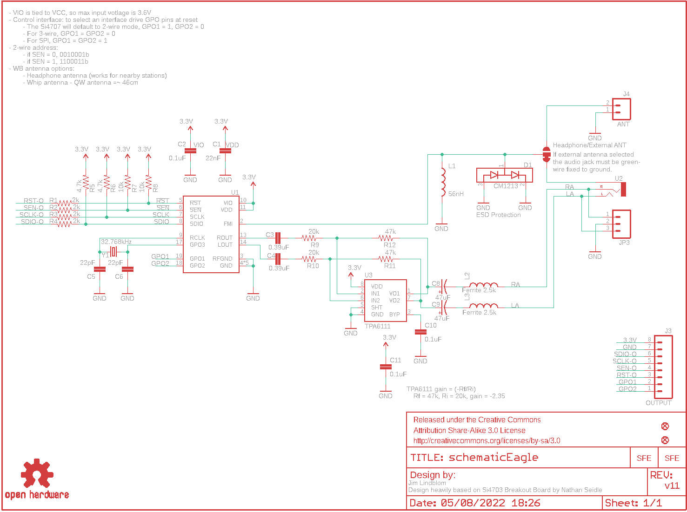
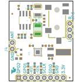
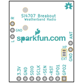
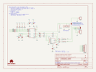
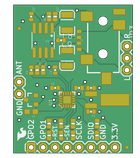
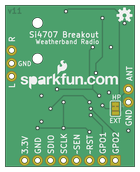

Contents
========

* [PRS11129 > Si4707 Breakout](#prs11129--si4707-breakout)
	* [Schematic](#schematic)
	* [PCB](#pcb)
	* [Interactive BOM](#interactive-bom)
	* [OOMP Parts](#oomp-parts)
	* [Images](#images)
	* [Tags](#tags)
  
![][im]
# PRS11129 > Si4707 Breakout

- ID: PROJ-SPAR-11129-STAN-01
- Hex ID: PRS11129
- Name: Sparkfun
- Description: Sparkfun
- Long Link: [http://oom.lt/PROJ-SPAR-11129-STAN-01](http://oom.lt/PROJ-SPAR-11129-STAN-01)
- Short Link: [http://oom.lt/PRS11129](http://oom.lt/PRS11129)

## Schematic
  

## PCB
  

## Interactive BOM

- Interactive BOM page: [ibom.html](https://htmlpreview.github.io/?https://github.com/oomlout/oomlout_OOMP_projects/blob/main/PROJ-SPAR-11129-STAN-01/kicad/bom/ibom.html)

## OOMP Parts
  

|OOMP ID|Name|Identifier|
| :---: | :---: | :---: |
|[CAPC-0402-X-NF22-V50](https://github.com/oomlout/oomlout_OOMP_parts/tree/main/CAPC-0402-X-NF22-V50/)|[SMD (0402) 22 nF Capacitor (Ceramic) 50v](https://github.com/oomlout/oomlout_OOMP_parts/tree/main/CAPC-0402-X-NF22-V50/)|[C1](https://github.com/oomlout/oomlout_OOMP_parts/tree/main/CAPC-0402-X-NF22-V50/)|
|[CAPC-0402-X-NF100-V10](https://github.com/oomlout/oomlout_OOMP_parts/tree/main/CAPC-0402-X-NF100-V10/)|[SMD (0402) 100 nF Capacitor (Ceramic) 10v](https://github.com/oomlout/oomlout_OOMP_parts/tree/main/CAPC-0402-X-NF100-V10/)|[C2, C10, C11](https://github.com/oomlout/oomlout_OOMP_parts/tree/main/CAPC-0402-X-NF100-V10/)|
|CAPC-0402-X-NF390-01||C3, C4|
|[CAPC-0402-X-PF22-V50](https://github.com/oomlout/oomlout_OOMP_parts/tree/main/CAPC-0402-X-PF22-V50/)|[SMD (0402) 22 pF Capacitor (Ceramic) 50v](https://github.com/oomlout/oomlout_OOMP_parts/tree/main/CAPC-0402-X-PF22-V50/)|[C5, C6](https://github.com/oomlout/oomlout_OOMP_parts/tree/main/CAPC-0402-X-PF22-V50/)|
|CAPX-3528-X-UF47-01||C8, C9|
|DIOD-SO23-X-UNMATCHED-01||D1|
|[HEAD-I01-X-PI08-01](https://github.com/oomlout/oomlout_OOMP_parts/tree/main/HEAD-I01-X-PI08-01/)|[2.54 mm 8 Pin Header](https://github.com/oomlout/oomlout_OOMP_parts/tree/main/HEAD-I01-X-PI08-01/)|[J3](https://github.com/oomlout/oomlout_OOMP_parts/tree/main/HEAD-I01-X-PI08-01/)|
|[HEAD-I01-X-PI02-01](https://github.com/oomlout/oomlout_OOMP_parts/tree/main/HEAD-I01-X-PI02-01/)|[2.54 mm 2 Pin Header](https://github.com/oomlout/oomlout_OOMP_parts/tree/main/HEAD-I01-X-PI02-01/)|[J4](https://github.com/oomlout/oomlout_OOMP_parts/tree/main/HEAD-I01-X-PI02-01/)|
|[HEAD-I01-X-PI03-01](https://github.com/oomlout/oomlout_OOMP_parts/tree/main/HEAD-I01-X-PI03-01/)|[2.54 mm 3 Pin Header](https://github.com/oomlout/oomlout_OOMP_parts/tree/main/HEAD-I01-X-PI03-01/)|[JP3](https://github.com/oomlout/oomlout_OOMP_parts/tree/main/HEAD-I01-X-PI03-01/)|
|UNMATCHED-0603-X-UNMATCHED-01||L1|
|UNMATCHED-0402-X-UNMATCHED-01||L2, L3|
|[RESE-0402-X-O202-01](https://github.com/oomlout/oomlout_OOMP_parts/tree/main/RESE-0402-X-O202-01/)|[SMD (0402) 2k Ohm Resistor](https://github.com/oomlout/oomlout_OOMP_parts/tree/main/RESE-0402-X-O202-01/)|[R1, R2, R3, R4](https://github.com/oomlout/oomlout_OOMP_parts/tree/main/RESE-0402-X-O202-01/)|
|[RESE-0402-X-O472-01](https://github.com/oomlout/oomlout_OOMP_parts/tree/main/RESE-0402-X-O472-01/)|[SMD (0402) 4.7k Ohm Resistor](https://github.com/oomlout/oomlout_OOMP_parts/tree/main/RESE-0402-X-O472-01/)|[R5, R6](https://github.com/oomlout/oomlout_OOMP_parts/tree/main/RESE-0402-X-O472-01/)|
|[RESE-0402-X-O103-01](https://github.com/oomlout/oomlout_OOMP_parts/tree/main/RESE-0402-X-O103-01/)|[SMD (0402) 10k Ohm Resistor](https://github.com/oomlout/oomlout_OOMP_parts/tree/main/RESE-0402-X-O103-01/)|[R7, R8](https://github.com/oomlout/oomlout_OOMP_parts/tree/main/RESE-0402-X-O103-01/)|
|[RESE-0402-X-O203-01](https://github.com/oomlout/oomlout_OOMP_parts/tree/main/RESE-0402-X-O203-01/)|[SMD (0402) 20k Ohm Resistor](https://github.com/oomlout/oomlout_OOMP_parts/tree/main/RESE-0402-X-O203-01/)|[R9, R10](https://github.com/oomlout/oomlout_OOMP_parts/tree/main/RESE-0402-X-O203-01/)|
|[RESE-0402-X-O473-01](https://github.com/oomlout/oomlout_OOMP_parts/tree/main/RESE-0402-X-O473-01/)|[SMD (0402) 47k Ohm Resistor](https://github.com/oomlout/oomlout_OOMP_parts/tree/main/RESE-0402-X-O473-01/)|[R11, R12](https://github.com/oomlout/oomlout_OOMP_parts/tree/main/RESE-0402-X-O473-01/)|
|UNMATCHED-UNMATCHED-X-UNMATCHED-01||U1, U3, Y1|
|TERS-35D-L-UNMATCHED-01||U2|

## Images
  
  

|bominteractivefront|bominteractiveback|kicadPcb3d|kicadPcb3dFront|kicadPcb3dBack|kicadSchem|eagleImage|eagleSchemImage|pcbdraw|pcbdrawback|
| :---: | :---: | :---: | :---: | :---: | :---: | :---: | :---: | :---: | :---: |
|||||||||||

## Tags

- hexID: PRS11129
- oompType: PROJ
- oompSize: SPAR
- oompColor: 11129
- oompDesc: STAN
- oompIndex: 01
- oompName: Si4707 Breakout
- sources: All source files from https://github.com/sparkfun/Si4707_Breakout (source licence details in srcLicense.md)
- linkBuyPage: https://www.sparkfun.com/products/11129
- oompID: PROJ-SPAR-11129-STAN-01
- oompParts: C1,CAPC-0402-X-NF22-V50
- oompParts: C2,CAPC-0402-X-NF100-V10
- oompParts: C3,CAPC-0402-X-NF390-01
- oompParts: C4,CAPC-0402-X-NF390-01
- oompParts: C5,CAPC-0402-X-PF22-V50
- oompParts: C6,CAPC-0402-X-PF22-V50
- oompParts: C8,CAPX-3528-X-UF47-01
- oompParts: C9,CAPX-3528-X-UF47-01
- oompParts: C10,CAPC-0402-X-NF100-V10
- oompParts: C11,CAPC-0402-X-NF100-V10
- oompParts: D1,DIOD-SO23-X-UNMATCHED-01
- oompParts: J3,HEAD-I01-X-PI08-01
- oompParts: J4,HEAD-I01-X-PI02-01
- oompParts: JP3,HEAD-I01-X-PI03-01
- oompParts: L1,UNMATCHED-0603-X-UNMATCHED-01
- oompParts: L2,UNMATCHED-0402-X-UNMATCHED-01
- oompParts: L3,UNMATCHED-0402-X-UNMATCHED-01
- oompParts: R1,RESE-0402-X-O202-01
- oompParts: R2,RESE-0402-X-O202-01
- oompParts: R3,RESE-0402-X-O202-01
- oompParts: R4,RESE-0402-X-O202-01
- oompParts: R5,RESE-0402-X-O472-01
- oompParts: R6,RESE-0402-X-O472-01
- oompParts: R7,RESE-0402-X-O103-01
- oompParts: R8,RESE-0402-X-O103-01
- oompParts: R9,RESE-0402-X-O203-01
- oompParts: R10,RESE-0402-X-O203-01
- oompParts: R11,RESE-0402-X-O473-01
- oompParts: R12,RESE-0402-X-O473-01
- oompParts: U1,UNMATCHED-UNMATCHED-X-UNMATCHED-01
- oompParts: U2,TERS-35D-L-UNMATCHED-01
- oompParts: U3,UNMATCHED-UNMATCHED-X-UNMATCHED-01
- oompParts: Y1,UNMATCHED-UNMATCHED-X-UNMATCHED-01
- rawParts: C1,22nF,CAP0402-CAP,0402-CAP,Capacitor,,
- rawParts: C2,0.1uF,CAP0402-CAP,0402-CAP,Capacitor,,
- rawParts: C3,0.39uF,CAP0402-CAP,0402-CAP,Capacitor,,
- rawParts: C4,0.39uF,CAP0402-CAP,0402-CAP,Capacitor,,
- rawParts: C5,22pF,CAP0402-CAP,0402-CAP,Capacitor,,
- rawParts: C6,22pF,CAP0402-CAP,0402-CAP,Capacitor,,
- rawParts: C8,47uF,CAP_POL3528,EIA3528,Capacitor Polarized,,
- rawParts: C9,47uF,CAP_POL3528,EIA3528,Capacitor Polarized,,
- rawParts: C10,0.1uF,CAP0402-CAP,0402-CAP,Capacitor,,
- rawParts: C11,0.1uF,CAP0402-CAP,0402-CAP,Capacitor,,
- rawParts: D1,CM1213,CM1213,SOT23-3,,,
- rawParts: FRAME1,FRAME-LETTER,FRAME-LETTER,CREATIVE_COMMONS,Schematic Frame,,
- rawParts: J3,OUTPUT,M081X08,1X08,Header 8,,
- rawParts: J4,ANT,M02PTH,1X02,Header 2,,
- rawParts: JP1,LOGO-SFENEW,LOGO-SFENEW,SFE-NEW-WEBLOGO,Spark Fun Electronics PCB Logo,,
- rawParts: JP2,LOGO-SFESK,LOGO-SFESK,SFE-LOGO-FLAME,Spark Fun Electronics PCB Logo,,
- rawParts: JP3,,M03PTH,1X03,Header 3,,
- rawParts: JP4,FIDUCIALUFIDUCIAL,FIDUCIALUFIDUCIAL,MICRO-FIDUCIAL,Fiducial Alignment Points,,
- rawParts: JP5,FIDUCIALUFIDUCIAL,FIDUCIALUFIDUCIAL,MICRO-FIDUCIAL,Fiducial Alignment Points,,
- rawParts: L1,56nH,INDUCTOR0603,0603,Inductors,,
- rawParts: L2,Ferrite 2.5k,INDUCTOR0402,C0402,Inductors,,
- rawParts: L3,Ferrite 2.5k,INDUCTOR0402,C0402,Inductors,,
- rawParts: R1,2k,RESISTOR0402-RES,0402-RES,Resistor,,
- rawParts: R2,2k,RESISTOR0402-RES,0402-RES,Resistor,,
- rawParts: R3,2k,RESISTOR0402-RES,0402-RES,Resistor,,
- rawParts: R4,2k,RESISTOR0402-RES,0402-RES,Resistor,,
- rawParts: R5,4.7k,RESISTOR0402-RES,0402-RES,Resistor,,
- rawParts: R6,4.7k,RESISTOR0402-RES,0402-RES,Resistor,,
- rawParts: R7,10k,RESISTOR0402-RES,0402-RES,Resistor,,
- rawParts: R8,10k,RESISTOR0402-RES,0402-RES,Resistor,,
- rawParts: R9,20k,RESISTOR0402-RES,0402-RES,Resistor,,
- rawParts: R10,20k,RESISTOR0402-RES,0402-RES,Resistor,,
- rawParts: R11,47k,RESISTOR0402-RES,0402-RES,Resistor,,
- rawParts: R12,47k,RESISTOR0402-RES,0402-RES,Resistor,,
- rawParts: SJ2,,SOLDERJUMPER_2WAYS,SJ_3,Solder Jumper,,
- rawParts: U$2,OSHW-LOGOS,OSHW-LOGOS,OSHW-LOGO-S,Open Source Hardware Logo This logo indicates the piece of hardware it is found on incorporates a OSHW license and/or adheres to the definition of open source hardware found here: http://freedomdefined.org/OSHW,,
- rawParts: U1,,SI4707,SI470X,Silicon Labs Si4707 Weather Band and SAME Data Receiver,,
- rawParts: U2,,AUDIO-JACKSMD2,AUDIO-JACK-3.5MM-SMD,3.5mm Audio Jack,,
- rawParts: U3,TPA6111,SPARKFUN_TPA6111SMD,SPARKFUN_SO08,,,
- rawParts: Y1,32.768kHz,CRYSTAL32-SMD,CRYSTAL-32KHZ-SMD,Various standard crystals. Proven footprints. Spark Fun Electronics SKU : COM-00534,,

[im]: kicadPcb3d_450.png
