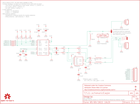

Contents
========

* [PRS11129 > Sparkfun](#prs11129--sparkfun)
	* [Images](#images)
	* [Tags](#tags)
  
![][im]
# PRS11129 > Sparkfun

- ID: PROJ-SPAR-11129-STAN-01
- Hex ID: PRS11129
- Name: Sparkfun
- Description: Sparkfun

## Images
  
  

|kicadPcb3d|kicadPcb3dFront|kicadPcb3dBack|eagleImage|eagleSchemImage|
| :---: | :---: | :---: | :---: | :---: |
||||||

## Tags

- hexID: PRS11129
- oompType: PROJ
- oompSize: SPAR
- oompColor: 11129
- oompDesc: STAN
- oompIndex: 01
- oompName: Si4707 Breakout
- sources: All source files from https://github.com/sparkfun/Si4707_Breakout (source licence details in srcLicense.md)
- linkBuyPage: https://www.sparkfun.com/products/11129
- oompID: PROJ-SPAR-11129-STAN-01
- oompParts: C1,UNMATCHED-UNMATCHED-UNMATCHED-UNMATCHED-UNMATCHED
- oompParts: C2,UNMATCHED-UNMATCHED-UNMATCHED-UNMATCHED-UNMATCHED
- oompParts: C3,UNMATCHED-UNMATCHED-UNMATCHED-UNMATCHED-UNMATCHED
- oompParts: C4,UNMATCHED-UNMATCHED-UNMATCHED-UNMATCHED-UNMATCHED
- oompParts: C5,UNMATCHED-UNMATCHED-UNMATCHED-UNMATCHED-UNMATCHED
- oompParts: C6,UNMATCHED-UNMATCHED-UNMATCHED-UNMATCHED-UNMATCHED
- oompParts: C8,UNMATCHED-UNMATCHED-UNMATCHED-UNMATCHED-UNMATCHED
- oompParts: C9,UNMATCHED-UNMATCHED-UNMATCHED-UNMATCHED-UNMATCHED
- oompParts: C10,UNMATCHED-UNMATCHED-UNMATCHED-UNMATCHED-UNMATCHED
- oompParts: C11,UNMATCHED-UNMATCHED-UNMATCHED-UNMATCHED-UNMATCHED
- oompParts: D1,UNMATCHED-UNMATCHED-UNMATCHED-UNMATCHED-UNMATCHED
- oompParts: FRAME1,UNMATCHED-UNMATCHED-UNMATCHED-UNMATCHED-UNMATCHED
- oompParts: J3,UNMATCHED-UNMATCHED-UNMATCHED-UNMATCHED-UNMATCHED
- oompParts: J4,UNMATCHED-UNMATCHED-UNMATCHED-UNMATCHED-UNMATCHED
- oompParts: JP1,UNMATCHED-UNMATCHED-UNMATCHED-UNMATCHED-UNMATCHED
- oompParts: JP2,UNMATCHED-UNMATCHED-UNMATCHED-UNMATCHED-UNMATCHED
- oompParts: JP3,UNMATCHED-UNMATCHED-UNMATCHED-UNMATCHED-UNMATCHED
- oompParts: L1,UNMATCHED-UNMATCHED-UNMATCHED-UNMATCHED-UNMATCHED
- oompParts: L2,UNMATCHED-UNMATCHED-UNMATCHED-UNMATCHED-UNMATCHED
- oompParts: L3,UNMATCHED-UNMATCHED-UNMATCHED-UNMATCHED-UNMATCHED
- oompParts: R1,UNMATCHED-UNMATCHED-UNMATCHED-UNMATCHED-UNMATCHED
- oompParts: R2,UNMATCHED-UNMATCHED-UNMATCHED-UNMATCHED-UNMATCHED
- oompParts: R3,UNMATCHED-UNMATCHED-UNMATCHED-UNMATCHED-UNMATCHED
- oompParts: R4,UNMATCHED-UNMATCHED-UNMATCHED-UNMATCHED-UNMATCHED
- oompParts: R5,UNMATCHED-UNMATCHED-UNMATCHED-UNMATCHED-UNMATCHED
- oompParts: R6,UNMATCHED-UNMATCHED-UNMATCHED-UNMATCHED-UNMATCHED
- oompParts: R7,UNMATCHED-UNMATCHED-UNMATCHED-UNMATCHED-UNMATCHED
- oompParts: R8,UNMATCHED-UNMATCHED-UNMATCHED-UNMATCHED-UNMATCHED
- oompParts: R9,UNMATCHED-UNMATCHED-UNMATCHED-UNMATCHED-UNMATCHED
- oompParts: R10,UNMATCHED-UNMATCHED-UNMATCHED-UNMATCHED-UNMATCHED
- oompParts: R11,UNMATCHED-UNMATCHED-UNMATCHED-UNMATCHED-UNMATCHED
- oompParts: R12,UNMATCHED-UNMATCHED-UNMATCHED-UNMATCHED-UNMATCHED
- oompParts: SJ2,UNMATCHED-UNMATCHED-UNMATCHED-UNMATCHED-UNMATCHED
- oompParts: U$2,UNMATCHED-UNMATCHED-UNMATCHED-UNMATCHED-UNMATCHED
- oompParts: U1,UNMATCHED-UNMATCHED-UNMATCHED-UNMATCHED-UNMATCHED
- oompParts: U2,UNMATCHED-UNMATCHED-UNMATCHED-UNMATCHED-UNMATCHED
- oompParts: U3,UNMATCHED-UNMATCHED-UNMATCHED-UNMATCHED-UNMATCHED
- oompParts: Y1,UNMATCHED-UNMATCHED-UNMATCHED-UNMATCHED-UNMATCHED
- rawParts: C1,22nF,CAP0402-CAP,0402-CAP,Capacitor,,
- rawParts: C2,0.1uF,CAP0402-CAP,0402-CAP,Capacitor,,
- rawParts: C3,0.39uF,CAP0402-CAP,0402-CAP,Capacitor,,
- rawParts: C4,0.39uF,CAP0402-CAP,0402-CAP,Capacitor,,
- rawParts: C5,22pF,CAP0402-CAP,0402-CAP,Capacitor,,
- rawParts: C6,22pF,CAP0402-CAP,0402-CAP,Capacitor,,
- rawParts: C8,47uF,CAP_POL3528,EIA3528,Capacitor Polarized,,
- rawParts: C9,47uF,CAP_POL3528,EIA3528,Capacitor Polarized,,
- rawParts: C10,0.1uF,CAP0402-CAP,0402-CAP,Capacitor,,
- rawParts: C11,0.1uF,CAP0402-CAP,0402-CAP,Capacitor,,
- rawParts: D1,CM1213,CM1213,SOT23-3,,,
- rawParts: FRAME1,FRAME-LETTER,FRAME-LETTER,CREATIVE_COMMONS,Schematic Frame,,
- rawParts: J3,OUTPUT,M081X08,1X08,Header 8,,
- rawParts: J4,ANT,M02PTH,1X02,Header 2,,
- rawParts: JP1,LOGO-SFENEW,LOGO-SFENEW,SFE-NEW-WEBLOGO,Spark Fun Electronics PCB Logo,,
- rawParts: JP2,LOGO-SFESK,LOGO-SFESK,SFE-LOGO-FLAME,Spark Fun Electronics PCB Logo,,
- rawParts: JP3,,M03PTH,1X03,Header 3,,
- rawParts: JP4,FIDUCIALUFIDUCIAL,FIDUCIALUFIDUCIAL,MICRO-FIDUCIAL,Fiducial Alignment Points,,
- rawParts: JP5,FIDUCIALUFIDUCIAL,FIDUCIALUFIDUCIAL,MICRO-FIDUCIAL,Fiducial Alignment Points,,
- rawParts: L1,56nH,INDUCTOR0603,0603,Inductors,,
- rawParts: L2,Ferrite 2.5k,INDUCTOR0402,C0402,Inductors,,
- rawParts: L3,Ferrite 2.5k,INDUCTOR0402,C0402,Inductors,,
- rawParts: R1,2k,RESISTOR0402-RES,0402-RES,Resistor,,
- rawParts: R2,2k,RESISTOR0402-RES,0402-RES,Resistor,,
- rawParts: R3,2k,RESISTOR0402-RES,0402-RES,Resistor,,
- rawParts: R4,2k,RESISTOR0402-RES,0402-RES,Resistor,,
- rawParts: R5,4.7k,RESISTOR0402-RES,0402-RES,Resistor,,
- rawParts: R6,4.7k,RESISTOR0402-RES,0402-RES,Resistor,,
- rawParts: R7,10k,RESISTOR0402-RES,0402-RES,Resistor,,
- rawParts: R8,10k,RESISTOR0402-RES,0402-RES,Resistor,,
- rawParts: R9,20k,RESISTOR0402-RES,0402-RES,Resistor,,
- rawParts: R10,20k,RESISTOR0402-RES,0402-RES,Resistor,,
- rawParts: R11,47k,RESISTOR0402-RES,0402-RES,Resistor,,
- rawParts: R12,47k,RESISTOR0402-RES,0402-RES,Resistor,,
- rawParts: SJ2,,SOLDERJUMPER_2WAYS,SJ_3,Solder Jumper,,
- rawParts: U$2,OSHW-LOGOS,OSHW-LOGOS,OSHW-LOGO-S,Open Source Hardware Logo This logo indicates the piece of hardware it is found on incorporates a OSHW license and/or adheres to the definition of open source hardware found here: http://freedomdefined.org/OSHW,,
- rawParts: U1,,SI4707,SI470X,Silicon Labs Si4707 Weather Band and SAME Data Receiver,,
- rawParts: U2,,AUDIO-JACKSMD2,AUDIO-JACK-3.5MM-SMD,3.5mm Audio Jack,,
- rawParts: U3,TPA6111,SPARKFUN_TPA6111SMD,SPARKFUN_SO08,,,
- rawParts: Y1,32.768kHz,CRYSTAL32-SMD,CRYSTAL-32KHZ-SMD,Various standard crystals. Proven footprints. Spark Fun Electronics SKU : COM-00534,,

[im]: kicadPcb3d_450.png
