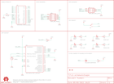

Contents
========

* [PRS11168 > AVR ISP Shield](#prs11168--avr-isp-shield)
	* [Schematic](#schematic)
	* [PCB](#pcb)
	* [Interactive BOM](#interactive-bom)
	* [OOMP Parts](#oomp-parts)
	* [Images](#images)
	* [Tags](#tags)
  
![][im]
# PRS11168 > AVR ISP Shield

- ID: PROJ-SPAR-11168-STAN-01
- Hex ID: PRS11168
- Name: Sparkfun
- Description: Sparkfun
- Long Link: [http://oom.lt/PROJ-SPAR-11168-STAN-01](http://oom.lt/PROJ-SPAR-11168-STAN-01)
- Short Link: [http://oom.lt/PRS11168](http://oom.lt/PRS11168)

## Schematic
  

## PCB
  

## Interactive BOM

- Interactive BOM page: [ibom.html](https://htmlpreview.github.io/?https://github.com/oomlout/oomlout_OOMP_projects/blob/main/PROJ-SPAR-11168-STAN-01/kicad/bom/ibom.html)

## OOMP Parts
  

|OOMP Parts|
| :---: |
|IC1 IC1,UNMATCHED-UNMATCHED-X-UNMATCHED-01|
|J1 J1,UNMATCHED-UNMATCHED-X-UNMATCHED-01|
|[LED1 LEDS-0603-G-STAN-01 SMD (0603) Green LED](https://github.com/oomlout/oomlout_OOMP_parts/tree/main/LEDS-0603-G-STAN-01/)|
|[LED2 LEDS-0603-G-STAN-01 SMD (0603) Green LED](https://github.com/oomlout/oomlout_OOMP_parts/tree/main/LEDS-0603-G-STAN-01/)|
|[LED3 LEDS-0603-G-STAN-01 SMD (0603) Green LED](https://github.com/oomlout/oomlout_OOMP_parts/tree/main/LEDS-0603-G-STAN-01/)|
|[LED4 LEDS-0603-G-STAN-01 SMD (0603) Green LED](https://github.com/oomlout/oomlout_OOMP_parts/tree/main/LEDS-0603-G-STAN-01/)|
|Q1 Q1,UNMATCHED-UNMATCHED-X-UNMATCHED-01|
|R1 R1,RESE-0402-X-O331-01|
|R2 R2,RESE-0402-X-O331-01|
|[R3 RESE-0402-X-O103-01 SMD (0402) 10k Ohm Resistor](https://github.com/oomlout/oomlout_OOMP_parts/tree/main/RESE-0402-X-O103-01/)|
|R4 R4,RESE-0402-X-O331-01|
|R5 R5,RESE-0402-X-O331-01|
|[R6 RESE-0402-X-O101-01 SMD (0402) 100 Ohm Resistor](https://github.com/oomlout/oomlout_OOMP_parts/tree/main/RESE-0402-X-O101-01/)|
|S2 S2,UNMATCHED-UNMATCHED-X-UNMATCHED-01|
|S3 S3,UNMATCHED-UNMATCHED-X-UNMATCHED-01|
|U$9 U$9,UNMATCHED-UNMATCHED-X-UNMATCHED-01|
|U1 U1,UNMATCHED-UNMATCHED-X-UNMATCHED-01|

## Images
  
  

|kicadPcb3d|kicadPcb3dFront|kicadPcb3dBack|eagleImage|eagleSchemImage|
| :---: | :---: | :---: | :---: | :---: |
||||||

## Tags

- hexID: PRS11168
- oompType: PROJ
- oompSize: SPAR
- oompColor: 11168
- oompDesc: STAN
- oompIndex: 01
- oompName: AVR ISP Shield
- sources: All source files from https://github.com/sparkfun/AVR_ISP_Shield (source licence details in srcLicense.md)
- linkBuyPage: https://www.sparkfun.com/products/11168
- oompID: PROJ-SPAR-11168-STAN-01
- oompParts: IC1,UNMATCHED-UNMATCHED-X-UNMATCHED-01
- oompParts: J1,UNMATCHED-UNMATCHED-X-UNMATCHED-01
- oompParts: LED1,LEDS-0603-G-STAN-01
- oompParts: LED2,LEDS-0603-G-STAN-01
- oompParts: LED3,LEDS-0603-G-STAN-01
- oompParts: LED4,LEDS-0603-G-STAN-01
- oompParts: Q1,UNMATCHED-UNMATCHED-X-UNMATCHED-01
- oompParts: R1,RESE-0402-X-O331-01
- oompParts: R2,RESE-0402-X-O331-01
- oompParts: R3,RESE-0402-X-O103-01
- oompParts: R4,RESE-0402-X-O331-01
- oompParts: R5,RESE-0402-X-O331-01
- oompParts: R6,RESE-0402-X-O101-01
- oompParts: S2,UNMATCHED-UNMATCHED-X-UNMATCHED-01
- oompParts: S3,UNMATCHED-UNMATCHED-X-UNMATCHED-01
- oompParts: U$9,UNMATCHED-UNMATCHED-X-UNMATCHED-01
- oompParts: U1,UNMATCHED-UNMATCHED-X-UNMATCHED-01
- rawParts: $$U$1,CREATIVE_COMMONS,CREATIVE_COMMONS,CREATIVE_COMMONS,,,
- rawParts: IC1,AVR-MEGA-PZIF_SOCKET,AVR-MEGA8-PZIF_SOCKET,DIL28-3-ZIF_SOCKET,MICROCONTROLLER,,
- rawParts: J1,AVR_SPI_PRG_6PTH,AVR_SPI_PRG_6PTH,2X3,AVR ISP 6 Pin,,
- rawParts: JP5,FIDUCIAL1X2.5,FIDUCIAL1X2.5,FIDUCIAL-1X2.5,Fiducial Alignment Points,,
- rawParts: JP6,FIDUCIAL1X2.5,FIDUCIAL1X2.5,FIDUCIAL-1X2.5,Fiducial Alignment Points,,
- rawParts: LED1,GREEN,LED0603,LED-0603,LEDs,,
- rawParts: LED2,GREEN,LED0603,LED-0603,LEDs,,
- rawParts: LED3,RED,LED0603,LED-0603,LEDs,,
- rawParts: LED4,BLUE,LED0603,LED-0603,LEDs,,
- rawParts: Q1,8/16/20MHz,RESONATORSMD,RESONATOR-SMD,Resonator,,
- rawParts: R1,330,RESISTOR0402-RES,0402-RES,Resistor,,
- rawParts: R2,330,RESISTOR0402-RES,0402-RES,Resistor,,
- rawParts: R3,10K,RESISTOR0402-RES,0402-RES,Resistor,,
- rawParts: R4,330,RESISTOR0402-RES,0402-RES,Resistor,,
- rawParts: R5,330,RESISTOR0402-RES,0402-RES,Resistor,,
- rawParts: R6,100,RESISTOR0402-RES,0402-RES,Resistor,,
- rawParts: S2,,SWITCH-SPSTSMD,AYZ0202,SPST Switch,,
- rawParts: S3,Reset,SWITCH-MOMENTARY-2SMD,TACTILE_SWITCH_SMD,,,
- rawParts: SJ1,SOLDERJUMPERNO,SOLDERJUMPERNO,SJ_2S-NO,Solder Jumper,,
- rawParts: U$4,OSHW-LOGOS,OSHW-LOGOS,OSHW-LOGO-S,Open Source Hardware Logo This logo indicates the piece of hardware it is found on incorporates a OSHW license and/or adheres to the definition of open source hardware found here: http://freedomdefined.org/OSHW,,
- rawParts: U$9,AVR_SPI_PROG,AVR_SPI_PROG,AVR_ICSP,AVR ICSP Header,,
- rawParts: U1,ARDUINO_SHIELDLABEL,ARDUINO_SHIELDLABEL,DUEMILANOVE_SHIELD,,,

[im]: kicadPcb3d_450.png
