Contents
========

* [PRS11177 > Sparkpunk](#prs11177--sparkpunk)
	* [Schematic](#schematic)
	* [PCB](#pcb)
	* [Interactive BOM](#interactive-bom)
	* [OOMP Parts](#oomp-parts)
	* [Images](#images)
	* [Tags](#tags)
  
![][im]
# PRS11177 > Sparkpunk

- ID: PROJ-SPAR-11177-STAN-01
- Hex ID: PRS11177
- Name: Sparkfun
- Description: Sparkfun
- Long Link: [http://oom.lt/PROJ-SPAR-11177-STAN-01](http://oom.lt/PROJ-SPAR-11177-STAN-01)
- Short Link: [http://oom.lt/PRS11177](http://oom.lt/PRS11177)

## Schematic
  
[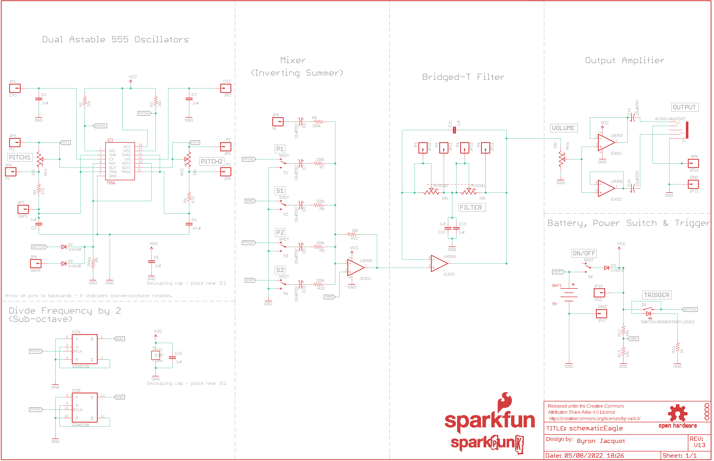](eagleSchemImage.png)
## PCB
  
[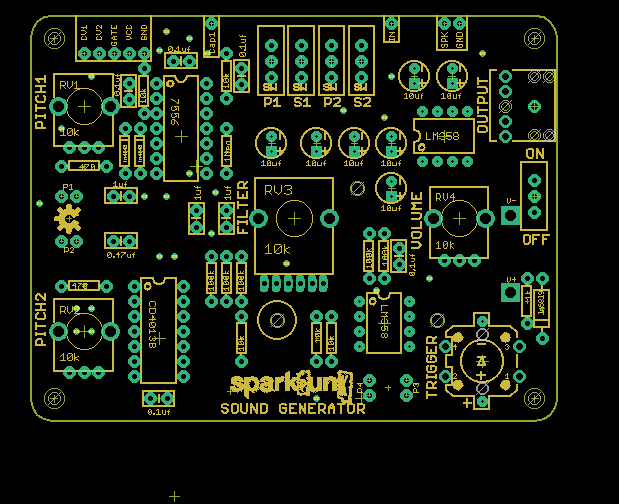](eagleImage.png)
## Interactive BOM

- Interactive BOM page: [ibom.html](https://htmlpreview.github.io/?https://github.com/oomlout/oomlout_OOMP_projects/blob/main/PROJ-SPAR-11177-STAN-01/kicad/bom/ibom.html)

## OOMP Parts
  

|OOMP ID|Name|Identifier|
| :---: | :---: | :---: |
|UNMATCHED-UNMATCHED-X-UNMATCHED-01||BAT1, IC1, IC2, IC3, IC4, J1, RV1, RV2, RV3, RV4, S1, S2, S3, S4, S5, S6|
|CAPX-UNMATCHED-X-NF100-01||C1, C2, C5, C11, C16|
|CAPX-UNMATCHED-X-UF1-01||C3, C12, C13|
|CAPX-UNMATCHED-X-UF47-01||C4|
|CAPX-UNMATCHED-X-UNMATCHED-V25||C6, C7, C8, C9, C10, C14, C15|
|DIOD-UNMATCHED-X-K4148-01||D1, D2|
|DIOD-UNMATCHED-X-UNMATCHED-01||D3|
|HEAD-I01-X-PI01-01||JP1, JP2, JP3, JP4, JP5, JP6, JP7, JP8, JP9, JP10, JP11, JP12, JP13, JP14, JP15, JP16, JP17|
|RESE-UNMATCHED-X-O103-01||R1, R2, R11, R12, R13|
|RESE-UNMATCHED-X-O471-01||R3, R4|
|RESE-UNMATCHED-X-UNMATCHED-01||R5|
|RESE-UNMATCHED-X-O1003-01||R6, R7, R8, R9, R10|
|RESE-UNMATCHED-X-O102-01||R14|

## Images
  
  

|bominteractivefront|bominteractiveback|kicadPcb3d|kicadPcb3dFront|kicadPcb3dBack|eagleImage|eagleSchemImage|pcbdraw|pcbdrawback|
| :---: | :---: | :---: | :---: | :---: | :---: | :---: | :---: | :---: |
|[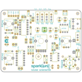](bomFront.png)|[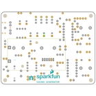](bomBack.png)|[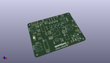](kicadPcb3d.png)|[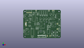](kicadPcb3dFront.png)|[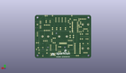](kicadPcb3dBack.png)|[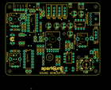](eagleImage.png)|[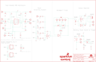](eagleSchemImage.png)|[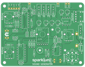](pcbdraw.png)|[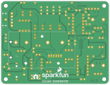](pcbdrawBack.png)|

## Tags

- hexID: PRS11177
- oompType: PROJ
- oompSize: SPAR
- oompColor: 11177
- oompDesc: STAN
- oompIndex: 01
- oompName: Sparkpunk
- sources: All source files from https://github.com/sparkfun/Sparkpunk (source licence details in srcLicense.md)
- linkBuyPage: https://www.sparkfun.com/products/11177
- oompID: PROJ-SPAR-11177-STAN-01
- oompParts: BAT1,UNMATCHED-UNMATCHED-X-UNMATCHED-01
- oompParts: C1,CAPX-UNMATCHED-X-NF100-01
- oompParts: C2,CAPX-UNMATCHED-X-NF100-01
- oompParts: C3,CAPX-UNMATCHED-X-UF1-01
- oompParts: C4,CAPX-UNMATCHED-X-UF47-01
- oompParts: C5,CAPX-UNMATCHED-X-NF100-01
- oompParts: C6,CAPX-UNMATCHED-X-UNMATCHED-V25
- oompParts: C7,CAPX-UNMATCHED-X-UNMATCHED-V25
- oompParts: C8,CAPX-UNMATCHED-X-UNMATCHED-V25
- oompParts: C9,CAPX-UNMATCHED-X-UNMATCHED-V25
- oompParts: C10,CAPX-UNMATCHED-X-UNMATCHED-V25
- oompParts: C11,CAPX-UNMATCHED-X-NF100-01
- oompParts: C12,CAPX-UNMATCHED-X-UF1-01
- oompParts: C13,CAPX-UNMATCHED-X-UF1-01
- oompParts: C14,CAPX-UNMATCHED-X-UNMATCHED-V25
- oompParts: C15,CAPX-UNMATCHED-X-UNMATCHED-V25
- oompParts: C16,CAPX-UNMATCHED-X-NF100-01
- oompParts: D1,DIOD-UNMATCHED-X-K4148-01
- oompParts: D2,DIOD-UNMATCHED-X-K4148-01
- oompParts: D3,DIOD-UNMATCHED-X-UNMATCHED-01
- oompParts: IC1,UNMATCHED-UNMATCHED-X-UNMATCHED-01
- oompParts: IC2,UNMATCHED-UNMATCHED-X-UNMATCHED-01
- oompParts: IC3,UNMATCHED-UNMATCHED-X-UNMATCHED-01
- oompParts: IC4,UNMATCHED-UNMATCHED-X-UNMATCHED-01
- oompParts: J1,UNMATCHED-UNMATCHED-X-UNMATCHED-01
- oompParts: JP1,HEAD-I01-X-PI01-01
- oompParts: JP2,HEAD-I01-X-PI01-01
- oompParts: JP3,HEAD-I01-X-PI01-01
- oompParts: JP4,HEAD-I01-X-PI01-01
- oompParts: JP5,HEAD-I01-X-PI01-01
- oompParts: JP6,HEAD-I01-X-PI01-01
- oompParts: JP7,HEAD-I01-X-PI01-01
- oompParts: JP8,HEAD-I01-X-PI01-01
- oompParts: JP9,HEAD-I01-X-PI01-01
- oompParts: JP10,HEAD-I01-X-PI01-01
- oompParts: JP11,HEAD-I01-X-PI01-01
- oompParts: JP12,HEAD-I01-X-PI01-01
- oompParts: JP13,HEAD-I01-X-PI01-01
- oompParts: JP14,HEAD-I01-X-PI01-01
- oompParts: JP15,HEAD-I01-X-PI01-01
- oompParts: JP16,HEAD-I01-X-PI01-01
- oompParts: JP17,HEAD-I01-X-PI01-01
- oompParts: R1,RESE-UNMATCHED-X-O103-01
- oompParts: R2,RESE-UNMATCHED-X-O103-01
- oompParts: R3,RESE-UNMATCHED-X-O471-01
- oompParts: R4,RESE-UNMATCHED-X-O471-01
- oompParts: R5,RESE-UNMATCHED-X-UNMATCHED-01
- oompParts: R6,RESE-UNMATCHED-X-O1003-01
- oompParts: R7,RESE-UNMATCHED-X-O1003-01
- oompParts: R8,RESE-UNMATCHED-X-O1003-01
- oompParts: R9,RESE-UNMATCHED-X-O1003-01
- oompParts: R10,RESE-UNMATCHED-X-O1003-01
- oompParts: R11,RESE-UNMATCHED-X-O103-01
- oompParts: R12,RESE-UNMATCHED-X-O103-01
- oompParts: R13,RESE-UNMATCHED-X-O103-01
- oompParts: R14,RESE-UNMATCHED-X-O102-01
- oompParts: RV1,UNMATCHED-UNMATCHED-X-UNMATCHED-01
- oompParts: RV2,UNMATCHED-UNMATCHED-X-UNMATCHED-01
- oompParts: RV3,UNMATCHED-UNMATCHED-X-UNMATCHED-01
- oompParts: RV4,UNMATCHED-UNMATCHED-X-UNMATCHED-01
- oompParts: S1,UNMATCHED-UNMATCHED-X-UNMATCHED-01
- oompParts: S2,UNMATCHED-UNMATCHED-X-UNMATCHED-01
- oompParts: S3,UNMATCHED-UNMATCHED-X-UNMATCHED-01
- oompParts: S4,UNMATCHED-UNMATCHED-X-UNMATCHED-01
- oompParts: S5,UNMATCHED-UNMATCHED-X-UNMATCHED-01
- oompParts: S6,UNMATCHED-UNMATCHED-X-UNMATCHED-01
- rawParts: BAT1,9V,BC9VPCKIT_SOLDERMASK,BC9VPC_KIT,9V board-mount battery cradle,,,,,
- rawParts: C1,.1uf,CAPKIT,CAP-PTH-SMALL-KIT,Capacitor,,,CAP-08370,,
- rawParts: C2,.1uf,CAPKIT,CAP-PTH-SMALL-KIT,Capacitor,,,CAP-08370,,
- rawParts: C3,1uf,CAPKIT,CAP-PTH-SMALL-KIT,Capacitor,,,CAP-09184,,
- rawParts: C4,.47uf,CAPKIT,CAP-PTH-SMALL-KIT,Capacitor,,,CAP-09152,,
- rawParts: C5,.1uf,CAPKIT,CAP-PTH-SMALL-KIT,Capacitor,,,CAP-08370,,
- rawParts: C6,10uf/25V,10UF-25V-20%(PTH)KIT,CPOL-RADIAL-10UF-25V-KIT,CAP-08440,,,CAP-08440,,
- rawParts: C7,10uf/25V,10UF-25V-20%(PTH)KIT,CPOL-RADIAL-10UF-25V-KIT,CAP-08440,,,CAP-08440,,
- rawParts: C8,10uf/25V,10UF-25V-20%(PTH)KIT,CPOL-RADIAL-10UF-25V-KIT,CAP-08440,,,CAP-08440,,
- rawParts: C9,10uf/25V,10UF-25V-20%(PTH)KIT,CPOL-RADIAL-10UF-25V-KIT,CAP-08440,,,CAP-08440,,
- rawParts: C10,10uf/25V,10UF-25V-20%(PTH)KIT,CPOL-RADIAL-10UF-25V-KIT,CAP-08440,,,CAP-08440,,
- rawParts: C11,.1uf,CAPKIT,CAP-PTH-SMALL-KIT,Capacitor,,,CAP-08370,,
- rawParts: C12,1uf,CAPKIT,CAP-PTH-SMALL-KIT,Capacitor,,,CAP-09184,,
- rawParts: C13,1uf,CAPKIT,CAP-PTH-SMALL-KIT,Capacitor,,,CAP-9184,,
- rawParts: C14,10uf/25V,10UF-25V-20%(PTH)KIT,CPOL-RADIAL-10UF-25V-KIT,CAP-08440,,,CAP-08440,,
- rawParts: C15,10uf/25V,10UF-25V-20%(PTH)KIT,CPOL-RADIAL-10UF-25V-KIT,CAP-08440,,,CAP-08440,,
- rawParts: C16,.1uf,CAPKIT,CAP-PTH-SMALL-KIT,Capacitor,,,CAP-08370,,
- rawParts: D1,1n4148,DIODEKIT,DIODE-1N4148-KIT,Diode,,,,,
- rawParts: D2,1n4148,DIODEKIT,DIODE-1N4148-KIT,Diode,,,,,
- rawParts: D3,1n5819,DIODE,DIODE-1N4001-KIT,Diode,sparkfun,COM-10926,DIO-11895,,
- rawParts: FRAME1,FRAME-LEDGER,FRAME-LEDGER,CREATIVE_COMMONS,Schematic Frame,,,,,
- rawParts: IC1,7556,556KIT,DIL14-KIT,Dual timer circuit (2 555 timers in one package),,,IC-11898,556,
- rawParts: IC2,CD4013B,CD4013,DIL14-KIT,Dual D-type Flip-Flop,,,IC-11896,CD4013B,
- rawParts: IC3,LM358,LM358KIT,DIP08-KIT,Jellybean op-amp,,,IC-09172,,
- rawParts: IC4,LM358,LM358KIT,DIP08-KIT,Jellybean op-amp,,,IC-09172,,
- rawParts: J1,AUDIO-JACK2KIT,AUDIO-JACK2KIT,AUDIO-JACK-KIT,Stereo audio jack with bypass switches.,,,CONN-08774,,
- rawParts: JP1,CV1,M01SMDNS,1X01NS,Header 1,,,,,
- rawParts: JP2,CV2,M01SMDNS,1X01NS,Header 1,,,,,
- rawParts: JP3,P1,M01SMDNS,1X01NS,Header 1,,,,,
- rawParts: JP4,P1,M01SMDNS,1X01NS,Header 1,,,,,
- rawParts: JP5,P2,M01SMDNS,1X01NS,Header 1,,,,,
- rawParts: JP6,P2,M01SMDNS,1X01NS,Header 1,,,,,
- rawParts: JP7,CAP1,M01SMDNS,1X01NS,Header 1,,,,,
- rawParts: JP8,GATE,M01SMDNS,1X01NS,Header 1,,,,,
- rawParts: JP9,IN,M01SMDNS,1X01NS,Header 1,,,,,
- rawParts: JP10,P3,M01SMDNS,1X01NS,Header 1,,,,,
- rawParts: JP11,P3,M01SMDNS,1X01NS,Header 1,,,,,
- rawParts: JP12,P4,M01SMDNS,1X01NS,Header 1,,,,,
- rawParts: JP13,P4,M01SMDNS,1X01NS,Header 1,,,,,
- rawParts: JP14,SPK,M01SMDNS,1X01NS,Header 1,,,,,
- rawParts: JP15,GND,M01SMDNS,1X01NS,Header 1,,,,,
- rawParts: JP16,VCC,M01SMDNS,1X01NS,Header 1,,,,,
- rawParts: JP17,GND,M01SMDNS,1X01NS,Header 1,,,,,
- rawParts: LOGO1,SFE_LOGO_NAME_FLAME.2_INCH,SFE_LOGO_NAME_FLAME.2_INCH,SFE_LOGO_NAME_FLAME_.2,SFE Logo, name and flame,,,,,
- rawParts: LOGO2,SPARKPUNK_LOGO.1INCH_TALL,SPARKPUNK_LOGO.1INCH_TALL,SPARKPUNK_LOGO_.1,,,,,,
- rawParts: LOGO3,OSHW-LOGOM,OSHW-LOGOM,OSHW-LOGO-M,Open Source Hardware Logo This logo indicates the piece of hardware it is found on incorporates a OSHW license and/or adheres to the definition of open source hardware found here: http://freedomdefined.org/OSHW,,,,,
- rawParts: LOGO4,OSHW-LOGOM,OSHW-LOGOM,OSHW-LOGO-M,Open Source Hardware Logo This logo indicates the piece of hardware it is found on incorporates a OSHW license and/or adheres to the definition of open source hardware found here: http://freedomdefined.org/OSHW,,,,,
- rawParts: R1,10k,RESISTOREZ,AXIAL-0.3EZ,Resistor,,,RES-09435,,
- rawParts: R2,10k,RESISTOREZ,AXIAL-0.3EZ,Resistor,,,RES-09435,,
- rawParts: R3,470,RESISTOREZ,AXIAL-0.3EZ,Resistor,,,RES-10693,,
- rawParts: R4,470,RESISTOREZ,AXIAL-0.3EZ,Resistor,,,RES-10693,,
- rawParts: R5,1Meg,RESISTOREZ,AXIAL-0.3EZ,Resistor,,,RES-09329,,
- rawParts: R6,100k,RESISTOREZ,AXIAL-0.3EZ,Resistor,,,RES-10686,,
- rawParts: R7,100k,RESISTOREZ,AXIAL-0.3EZ,Resistor,,,RES-10686,,
- rawParts: R8,100k,RESISTOREZ,AXIAL-0.3EZ,Resistor,,,RES-10686,,
- rawParts: R9,100k,RESISTOREZ,AXIAL-0.3EZ,Resistor,,,RES-10686,,
- rawParts: R10,100k,RESISTOREZ,AXIAL-0.3EZ,Resistor,,,RES-10686,,
- rawParts: R11,10k,RESISTOREZ,AXIAL-0.3EZ,Resistor,,,RES-09435,,
- rawParts: R12,10k,RESISTOREZ,AXIAL-0.3EZ,Resistor,,,RES-09435,,
- rawParts: R13,10k,RESISTOREZ,AXIAL-0.3EZ,Resistor,,,RES-09435,,
- rawParts: R14,1k,RESISTOREZ,AXIAL-0.3EZ,Resistor,,,RES-08380,,
- rawParts: RV1,10k,POTALPS-KIT,ALPS_POT_KIT,,,,RES-09177,,
- rawParts: RV2,10k,POTALPS-KIT,ALPS_POT_KIT,,,,RES-09177,,
- rawParts: RV3,10k,POT_DUAL,POT_PANASONIC_DUAL_VERT_KIT,,digikey, P2A5103-ND,RES-11897,,
- rawParts: RV4,10k,POTALPS-KIT,ALPS_POT_KIT,,,,RES-09177,,
- rawParts: S1,SPDT,SWITCH-SPDTKIT,SWITCH-SPDT_KIT,SPDT Switch,,,SWCH-08261,,
- rawParts: S2,SPDT,SWITCH-SPDTKIT,SWITCH-SPDT_KIT,SPDT Switch,,,SWCH-08261,,
- rawParts: S3,SPDT,SWITCH-SPDTKIT,SWITCH-SPDT_KIT,SPDT Switch,,,SWCH-08261,,
- rawParts: S4,SPDT,SWITCH-SPDTKIT,SWITCH-SPDT_KIT,SPDT Switch,,,SWCH-08261,,
- rawParts: S5,SWITCH-MOMENTARY-LEDEZ,SWITCH-MOMENTARY-LEDEZ,TACTILE-PTH-LED-12MM-EZ,EZ is for Kits. There is no tStop (covering up the top side of the pads with mask). This helps the beginner see which side they should be soldering too.,,,SWCH-11758,,
- rawParts: S6,SPDT,SWITCH-SPDTKIT,SWITCH-SPDT_KIT,SPDT Switch,,,SWCH-08261,,
- rawParts: STANDOFF1,STAND-OFF,STAND-OFF,STAND-OFF,#4 Stand Off,,,,,
- rawParts: STANDOFF2,STAND-OFF,STAND-OFF,STAND-OFF,#4 Stand Off,,,,,
- rawParts: STANDOFF3,STAND-OFF,STAND-OFF,STAND-OFF,#4 Stand Off,,,,,
- rawParts: STANDOFF4,STAND-OFF,STAND-OFF,STAND-OFF,#4 Stand Off,,,,,

[im]: kicadPcb3d_450.png
