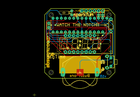
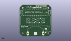
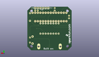
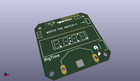

Contents
========

* [PROJ-SPAR-11178-STAN-01>BigTime](#proj-spar-11178-stan-01bigtime)
	* [Images](#images)
	* [Interactive BOM](#interactive-bom)
	* [OOMP Parts](#oomp-parts)
	* [Tags](#tags)
  
![][im]
# PROJ-SPAR-11178-STAN-01>BigTime

- ID: PROJ-SPAR-11178-STAN-01
- Hex ID: PRS11178
- Name: BigTime
- Description: 

## Images
  
  

|eagleImage|kicadPcb3dFront|kicadPcb3dBack|kicadPcb3d|
| :---: | :---: | :---: | :---: |
|||||

## Interactive BOM

- Interactive BOM page: [ibom.html](kicad/bom/ibom.html)

## OOMP Parts
  

|OOMP Parts|
| :---: |
|UNMATCHED-UNMATCHED-X-UNMATCHED-01, BAT, 21.59, 3.8099999999999996, 180,BAT, BATTERY_20MM_PTH_COMPACT, SparkFun-Electromechanical, (0.85, 0.15), R180|
|CAPE-UNMATCHED-X-UNMATCHED-01, C1, 33.019999999999996, 39.37, 0,C1, 100nF, CAP-PTH-SMALLEZ, SparkFun-Passives, (1.3, 1.55), R0|
|CAPE-UNMATCHED-X-UNMATCHED-01, C2, 2.54, 31.75, 90,C2, 100nF, CAP-PTH-SMALLEZ, SparkFun-Passives, (0.1, 1.25), R90|
|UNMATCHED-UNMATCHED-X-UNMATCHED-01, JP1, 35.559999999999995, 41.91, M0,JP1, FTDI_BASICPTH, FTDI_BASIC, SparkFun, (1.4, 1.65), MR0|
|UNMATCHED-UNMATCHED-X-UNMATCHED-01, LED1, 21.59, 21.59, 0,LED1, 7-SEGMENT-4DIGIT-YOUNGSUNKIT, 7-SEGMENT-4DIGIT-YOUNGSUN-KIT, Testing, (0.85, 0.85), R0|
|RESE-UNMATCHED-X-O104-01, R1, 40.64, 33.019999999999996, 270,R1, 100k, AXIAL-0.3-KIT, SparkFun-Passives, (1.6, 1.3), R270|
|UNMATCHED-UNMATCHED-X-UNMATCHED-01, S1, 40.64, 10.16, 90,S1, BUTTON, TACTILE-PTH-SIDEEZ, SparkFun-Electromechanical, (1.6, 0.4), R90|
|UNMATCHED-UNMATCHED-X-UNMATCHED-01, U1, 21.59, 33.019999999999996, 180,U1, ATMEGA328P_PDIP_EZ, DIL28-EZ, SparkFun-DigitalIC, (0.85, 1.3), R180|
|UNMATCHED-UNMATCHED-X-UNMATCHED-01, Y1, 16.509999999999998, 40.64, 90,Y1, 32.768kHz, TC26HEZ, SparkFun-FreqCtrl, (0.65, 1.6), R90|

## Tags

- hexID: PRS11178
- oompType: PROJ
- oompSize: SPAR
- oompColor: 11178
- oompDesc: STAN
- oompIndex: 01
- oompName: BigTime
- sources: All source files from https://github.com/sparkfun/BigTime (source licence details in srcLicense.md)
- linkBuyPage: https://www.sparkfun.com/products/11178
- oompPart: UNMATCHED-UNMATCHED-X-UNMATCHED-01, BAT, 21.59, 3.8099999999999996, 180
- oompPart: CAPE-UNMATCHED-X-UNMATCHED-01, C1, 33.019999999999996, 39.37, 0
- oompPart: CAPE-UNMATCHED-X-UNMATCHED-01, C2, 2.54, 31.75, 90
- oompPart: UNMATCHED-UNMATCHED-X-UNMATCHED-01, JP1, 35.559999999999995, 41.91, M0
- oompPart: UNMATCHED-UNMATCHED-X-UNMATCHED-01, LED1, 21.59, 21.59, 0
- oompPart: RESE-UNMATCHED-X-O104-01, R1, 40.64, 33.019999999999996, 270
- oompPart: UNMATCHED-UNMATCHED-X-UNMATCHED-01, S1, 40.64, 10.16, 90
- oompPart: UNMATCHED-UNMATCHED-X-UNMATCHED-01, U1, 21.59, 33.019999999999996, 180
- oompPart: UNMATCHED-UNMATCHED-X-UNMATCHED-01, Y1, 16.509999999999998, 40.64, 90
- rawPart: BAT, BATTERY_20MM_PTH_COMPACT, SparkFun-Electromechanical, (0.85, 0.15), R180
- rawPart: C1, 100nF, CAP-PTH-SMALLEZ, SparkFun-Passives, (1.3, 1.55), R0
- rawPart: C2, 100nF, CAP-PTH-SMALLEZ, SparkFun-Passives, (0.1, 1.25), R90
- rawPart: JP1, FTDI_BASICPTH, FTDI_BASIC, SparkFun, (1.4, 1.65), MR0
- rawPart: LED1, 7-SEGMENT-4DIGIT-YOUNGSUNKIT, 7-SEGMENT-4DIGIT-YOUNGSUN-KIT, Testing, (0.85, 0.85), R0
- rawPart: R1, 100k, AXIAL-0.3-KIT, SparkFun-Passives, (1.6, 1.3), R270
- rawPart: S1, BUTTON, TACTILE-PTH-SIDEEZ, SparkFun-Electromechanical, (1.6, 0.4), R90
- rawPart: U1, ATMEGA328P_PDIP_EZ, DIL28-EZ, SparkFun-DigitalIC, (0.85, 1.3), R180
- rawPart: Y1, 32.768kHz, TC26HEZ, SparkFun-FreqCtrl, (0.65, 1.6), R90

[im]: kicadPcb3d_450.png
