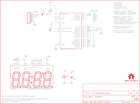

Contents
========

* [PRS11178 > BigTime](#prs11178--bigtime)
	* [Schematic](#schematic)
	* [PCB](#pcb)
	* [Interactive BOM](#interactive-bom)
	* [OOMP Parts](#oomp-parts)
	* [Images](#images)
	* [Tags](#tags)
  
![][im]
# PRS11178 > BigTime

- ID: PROJ-SPAR-11178-STAN-01
- Hex ID: PRS11178
- Name: Sparkfun
- Description: Sparkfun
- Long Link: [http://oom.lt/PROJ-SPAR-11178-STAN-01](http://oom.lt/PROJ-SPAR-11178-STAN-01)
- Short Link: [http://oom.lt/PRS11178](http://oom.lt/PRS11178)

## Schematic
  

## PCB
  

## Interactive BOM

- Interactive BOM page: [ibom.html](https://htmlpreview.github.io/?https://github.com/oomlout/oomlout_OOMP_projects/blob/main/PROJ-SPAR-11178-STAN-01/kicad/bom/ibom.html)

## OOMP Parts
  

|OOMP Parts|
| :---: |
|UNMATCHED-UNMATCHED-X-UNMATCHED-01 BAT, JP1, S1, U1, Y1|
|CAPX-UNMATCHED-X-NF100-01 C1, C2|
|LEDS-UNMATCHED-G-STAN-01 LED1|
|RESE-UNMATCHED-X-O1003-01 R1|

## Images
  
  

|bominteractivefront|bominteractiveback|kicadPcb3d|kicadPcb3dFront|kicadPcb3dBack|eagleImage|eagleSchemImage|
| :---: | :---: | :---: | :---: | :---: | :---: | :---: |
||||||||

## Tags

- hexID: PRS11178
- oompType: PROJ
- oompSize: SPAR
- oompColor: 11178
- oompDesc: STAN
- oompIndex: 01
- oompName: BigTime
- sources: All source files from https://github.com/sparkfun/BigTime (source licence details in srcLicense.md)
- linkBuyPage: https://www.sparkfun.com/products/11178
- oompID: PROJ-SPAR-11178-STAN-01
- oompParts: BAT,UNMATCHED-UNMATCHED-X-UNMATCHED-01
- oompParts: C1,CAPX-UNMATCHED-X-NF100-01
- oompParts: C2,CAPX-UNMATCHED-X-NF100-01
- oompParts: JP1,UNMATCHED-UNMATCHED-X-UNMATCHED-01
- oompParts: LED1,LEDS-UNMATCHED-G-STAN-01
- oompParts: R1,RESE-UNMATCHED-X-O1003-01
- oompParts: S1,UNMATCHED-UNMATCHED-X-UNMATCHED-01
- oompParts: U1,UNMATCHED-UNMATCHED-X-UNMATCHED-01
- oompParts: Y1,UNMATCHED-UNMATCHED-X-UNMATCHED-01
- rawParts: BAT,,BATTERYFOB,BATTERY_20MM_PTH_COMPACT,Battery Holders,,
- rawParts: C1,100nF,CAPEZ,CAP-PTH-SMALLEZ,Capacitor,,
- rawParts: C2,100nF,CAPEZ,CAP-PTH-SMALLEZ,Capacitor,,
- rawParts: JP1,FTDI_BASICPTH,FTDI_BASICPTH,FTDI_BASIC,FTDI Basic: 3.3V and 5V,,
- rawParts: LED1,7-SEGMENT-4DIGIT-YOUNGSUNKIT,7-SEGMENT-4DIGIT-YOUNGSUNKIT,7-SEGMENT-4DIGIT-YOUNGSUN-KIT,This is a part for the 4-Digit 7-segment LEDs from Young Sun.  Different from the Digikey LEDs, all 16 pins are used.,,
- rawParts: R1,100k,RESISTORKIT,AXIAL-0.3-KIT,Resistor,,
- rawParts: S1,BUTTON,SWITCH-MOMENTARY-2SIDE_EZ,TACTILE-PTH-SIDEEZ,Various NO switches- pushbuttons, reed, etc,,
- rawParts: U$1,LOGO-SFESK,LOGO-SFESK,SFE-LOGO-FLAME,Spark Fun Electronics PCB Logo,,
- rawParts: U$2,CREATIVE_COMMONS,CREATIVE_COMMONS,CREATIVE_COMMONS,,,
- rawParts: U$4,OSHW-LOGOS,OSHW-LOGOS,OSHW-LOGO-S,Open Source Hardware Logo This logo indicates the piece of hardware it is found on incorporates a OSHW license and/or adheres to the definition of open source hardware found here: http://freedomdefined.org/OSHW,,
- rawParts: U$5,LOGO-SFENW2,LOGO-SFENW2,SFE-NEW-WEB,Spark Fun Electronics PCB Logo,,
- rawParts: U1,ATMEGA328P_PDIP_EZ,ATMEGA328P_PDIP_EZ,DIL28-EZ,uC used in the Arduino,,
- rawParts: Y1,32.768kHz,CRYSTALTC26H_EZ,TC26HEZ,Various standard crystals. Proven footprints. Spark Fun Electronics SKU : COM-00534,,

[im]: kicadPcb3d_450.png
