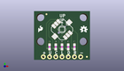
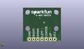
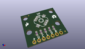

Contents
========

* [PROJ-SPAR-11187-STAN-01>5-Way Tactile Switch Breakout](#proj-spar-11187-stan-015-way-tactile-switch-breakout)
	* [Images](#images)
	* [Interactive BOM](#interactive-bom)
	* [OOMP Parts](#oomp-parts)
	* [Tags](#tags)
  
![][im]
# PROJ-SPAR-11187-STAN-01>5-Way Tactile Switch Breakout

- ID: PROJ-SPAR-11187-STAN-01
- Hex ID: PRS11187
- Name: 5-Way Tactile Switch Breakout
- Description: 

## Images
  
  

|eagleImage|kicadPcb3dFront|kicadPcb3dBack|kicadPcb3d|
| :---: | :---: | :---: | :---: |
|||||

## Interactive BOM

- Interactive BOM page: [ibom.html](kicad/bom/ibom.html)

## OOMP Parts
  

|OOMP Parts|
| :---: |
|<table><tr><td></td><td> JP1</td><td>[HEAD-I01-X-PI07-01 2.54 mm 7 Pin Header](https://github.com/oomlout/oomlout_OOMP_parts/tree/main/HEAD-I01-X-PI07-01/)</td><td>[H07](https://github.com/oomlout/oomlout_OOMP_parts/tree/main/HEAD-I01-X-PI07-01/)</td></tr></table>|
|<table><tr><td></td><td> R1</td><td>[RESE-0603-X-O103-01 SMD (0603) 10k Ohm Resistor](https://github.com/oomlout/oomlout_OOMP_parts/tree/main/RESE-0603-X-O103-01/)</td><td>[R6103](https://github.com/oomlout/oomlout_OOMP_parts/tree/main/RESE-0603-X-O103-01/)</td></tr></table>|
|<table><tr><td></td><td> R2</td><td>[RESE-0603-X-O103-01 SMD (0603) 10k Ohm Resistor](https://github.com/oomlout/oomlout_OOMP_parts/tree/main/RESE-0603-X-O103-01/)</td><td>[R6103](https://github.com/oomlout/oomlout_OOMP_parts/tree/main/RESE-0603-X-O103-01/)</td></tr></table>|
|<table><tr><td></td><td> R3</td><td>[RESE-0603-X-O103-01 SMD (0603) 10k Ohm Resistor](https://github.com/oomlout/oomlout_OOMP_parts/tree/main/RESE-0603-X-O103-01/)</td><td>[R6103](https://github.com/oomlout/oomlout_OOMP_parts/tree/main/RESE-0603-X-O103-01/)</td></tr></table>|
|<table><tr><td></td><td> R4</td><td>[RESE-0603-X-O103-01 SMD (0603) 10k Ohm Resistor](https://github.com/oomlout/oomlout_OOMP_parts/tree/main/RESE-0603-X-O103-01/)</td><td>[R6103](https://github.com/oomlout/oomlout_OOMP_parts/tree/main/RESE-0603-X-O103-01/)</td></tr></table>|
|<table><tr><td></td><td> R5</td><td>[RESE-0603-X-O103-01 SMD (0603) 10k Ohm Resistor](https://github.com/oomlout/oomlout_OOMP_parts/tree/main/RESE-0603-X-O103-01/)</td><td>[R6103](https://github.com/oomlout/oomlout_OOMP_parts/tree/main/RESE-0603-X-O103-01/)</td></tr></table>|
|UNMATCHED-UNMATCHED-X-UNMATCHED-01, S1, 11.43, 12.7, S315,S1, 5-WAY-TACTILE-SWITCH, JOYSTICK_MINI, SparkFun-Electromechanical, (0.45, 0.5), SR315|

## Tags

- hexID: PRS11187
- oompType: PROJ
- oompSize: SPAR
- oompColor: 11187
- oompDesc: STAN
- oompIndex: 01
- oompName: 5-Way Tactile Switch Breakout
- sources: All source files from https://github.com/sparkfun/5-Way_Tactile_Switch_Breakout (source licence details in srcLicense.md)
- linkBuyPage: https://www.sparkfun.com/products/11187
- oompPart: HEAD-I01-X-PI07-01, JP1, 3.8099999999999996, 1.27, M180
- oompPart: SKIP-UNMATCHED-X-UNMATCHED-01, JP2, 21.59, 1.27, 0
- oompPart: SKIP-UNMATCHED-X-UNMATCHED-01, JP7, 5.08, 19.049999999999997, 0
- oompPart: RESE-0603-X-O103-01, R1, 6.35, 5.3975, 90
- oompPart: RESE-0603-X-O103-01, R2, 8.889999999999999, 5.3975, 90
- oompPart: RESE-0603-X-O103-01, R3, 11.43, 5.3975, 90
- oompPart: RESE-0603-X-O103-01, R4, 13.97, 5.3975, 90
- oompPart: RESE-0603-X-O103-01, R5, 16.509999999999998, 5.3975, 90
- oompPart: UNMATCHED-UNMATCHED-X-UNMATCHED-01, S1, 11.43, 12.7, S315
- rawPart: JP1, 1X07, SparkFun, (0.15, 0.05), MR180
- rawPart: JP2, FIDUCIALUFIDUCIAL, MICRO-FIDUCIAL, SparkFun, (0.85, 0.05), R0
- rawPart: JP7, FIDUCIALUFIDUCIAL, MICRO-FIDUCIAL, SparkFun, (0.2, 0.75), R0
- rawPart: R1, 10K, 0603-RES, SparkFun, (0.25, 0.2125), R90
- rawPart: R2, 10K, 0603-RES, SparkFun, (0.35, 0.2125), R90
- rawPart: R3, 10K, 0603-RES, SparkFun, (0.45, 0.2125), R90
- rawPart: R4, 10K, 0603-RES, SparkFun, (0.55, 0.2125), R90
- rawPart: R5, 10K, 0603-RES, SparkFun, (0.65, 0.2125), R90
- rawPart: S1, 5-WAY-TACTILE-SWITCH, JOYSTICK_MINI, SparkFun-Electromechanical, (0.45, 0.5), SR315
- oompID: PROJ-SPAR-11187-STAN-01

[im]: kicadPcb3d_450.png
