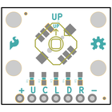
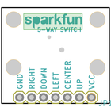
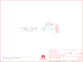

Contents
========

* [PRS11187 > 5-Way Tactile Switch Breakout](#prs11187--5-way-tactile-switch-breakout)
	* [Schematic](#schematic)
	* [PCB](#pcb)
	* [Interactive BOM](#interactive-bom)
	* [OOMP Parts](#oomp-parts)
	* [Images](#images)
	* [Tags](#tags)
  
![][im]
# PRS11187 > 5-Way Tactile Switch Breakout

- ID: PROJ-SPAR-11187-STAN-01
- Hex ID: PRS11187
- Name: Sparkfun
- Description: Sparkfun
- Long Link: [http://oom.lt/PROJ-SPAR-11187-STAN-01](http://oom.lt/PROJ-SPAR-11187-STAN-01)
- Short Link: [http://oom.lt/PRS11187](http://oom.lt/PRS11187)

## Schematic
  

## PCB
  

## Interactive BOM

- Interactive BOM page: [ibom.html](https://htmlpreview.github.io/?https://github.com/oomlout/oomlout_OOMP_projects/blob/main/PROJ-SPAR-11187-STAN-01/kicad/bom/ibom.html)

## OOMP Parts
  

|OOMP Parts|
| :---: |
|[HEAD-I01-X-PI07-01  2.54 mm 7 Pin Header  JP1](https://github.com/oomlout/oomlout_OOMP_parts/tree/main/HEAD-I01-X-PI07-01/)|
|[RESE-0603-X-O103-01  SMD (0603) 10k Ohm Resistor  R1, R2, R3, R4, R5](https://github.com/oomlout/oomlout_OOMP_parts/tree/main/RESE-0603-X-O103-01/)|
|UNMATCHED-UNMATCHED-X-UNMATCHED-01 S1|

## Images
  
  

|bominteractivefront|bominteractiveback|kicadPcb3d|kicadPcb3dFront|kicadPcb3dBack|eagleImage|eagleSchemImage|
| :---: | :---: | :---: | :---: | :---: | :---: | :---: |
||||||||

## Tags

- hexID: PRS11187
- oompType: PROJ
- oompSize: SPAR
- oompColor: 11187
- oompDesc: STAN
- oompIndex: 01
- oompName: 5-Way Tactile Switch Breakout
- sources: All source files from https://github.com/sparkfun/5-Way_Tactile_Switch_Breakout (source licence details in srcLicense.md)
- linkBuyPage: https://www.sparkfun.com/products/11187
- oompID: PROJ-SPAR-11187-STAN-01
- oompParts: JP1,HEAD-I01-X-PI07-01
- oompParts: R1,RESE-0603-X-O103-01
- oompParts: R2,RESE-0603-X-O103-01
- oompParts: R3,RESE-0603-X-O103-01
- oompParts: R4,RESE-0603-X-O103-01
- oompParts: R5,RESE-0603-X-O103-01
- oompParts: S1,UNMATCHED-UNMATCHED-X-UNMATCHED-01
- rawParts: JP1,,M07,1X07,Header 7,,
- rawParts: JP2,FIDUCIALUFIDUCIAL,FIDUCIALUFIDUCIAL,MICRO-FIDUCIAL,Fiducial Alignment Points,,
- rawParts: JP3,STAND-OFF,STAND-OFF,STAND-OFF,Stand Off,,
- rawParts: JP4,STAND-OFF,STAND-OFF,STAND-OFF,Stand Off,,
- rawParts: JP5,STAND-OFF,STAND-OFF,STAND-OFF,Stand Off,,
- rawParts: JP6,STAND-OFF,STAND-OFF,STAND-OFF,Stand Off,,
- rawParts: JP7,FIDUCIALUFIDUCIAL,FIDUCIALUFIDUCIAL,MICRO-FIDUCIAL,Fiducial Alignment Points,,
- rawParts: JP9,LOGO-SFESK,LOGO-SFESK,SFE-LOGO-FLAME,Spark Fun Electronics PCB Logo,,
- rawParts: JP10,LOGO-SFENW2,LOGO-SFENW2,SFE-NEW-WEB,Spark Fun Electronics PCB Logo,,
- rawParts: R1,10K,RESISTOR0603-RES,0603-RES,Resistor,,
- rawParts: R2,10K,RESISTOR0603-RES,0603-RES,Resistor,,
- rawParts: R3,10K,RESISTOR0603-RES,0603-RES,Resistor,,
- rawParts: R4,10K,RESISTOR0603-RES,0603-RES,Resistor,,
- rawParts: R5,10K,RESISTOR0603-RES,0603-RES,Resistor,,
- rawParts: S1,5-WAY-TACTILE-SWITCH,JOYSTICK_MINI,JOYSTICK_MINI,Small 5-way tactile joystick, COM-10063,,
- rawParts: U$1,OSHW-LOGOS,OSHW-LOGOS,OSHW-LOGO-S,Open Source Hardware Logo This logo indicates the piece of hardware it is found on incorporates a OSHW license and/or adheres to the definition of open source hardware found here: http://freedomdefined.org/OSHW,,
- rawParts: U$2,CREATIVE_COMMONS,CREATIVE_COMMONS,CREATIVE_COMMONS,,,

[im]: kicadPcb3d_450.png
