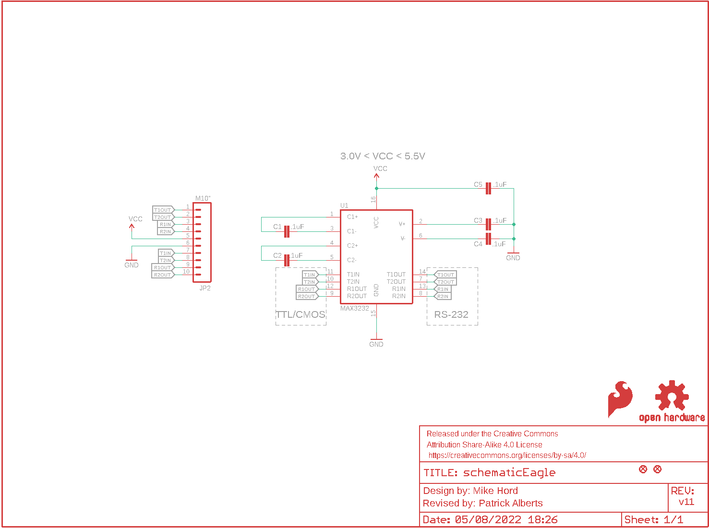
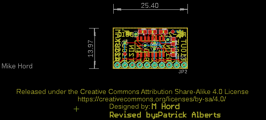
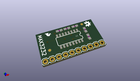
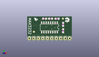
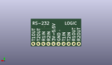
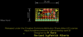
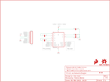

Contents
========

* [PRS11189 > MAX3232 Breakout](#prs11189--max3232-breakout)
	* [Schematic](#schematic)
	* [PCB](#pcb)
	* [Interactive BOM](#interactive-bom)
	* [OOMP Parts](#oomp-parts)
	* [Images](#images)
	* [Tags](#tags)
  
![][im]
# PRS11189 > MAX3232 Breakout

- ID: PROJ-SPAR-11189-STAN-01
- Hex ID: PRS11189
- Name: Sparkfun
- Description: Sparkfun
- Long Link: [http://oom.lt/PROJ-SPAR-11189-STAN-01](http://oom.lt/PROJ-SPAR-11189-STAN-01)
- Short Link: [http://oom.lt/PRS11189](http://oom.lt/PRS11189)

## Schematic
  

## PCB
  

## Interactive BOM

- Interactive BOM page: [ibom.html](https://htmlpreview.github.io/?https://github.com/oomlout/oomlout_OOMP_projects/blob/main/PROJ-SPAR-11189-STAN-01/kicad/bom/ibom.html)

## OOMP Parts
  

|OOMP Parts|
| :---: |
|[CAPC-0603-X-NF100-V50  SMD (0603) 100 nF Capacitor (Ceramic) 50v  C1, C2, C3, C4, C5](https://github.com/oomlout/oomlout_OOMP_parts/tree/main/CAPC-0603-X-NF100-V50/)|
|UNMATCHED-UNMATCHED-X-UNMATCHED-01 FRAME1, U1|
|[HEAD-I01-X-PI10-01  2.54 mm 10 Pin Header  JP2](https://github.com/oomlout/oomlout_OOMP_parts/tree/main/HEAD-I01-X-PI10-01/)|

## Images
  
  

|kicadPcb3d|kicadPcb3dFront|kicadPcb3dBack|eagleImage|eagleSchemImage|
| :---: | :---: | :---: | :---: | :---: |
||||||

## Tags

- hexID: PRS11189
- oompType: PROJ
- oompSize: SPAR
- oompColor: 11189
- oompDesc: STAN
- oompIndex: 01
- oompName: MAX3232 Breakout
- sources: All source files from https://github.com/sparkfun/MAX3232_Breakout (source licence details in srcLicense.md)
- linkBuyPage: https://www.sparkfun.com/products/11189
- oompID: PROJ-SPAR-11189-STAN-01
- oompParts: C1,CAPC-0603-X-NF100-V50
- oompParts: C2,CAPC-0603-X-NF100-V50
- oompParts: C3,CAPC-0603-X-NF100-V50
- oompParts: C4,CAPC-0603-X-NF100-V50
- oompParts: C5,CAPC-0603-X-NF100-V50
- oompParts: FRAME1,UNMATCHED-UNMATCHED-X-UNMATCHED-01
- oompParts: JP2,HEAD-I01-X-PI10-01
- oompParts: U1,UNMATCHED-UNMATCHED-X-UNMATCHED-01
- rawParts: C1,.1uF,0.1UF-25V(+80/-20%)(0603),0603-CAP,CAP-00810,,,CAP-00810,918,0.1uF,,
- rawParts: C2,.1uF,0.1UF-25V(+80/-20%)(0603),0603-CAP,CAP-00810,,,CAP-00810,918,0.1uF,,
- rawParts: C3,.1uF,0.1UF-25V(+80/-20%)(0603),0603-CAP,CAP-00810,,,CAP-00810,918,0.1uF,,
- rawParts: C4,.1uF,0.1UF-25V(+80/-20%)(0603),0603-CAP,CAP-00810,,,CAP-00810,918,0.1uF,,
- rawParts: C5,.1uF,0.1UF-25V(+80/-20%)(0603),0603-CAP,CAP-00810,,,CAP-00810,918,0.1uF,,
- rawParts: FID1,FIDUCIAL1X2,FIDUCIAL1X2,FIDUCIAL-1X2,Fiducial Alignment Points,,,,,,,
- rawParts: FID2,FIDUCIAL1X2,FIDUCIAL1X2,FIDUCIAL-1X2,Fiducial Alignment Points,,,,,,,
- rawParts: FRAME1,,FRAME-LETTER,CREATIVE_COMMONS,Schematic Frame,NAME,1,,,,v01,
- rawParts: JP2,M10,M10,1X10,Header 10,,1,,,,,
- rawParts: LOGO1,SFE_LOGO_FLAME.1_INCH,SFE_LOGO_FLAME.1_INCH,SFE_LOGO_FLAME_.1,SFE Logo, flame only,,,,,,,
- rawParts: U$1,OSHW-LOGOS,OSHW-LOGOS,OSHW-LOGO-S,Open Source Hardware Logo This logo indicates the piece of hardware it is found on incorporates a OSHW license and/or adheres to the definition of open source hardware found here: http://freedomdefined.org/OSHW,,1,,,,,
- rawParts: U1,MAX3232,MAX232SOIC16,SO016,RS232 Transceiver,,,IC-08171,,,,

[im]: kicadPcb3d_450.png
