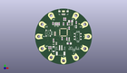
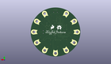
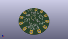

Contents
========

* [PROJ-SPAR-11190-STAN-01>LilyPad Arduino USB](#proj-spar-11190-stan-01lilypad-arduino-usb)
	* [Images](#images)
	* [Interactive BOM](#interactive-bom)
	* [OOMP Parts](#oomp-parts)
	* [Tags](#tags)
  
![][im]
# PROJ-SPAR-11190-STAN-01>LilyPad Arduino USB

- ID: PROJ-SPAR-11190-STAN-01
- Hex ID: PRS11190
- Name: LilyPad Arduino USB
- Description: 

## Images
  
  

|eagleImage|kicadPcb3dFront|kicadPcb3dBack|kicadPcb3d|
| :---: | :---: | :---: | :---: |
|||||

## Interactive BOM

- Interactive BOM page: [ibom.html](kicad/bom/ibom.html)

## OOMP Parts
  

|OOMP Parts|
| :---: |
|UNMATCHED-UNMATCHED-X-UNMATCHED-01, +, 0.0, -21.999993846, 90,+, SEWTAP9, PETAL-LONG-1-2SIDE, LilyPad-Wearables, (0, -0.86614149), R90|
|UNMATCHED-UNMATCHED-X-UNMATCHED-01, -, -11.000000098, -18.999996797999998, 60,-, SEWTAP9, PETAL-LONG-1-2SIDE, LilyPad-Wearables, (-0.43307087, -0.74803137), R60|
|UNMATCHED-UNMATCHED-X-UNMATCHED-01, A2, -11.000000098, 18.999996797999998, 300,A2, SEWTAP9, PETAL-LONG-1-2SIDE, LilyPad-Wearables, (-0.43307087, 0.74803137), R300|
|UNMATCHED-UNMATCHED-X-UNMATCHED-01, A3, -18.999996797999998, 11.000000098, 330,A3, SEWTAP9, PETAL-LONG-1-2SIDE, LilyPad-Wearables, (-0.74803137, 0.43307087), R330|
|UNMATCHED-UNMATCHED-X-UNMATCHED-01, A4, -21.999993846, 0.0, 0,A4, SEWTAP9, PETAL-LONG-1-2SIDE, LilyPad-Wearables, (-0.86614149, 0), R0|
|UNMATCHED-UNMATCHED-X-UNMATCHED-01, A5, -18.999996797999998, -11.000000098, 30,A5, SEWTAP9, PETAL-LONG-1-2SIDE, LilyPad-Wearables, (-0.74803137, -0.43307087), R30|
|CAPE-0603-X-UNMATCHED-01, C1, -8.889996951999999, -3.301996952, 90,C1, 470pF, 0603-CAP, SparkFun-Passives, (-0.34999988, -0.12999988), R90|
|CAPC-0603-X-UNMATCHED-01, C2, -1.2699969519999998, -1.904996952, 90,C2, .1uF, 0603-CAP, SparkFun-Passives, (-0.04999988, -0.07499988), R90|
|CAPC-0603-X-UNMATCHED-01, C3, 5.079996951999999, 7.619996951999999, 90,C3, .1uF, 0603-CAP, SparkFun-Passives, (0.19999988, 0.29999988), R90|
|CAPC-0603-X-UNMATCHED-01, C4, -12.953996951999999, -10.159996951999998, 90,C4, .1uF, 0603-CAP, SparkFun-Passives, (-0.50999988, -0.39999988), R90|
|CAPC-0603-X-UNMATCHED-01, C5, 0.0, 11.429993649999998, 270,C5, 1uF, 0603-CAP, SparkFun-Passives, (0, 0.44999975), R270|
|CAPC-0603-X-UNMATCHED-01, C6, -11.429996952, -10.159996951999998, 90,C6, 4.7uF, 0603-CAP, SparkFun-Passives, (-0.44999988, -0.39999988), R90|
|CAPC-UNMATCHED-X-UNMATCHED-01, C7, 6.35, 13.969996951999999, 180,C7, 4.7uF, 1206, SparkFun-Passives, (0.25, 0.54999988), R180|
|CAPC-UNMATCHED-X-UNMATCHED-01, C8, 5.079996951999999, -6.349996952, 180,C8, 4.7uF, 1206, SparkFun-Passives, (0.19999988, -0.24999988), R180|
|UNMATCHED-UNMATCHED-X-UNMATCHED-01, D1, -8.889999999999999, -11.43, 90,D1, B340A, SMA-DIODE, SparkFun-DiscreteSemi, (-0.35, -0.45), R90|
|UNMATCHED-UNMATCHED-X-UNMATCHED-01, D5, 11.000000098, -18.999996797999998, 120,D5, SEWTAP9, PETAL-LONG-1-2SIDE, LilyPad-Wearables, (0.43307087, -0.74803137), R120|
|UNMATCHED-UNMATCHED-X-UNMATCHED-01, D6, 18.999996797999998, -11.000000098, 150,D6, SEWTAP9, PETAL-LONG-1-2SIDE, LilyPad-Wearables, (0.74803137, -0.43307087), R150|
|UNMATCHED-UNMATCHED-X-UNMATCHED-01, D9, 21.999993846, 0.0, 180,D9, SEWTAP9, PETAL-LONG-1-2SIDE, LilyPad-Wearables, (0.86614149, 0), R180|
|UNMATCHED-UNMATCHED-X-UNMATCHED-01, D10, 18.999996797999998, 11.000000098, 210,D10, SEWTAP9, PETAL-LONG-1-2SIDE, LilyPad-Wearables, (0.74803137, 0.43307087), R210|
|UNMATCHED-UNMATCHED-X-UNMATCHED-01, D11, 11.000000098, 18.999996797999998, 240,D11, SEWTAP9, PETAL-LONG-1-2SIDE, LilyPad-Wearables, (0.43307087, 0.74803137), R240|
|UNMATCHED-UNMATCHED-X-UNMATCHED-01, JP1, -2.54, -13.969996951999999, 180,JP1, JST-2, JST-2-SMD, SparkFun-Connectors, (-0.1, -0.54999988), R180|
|HEAD-I01-X-PI2-01, JP2, -12.699996952, -12.699996952, 0,JP2, FIDUCIAL1X2, FIDUCIAL-1X2, SparkFun, (-0.49999988, -0.49999988), R0|
|HEAD-I01-X-PI2-01, JP3, 13.969996951999999, 11.429996952, 0,JP3, FIDUCIAL1X2, FIDUCIAL-1X2, SparkFun, (0.54999988, 0.44999988), R0|
|UNMATCHED-0603-X-UNMATCHED-01, LED1, 11.429996952, 8.889999999999999, 180,LED1, RED, LED-0603, SparkFun-LED, (0.44999988, 0.35), R180|
|UNMATCHED-0603-X-UNMATCHED-01, LED2, -5.08, 11.429993649999998, 0,LED2, RED, LED-0603, SparkFun-LED, (-0.2, 0.44999975), R0|
|UNMATCHED-0603-X-UNMATCHED-01, LED3, -7.619996951999999, 11.429993649999998, 0,LED3, RED, LED-0603, SparkFun-LED, (-0.29999988, 0.44999975), R0|
|UNMATCHED-0603-X-UNMATCHED-01, LED4, 5.08000635, -2.1590000000000003, 0,LED4, RED, LED-0603, SparkFun-LED, (0.20000025, -0.085), R0|
|<table><tr><td></td><td> R1</td><td>[RESE-0603-X-O331-01 SMD (0603) 330 Ohm Resistor](https://github.com/oomlout/oomlout_OOMP_parts/tree/main/RESE-0603-X-O331-01/)</td><td>[R6331](https://github.com/oomlout/oomlout_OOMP_parts/tree/main/RESE-0603-X-O331-01/)</td></tr></table>|
|<table><tr><td></td><td> R2</td><td>[RESE-0603-X-O103-01 SMD (0603) 10k Ohm Resistor](https://github.com/oomlout/oomlout_OOMP_parts/tree/main/RESE-0603-X-O103-01/)</td><td>[R6103](https://github.com/oomlout/oomlout_OOMP_parts/tree/main/RESE-0603-X-O103-01/)</td></tr></table>|
|<table><tr><td></td><td> R3</td><td>[RESE-0603-X-O103-01 SMD (0603) 10k Ohm Resistor](https://github.com/oomlout/oomlout_OOMP_parts/tree/main/RESE-0603-X-O103-01/)</td><td>[R6103](https://github.com/oomlout/oomlout_OOMP_parts/tree/main/RESE-0603-X-O103-01/)</td></tr></table>|
|RESE-0603-X-UNMATCHED-01, R4, 0.38099999999999995, 15.747996951999998, 90,R4, 22, 0603-RES, SparkFun-Resistors, (0.015, 0.61999988), R90|
|RESE-0603-X-UNMATCHED-01, R5, 1.904996952, 15.747996951999998, 90,R5, 22, 0603-RES, SparkFun-Resistors, (0.07499988, 0.61999988), R90|
|<table><tr><td></td><td> R6</td><td>[RESE-0603-X-O331-01 SMD (0603) 330 Ohm Resistor](https://github.com/oomlout/oomlout_OOMP_parts/tree/main/RESE-0603-X-O331-01/)</td><td>[R6331](https://github.com/oomlout/oomlout_OOMP_parts/tree/main/RESE-0603-X-O331-01/)</td></tr></table>|
|<table><tr><td></td><td> R7</td><td>[RESE-0603-X-O331-01 SMD (0603) 330 Ohm Resistor](https://github.com/oomlout/oomlout_OOMP_parts/tree/main/RESE-0603-X-O331-01/)</td><td>[R6331](https://github.com/oomlout/oomlout_OOMP_parts/tree/main/RESE-0603-X-O331-01/)</td></tr></table>|
|<table><tr><td></td><td> R8</td><td>[RESE-0603-X-O331-01 SMD (0603) 330 Ohm Resistor](https://github.com/oomlout/oomlout_OOMP_parts/tree/main/RESE-0603-X-O331-01/)</td><td>[R6331](https://github.com/oomlout/oomlout_OOMP_parts/tree/main/RESE-0603-X-O331-01/)</td></tr></table>|
|UNMATCHED-UNMATCHED-X-UNMATCHED-01, S1, 12.69999365, 0.0, 90,S1, AYZ0202, SparkFun-Electromechanical, (0.49999975, 0), R90|
|UNMATCHED-UNMATCHED-X-UNMATCHED-01, S2, -13.588996951999999, 3.0479999999999996, 90,S2, !RESET, TACTILE_SWITCH_SMD, SparkFun-Electromechanical, (-0.53499988, 0.12), R90|
|UNMATCHED-UNMATCHED-X-UNMATCHED-01, U1, 6.35, 11.429993649999998, 90,U1, MCP73831, SOT23-5, SparkFun-PowerIC, (0.25, 0.44999975), R90|
|UNMATCHED-UNMATCHED-X-UNMATCHED-01, U2, -7.619996951999999, -6.35, 90,U2, MIC5219, SOT23-5, SparkFun-PowerIC, (-0.29999988, -0.25), R90|
|UNMATCHED-UNMATCHED-X-UNMATCHED-01, U3, 0.0, 3.8099969519999997, 270,U3, ATMEGA32U41:1-LESS_PASTE, QFN-44-NOPAD_1:1-LESS_PASTE, Testing, (0, 0.14999988), R270|
|UNMATCHED-UNMATCHED-X-UNMATCHED-01, U5, 0.0, 22.86, 270,U5, USB-AB-MICRO-SMD_V03, SparkFun-Connectors, (0, 0.9), R270|
|UNMATCHED-UNMATCHED-X-UNMATCHED-01, Y1, -7.61999365, 2.54, 90,Y1, 8MHz, RESONATOR-SMD, SparkFun-FreqCtrl, (-0.29999975, 0.1), R90|

## Tags

- hexID: PRS11190
- oompType: PROJ
- oompSize: SPAR
- oompColor: 11190
- oompDesc: STAN
- oompIndex: 01
- oompName: LilyPad Arduino USB
- sources: All source files from https://github.com/sparkfun/LilyPad_Arduino_USB (source licence details in srcLicense.md)
- linkBuyPage: https://www.sparkfun.com/products/11190
- oompPart: UNMATCHED-UNMATCHED-X-UNMATCHED-01, +, 0.0, -21.999993846, 90
- oompPart: UNMATCHED-UNMATCHED-X-UNMATCHED-01, -, -11.000000098, -18.999996797999998, 60
- oompPart: UNMATCHED-UNMATCHED-X-UNMATCHED-01, A2, -11.000000098, 18.999996797999998, 300
- oompPart: UNMATCHED-UNMATCHED-X-UNMATCHED-01, A3, -18.999996797999998, 11.000000098, 330
- oompPart: UNMATCHED-UNMATCHED-X-UNMATCHED-01, A4, -21.999993846, 0.0, 0
- oompPart: UNMATCHED-UNMATCHED-X-UNMATCHED-01, A5, -18.999996797999998, -11.000000098, 30
- oompPart: CAPE-0603-X-UNMATCHED-01, C1, -8.889996951999999, -3.301996952, 90
- oompPart: CAPC-0603-X-UNMATCHED-01, C2, -1.2699969519999998, -1.904996952, 90
- oompPart: CAPC-0603-X-UNMATCHED-01, C3, 5.079996951999999, 7.619996951999999, 90
- oompPart: CAPC-0603-X-UNMATCHED-01, C4, -12.953996951999999, -10.159996951999998, 90
- oompPart: CAPC-0603-X-UNMATCHED-01, C5, 0.0, 11.429993649999998, 270
- oompPart: CAPC-0603-X-UNMATCHED-01, C6, -11.429996952, -10.159996951999998, 90
- oompPart: CAPC-UNMATCHED-X-UNMATCHED-01, C7, 6.35, 13.969996951999999, 180
- oompPart: CAPC-UNMATCHED-X-UNMATCHED-01, C8, 5.079996951999999, -6.349996952, 180
- oompPart: UNMATCHED-UNMATCHED-X-UNMATCHED-01, D1, -8.889999999999999, -11.43, 90
- oompPart: UNMATCHED-UNMATCHED-X-UNMATCHED-01, D5, 11.000000098, -18.999996797999998, 120
- oompPart: UNMATCHED-UNMATCHED-X-UNMATCHED-01, D6, 18.999996797999998, -11.000000098, 150
- oompPart: UNMATCHED-UNMATCHED-X-UNMATCHED-01, D9, 21.999993846, 0.0, 180
- oompPart: UNMATCHED-UNMATCHED-X-UNMATCHED-01, D10, 18.999996797999998, 11.000000098, 210
- oompPart: UNMATCHED-UNMATCHED-X-UNMATCHED-01, D11, 11.000000098, 18.999996797999998, 240
- oompPart: UNMATCHED-UNMATCHED-X-UNMATCHED-01, JP1, -2.54, -13.969996951999999, 180
- oompPart: HEAD-I01-X-PI2-01, JP2, -12.699996952, -12.699996952, 0
- oompPart: HEAD-I01-X-PI2-01, JP3, 13.969996951999999, 11.429996952, 0
- oompPart: UNMATCHED-0603-X-UNMATCHED-01, LED1, 11.429996952, 8.889999999999999, 180
- oompPart: UNMATCHED-0603-X-UNMATCHED-01, LED2, -5.08, 11.429993649999998, 0
- oompPart: UNMATCHED-0603-X-UNMATCHED-01, LED3, -7.619996951999999, 11.429993649999998, 0
- oompPart: UNMATCHED-0603-X-UNMATCHED-01, LED4, 5.08000635, -2.1590000000000003, 0
- oompPart: RESE-0603-X-O331-01, R1, 11.429996952, 12.699996952, 90
- oompPart: RESE-0603-X-O103-01, R2, 3.556, 11.429993649999998, 270
- oompPart: RESE-0603-X-O103-01, R3, -9.397996952, 11.810993649999999, 90
- oompPart: RESE-0603-X-UNMATCHED-01, R4, 0.38099999999999995, 15.747996951999998, 90
- oompPart: RESE-0603-X-UNMATCHED-01, R5, 1.904996952, 15.747996951999998, 90
- oompPart: RESE-0603-X-O331-01, R6, -3.8099969519999997, 11.429996952, 270
- oompPart: RESE-0603-X-O331-01, R7, -6.35, 11.429993649999998, 270
- oompPart: RESE-0603-X-O331-01, R8, 3.047996952, -2.1590000000000003, 90
- oompPart: UNMATCHED-UNMATCHED-X-UNMATCHED-01, S1, 12.69999365, 0.0, 90
- oompPart: UNMATCHED-UNMATCHED-X-UNMATCHED-01, S2, -13.588996951999999, 3.0479999999999996, 90
- oompPart: UNMATCHED-UNMATCHED-X-UNMATCHED-01, U1, 6.35, 11.429993649999998, 90
- oompPart: UNMATCHED-UNMATCHED-X-UNMATCHED-01, U2, -7.619996951999999, -6.35, 90
- oompPart: UNMATCHED-UNMATCHED-X-UNMATCHED-01, U3, 0.0, 3.8099969519999997, 270
- oompPart: UNMATCHED-UNMATCHED-X-UNMATCHED-01, U5, 0.0, 22.86, 270
- oompPart: UNMATCHED-UNMATCHED-X-UNMATCHED-01, Y1, -7.61999365, 2.54, 90
- rawPart: +, SEWTAP9, PETAL-LONG-1-2SIDE, LilyPad-Wearables, (0, -0.86614149), R90
- rawPart: -, SEWTAP9, PETAL-LONG-1-2SIDE, LilyPad-Wearables, (-0.43307087, -0.74803137), R60
- rawPart: A2, SEWTAP9, PETAL-LONG-1-2SIDE, LilyPad-Wearables, (-0.43307087, 0.74803137), R300
- rawPart: A3, SEWTAP9, PETAL-LONG-1-2SIDE, LilyPad-Wearables, (-0.74803137, 0.43307087), R330
- rawPart: A4, SEWTAP9, PETAL-LONG-1-2SIDE, LilyPad-Wearables, (-0.86614149, 0), R0
- rawPart: A5, SEWTAP9, PETAL-LONG-1-2SIDE, LilyPad-Wearables, (-0.74803137, -0.43307087), R30
- rawPart: C1, 470pF, 0603-CAP, SparkFun-Passives, (-0.34999988, -0.12999988), R90
- rawPart: C2, .1uF, 0603-CAP, SparkFun-Passives, (-0.04999988, -0.07499988), R90
- rawPart: C3, .1uF, 0603-CAP, SparkFun-Passives, (0.19999988, 0.29999988), R90
- rawPart: C4, .1uF, 0603-CAP, SparkFun-Passives, (-0.50999988, -0.39999988), R90
- rawPart: C5, 1uF, 0603-CAP, SparkFun-Passives, (0, 0.44999975), R270
- rawPart: C6, 4.7uF, 0603-CAP, SparkFun-Passives, (-0.44999988, -0.39999988), R90
- rawPart: C7, 4.7uF, 1206, SparkFun-Passives, (0.25, 0.54999988), R180
- rawPart: C8, 4.7uF, 1206, SparkFun-Passives, (0.19999988, -0.24999988), R180
- rawPart: D1, B340A, SMA-DIODE, SparkFun-DiscreteSemi, (-0.35, -0.45), R90
- rawPart: D5, SEWTAP9, PETAL-LONG-1-2SIDE, LilyPad-Wearables, (0.43307087, -0.74803137), R120
- rawPart: D6, SEWTAP9, PETAL-LONG-1-2SIDE, LilyPad-Wearables, (0.74803137, -0.43307087), R150
- rawPart: D9, SEWTAP9, PETAL-LONG-1-2SIDE, LilyPad-Wearables, (0.86614149, 0), R180
- rawPart: D10, SEWTAP9, PETAL-LONG-1-2SIDE, LilyPad-Wearables, (0.74803137, 0.43307087), R210
- rawPart: D11, SEWTAP9, PETAL-LONG-1-2SIDE, LilyPad-Wearables, (0.43307087, 0.74803137), R240
- rawPart: JP1, JST-2, JST-2-SMD, SparkFun-Connectors, (-0.1, -0.54999988), R180
- rawPart: JP2, FIDUCIAL1X2, FIDUCIAL-1X2, SparkFun, (-0.49999988, -0.49999988), R0
- rawPart: JP3, FIDUCIAL1X2, FIDUCIAL-1X2, SparkFun, (0.54999988, 0.44999988), R0
- rawPart: LED1, RED, LED-0603, SparkFun-LED, (0.44999988, 0.35), R180
- rawPart: LED2, RED, LED-0603, SparkFun-LED, (-0.2, 0.44999975), R0
- rawPart: LED3, RED, LED-0603, SparkFun-LED, (-0.29999988, 0.44999975), R0
- rawPart: LED4, RED, LED-0603, SparkFun-LED, (0.20000025, -0.085), R0
- rawPart: R1, 330, 0603-RES, SparkFun-Passives, (0.44999988, 0.49999988), R90
- rawPart: R2, 10k, 0603-RES, SparkFun-Resistors, (0.14, 0.44999975), R270
- rawPart: R3, 10k, 0603-RES, SparkFun-Resistors, (-0.36999988, 0.46499975), R90
- rawPart: R4, 22, 0603-RES, SparkFun-Resistors, (0.015, 0.61999988), R90
- rawPart: R5, 22, 0603-RES, SparkFun-Resistors, (0.07499988, 0.61999988), R90
- rawPart: R6, 330, 0603-RES, SparkFun-Resistors, (-0.14999988, 0.44999988), R270
- rawPart: R7, 330, 0603-RES, SparkFun-Passives, (-0.25, 0.44999975), R270
- rawPart: R8, 330, 0603-RES, SparkFun-Passives, (0.11999988, -0.085), R90
- rawPart: S1, AYZ0202, SparkFun-Electromechanical, (0.49999975, 0), R90
- rawPart: S2, !RESET, TACTILE_SWITCH_SMD, SparkFun-Electromechanical, (-0.53499988, 0.12), R90
- rawPart: U1, MCP73831, SOT23-5, SparkFun-PowerIC, (0.25, 0.44999975), R90
- rawPart: U2, MIC5219, SOT23-5, SparkFun-PowerIC, (-0.29999988, -0.25), R90
- rawPart: U3, ATMEGA32U41:1-LESS_PASTE, QFN-44-NOPAD_1:1-LESS_PASTE, Testing, (0, 0.14999988), R270
- rawPart: U5, USB-AB-MICRO-SMD_V03, SparkFun-Connectors, (0, 0.9), R270
- rawPart: Y1, 8MHz, RESONATOR-SMD, SparkFun-FreqCtrl, (-0.29999975, 0.1), R90
- oompID: PROJ-SPAR-11190-STAN-01

[im]: kicadPcb3d_450.png
