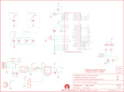

Contents
========

* [PRS11190 > LilyPad Arduino USB](#prs11190--lilypad-arduino-usb)
	* [Schematic](#schematic)
	* [PCB](#pcb)
	* [Interactive BOM](#interactive-bom)
	* [OOMP Parts](#oomp-parts)
	* [Images](#images)
	* [Tags](#tags)
  
![][im]
# PRS11190 > LilyPad Arduino USB

- ID: PROJ-SPAR-11190-STAN-01
- Hex ID: PRS11190
- Name: Sparkfun
- Description: Sparkfun
- Long Link: [http://oom.lt/PROJ-SPAR-11190-STAN-01](http://oom.lt/PROJ-SPAR-11190-STAN-01)
- Short Link: [http://oom.lt/PRS11190](http://oom.lt/PRS11190)

## Schematic
  

## PCB
  

## Interactive BOM

- Interactive BOM page: [ibom.html](https://htmlpreview.github.io/?https://github.com/oomlout/oomlout_OOMP_projects/blob/main/PROJ-SPAR-11190-STAN-01/kicad/bom/ibom.html)

## OOMP Parts
  

|OOMP ID|Name|Identifier|
| :---: | :---: | :---: |
|CAPC-0603-X-PF470-01||C1|
|[CAPC-0603-X-NF100-V50](https://github.com/oomlout/oomlout_OOMP_parts/tree/main/CAPC-0603-X-NF100-V50/)|[SMD (0603) 100 nF Capacitor (Ceramic) 50v](https://github.com/oomlout/oomlout_OOMP_parts/tree/main/CAPC-0603-X-NF100-V50/)|[C2, C3, C4](https://github.com/oomlout/oomlout_OOMP_parts/tree/main/CAPC-0603-X-NF100-V50/)|
|[CAPC-0603-X-UF1-V25](https://github.com/oomlout/oomlout_OOMP_parts/tree/main/CAPC-0603-X-UF1-V25/)|[SMD (0603) 1 uF Capacitor (Ceramic) 25v](https://github.com/oomlout/oomlout_OOMP_parts/tree/main/CAPC-0603-X-UF1-V25/)|[C5](https://github.com/oomlout/oomlout_OOMP_parts/tree/main/CAPC-0603-X-UF1-V25/)|
|[CAPC-0603-X-UF47D-V10](https://github.com/oomlout/oomlout_OOMP_parts/tree/main/CAPC-0603-X-UF47D-V10/)|[SMD (0603) 4.7 uF Capacitor (Ceramic) 10v](https://github.com/oomlout/oomlout_OOMP_parts/tree/main/CAPC-0603-X-UF47D-V10/)|[C6](https://github.com/oomlout/oomlout_OOMP_parts/tree/main/CAPC-0603-X-UF47D-V10/)|
|CAPC-1206-X-UF47D-01||C7, C8|
|DIOD-UNMATCHED-X-UNMATCHED-01||D1|
|HEAD-I01-X-UNMATCHED-01||JP1|
|[LEDS-0603-R-STAN-01](https://github.com/oomlout/oomlout_OOMP_parts/tree/main/LEDS-0603-R-STAN-01/)|[SMD (0603) Red LED](https://github.com/oomlout/oomlout_OOMP_parts/tree/main/LEDS-0603-R-STAN-01/)|[LED1, LED2, LED3, LED4](https://github.com/oomlout/oomlout_OOMP_parts/tree/main/LEDS-0603-R-STAN-01/)|
|[RESE-0603-X-O331-01](https://github.com/oomlout/oomlout_OOMP_parts/tree/main/RESE-0603-X-O331-01/)|[SMD (0603) 330 Ohm Resistor](https://github.com/oomlout/oomlout_OOMP_parts/tree/main/RESE-0603-X-O331-01/)|[R1, R6, R7, R8](https://github.com/oomlout/oomlout_OOMP_parts/tree/main/RESE-0603-X-O331-01/)|
|[RESE-0603-X-O103-01](https://github.com/oomlout/oomlout_OOMP_parts/tree/main/RESE-0603-X-O103-01/)|[SMD (0603) 10k Ohm Resistor](https://github.com/oomlout/oomlout_OOMP_parts/tree/main/RESE-0603-X-O103-01/)|[R2, R3](https://github.com/oomlout/oomlout_OOMP_parts/tree/main/RESE-0603-X-O103-01/)|
|[RESE-0603-X-O220-01](https://github.com/oomlout/oomlout_OOMP_parts/tree/main/RESE-0603-X-O220-01/)|[SMD (0603) 22 Ohm Resistor](https://github.com/oomlout/oomlout_OOMP_parts/tree/main/RESE-0603-X-O220-01/)|[R4, R5](https://github.com/oomlout/oomlout_OOMP_parts/tree/main/RESE-0603-X-O220-01/)|
|UNMATCHED-UNMATCHED-X-UNMATCHED-01||S1, S2, U3, U5, Y1|
|UNMATCHED-SO235-X-UNMATCHED-01||U1, U2|

## Images
  
  

|bominteractivefront|bominteractiveback|kicadPcb3d|kicadPcb3dFront|kicadPcb3dBack|kicadSchem|eagleImage|eagleSchemImage|pcbdraw|pcbdrawback|
| :---: | :---: | :---: | :---: | :---: | :---: | :---: | :---: | :---: | :---: |
|||||||||||

## Tags

- hexID: PRS11190
- oompType: PROJ
- oompSize: SPAR
- oompColor: 11190
- oompDesc: STAN
- oompIndex: 01
- oompName: LilyPad Arduino USB
- sources: All source files from https://github.com/sparkfun/LilyPad_Arduino_USB (source licence details in srcLicense.md)
- linkBuyPage: https://www.sparkfun.com/products/11190
- oompID: PROJ-SPAR-11190-STAN-01
- oompParts: C1,CAPC-0603-X-PF470-01
- oompParts: C2,CAPC-0603-X-NF100-V50
- oompParts: C3,CAPC-0603-X-NF100-V50
- oompParts: C4,CAPC-0603-X-NF100-V50
- oompParts: C5,CAPC-0603-X-UF1-V25
- oompParts: C6,CAPC-0603-X-UF47D-V10
- oompParts: C7,CAPC-1206-X-UF47D-01
- oompParts: C8,CAPC-1206-X-UF47D-01
- oompParts: D1,DIOD-UNMATCHED-X-UNMATCHED-01
- oompParts: JP1,HEAD-I01-X-UNMATCHED-01
- oompParts: LED1,LEDS-0603-R-STAN-01
- oompParts: LED2,LEDS-0603-R-STAN-01
- oompParts: LED3,LEDS-0603-R-STAN-01
- oompParts: LED4,LEDS-0603-R-STAN-01
- oompParts: R1,RESE-0603-X-O331-01
- oompParts: R2,RESE-0603-X-O103-01
- oompParts: R3,RESE-0603-X-O103-01
- oompParts: R4,RESE-0603-X-O220-01
- oompParts: R5,RESE-0603-X-O220-01
- oompParts: R6,RESE-0603-X-O331-01
- oompParts: R7,RESE-0603-X-O331-01
- oompParts: R8,RESE-0603-X-O331-01
- oompParts: S1,UNMATCHED-UNMATCHED-X-UNMATCHED-01
- oompParts: S2,UNMATCHED-UNMATCHED-X-UNMATCHED-01
- oompParts: U1,UNMATCHED-SO235-X-UNMATCHED-01
- oompParts: U2,UNMATCHED-SO235-X-UNMATCHED-01
- oompParts: U3,UNMATCHED-UNMATCHED-X-UNMATCHED-01
- oompParts: U5,UNMATCHED-UNMATCHED-X-UNMATCHED-01
- oompParts: Y1,UNMATCHED-UNMATCHED-X-UNMATCHED-01
- rawParts: +,SEWTAP9,SEWTAP9,PETAL-LONG-1-2SIDE,,1,,,
- rawParts: -,SEWTAP9,SEWTAP9,PETAL-LONG-1-2SIDE,,1,,,
- rawParts: A2,SEWTAP9,SEWTAP9,PETAL-LONG-1-2SIDE,,1,,,
- rawParts: A3,SEWTAP9,SEWTAP9,PETAL-LONG-1-2SIDE,,1,,,
- rawParts: A4,SEWTAP9,SEWTAP9,PETAL-LONG-1-2SIDE,,1,,,
- rawParts: A5,SEWTAP9,SEWTAP9,PETAL-LONG-1-2SIDE,,1,,,
- rawParts: C1,470pF,CAP0603-CAP,0603-CAP,Capacitor,,CAP-07884,,
- rawParts: C2,.1uF,CAP0603-CAP,0603-CAP,Capacitor,,CAP-00810,,
- rawParts: C3,.1uF,CAP0603-CAP,0603-CAP,Capacitor,,CAP-00810,,
- rawParts: C4,.1uF,CAP0603-CAP,0603-CAP,Capacitor,,CAP-00810,,
- rawParts: C5,1uF,CAP0603-CAP,0603-CAP,Capacitor,,CAP-00868,,
- rawParts: C6,4.7uF,CAP0603-CAP,0603-CAP,Capacitor,,CAP-08280,,
- rawParts: C7,4.7uF,CAP1206,1206,Capacitor,,CAP-10300,,
- rawParts: C8,4.7uF,CAP1206,1206,Capacitor,,CAP-10300,,
- rawParts: D1,B340A,DIODE-SCHOTTKY-B340A,SMA-DIODE,Schottky diodes in SFEs production catalog,,DIO-09886,B340A,
- rawParts: D5,SEWTAP9,SEWTAP9,PETAL-LONG-1-2SIDE,,1,,,
- rawParts: D6,SEWTAP9,SEWTAP9,PETAL-LONG-1-2SIDE,,1,,,
- rawParts: D9,SEWTAP9,SEWTAP9,PETAL-LONG-1-2SIDE,,1,,,
- rawParts: D10,SEWTAP9,SEWTAP9,PETAL-LONG-1-2SIDE,,1,,,
- rawParts: D11,SEWTAP9,SEWTAP9,PETAL-LONG-1-2SIDE,,1,,,
- rawParts: FRAME1,FRAME-LETTER,FRAME-LETTER,CREATIVE_COMMONS,Schematic Frame,,,,
- rawParts: JP1,JST-2,M02-JST-2MM-SMT,JST-2-SMD,Standard 2-pin 0.1 header. Use with,,CONN-08352,,
- rawParts: JP2,FIDUCIAL1X2,FIDUCIAL1X2,FIDUCIAL-1X2,Fiducial Alignment Points,,,,
- rawParts: JP3,FIDUCIAL1X2,FIDUCIAL1X2,FIDUCIAL-1X2,Fiducial Alignment Points,,,,
- rawParts: LED1,RED,LED0603,LED-0603,LEDs,,DIO-00819,,
- rawParts: LED2,RED,LED0603,LED-0603,LEDs,,DIO-00819,,
- rawParts: LED3,RED,LED0603,LED-0603,LEDs,,DIO-00819,,
- rawParts: LED4,RED,LED0603,LED-0603,LEDs,,DIO-00819,,
- rawParts: R1,330,RESISTOR0603-RES,0603-RES,Resistor,,RES-00818,,
- rawParts: R2,10k,RESISTOR0603-RES,0603-RES,Resistor,,RES-00824,,
- rawParts: R3,10k,RESISTOR0603-RES,0603-RES,Resistor,,RES-00824,,
- rawParts: R4,22,RESISTOR0603-RES,0603-RES,Resistor,,RES-08698,,
- rawParts: R5,22,RESISTOR0603-RES,0603-RES,Resistor,,RES-08698,,
- rawParts: R6,330,RESISTOR0603-RES,0603-RES,Resistor,,RES-00818,,
- rawParts: R7,330,RESISTOR0603-RES,0603-RES,Resistor,,RES-00818,,
- rawParts: R8,330,RESISTOR0603-RES,0603-RES,Resistor,,RES-00818,,
- rawParts: S1,,SWITCH-DPDTAYZ0202,AYZ0202,DPDT Version of the COM-00597,,SWCH-08179,DPDT,
- rawParts: S2,!RESET,SWITCH-MOMENTARY-2SMD,TACTILE_SWITCH_SMD,Various NO switches- pushbuttons, reed, etc,,SWCH-08247,,
- rawParts: U$1,LOGO-LPLPA,LOGO-LPLPA,LOGO-LPA,,,,,
- rawParts: U$5,OSHW-LOGOM,OSHW-LOGOM,OSHW-LOGO-M,Open Source Hardware Logo This logo indicates the piece of hardware it is found on incorporates a OSHW license and/or adheres to the definition of open source hardware found here: http://freedomdefined.org/OSHW,,,,
- rawParts: U$13,LOGO-LPLP,LOGO-LPLP,LOGO-LILYPAD,,1,,,
- rawParts: U1,MCP73831,MCP73831,SOT23-5,Miniature single cell, fully integrated Li-Ion, Li-polymer charge management controller,,IC-09995,,
- rawParts: U2,MIC5219,V_REG_MIC52193.3V,SOT23-5,V_REG MIC5219,,VREG-09872,MIC5219 3.3V,
- rawParts: U3,ATMEGA32U41:1-LESS_PASTE,ATMEGA32U41:1-LESS_PASTE,QFN-44-NOPAD_1:1-LESS_PASTE,Atmel 44-pin 8-bit Microcontroller with 32KBytes of ISP Flash and USB Controller,,IC-10828,,
- rawParts: U5,,USB-ABCONN-11794,USB-AB-MICRO-SMD_V03,This is a USB AB connector that is compatible with USB OTG. i.e. this connector can serve as a host or device,,CONN-11794,,
- rawParts: Y1,8MHz,RESONATOR8MHZ,RESONATOR-SMD,Resonator,,XTAL-08895,8MHZ,

[im]: kicadPcb3d_450.png
