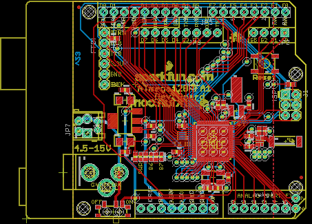
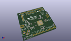
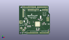
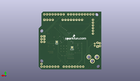
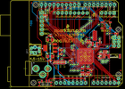
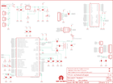

Contents
========

* [PRS11197 > ATmega128RFA1 Dev](#prs11197--atmega128rfa1-dev)
	* [Schematic](#schematic)
	* [PCB](#pcb)
	* [Interactive BOM](#interactive-bom)
	* [OOMP Parts](#oomp-parts)
	* [Images](#images)
	* [Tags](#tags)
  
![][im]
# PRS11197 > ATmega128RFA1 Dev

- ID: PROJ-SPAR-11197-STAN-01
- Hex ID: PRS11197
- Name: Sparkfun
- Description: Sparkfun
- Long Link: [http://oom.lt/PROJ-SPAR-11197-STAN-01](http://oom.lt/PROJ-SPAR-11197-STAN-01)
- Short Link: [http://oom.lt/PRS11197](http://oom.lt/PRS11197)

## Schematic
  

## PCB
  

## Interactive BOM

- Interactive BOM page: [ibom.html](https://htmlpreview.github.io/?https://github.com/oomlout/oomlout_OOMP_projects/blob/main/PROJ-SPAR-11197-STAN-01/kicad/bom/ibom.html)

## OOMP Parts
  

|OOMP Parts|
| :---: |
|UNMATCHED-UNMATCHED-X-UNMATCHED-01 A1, B1, J1, J2, S1, S2, U1, U2, Y1, Y2|
|[CAPC-0402-X-UF1-V63D  SMD (0402) 1 uF Capacitor (Ceramic) 6.3v  C1, C2, C3, C4, C12](https://github.com/oomlout/oomlout_OOMP_parts/tree/main/CAPC-0402-X-UF1-V63D/)|
|[CAPC-0402-X-PF12-V50  SMD (0402) 12 pF Capacitor (Ceramic) 50v  C5, C6, C7, C8](https://github.com/oomlout/oomlout_OOMP_parts/tree/main/CAPC-0402-X-PF12-V50/)|
|CAPC-0402-X-NF750-01 C9|
|CAPT-3216-X-UF10-01 C10, C14|
|[CAPC-0402-X-PF22-V50  SMD (0402) 22 pF Capacitor (Ceramic) 50v  C11](https://github.com/oomlout/oomlout_OOMP_parts/tree/main/CAPC-0402-X-PF22-V50/)|
|CAPC-0402-X-UF1D-01 C13, C15|
|[CAPC-0402-X-NF100-V10  SMD (0402) 100 nF Capacitor (Ceramic) 10v  C16, C17](https://github.com/oomlout/oomlout_OOMP_parts/tree/main/CAPC-0402-X-NF100-V10/)|
|[DCJP-21D-X-STAN-01  2.1 mm DC Jack  J3](https://github.com/oomlout/oomlout_OOMP_parts/tree/main/DCJP-21D-X-STAN-01/)|
|[HEAD-I01-X-PI02-01  2.54 mm 2 Pin Header  JP1, JP5, JP7](https://github.com/oomlout/oomlout_OOMP_parts/tree/main/HEAD-I01-X-PI02-01/)|
|[HEAD-I01-X-PI04-01  2.54 mm 4 Pin Header  JP2](https://github.com/oomlout/oomlout_OOMP_parts/tree/main/HEAD-I01-X-PI04-01/)|
|[HEAD-I01-X-PI06-01  2.54 mm 6 Pin Header  JP3](https://github.com/oomlout/oomlout_OOMP_parts/tree/main/HEAD-I01-X-PI06-01/)|
|HEAD-I01-X-UNMATCHED-01 JP6, JP9|
|[TERS-35D-L-PI02-01  3.5 mm 2 Pin Blue Screw Terminal  JP8](https://github.com/oomlout/oomlout_OOMP_parts/tree/main/TERS-35D-L-PI02-01/)|
|[LEDS-0603-R-STAN-01  SMD (0603) Red LED  LED1](https://github.com/oomlout/oomlout_OOMP_parts/tree/main/LEDS-0603-R-STAN-01/)|
|[LEDS-0603-G-STAN-01  SMD (0603) Green LED  LED2, LED3](https://github.com/oomlout/oomlout_OOMP_parts/tree/main/LEDS-0603-G-STAN-01/)|
|[RESE-0402-X-O103-01  SMD (0402) 10k Ohm Resistor  R1](https://github.com/oomlout/oomlout_OOMP_parts/tree/main/RESE-0402-X-O103-01/)|
|[RESE-0402-X-O102-01  SMD (0402) 1k Ohm Resistor  R2](https://github.com/oomlout/oomlout_OOMP_parts/tree/main/RESE-0402-X-O102-01/)|
|RESE-0402-X-O241-01 R3|
|RESE-0402-X-O391-01 R4|
|RESE-0402-X-O331-01 R5, R6|

## Images
  
  

|kicadPcb3d|kicadPcb3dFront|kicadPcb3dBack|eagleImage|eagleSchemImage|
| :---: | :---: | :---: | :---: | :---: |
||||||

## Tags

- hexID: PRS11197
- oompType: PROJ
- oompSize: SPAR
- oompColor: 11197
- oompDesc: STAN
- oompIndex: 01
- oompName: ATmega128RFA1 Dev
- sources: All source files from https://github.com/sparkfun/ATmega128RFA1_Dev (source licence details in srcLicense.md)
- linkBuyPage: https://www.sparkfun.com/products/11197
- oompID: PROJ-SPAR-11197-STAN-01
- oompParts: A1,UNMATCHED-UNMATCHED-X-UNMATCHED-01
- oompParts: B1,UNMATCHED-UNMATCHED-X-UNMATCHED-01
- oompParts: C1,CAPC-0402-X-UF1-V63D
- oompParts: C2,CAPC-0402-X-UF1-V63D
- oompParts: C3,CAPC-0402-X-UF1-V63D
- oompParts: C4,CAPC-0402-X-UF1-V63D
- oompParts: C5,CAPC-0402-X-PF12-V50
- oompParts: C6,CAPC-0402-X-PF12-V50
- oompParts: C7,CAPC-0402-X-PF12-V50
- oompParts: C8,CAPC-0402-X-PF12-V50
- oompParts: C9,CAPC-0402-X-NF750-01
- oompParts: C10,CAPT-3216-X-UF10-01
- oompParts: C11,CAPC-0402-X-PF22-V50
- oompParts: C12,CAPC-0402-X-UF1-V63D
- oompParts: C13,CAPC-0402-X-UF1D-01
- oompParts: C14,CAPT-3216-X-UF10-01
- oompParts: C15,CAPC-0402-X-UF1D-01
- oompParts: C16,CAPC-0402-X-NF100-V10
- oompParts: C17,CAPC-0402-X-NF100-V10
- oompParts: J1,UNMATCHED-UNMATCHED-X-UNMATCHED-01
- oompParts: J2,UNMATCHED-UNMATCHED-X-UNMATCHED-01
- oompParts: J3,DCJP-21D-X-STAN-01
- oompParts: JP1,HEAD-I01-X-PI02-01
- oompParts: JP2,HEAD-I01-X-PI04-01
- oompParts: JP3,HEAD-I01-X-PI06-01
- oompParts: JP5,HEAD-I01-X-PI02-01
- oompParts: JP6,HEAD-I01-X-UNMATCHED-01
- oompParts: JP7,HEAD-I01-X-PI02-01
- oompParts: JP8,TERS-35D-L-PI02-01
- oompParts: JP9,HEAD-I01-X-UNMATCHED-01
- oompParts: LED1,LEDS-0603-R-STAN-01
- oompParts: LED2,LEDS-0603-G-STAN-01
- oompParts: LED3,LEDS-0603-G-STAN-01
- oompParts: R1,RESE-0402-X-O103-01
- oompParts: R2,RESE-0402-X-O102-01
- oompParts: R3,RESE-0402-X-O241-01
- oompParts: R4,RESE-0402-X-O391-01
- oompParts: R5,RESE-0402-X-O331-01
- oompParts: R6,RESE-0402-X-O331-01
- oompParts: S1,UNMATCHED-UNMATCHED-X-UNMATCHED-01
- oompParts: S2,UNMATCHED-UNMATCHED-X-UNMATCHED-01
- oompParts: U1,UNMATCHED-UNMATCHED-X-UNMATCHED-01
- oompParts: U2,UNMATCHED-UNMATCHED-X-UNMATCHED-01
- oompParts: Y1,UNMATCHED-UNMATCHED-X-UNMATCHED-01
- oompParts: Y2,UNMATCHED-UNMATCHED-X-UNMATCHED-01
- rawParts: A1,ANTENNA2SMD5,ANTENNA2SMD5,ANTENNA-CHIP5,Chip antenna,,
- rawParts: B1,748421245,BALUN0805,BALUN,0805 footprint balun- Ember 351/357,,
- rawParts: C1,1uF,CAP0402-CAP,0402-CAP,Capacitor,,
- rawParts: C2,1uF,CAP0402-CAP,0402-CAP,Capacitor,,
- rawParts: C3,1uF,CAP0402-CAP,0402-CAP,Capacitor,,
- rawParts: C4,1uF,CAP0402-CAP,0402-CAP,Capacitor,,
- rawParts: C5,12pF,CAP0402-CAP,0402-CAP,Capacitor,,
- rawParts: C6,12pF,CAP0402-CAP,0402-CAP,Capacitor,,
- rawParts: C7,12pF,CAP0402-CAP,0402-CAP,Capacitor,,
- rawParts: C8,12pF,CAP0402-CAP,0402-CAP,Capacitor,,
- rawParts: C9,0.75pF,CAP0402-CAP,0402-CAP,Capacitor,,
- rawParts: C10,10uF,CAP_POL1206,EIA3216,Capacitor Polarized,,
- rawParts: C11,22pF,CAP0402-CAP,0402-CAP,Capacitor,,
- rawParts: C12,1uF,CAP0402-CAP,0402-CAP,Capacitor,,
- rawParts: C13,0.1uF,CAP0402-CAP,0402-CAP,Capacitor,,
- rawParts: C14,10uF,CAP_POL1206,EIA3216,Capacitor Polarized,,
- rawParts: C15,0.1uF,CAP0402-CAP,0402-CAP,Capacitor,,
- rawParts: C16,JUMP,CAP0402-CAP,0402-CAP,Capacitor,,
- rawParts: C17,JUMP,CAP0402-CAP,0402-CAP,Capacitor,,
- rawParts: FID1,FIDUCIALUFIDUCIAL,FIDUCIALUFIDUCIAL,MICRO-FIDUCIAL,Fiducial Alignment Points,,
- rawParts: FID2,FIDUCIALUFIDUCIAL,FIDUCIALUFIDUCIAL,MICRO-FIDUCIAL,Fiducial Alignment Points,,
- rawParts: J1,ISP,AVR_SPI_PRG_6NS,2X3-NS,AVR ISP 6 Pin,,
- rawParts: J2,ARDUINO_UNO_R3,ARDUINO_UNO_R3,ARDUINO_UNO_R3,Arduino Uno R3,,
- rawParts: J3,POWER_JACKPTH_LOCK,POWER_JACKPTH_LOCK,POWER_JACK_PTH_LOCK,Power Jack,,
- rawParts: JP1,,M021X02_NO_SILK,1X02_NO_SILK,Header 2,,
- rawParts: JP2,,M041X04_NO_SILK,1X04_NO_SILK,Header 4,,
- rawParts: JP3,,M06SIP-NS,1X06_NS,Header 6,,
- rawParts: JP4,LOGO-SFENEW,LOGO-SFENEW,SFE-NEW-WEBLOGO,Spark Fun Electronics PCB Logo,,
- rawParts: JP5,,M021X02_NO_SILK,1X02_NO_SILK,Header 2,,
- rawParts: JP6,,M02JST-PTH-2,JST-2-PTH,Header 2,,
- rawParts: JP7,,M021X02_NO_SILK,1X02_NO_SILK,Header 2,,
- rawParts: JP8,,M023.5MM-NO_SILK,SCREWTERMINAL-3.5MM-2-NS,Header 2,,
- rawParts: JP9,FTDI,FTDI_BASICPTH,FTDI_BASIC,FTDI Basic header with labels,,
- rawParts: JP10,LOGO-SFENEW,LOGO-SFENEW,SFE-NEW-WEBLOGO,Spark Fun Electronics PCB Logo,,
- rawParts: LED1,RED,LED0603,LED-0603,LEDs,,
- rawParts: LED2,GREEN,LED0603,LED-0603,LEDs,,
- rawParts: LED3,GREEN,LED0603,LED-0603,LEDs,,
- rawParts: R1,10k,RESISTOR0402-RES,0402-RES,Resistor,,
- rawParts: R2,1k,RESISTOR0402-RES,0402-RES,Resistor,,
- rawParts: R3,240,RESISTOR0402-RES,0402-RES,Resistor,,
- rawParts: R4,390,RESISTOR0402-RES,0402-RES,Resistor,,
- rawParts: R5,330,RESISTOR0402-RES,0402-RES,Resistor,,
- rawParts: R6,330,RESISTOR0402-RES,0402-RES,Resistor,,
- rawParts: S1,,SWITCH-MOMENTARY-2SMD,TACTILE_SWITCH_SMD,Various NO switches- pushbuttons, reed, etc,,
- rawParts: S2,,SWITCH-SPST-SMD-A,SWITCH-SPST-SMD-A,SPST Switch,,
- rawParts: SJ1,,SOLDERJUMPERTRACE,SJ_2S-TRACE,Solder Jumper,,
- rawParts: SJ2,,SOLDERJUMPERTRACE,SJ_2S-TRACE,Solder Jumper,,
- rawParts: U$1,OSHW-LOGOS,OSHW-LOGOS,OSHW-LOGO-S,Open Source Hardware Logo This logo indicates the piece of hardware it is found on incorporates a OSHW license and/or adheres to the definition of open source hardware found here: http://freedomdefined.org/OSHW,,
- rawParts: U1,ATMEGA128RFA1,ATMEGA128RFA1,QFN-64,ATmega128RFA1,,
- rawParts: U2,LM1117,V_REG_317SMD,SOT223,Voltage Regulator,,
- rawParts: Y1,16MHz,CRYSTAL5X3,CRYSTAL-SMD-5X3,Various standard crystals. Proven footprints. Spark Fun Electronics SKU : COM-00534,,
- rawParts: Y2,32.768kHz,CRYSTAL32-SMD,CRYSTAL-32KHZ-SMD,Various standard crystals. Proven footprints. Spark Fun Electronics SKU : COM-00534,,

[im]: kicadPcb3d_450.png
