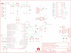

Contents
========

* [PRS11197 > Sparkfun](#prs11197--sparkfun)
	* [Schematic](#schematic)
	* [Interactive BOM](#interactive-bom)
	* [OOMP Parts](#oomp-parts)
	* [Images](#images)
	* [Tags](#tags)
  
![][im]
# PRS11197 > Sparkfun

- ID: PROJ-SPAR-11197-STAN-01
- Hex ID: PRS11197
- Name: Sparkfun
- Description: Sparkfun
- Long Link: [http://oom.lt/PROJ-SPAR-11197-STAN-01](http://oom.lt/PROJ-SPAR-11197-STAN-01)
- Short Link: [http://oom.lt/PRS11197](http://oom.lt/PRS11197)

## Schematic
  

## Interactive BOM

- Interactive BOM page: [ibom.html](https://htmlpreview.github.io/?https://github.com/oomlout/oomlout_OOMP_projects/blob/main/PROJ-SPAR-11197-STAN-01/kicad/bom/ibom.html)

## OOMP Parts
  

|OOMP Parts|
| :---: |
|A1,UNMATCHED-UNMATCHED-UNMATCHED-UNMATCHED-UNMATCHED,A1,ANTENNA2SMD5,ANTENNA2SMD5,ANTENNA-CHIP5,Chip antenna,,|
|B1,UNMATCHED-UNMATCHED-UNMATCHED-UNMATCHED-UNMATCHED,B1,748421245,BALUN0805,BALUN,0805 footprint balun- Ember 351/357,,|
|C1,UNMATCHED-UNMATCHED-UNMATCHED-UNMATCHED-UNMATCHED,C1,1uF,CAP0402-CAP,0402-CAP,Capacitor,,|
|C2,UNMATCHED-UNMATCHED-UNMATCHED-UNMATCHED-UNMATCHED,C2,1uF,CAP0402-CAP,0402-CAP,Capacitor,,|
|C3,UNMATCHED-UNMATCHED-UNMATCHED-UNMATCHED-UNMATCHED,C3,1uF,CAP0402-CAP,0402-CAP,Capacitor,,|
|C4,UNMATCHED-UNMATCHED-UNMATCHED-UNMATCHED-UNMATCHED,C4,1uF,CAP0402-CAP,0402-CAP,Capacitor,,|
|C5,UNMATCHED-UNMATCHED-UNMATCHED-UNMATCHED-UNMATCHED,C5,12pF,CAP0402-CAP,0402-CAP,Capacitor,,|
|C6,UNMATCHED-UNMATCHED-UNMATCHED-UNMATCHED-UNMATCHED,C6,12pF,CAP0402-CAP,0402-CAP,Capacitor,,|
|C7,UNMATCHED-UNMATCHED-UNMATCHED-UNMATCHED-UNMATCHED,C7,12pF,CAP0402-CAP,0402-CAP,Capacitor,,|
|C8,UNMATCHED-UNMATCHED-UNMATCHED-UNMATCHED-UNMATCHED,C8,12pF,CAP0402-CAP,0402-CAP,Capacitor,,|
|C9,UNMATCHED-UNMATCHED-UNMATCHED-UNMATCHED-UNMATCHED,C9,0.75pF,CAP0402-CAP,0402-CAP,Capacitor,,|
|C10,UNMATCHED-UNMATCHED-UNMATCHED-UNMATCHED-UNMATCHED,C10,10uF,CAP_POL1206,EIA3216,Capacitor Polarized,,|
|C11,UNMATCHED-UNMATCHED-UNMATCHED-UNMATCHED-UNMATCHED,C11,22pF,CAP0402-CAP,0402-CAP,Capacitor,,|
|C12,UNMATCHED-UNMATCHED-UNMATCHED-UNMATCHED-UNMATCHED,C12,1uF,CAP0402-CAP,0402-CAP,Capacitor,,|
|C13,UNMATCHED-UNMATCHED-UNMATCHED-UNMATCHED-UNMATCHED,C13,0.1uF,CAP0402-CAP,0402-CAP,Capacitor,,|
|C14,UNMATCHED-UNMATCHED-UNMATCHED-UNMATCHED-UNMATCHED,C14,10uF,CAP_POL1206,EIA3216,Capacitor Polarized,,|
|C15,UNMATCHED-UNMATCHED-UNMATCHED-UNMATCHED-UNMATCHED,C15,0.1uF,CAP0402-CAP,0402-CAP,Capacitor,,|
|C16,UNMATCHED-UNMATCHED-UNMATCHED-UNMATCHED-UNMATCHED,C16,JUMP,CAP0402-CAP,0402-CAP,Capacitor,,|
|C17,UNMATCHED-UNMATCHED-UNMATCHED-UNMATCHED-UNMATCHED,C17,JUMP,CAP0402-CAP,0402-CAP,Capacitor,,|
|J1,UNMATCHED-UNMATCHED-UNMATCHED-UNMATCHED-UNMATCHED,FID1,FIDUCIALUFIDUCIAL,FIDUCIALUFIDUCIAL,MICRO-FIDUCIAL,Fiducial Alignment Points,,|
|J2,UNMATCHED-UNMATCHED-UNMATCHED-UNMATCHED-UNMATCHED,FID2,FIDUCIALUFIDUCIAL,FIDUCIALUFIDUCIAL,MICRO-FIDUCIAL,Fiducial Alignment Points,,|
|J3,UNMATCHED-UNMATCHED-UNMATCHED-UNMATCHED-UNMATCHED,J1,ISP,AVR_SPI_PRG_6NS,2X3-NS,AVR ISP 6 Pin,,|
|JP1,UNMATCHED-UNMATCHED-UNMATCHED-UNMATCHED-UNMATCHED,J2,ARDUINO_UNO_R3,ARDUINO_UNO_R3,ARDUINO_UNO_R3,Arduino Uno R3,,|
|JP2,UNMATCHED-UNMATCHED-UNMATCHED-UNMATCHED-UNMATCHED,J3,POWER_JACKPTH_LOCK,POWER_JACKPTH_LOCK,POWER_JACK_PTH_LOCK,Power Jack,,|
|JP3,UNMATCHED-UNMATCHED-UNMATCHED-UNMATCHED-UNMATCHED,JP1,,M021X02_NO_SILK,1X02_NO_SILK,Header 2,,|
|JP4,UNMATCHED-UNMATCHED-UNMATCHED-UNMATCHED-UNMATCHED,JP2,,M041X04_NO_SILK,1X04_NO_SILK,Header 4,,|
|JP5,UNMATCHED-UNMATCHED-UNMATCHED-UNMATCHED-UNMATCHED,JP3,,M06SIP-NS,1X06_NS,Header 6,,|
|JP6,UNMATCHED-UNMATCHED-UNMATCHED-UNMATCHED-UNMATCHED,JP4,LOGO-SFENEW,LOGO-SFENEW,SFE-NEW-WEBLOGO,Spark Fun Electronics PCB Logo,,|
|JP7,UNMATCHED-UNMATCHED-UNMATCHED-UNMATCHED-UNMATCHED,JP5,,M021X02_NO_SILK,1X02_NO_SILK,Header 2,,|
|JP8,UNMATCHED-UNMATCHED-UNMATCHED-UNMATCHED-UNMATCHED,JP6,,M02JST-PTH-2,JST-2-PTH,Header 2,,|
|JP9,UNMATCHED-UNMATCHED-UNMATCHED-UNMATCHED-UNMATCHED,JP7,,M021X02_NO_SILK,1X02_NO_SILK,Header 2,,|
|JP10,UNMATCHED-UNMATCHED-UNMATCHED-UNMATCHED-UNMATCHED,JP8,,M023.5MM-NO_SILK,SCREWTERMINAL-3.5MM-2-NS,Header 2,,|
|LED1,UNMATCHED-UNMATCHED-UNMATCHED-UNMATCHED-UNMATCHED,JP9,FTDI,FTDI_BASICPTH,FTDI_BASIC,FTDI Basic header with labels,,|
|LED2,UNMATCHED-UNMATCHED-UNMATCHED-UNMATCHED-UNMATCHED,JP10,LOGO-SFENEW,LOGO-SFENEW,SFE-NEW-WEBLOGO,Spark Fun Electronics PCB Logo,,|
|LED3,UNMATCHED-UNMATCHED-UNMATCHED-UNMATCHED-UNMATCHED,LED1,RED,LED0603,LED-0603,LEDs,,|
|R1,UNMATCHED-UNMATCHED-UNMATCHED-UNMATCHED-UNMATCHED,LED2,GREEN,LED0603,LED-0603,LEDs,,|
|R2,UNMATCHED-UNMATCHED-UNMATCHED-UNMATCHED-UNMATCHED,LED3,GREEN,LED0603,LED-0603,LEDs,,|
|R3,UNMATCHED-UNMATCHED-UNMATCHED-UNMATCHED-UNMATCHED,R1,10k,RESISTOR0402-RES,0402-RES,Resistor,,|
|R4,UNMATCHED-UNMATCHED-UNMATCHED-UNMATCHED-UNMATCHED,R2,1k,RESISTOR0402-RES,0402-RES,Resistor,,|
|R5,UNMATCHED-UNMATCHED-UNMATCHED-UNMATCHED-UNMATCHED,R3,240,RESISTOR0402-RES,0402-RES,Resistor,,|
|R6,UNMATCHED-UNMATCHED-UNMATCHED-UNMATCHED-UNMATCHED,R4,390,RESISTOR0402-RES,0402-RES,Resistor,,|
|S1,UNMATCHED-UNMATCHED-UNMATCHED-UNMATCHED-UNMATCHED,R5,330,RESISTOR0402-RES,0402-RES,Resistor,,|
|S2,UNMATCHED-UNMATCHED-UNMATCHED-UNMATCHED-UNMATCHED,R6,330,RESISTOR0402-RES,0402-RES,Resistor,,|
|SJ1,UNMATCHED-UNMATCHED-UNMATCHED-UNMATCHED-UNMATCHED,S1,,SWITCH-MOMENTARY-2SMD,TACTILE_SWITCH_SMD,Various NO switches- pushbuttons, reed, etc,,|
|SJ2,UNMATCHED-UNMATCHED-UNMATCHED-UNMATCHED-UNMATCHED,S2,,SWITCH-SPST-SMD-A,SWITCH-SPST-SMD-A,SPST Switch,,|
|U$1,UNMATCHED-UNMATCHED-UNMATCHED-UNMATCHED-UNMATCHED,SJ1,,SOLDERJUMPERTRACE,SJ_2S-TRACE,Solder Jumper,,|
|U1,UNMATCHED-UNMATCHED-UNMATCHED-UNMATCHED-UNMATCHED,SJ2,,SOLDERJUMPERTRACE,SJ_2S-TRACE,Solder Jumper,,|
|U2,UNMATCHED-UNMATCHED-UNMATCHED-UNMATCHED-UNMATCHED,U$1,OSHW-LOGOS,OSHW-LOGOS,OSHW-LOGO-S,Open Source Hardware Logo This logo indicates the piece of hardware it is found on incorporates a OSHW license and/or adheres to the definition of open source hardware found here: http://freedomdefined.org/OSHW,,|
|Y1,UNMATCHED-UNMATCHED-UNMATCHED-UNMATCHED-UNMATCHED,U1,ATMEGA128RFA1,ATMEGA128RFA1,QFN-64,ATmega128RFA1,,|
|Y2,UNMATCHED-UNMATCHED-UNMATCHED-UNMATCHED-UNMATCHED,U2,LM1117,V_REG_317SMD,SOT223,Voltage Regulator,,|

## Images
  
  

|kicadPcb3d|kicadPcb3dFront|kicadPcb3dBack|eagleImage|eagleSchemImage|
| :---: | :---: | :---: | :---: | :---: |
||||||

## Tags

- hexID: PRS11197
- oompType: PROJ
- oompSize: SPAR
- oompColor: 11197
- oompDesc: STAN
- oompIndex: 01
- oompName: ATmega128RFA1 Dev
- sources: All source files from https://github.com/sparkfun/ATmega128RFA1_Dev (source licence details in srcLicense.md)
- linkBuyPage: https://www.sparkfun.com/products/11197
- oompID: PROJ-SPAR-11197-STAN-01
- oompParts: A1,UNMATCHED-UNMATCHED-UNMATCHED-UNMATCHED-UNMATCHED
- oompParts: B1,UNMATCHED-UNMATCHED-UNMATCHED-UNMATCHED-UNMATCHED
- oompParts: C1,UNMATCHED-UNMATCHED-UNMATCHED-UNMATCHED-UNMATCHED
- oompParts: C2,UNMATCHED-UNMATCHED-UNMATCHED-UNMATCHED-UNMATCHED
- oompParts: C3,UNMATCHED-UNMATCHED-UNMATCHED-UNMATCHED-UNMATCHED
- oompParts: C4,UNMATCHED-UNMATCHED-UNMATCHED-UNMATCHED-UNMATCHED
- oompParts: C5,UNMATCHED-UNMATCHED-UNMATCHED-UNMATCHED-UNMATCHED
- oompParts: C6,UNMATCHED-UNMATCHED-UNMATCHED-UNMATCHED-UNMATCHED
- oompParts: C7,UNMATCHED-UNMATCHED-UNMATCHED-UNMATCHED-UNMATCHED
- oompParts: C8,UNMATCHED-UNMATCHED-UNMATCHED-UNMATCHED-UNMATCHED
- oompParts: C9,UNMATCHED-UNMATCHED-UNMATCHED-UNMATCHED-UNMATCHED
- oompParts: C10,UNMATCHED-UNMATCHED-UNMATCHED-UNMATCHED-UNMATCHED
- oompParts: C11,UNMATCHED-UNMATCHED-UNMATCHED-UNMATCHED-UNMATCHED
- oompParts: C12,UNMATCHED-UNMATCHED-UNMATCHED-UNMATCHED-UNMATCHED
- oompParts: C13,UNMATCHED-UNMATCHED-UNMATCHED-UNMATCHED-UNMATCHED
- oompParts: C14,UNMATCHED-UNMATCHED-UNMATCHED-UNMATCHED-UNMATCHED
- oompParts: C15,UNMATCHED-UNMATCHED-UNMATCHED-UNMATCHED-UNMATCHED
- oompParts: C16,UNMATCHED-UNMATCHED-UNMATCHED-UNMATCHED-UNMATCHED
- oompParts: C17,UNMATCHED-UNMATCHED-UNMATCHED-UNMATCHED-UNMATCHED
- oompParts: J1,UNMATCHED-UNMATCHED-UNMATCHED-UNMATCHED-UNMATCHED
- oompParts: J2,UNMATCHED-UNMATCHED-UNMATCHED-UNMATCHED-UNMATCHED
- oompParts: J3,UNMATCHED-UNMATCHED-UNMATCHED-UNMATCHED-UNMATCHED
- oompParts: JP1,UNMATCHED-UNMATCHED-UNMATCHED-UNMATCHED-UNMATCHED
- oompParts: JP2,UNMATCHED-UNMATCHED-UNMATCHED-UNMATCHED-UNMATCHED
- oompParts: JP3,UNMATCHED-UNMATCHED-UNMATCHED-UNMATCHED-UNMATCHED
- oompParts: JP4,UNMATCHED-UNMATCHED-UNMATCHED-UNMATCHED-UNMATCHED
- oompParts: JP5,UNMATCHED-UNMATCHED-UNMATCHED-UNMATCHED-UNMATCHED
- oompParts: JP6,UNMATCHED-UNMATCHED-UNMATCHED-UNMATCHED-UNMATCHED
- oompParts: JP7,UNMATCHED-UNMATCHED-UNMATCHED-UNMATCHED-UNMATCHED
- oompParts: JP8,UNMATCHED-UNMATCHED-UNMATCHED-UNMATCHED-UNMATCHED
- oompParts: JP9,UNMATCHED-UNMATCHED-UNMATCHED-UNMATCHED-UNMATCHED
- oompParts: JP10,UNMATCHED-UNMATCHED-UNMATCHED-UNMATCHED-UNMATCHED
- oompParts: LED1,UNMATCHED-UNMATCHED-UNMATCHED-UNMATCHED-UNMATCHED
- oompParts: LED2,UNMATCHED-UNMATCHED-UNMATCHED-UNMATCHED-UNMATCHED
- oompParts: LED3,UNMATCHED-UNMATCHED-UNMATCHED-UNMATCHED-UNMATCHED
- oompParts: R1,UNMATCHED-UNMATCHED-UNMATCHED-UNMATCHED-UNMATCHED
- oompParts: R2,UNMATCHED-UNMATCHED-UNMATCHED-UNMATCHED-UNMATCHED
- oompParts: R3,UNMATCHED-UNMATCHED-UNMATCHED-UNMATCHED-UNMATCHED
- oompParts: R4,UNMATCHED-UNMATCHED-UNMATCHED-UNMATCHED-UNMATCHED
- oompParts: R5,UNMATCHED-UNMATCHED-UNMATCHED-UNMATCHED-UNMATCHED
- oompParts: R6,UNMATCHED-UNMATCHED-UNMATCHED-UNMATCHED-UNMATCHED
- oompParts: S1,UNMATCHED-UNMATCHED-UNMATCHED-UNMATCHED-UNMATCHED
- oompParts: S2,UNMATCHED-UNMATCHED-UNMATCHED-UNMATCHED-UNMATCHED
- oompParts: SJ1,UNMATCHED-UNMATCHED-UNMATCHED-UNMATCHED-UNMATCHED
- oompParts: SJ2,UNMATCHED-UNMATCHED-UNMATCHED-UNMATCHED-UNMATCHED
- oompParts: U$1,UNMATCHED-UNMATCHED-UNMATCHED-UNMATCHED-UNMATCHED
- oompParts: U1,UNMATCHED-UNMATCHED-UNMATCHED-UNMATCHED-UNMATCHED
- oompParts: U2,UNMATCHED-UNMATCHED-UNMATCHED-UNMATCHED-UNMATCHED
- oompParts: Y1,UNMATCHED-UNMATCHED-UNMATCHED-UNMATCHED-UNMATCHED
- oompParts: Y2,UNMATCHED-UNMATCHED-UNMATCHED-UNMATCHED-UNMATCHED
- rawParts: A1,ANTENNA2SMD5,ANTENNA2SMD5,ANTENNA-CHIP5,Chip antenna,,
- rawParts: B1,748421245,BALUN0805,BALUN,0805 footprint balun- Ember 351/357,,
- rawParts: C1,1uF,CAP0402-CAP,0402-CAP,Capacitor,,
- rawParts: C2,1uF,CAP0402-CAP,0402-CAP,Capacitor,,
- rawParts: C3,1uF,CAP0402-CAP,0402-CAP,Capacitor,,
- rawParts: C4,1uF,CAP0402-CAP,0402-CAP,Capacitor,,
- rawParts: C5,12pF,CAP0402-CAP,0402-CAP,Capacitor,,
- rawParts: C6,12pF,CAP0402-CAP,0402-CAP,Capacitor,,
- rawParts: C7,12pF,CAP0402-CAP,0402-CAP,Capacitor,,
- rawParts: C8,12pF,CAP0402-CAP,0402-CAP,Capacitor,,
- rawParts: C9,0.75pF,CAP0402-CAP,0402-CAP,Capacitor,,
- rawParts: C10,10uF,CAP_POL1206,EIA3216,Capacitor Polarized,,
- rawParts: C11,22pF,CAP0402-CAP,0402-CAP,Capacitor,,
- rawParts: C12,1uF,CAP0402-CAP,0402-CAP,Capacitor,,
- rawParts: C13,0.1uF,CAP0402-CAP,0402-CAP,Capacitor,,
- rawParts: C14,10uF,CAP_POL1206,EIA3216,Capacitor Polarized,,
- rawParts: C15,0.1uF,CAP0402-CAP,0402-CAP,Capacitor,,
- rawParts: C16,JUMP,CAP0402-CAP,0402-CAP,Capacitor,,
- rawParts: C17,JUMP,CAP0402-CAP,0402-CAP,Capacitor,,
- rawParts: FID1,FIDUCIALUFIDUCIAL,FIDUCIALUFIDUCIAL,MICRO-FIDUCIAL,Fiducial Alignment Points,,
- rawParts: FID2,FIDUCIALUFIDUCIAL,FIDUCIALUFIDUCIAL,MICRO-FIDUCIAL,Fiducial Alignment Points,,
- rawParts: J1,ISP,AVR_SPI_PRG_6NS,2X3-NS,AVR ISP 6 Pin,,
- rawParts: J2,ARDUINO_UNO_R3,ARDUINO_UNO_R3,ARDUINO_UNO_R3,Arduino Uno R3,,
- rawParts: J3,POWER_JACKPTH_LOCK,POWER_JACKPTH_LOCK,POWER_JACK_PTH_LOCK,Power Jack,,
- rawParts: JP1,,M021X02_NO_SILK,1X02_NO_SILK,Header 2,,
- rawParts: JP2,,M041X04_NO_SILK,1X04_NO_SILK,Header 4,,
- rawParts: JP3,,M06SIP-NS,1X06_NS,Header 6,,
- rawParts: JP4,LOGO-SFENEW,LOGO-SFENEW,SFE-NEW-WEBLOGO,Spark Fun Electronics PCB Logo,,
- rawParts: JP5,,M021X02_NO_SILK,1X02_NO_SILK,Header 2,,
- rawParts: JP6,,M02JST-PTH-2,JST-2-PTH,Header 2,,
- rawParts: JP7,,M021X02_NO_SILK,1X02_NO_SILK,Header 2,,
- rawParts: JP8,,M023.5MM-NO_SILK,SCREWTERMINAL-3.5MM-2-NS,Header 2,,
- rawParts: JP9,FTDI,FTDI_BASICPTH,FTDI_BASIC,FTDI Basic header with labels,,
- rawParts: JP10,LOGO-SFENEW,LOGO-SFENEW,SFE-NEW-WEBLOGO,Spark Fun Electronics PCB Logo,,
- rawParts: LED1,RED,LED0603,LED-0603,LEDs,,
- rawParts: LED2,GREEN,LED0603,LED-0603,LEDs,,
- rawParts: LED3,GREEN,LED0603,LED-0603,LEDs,,
- rawParts: R1,10k,RESISTOR0402-RES,0402-RES,Resistor,,
- rawParts: R2,1k,RESISTOR0402-RES,0402-RES,Resistor,,
- rawParts: R3,240,RESISTOR0402-RES,0402-RES,Resistor,,
- rawParts: R4,390,RESISTOR0402-RES,0402-RES,Resistor,,
- rawParts: R5,330,RESISTOR0402-RES,0402-RES,Resistor,,
- rawParts: R6,330,RESISTOR0402-RES,0402-RES,Resistor,,
- rawParts: S1,,SWITCH-MOMENTARY-2SMD,TACTILE_SWITCH_SMD,Various NO switches- pushbuttons, reed, etc,,
- rawParts: S2,,SWITCH-SPST-SMD-A,SWITCH-SPST-SMD-A,SPST Switch,,
- rawParts: SJ1,,SOLDERJUMPERTRACE,SJ_2S-TRACE,Solder Jumper,,
- rawParts: SJ2,,SOLDERJUMPERTRACE,SJ_2S-TRACE,Solder Jumper,,
- rawParts: U$1,OSHW-LOGOS,OSHW-LOGOS,OSHW-LOGO-S,Open Source Hardware Logo This logo indicates the piece of hardware it is found on incorporates a OSHW license and/or adheres to the definition of open source hardware found here: http://freedomdefined.org/OSHW,,
- rawParts: U1,ATMEGA128RFA1,ATMEGA128RFA1,QFN-64,ATmega128RFA1,,
- rawParts: U2,LM1117,V_REG_317SMD,SOT223,Voltage Regulator,,
- rawParts: Y1,16MHz,CRYSTAL5X3,CRYSTAL-SMD-5X3,Various standard crystals. Proven footprints. Spark Fun Electronics SKU : COM-00534,,
- rawParts: Y2,32.768kHz,CRYSTAL32-SMD,CRYSTAL-32KHZ-SMD,Various standard crystals. Proven footprints. Spark Fun Electronics SKU : COM-00534,,

[im]: kicadPcb3d_450.png
