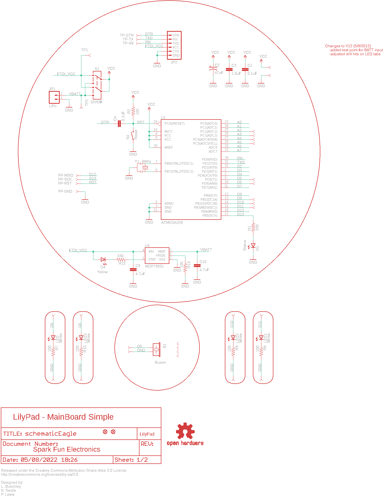

Contents
========

* [PRS11201 > Sparkfun](#prs11201--sparkfun)
	* [Schematic](#schematic)
	* [Interactive BOM](#interactive-bom)
	* [OOMP Parts](#oomp-parts)
	* [Images](#images)
	* [Tags](#tags)
  
![][im]
# PRS11201 > Sparkfun

- ID: PROJ-SPAR-11201-STAN-01
- Hex ID: PRS11201
- Name: Sparkfun
- Description: Sparkfun
- Long Link: [http://oom.lt/PROJ-SPAR-11201-STAN-01](http://oom.lt/PROJ-SPAR-11201-STAN-01)
- Short Link: [http://oom.lt/PRS11201](http://oom.lt/PRS11201)

## Schematic
  

## Interactive BOM

- Interactive BOM page: [ibom.html](https://htmlpreview.github.io/?https://github.com/oomlout/oomlout_OOMP_projects/blob/main/PROJ-SPAR-11201-STAN-01/kicad/bom/ibom.html)

## OOMP Parts
  

|OOMP Parts|
| :---: |
|1,UNMATCHED-UNMATCHED-X-UNMATCHED-01,1,SEWTAP-NOHOLE2,SEWTAP-NOHOLE2,PETAL-NOHOLE-2SIDE,,,|
|2,UNMATCHED-UNMATCHED-X-UNMATCHED-01,2,SEWTAP-NOHOLE2,SEWTAP-NOHOLE2,PETAL-NOHOLE-2SIDE,,,|
|3,UNMATCHED-UNMATCHED-X-UNMATCHED-01,3,SEWTAP-NOHOLE2,SEWTAP-NOHOLE2,PETAL-NOHOLE-2SIDE,,,|
|4,UNMATCHED-UNMATCHED-X-UNMATCHED-01,4,SEWTAP-NOHOLE2,SEWTAP-NOHOLE2,PETAL-NOHOLE-2SIDE,,,|
|A2/16,UNMATCHED-UNMATCHED-X-UNMATCHED-01,A2/16,SEWTAP9,SEWTAP9,PETAL-LONG-1-2SIDE,,,|
|A3/17,UNMATCHED-UNMATCHED-X-UNMATCHED-01,A3/17,SEWTAP9,SEWTAP9,PETAL-LONG-1-2SIDE,,,|
|A4/18,UNMATCHED-UNMATCHED-X-UNMATCHED-01,A4/18,SEWTAP9,SEWTAP9,PETAL-LONG-1-2SIDE,,,|
|A5/19,UNMATCHED-UNMATCHED-X-UNMATCHED-01,A5/19,SEWTAP9,SEWTAP9,PETAL-LONG-1-2SIDE,,,|
|B1,UNMATCHED-UNMATCHED-X-UNMATCHED-01,B1,Buzzer,BUZZERSMD2,BUZZER-CCV,Buzzer 12mm,,|
|C1,CAPC-0402-X-NF100-01,C1,0.1uF,CAP0402-CAP,0402-CAP,Capacitor,,|
|C2,CAPX-UNMATCHED-X-UF47-01,C2,47uF,CAP_POL3528,EIA3528,Capacitor Polarized,,|
|C3,CAPC-0402-X-UNMATCHED-01,C3,1.0uF,CAP0402-CAP,0402-CAP,Capacitor,,|
|C4,CAPC-0402-X-NF100-01,C4,0.1uF,CAP0402-CAP,0402-CAP,Capacitor,,|
|C9,CAPC-0402-X-UNMATCHED-01,C9,4.7uF,CAP0402-CAP,0402-CAP,Capacitor,,|
|C10,CAPC-0402-X-UNMATCHED-01,C10,4.7uF,CAP0402-CAP,0402-CAP,Capacitor,,|
|D1,LEDS-0603-G-STAN-01,D1,Status,LED0603,LED-0603,LEDs,,|
|D4,LEDS-0603-G-STAN-01,D4,Yellow,LED0603,LED-0603,LEDs,,|
|JP1,UNMATCHED-UNMATCHED-X-UNMATCHED-01,JP1,LiPo,M02-JST-2MM-SMT,JST-2-SMD,Header 2,,|
|JP2,HEAD-I01-X-PI06-01,JP2,,ARDUINO_SERIAL_PROGRAMSMD,1X06-SMD,,,|
|LED,LEDS-1206-G-STAN-01,JP3,FIDUCIAL1X2,FIDUCIAL1X2,FIDUCIAL-1X2,Fiducial Alignment Points,,|
|LED+,UNMATCHED-UNMATCHED-X-UNMATCHED-01,JP4,FIDUCIAL1X2,FIDUCIAL1X2,FIDUCIAL-1X2,Fiducial Alignment Points,,|
|LED+1,UNMATCHED-UNMATCHED-X-UNMATCHED-01,LED,White,LED1206,LED-1206,LEDs,,|
|LED+2,UNMATCHED-UNMATCHED-X-UNMATCHED-01,LED+,SEWTAP6,SEWTAP6,PETAL-SMALL-2SIDE,,,|
|LED+3,UNMATCHED-UNMATCHED-X-UNMATCHED-01,LED+1,SEWTAP6,SEWTAP6,PETAL-SMALL-2SIDE,,,|
|LED-,UNMATCHED-UNMATCHED-X-UNMATCHED-01,LED+2,SEWTAP6,SEWTAP6,PETAL-SMALL-2SIDE,,,|
|LED-1,UNMATCHED-UNMATCHED-X-UNMATCHED-01,LED+3,SEWTAP6,SEWTAP6,PETAL-SMALL-2SIDE,,,|
|LED-2,UNMATCHED-UNMATCHED-X-UNMATCHED-01,LED-,SEWTAP6,SEWTAP6,PETAL-SMALL-2SIDE,,,|
|LED-3,UNMATCHED-UNMATCHED-X-UNMATCHED-01,LED-1,SEWTAP6,SEWTAP6,PETAL-SMALL-2SIDE,,,|
|LED1,LEDS-1206-G-STAN-01,LED-2,SEWTAP6,SEWTAP6,PETAL-SMALL-2SIDE,,,|
|LED2,LEDS-1206-G-STAN-01,LED-3,SEWTAP6,SEWTAP6,PETAL-SMALL-2SIDE,,,|
|LED3,LEDS-1206-G-STAN-01,LED1,White,LED1206,LED-1206,LEDs,,|
|PP-GND,UNMATCHED-UNMATCHED-X-UNMATCHED-01,LED2,White,LED1206,LED-1206,LEDs,,|
|PP-MISO,UNMATCHED-UNMATCHED-X-UNMATCHED-01,LED3,White,LED1206,LED-1206,LEDs,,|
|PP-RST,UNMATCHED-UNMATCHED-X-UNMATCHED-01,LOGO,LOGO-LPLPA,LOGO-LPLPA,LOGO-LPA,,,|
|PP-SCK,UNMATCHED-UNMATCHED-X-UNMATCHED-01,PP-GND,,TEST-POINT3X5,PAD.03X.05,,,|
|R1,RESE-0402-X-O331-01,PP-MISO,,TEST-POINT3X5,PAD.03X.05,,,|
|R2,RESE-0402-X-O103-01,PP-RST,,TEST-POINT3X5,PAD.03X.05,,,|
|R7,RESE-0603-X-O101-01,PP-SCK,,TEST-POINT3X5,PAD.03X.05,,,|
|R8,RESE-0603-X-O101-01,R1,330,RESISTOR0402-RES,0402-RES,Resistor,,|
|R9,RESE-0603-X-O101-01,R2,10K,RESISTOR0402-RES,0402-RES,Resistor,,|
|R10,RESE-0603-X-O101-01,R7,100,RESISTOR0603-RES,0603-RES,Resistor,,|
|R12,RESE-0402-X-O331-01,R8,100,RESISTOR0603-RES,0603-RES,Resistor,,|
|R13,RESE-0402-X-O103-01,R9,100,RESISTOR0603-RES,0603-RES,Resistor,,|
|S1,UNMATCHED-UNMATCHED-X-UNMATCHED-01,R10,100,RESISTOR0603-RES,0603-RES,Resistor,,|
|S4,UNMATCHED-UNMATCHED-X-UNMATCHED-01,R12,330,RESISTOR0402-RES,0402-RES,Resistor,,|
|TP-DTR,UNMATCHED-UNMATCHED-X-UNMATCHED-01,R13,10k,RESISTOR0402-RES,0402-RES,Resistor,,|
|TP-RX,UNMATCHED-UNMATCHED-X-UNMATCHED-01,S1,On/Off,AYZ0202,AYZ0202,SPDT Slide Switch,,|
|TP-TX,UNMATCHED-UNMATCHED-X-UNMATCHED-01,S4,Reset,SWITCH-MOMENTARY-2SMD,TACTILE_SWITCH_SMD,,,|
|TP1,UNMATCHED-UNMATCHED-X-UNMATCHED-01,TP-DTR,,TEST-POINT3X5,PAD.03X.05,,,|
|TP2,UNMATCHED-UNMATCHED-X-UNMATCHED-01,TP-RX,,TEST-POINT3X5,PAD.03X.05,,,|
|U$1,UNMATCHED-UNMATCHED-X-UNMATCHED-01,TP-TX,,TEST-POINT3X5,PAD.03X.05,,,|
|U$4,UNMATCHED-UNMATCHED-X-UNMATCHED-01,TP1,,TEST-POINT3X5,PAD.03X.05,,,|
|U$32-,UNMATCHED-UNMATCHED-X-UNMATCHED-01,TP2,,TEST-POINT3X5,PAD.03X.05,,,|
|U$33+,UNMATCHED-UNMATCHED-X-UNMATCHED-01,U$1,SEWTAP9,SEWTAP9,PETAL-LONG-1-2SIDE,,,|
|U$37,UNMATCHED-UNMATCHED-X-UNMATCHED-01,U$2,OSHW-LOGOS,OSHW-LOGOS,OSHW-LOGO-S,Open Source Hardware Logo This logo indicates the piece of hardware it is found on incorporates a OSHW license and/or adheres to the definition of open source hardware found here: http://freedomdefined.org/OSHW,,|
|U$39,UNMATCHED-UNMATCHED-X-UNMATCHED-01,U$4,SEWTAP9,SEWTAP9,PETAL-LONG-1-2SIDE,,,|
|U$41,UNMATCHED-UNMATCHED-X-UNMATCHED-01,U$32-,SEWTAP6,SEWTAP4,PETAL-SMALL,,,|
|U$43,UNMATCHED-UNMATCHED-X-UNMATCHED-01,U$33+,SEWTAP6,SEWTAP4,PETAL-SMALL,,,|
|U$45,UNMATCHED-UNMATCHED-X-UNMATCHED-01,U$37,SEWTAP9,SEWTAP9,PETAL-LONG-1-2SIDE,,,|
|U1,UNMATCHED-UNMATCHED-X-UNMATCHED-01,U$39,SEWTAP9,SEWTAP9,PETAL-LONG-1-2SIDE,,,|
|U4,UNMATCHED-SO235-X-UNMATCHED-01,U$41,SEWTAP9,SEWTAP9,PETAL-LONG-1-2SIDE,,,|
|Y1,UNMATCHED-UNMATCHED-X-UNMATCHED-01,U$43,SEWTAP9,SEWTAP9,PETAL-LONG-1-2SIDE,,,|

## Images
  
  

|kicadPcb3d|kicadPcb3dFront|kicadPcb3dBack|eagleImage|eagleSchemImage|
| :---: | :---: | :---: | :---: | :---: |
||||||

## Tags

- hexID: PRS11201
- oompType: PROJ
- oompSize: SPAR
- oompColor: 11201
- oompDesc: STAN
- oompIndex: 01
- oompName: ProtoSnap-LilyPad Dev Simple
- sources: All source files from https://github.com/sparkfun/ProtoSnap-LilyPad_Dev_Simple (source licence details in srcLicense.md)
- linkBuyPage: https://www.sparkfun.com/products/11201
- oompID: PROJ-SPAR-11201-STAN-01
- oompParts: 1,UNMATCHED-UNMATCHED-X-UNMATCHED-01
- oompParts: 2,UNMATCHED-UNMATCHED-X-UNMATCHED-01
- oompParts: 3,UNMATCHED-UNMATCHED-X-UNMATCHED-01
- oompParts: 4,UNMATCHED-UNMATCHED-X-UNMATCHED-01
- oompParts: A2/16,UNMATCHED-UNMATCHED-X-UNMATCHED-01
- oompParts: A3/17,UNMATCHED-UNMATCHED-X-UNMATCHED-01
- oompParts: A4/18,UNMATCHED-UNMATCHED-X-UNMATCHED-01
- oompParts: A5/19,UNMATCHED-UNMATCHED-X-UNMATCHED-01
- oompParts: B1,UNMATCHED-UNMATCHED-X-UNMATCHED-01
- oompParts: C1,CAPC-0402-X-NF100-01
- oompParts: C2,CAPX-UNMATCHED-X-UF47-01
- oompParts: C3,CAPC-0402-X-UNMATCHED-01
- oompParts: C4,CAPC-0402-X-NF100-01
- oompParts: C9,CAPC-0402-X-UNMATCHED-01
- oompParts: C10,CAPC-0402-X-UNMATCHED-01
- oompParts: D1,LEDS-0603-G-STAN-01
- oompParts: D4,LEDS-0603-G-STAN-01
- oompParts: JP1,UNMATCHED-UNMATCHED-X-UNMATCHED-01
- oompParts: JP2,HEAD-I01-X-PI06-01
- oompParts: LED,LEDS-1206-G-STAN-01
- oompParts: LED+,UNMATCHED-UNMATCHED-X-UNMATCHED-01
- oompParts: LED+1,UNMATCHED-UNMATCHED-X-UNMATCHED-01
- oompParts: LED+2,UNMATCHED-UNMATCHED-X-UNMATCHED-01
- oompParts: LED+3,UNMATCHED-UNMATCHED-X-UNMATCHED-01
- oompParts: LED-,UNMATCHED-UNMATCHED-X-UNMATCHED-01
- oompParts: LED-1,UNMATCHED-UNMATCHED-X-UNMATCHED-01
- oompParts: LED-2,UNMATCHED-UNMATCHED-X-UNMATCHED-01
- oompParts: LED-3,UNMATCHED-UNMATCHED-X-UNMATCHED-01
- oompParts: LED1,LEDS-1206-G-STAN-01
- oompParts: LED2,LEDS-1206-G-STAN-01
- oompParts: LED3,LEDS-1206-G-STAN-01
- oompParts: PP-GND,UNMATCHED-UNMATCHED-X-UNMATCHED-01
- oompParts: PP-MISO,UNMATCHED-UNMATCHED-X-UNMATCHED-01
- oompParts: PP-RST,UNMATCHED-UNMATCHED-X-UNMATCHED-01
- oompParts: PP-SCK,UNMATCHED-UNMATCHED-X-UNMATCHED-01
- oompParts: R1,RESE-0402-X-O331-01
- oompParts: R2,RESE-0402-X-O103-01
- oompParts: R7,RESE-0603-X-O101-01
- oompParts: R8,RESE-0603-X-O101-01
- oompParts: R9,RESE-0603-X-O101-01
- oompParts: R10,RESE-0603-X-O101-01
- oompParts: R12,RESE-0402-X-O331-01
- oompParts: R13,RESE-0402-X-O103-01
- oompParts: S1,UNMATCHED-UNMATCHED-X-UNMATCHED-01
- oompParts: S4,UNMATCHED-UNMATCHED-X-UNMATCHED-01
- oompParts: TP-DTR,UNMATCHED-UNMATCHED-X-UNMATCHED-01
- oompParts: TP-RX,UNMATCHED-UNMATCHED-X-UNMATCHED-01
- oompParts: TP-TX,UNMATCHED-UNMATCHED-X-UNMATCHED-01
- oompParts: TP1,UNMATCHED-UNMATCHED-X-UNMATCHED-01
- oompParts: TP2,UNMATCHED-UNMATCHED-X-UNMATCHED-01
- oompParts: U$1,UNMATCHED-UNMATCHED-X-UNMATCHED-01
- oompParts: U$4,UNMATCHED-UNMATCHED-X-UNMATCHED-01
- oompParts: U$32-,UNMATCHED-UNMATCHED-X-UNMATCHED-01
- oompParts: U$33+,UNMATCHED-UNMATCHED-X-UNMATCHED-01
- oompParts: U$37,UNMATCHED-UNMATCHED-X-UNMATCHED-01
- oompParts: U$39,UNMATCHED-UNMATCHED-X-UNMATCHED-01
- oompParts: U$41,UNMATCHED-UNMATCHED-X-UNMATCHED-01
- oompParts: U$43,UNMATCHED-UNMATCHED-X-UNMATCHED-01
- oompParts: U$45,UNMATCHED-UNMATCHED-X-UNMATCHED-01
- oompParts: U1,UNMATCHED-UNMATCHED-X-UNMATCHED-01
- oompParts: U4,UNMATCHED-SO235-X-UNMATCHED-01
- oompParts: Y1,UNMATCHED-UNMATCHED-X-UNMATCHED-01
- rawParts: 1,SEWTAP-NOHOLE2,SEWTAP-NOHOLE2,PETAL-NOHOLE-2SIDE,,,
- rawParts: 2,SEWTAP-NOHOLE2,SEWTAP-NOHOLE2,PETAL-NOHOLE-2SIDE,,,
- rawParts: 3,SEWTAP-NOHOLE2,SEWTAP-NOHOLE2,PETAL-NOHOLE-2SIDE,,,
- rawParts: 4,SEWTAP-NOHOLE2,SEWTAP-NOHOLE2,PETAL-NOHOLE-2SIDE,,,
- rawParts: A2/16,SEWTAP9,SEWTAP9,PETAL-LONG-1-2SIDE,,,
- rawParts: A3/17,SEWTAP9,SEWTAP9,PETAL-LONG-1-2SIDE,,,
- rawParts: A4/18,SEWTAP9,SEWTAP9,PETAL-LONG-1-2SIDE,,,
- rawParts: A5/19,SEWTAP9,SEWTAP9,PETAL-LONG-1-2SIDE,,,
- rawParts: B1,Buzzer,BUZZERSMD2,BUZZER-CCV,Buzzer 12mm,,
- rawParts: C1,0.1uF,CAP0402-CAP,0402-CAP,Capacitor,,
- rawParts: C2,47uF,CAP_POL3528,EIA3528,Capacitor Polarized,,
- rawParts: C3,1.0uF,CAP0402-CAP,0402-CAP,Capacitor,,
- rawParts: C4,0.1uF,CAP0402-CAP,0402-CAP,Capacitor,,
- rawParts: C9,4.7uF,CAP0402-CAP,0402-CAP,Capacitor,,
- rawParts: C10,4.7uF,CAP0402-CAP,0402-CAP,Capacitor,,
- rawParts: D1,Status,LED0603,LED-0603,LEDs,,
- rawParts: D4,Yellow,LED0603,LED-0603,LEDs,,
- rawParts: JP1,LiPo,M02-JST-2MM-SMT,JST-2-SMD,Header 2,,
- rawParts: JP2,,ARDUINO_SERIAL_PROGRAMSMD,1X06-SMD,,,
- rawParts: JP3,FIDUCIAL1X2,FIDUCIAL1X2,FIDUCIAL-1X2,Fiducial Alignment Points,,
- rawParts: JP4,FIDUCIAL1X2,FIDUCIAL1X2,FIDUCIAL-1X2,Fiducial Alignment Points,,
- rawParts: LED,White,LED1206,LED-1206,LEDs,,
- rawParts: LED+,SEWTAP6,SEWTAP6,PETAL-SMALL-2SIDE,,,
- rawParts: LED+1,SEWTAP6,SEWTAP6,PETAL-SMALL-2SIDE,,,
- rawParts: LED+2,SEWTAP6,SEWTAP6,PETAL-SMALL-2SIDE,,,
- rawParts: LED+3,SEWTAP6,SEWTAP6,PETAL-SMALL-2SIDE,,,
- rawParts: LED-,SEWTAP6,SEWTAP6,PETAL-SMALL-2SIDE,,,
- rawParts: LED-1,SEWTAP6,SEWTAP6,PETAL-SMALL-2SIDE,,,
- rawParts: LED-2,SEWTAP6,SEWTAP6,PETAL-SMALL-2SIDE,,,
- rawParts: LED-3,SEWTAP6,SEWTAP6,PETAL-SMALL-2SIDE,,,
- rawParts: LED1,White,LED1206,LED-1206,LEDs,,
- rawParts: LED2,White,LED1206,LED-1206,LEDs,,
- rawParts: LED3,White,LED1206,LED-1206,LEDs,,
- rawParts: LOGO,LOGO-LPLPA,LOGO-LPLPA,LOGO-LPA,,,
- rawParts: PP-GND,,TEST-POINT3X5,PAD.03X.05,,,
- rawParts: PP-MISO,,TEST-POINT3X5,PAD.03X.05,,,
- rawParts: PP-RST,,TEST-POINT3X5,PAD.03X.05,,,
- rawParts: PP-SCK,,TEST-POINT3X5,PAD.03X.05,,,
- rawParts: R1,330,RESISTOR0402-RES,0402-RES,Resistor,,
- rawParts: R2,10K,RESISTOR0402-RES,0402-RES,Resistor,,
- rawParts: R7,100,RESISTOR0603-RES,0603-RES,Resistor,,
- rawParts: R8,100,RESISTOR0603-RES,0603-RES,Resistor,,
- rawParts: R9,100,RESISTOR0603-RES,0603-RES,Resistor,,
- rawParts: R10,100,RESISTOR0603-RES,0603-RES,Resistor,,
- rawParts: R12,330,RESISTOR0402-RES,0402-RES,Resistor,,
- rawParts: R13,10k,RESISTOR0402-RES,0402-RES,Resistor,,
- rawParts: S1,On/Off,AYZ0202,AYZ0202,SPDT Slide Switch,,
- rawParts: S4,Reset,SWITCH-MOMENTARY-2SMD,TACTILE_SWITCH_SMD,,,
- rawParts: TP-DTR,,TEST-POINT3X5,PAD.03X.05,,,
- rawParts: TP-RX,,TEST-POINT3X5,PAD.03X.05,,,
- rawParts: TP-TX,,TEST-POINT3X5,PAD.03X.05,,,
- rawParts: TP1,,TEST-POINT3X5,PAD.03X.05,,,
- rawParts: TP2,,TEST-POINT3X5,PAD.03X.05,,,
- rawParts: U$1,SEWTAP9,SEWTAP9,PETAL-LONG-1-2SIDE,,,
- rawParts: U$2,OSHW-LOGOS,OSHW-LOGOS,OSHW-LOGO-S,Open Source Hardware Logo This logo indicates the piece of hardware it is found on incorporates a OSHW license and/or adheres to the definition of open source hardware found here: http://freedomdefined.org/OSHW,,
- rawParts: U$4,SEWTAP9,SEWTAP9,PETAL-LONG-1-2SIDE,,,
- rawParts: U$32-,SEWTAP6,SEWTAP4,PETAL-SMALL,,,
- rawParts: U$33+,SEWTAP6,SEWTAP4,PETAL-SMALL,,,
- rawParts: U$37,SEWTAP9,SEWTAP9,PETAL-LONG-1-2SIDE,,,
- rawParts: U$39,SEWTAP9,SEWTAP9,PETAL-LONG-1-2SIDE,,,
- rawParts: U$41,SEWTAP9,SEWTAP9,PETAL-LONG-1-2SIDE,,,
- rawParts: U$43,SEWTAP9,SEWTAP9,PETAL-LONG-1-2SIDE,,,
- rawParts: U$45,SEWTAP9,SEWTAP9,PETAL-LONG-1-2SIDE,,,
- rawParts: U1,ATMEGA328,ATMEGA168,TQFP32-08,,,
- rawParts: U4,MCP73831,MCP73831,SOT23-5,Microchips MCP73831,,
- rawParts: Y1,8MHz,RESONATORSMD,RESONATOR-SMD,Resonator,,

[im]: kicadPcb3d_450.png
