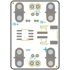
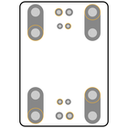
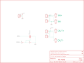
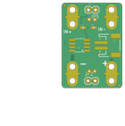
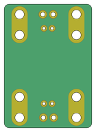

Contents
========

* [PRS11214 > MOSFET Power Controller](#prs11214--mosfet-power-controller)
	* [Schematic](#schematic)
	* [PCB](#pcb)
	* [Interactive BOM](#interactive-bom)
	* [OOMP Parts](#oomp-parts)
	* [Images](#images)
	* [Tags](#tags)
  
![][im]
# PRS11214 > MOSFET Power Controller

- ID: PROJ-SPAR-11214-STAN-01
- Hex ID: PRS11214
- Name: Sparkfun
- Description: Sparkfun
- Long Link: [http://oom.lt/PROJ-SPAR-11214-STAN-01](http://oom.lt/PROJ-SPAR-11214-STAN-01)
- Short Link: [http://oom.lt/PRS11214](http://oom.lt/PRS11214)

## Schematic
  

## PCB
  

## Interactive BOM

- Interactive BOM page: [ibom.html](https://htmlpreview.github.io/?https://github.com/oomlout/oomlout_OOMP_projects/blob/main/PROJ-SPAR-11214-STAN-01/kicad/bom/ibom.html)

## OOMP Parts
  

|OOMP ID|Name|Identifier|
| :---: | :---: | :---: |
|UNMATCHED-UNMATCHED-X-UNMATCHED-01||BH1, BH2, BH3, BH4, Q1|
|HEAD-I01-X-UNMATCHED-01||JP1, JP3, JP4|
|[HEAD-I01-X-PI02-01](https://github.com/oomlout/oomlout_OOMP_parts/tree/main/HEAD-I01-X-PI02-01/)|[2.54 mm 2 Pin Header](https://github.com/oomlout/oomlout_OOMP_parts/tree/main/HEAD-I01-X-PI02-01/)|[JP2, JP5](https://github.com/oomlout/oomlout_OOMP_parts/tree/main/HEAD-I01-X-PI02-01/)|
|[RESE-0402-X-O103-01](https://github.com/oomlout/oomlout_OOMP_parts/tree/main/RESE-0402-X-O103-01/)|[SMD (0402) 10k Ohm Resistor](https://github.com/oomlout/oomlout_OOMP_parts/tree/main/RESE-0402-X-O103-01/)|[R1](https://github.com/oomlout/oomlout_OOMP_parts/tree/main/RESE-0402-X-O103-01/)|
|[RESE-0402-X-O105-01](https://github.com/oomlout/oomlout_OOMP_parts/tree/main/RESE-0402-X-O105-01/)|[SMD (0402) 1M Ohm Resistor](https://github.com/oomlout/oomlout_OOMP_parts/tree/main/RESE-0402-X-O105-01/)|[R2](https://github.com/oomlout/oomlout_OOMP_parts/tree/main/RESE-0402-X-O105-01/)|

## Images
  
  

|bominteractivefront|bominteractiveback|kicadPcb3d|kicadPcb3dFront|kicadPcb3dBack|kicadSchem|eagleImage|eagleSchemImage|pcbdraw|pcbdrawback|
| :---: | :---: | :---: | :---: | :---: | :---: | :---: | :---: | :---: | :---: |
|||||||||||

## Tags

- hexID: PRS11214
- oompType: PROJ
- oompSize: SPAR
- oompColor: 11214
- oompDesc: STAN
- oompIndex: 01
- oompName: MOSFET Power Controller
- sources: All source files from https://github.com/sparkfun/MOSFET_Power_Controller (source licence details in srcLicense.md)
- linkBuyPage: https://www.sparkfun.com/products/11214
- oompID: PROJ-SPAR-11214-STAN-01
- oompParts: BH1,UNMATCHED-UNMATCHED-X-UNMATCHED-01
- oompParts: BH2,UNMATCHED-UNMATCHED-X-UNMATCHED-01
- oompParts: BH3,UNMATCHED-UNMATCHED-X-UNMATCHED-01
- oompParts: BH4,UNMATCHED-UNMATCHED-X-UNMATCHED-01
- oompParts: JP1,HEAD-I01-X-UNMATCHED-01
- oompParts: JP2,HEAD-I01-X-PI02-01
- oompParts: JP3,HEAD-I01-X-UNMATCHED-01
- oompParts: JP4,HEAD-I01-X-UNMATCHED-01
- oompParts: JP5,HEAD-I01-X-PI02-01
- oompParts: Q1,UNMATCHED-UNMATCHED-X-UNMATCHED-01
- oompParts: R1,RESE-0402-X-O103-01
- oompParts: R2,RESE-0402-X-O105-01
- rawParts: BH1,TRIG+,BUTTONHOLELARGE,BUTTONHOLE,,1,,,
- rawParts: BH2,TRIG-,BUTTONHOLELARGE,BUTTONHOLE,,1,,,
- rawParts: BH3,OUT+,BUTTONHOLELARGE,BUTTONHOLE,,1,,,
- rawParts: BH4,OUT-,BUTTONHOLELARGE,BUTTONHOLE,,1,,,
- rawParts: FRAME1,FRAME-LETTER,FRAME-LETTER,CREATIVE_COMMONS,Schematic Frame,,,,
- rawParts: JP1,JST-SMT,M02-JST-2MM-SMT,JST-2-SMD,Header 2,,CONN-08352,,
- rawParts: JP2,,M02PTH,1X02,Header 2,,,,
- rawParts: JP3,JST-PTH,M02-JST-2-PTH-NO_SILK,JST-2-PTH-NS,Header 2,1,,,
- rawParts: JP4,JST-PTH,M02-JST-2-PTH-NO_SILK,JST-2-PTH-NS,Header 2,1,,,
- rawParts: JP5,,M02PTH,1X02,Header 2,,,,
- rawParts: JP6,FIDUCIALUFIDUCIAL,FIDUCIALUFIDUCIAL,MICRO-FIDUCIAL,Fiducial Alignment Points,,,,
- rawParts: JP7,FIDUCIALUFIDUCIAL,FIDUCIALUFIDUCIAL,MICRO-FIDUCIAL,Fiducial Alignment Points,,,,
- rawParts: Q1,FDS6630A,MOSFET-NCHANNELFDS6630A,SO08,Common NMOSFET Parts,,IC-08089,,
- rawParts: R1,10k,RESISTOR0402-RES,0402-RES,Resistor,,RES-00824,,
- rawParts: R2,1M,1M-1%,0402-RES,1M-ohm SMT,,RES-07868,1M,

[im]: kicadPcb3d_450.png
