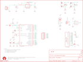

Contents
========

* [PRS11257 > Mr.Roboto](#prs11257--mrroboto)
	* [Schematic](#schematic)
	* [PCB](#pcb)
	* [Interactive BOM](#interactive-bom)
	* [OOMP Parts](#oomp-parts)
	* [Images](#images)
	* [Tags](#tags)
  
![][im]
# PRS11257 > Mr.Roboto

- ID: PROJ-SPAR-11257-STAN-01
- Hex ID: PRS11257
- Name: Sparkfun
- Description: Sparkfun
- Long Link: [http://oom.lt/PROJ-SPAR-11257-STAN-01](http://oom.lt/PROJ-SPAR-11257-STAN-01)
- Short Link: [http://oom.lt/PRS11257](http://oom.lt/PRS11257)

## Schematic
  

## PCB
  

## Interactive BOM

- Interactive BOM page: [ibom.html](https://htmlpreview.github.io/?https://github.com/oomlout/oomlout_OOMP_projects/blob/main/PROJ-SPAR-11257-STAN-01/kicad/bom/ibom.html)

## OOMP Parts
  

|OOMP Parts|
| :---: |
|[CAPC-0402-X-NF100-V10  SMD (0402) 100 nF Capacitor (Ceramic) 10v  C1, C2, C3, C10](https://github.com/oomlout/oomlout_OOMP_parts/tree/main/CAPC-0402-X-NF100-V10/)|
|CAPT-3216-X-UF10-01 C4|
|CAPX-3528-X-UF68-01 C5|
|DIOD-UNMATCHED-X-UNMATCHED-01 D1|
|UNMATCHED-SO235-X-UNMATCHED-01 IC1|
|UNMATCHED-UNMATCHED-X-UNMATCHED-01 JP1, JP2, JP4, JP5, JP6, JP7, JP8, JP10, L1, SG1, TP1, U1, U3, U4, Y1|
|HEAD-I01-X-UNMATCHED-01 JP3|
|[HEAD-I01-X-PI06-01  2.54 mm 6 Pin Header  JP9](https://github.com/oomlout/oomlout_OOMP_parts/tree/main/HEAD-I01-X-PI06-01/)|
|LEDS-UNMATCHED-R-STAN-01 LED2, LED3|
|UNMATCHED-SO23-X-UNMATCHED-01 Q1|
|RESE-UNMATCHED-X-O102-01 R1, R3|
|[RESE-0402-X-O103-01  SMD (0402) 10k Ohm Resistor  R2, R6](https://github.com/oomlout/oomlout_OOMP_parts/tree/main/RESE-0402-X-O103-01/)|
|RESE-UNMATCHED-X-UNMATCHED-01 R4, R5|

## Images
  
  

|bominteractivefront|bominteractiveback|kicadPcb3d|kicadPcb3dFront|kicadPcb3dBack|eagleImage|eagleSchemImage|pcbdraw|pcbdrawback|
| :---: | :---: | :---: | :---: | :---: | :---: | :---: | :---: | :---: |
||||||||||

## Tags

- hexID: PRS11257
- oompType: PROJ
- oompSize: SPAR
- oompColor: 11257
- oompDesc: STAN
- oompIndex: 01
- oompName: Mr.Roboto
- sources: All source files from https://github.com/sparkfun/Mr.Roboto (source licence details in srcLicense.md)
- linkBuyPage: https://www.sparkfun.com/products/11257
- oompID: PROJ-SPAR-11257-STAN-01
- oompParts: C1,CAPC-0402-X-NF100-V10
- oompParts: C2,CAPC-0402-X-NF100-V10
- oompParts: C3,CAPC-0402-X-NF100-V10
- oompParts: C4,CAPT-3216-X-UF10-01
- oompParts: C5,CAPX-3528-X-UF68-01
- oompParts: C10,CAPC-0402-X-NF100-V10
- oompParts: D1,DIOD-UNMATCHED-X-UNMATCHED-01
- oompParts: IC1,UNMATCHED-SO235-X-UNMATCHED-01
- oompParts: JP1,UNMATCHED-UNMATCHED-X-UNMATCHED-01
- oompParts: JP2,UNMATCHED-UNMATCHED-X-UNMATCHED-01
- oompParts: JP3,HEAD-I01-X-UNMATCHED-01
- oompParts: JP4,UNMATCHED-UNMATCHED-X-UNMATCHED-01
- oompParts: JP5,UNMATCHED-UNMATCHED-X-UNMATCHED-01
- oompParts: JP6,UNMATCHED-UNMATCHED-X-UNMATCHED-01
- oompParts: JP7,UNMATCHED-UNMATCHED-X-UNMATCHED-01
- oompParts: JP8,UNMATCHED-UNMATCHED-X-UNMATCHED-01
- oompParts: JP9,HEAD-I01-X-PI06-01
- oompParts: JP10,UNMATCHED-UNMATCHED-X-UNMATCHED-01
- oompParts: L1,UNMATCHED-UNMATCHED-X-UNMATCHED-01
- oompParts: LED2,LEDS-UNMATCHED-R-STAN-01
- oompParts: LED3,LEDS-UNMATCHED-R-STAN-01
- oompParts: Q1,UNMATCHED-SO23-X-UNMATCHED-01
- oompParts: R1,RESE-UNMATCHED-X-O102-01
- oompParts: R2,RESE-0402-X-O103-01
- oompParts: R3,RESE-UNMATCHED-X-O102-01
- oompParts: R4,RESE-UNMATCHED-X-UNMATCHED-01
- oompParts: R5,RESE-UNMATCHED-X-UNMATCHED-01
- oompParts: R6,RESE-0402-X-O103-01
- oompParts: SG1,UNMATCHED-UNMATCHED-X-UNMATCHED-01
- oompParts: TP1,UNMATCHED-UNMATCHED-X-UNMATCHED-01
- oompParts: U1,UNMATCHED-UNMATCHED-X-UNMATCHED-01
- oompParts: U3,UNMATCHED-UNMATCHED-X-UNMATCHED-01
- oompParts: U4,UNMATCHED-UNMATCHED-X-UNMATCHED-01
- oompParts: Y1,UNMATCHED-UNMATCHED-X-UNMATCHED-01
- rawParts: C1,0.1uF,CAP0402-CAP,0402-CAP,Capacitor,,
- rawParts: C2,0.1uF,CAP0402-CAP,0402-CAP,Capacitor,,
- rawParts: C3,0.1uF,CAP0402-CAP,0402-CAP,Capacitor,,
- rawParts: C4,10uF,CAP_POL1206,EIA3216,Capacitor Polarized,,
- rawParts: C5,68uF,CAP_POL3528,EIA3528,Capacitor Polarized,,
- rawParts: C10,0.1uF,CAP0402-CAP,0402-CAP,Capacitor,,
- rawParts: D1,MBRA140,DIODESMA,SMA-DIODE,Diode,,
- rawParts: IC1,NCP1402,V_REG_NCP1400SOT23-5,SOT23-5,Switching step-up voltage regulator,,
- rawParts: JP1,Long, Plastic,STAND-OFF,STAND-OFF,Stand Off,,
- rawParts: JP2,Long, Plastic,STAND-OFF,STAND-OFF,Stand Off,,
- rawParts: JP3,JST-PTH,M02JST-PTH-2-KIT,JST-2-PTH-KIT,Header 2,,
- rawParts: JP4,Long, Plastic,STAND-OFF,STAND-OFF,Stand Off,,
- rawParts: JP5,Long, Plastic,STAND-OFF,STAND-OFF,Stand Off,,
- rawParts: JP6,,JUMPER-2SMD-NO-NS,SJ_2S-NO-NS,Jumper,,
- rawParts: JP7,,JUMPER-2SMD-NO-NS,SJ_2S-NO-NS,Jumper,,
- rawParts: JP8,,JUMPER-2SMD-NO-NS,SJ_2S-NO-NS,Jumper,,
- rawParts: JP9,Program,ARDUINO_SERIAL_PROGRAMPTH-KIT,1X06-KIT,,,
- rawParts: JP10,,JUMPER-2SMD-NO-NS,SJ_2S-NO-NS,Jumper,,
- rawParts: JP11,FIDUCIAL1X2.5,FIDUCIAL1X2.5,FIDUCIAL-1X2.5,Fiducial Alignment Points,,
- rawParts: JP12,FIDUCIAL1X2.5,FIDUCIAL1X2.5,FIDUCIAL-1X2.5,Fiducial Alignment Points,,
- rawParts: L1,47uH,INDUCTORCR54,CR54,Inductors,,
- rawParts: LED2,RED,LED5MM-KIT,LED5MM-KIT,LEDs,,
- rawParts: LED3,RED,LED5MM-KIT,LED5MM-KIT,LEDs,,
- rawParts: Q1,,TRANSISTOR_NPNSOT23,SOT23,Transistor NPN,,
- rawParts: R1,1k,RESISTORKIT,AXIAL-0.3-KIT,Resistor,,
- rawParts: R2,10K,RESISTOR0402-RES,0402-RES,Resistor,,
- rawParts: R3,1k,RESISTORKIT,AXIAL-0.3-KIT,Resistor,,
- rawParts: R4,TRIMPOT-2,TRIMPOT-2,TRIMPOT_TC33,,,
- rawParts: R5,PHOTOCELLPTH,PHOTOCELLPTH-KIT,PHOTOCELL-KIT,Photocell Also known as a CdS photoresistor. This is a low cost way to detect light levels. Resistance decreases with more incoming light. SparkFun SKU: SEN-09088,,
- rawParts: R6,10k,RESISTOR0402-RES,0402-RES,Resistor,,
- rawParts: SG1,BUZZER,BUZZERPTH-NS-KIT,BUZZER-12MM-NS-KIT,Buzzer 12mm,,
- rawParts: TP1,TP,TEST-POINT3X5,PAD.03X.05,,,
- rawParts: U$1,CREATIVE_COMMONS,CREATIVE_COMMONS,CREATIVE_COMMONS,,,
- rawParts: U$2,OSHW-LOGOM,OSHW-LOGOM,OSHW-LOGO-M,Open Source Hardware Logo This logo indicates the piece of hardware it is found on incorporates a OSHW license and/or adheres to the definition of open source hardware found here: http://freedomdefined.org/OSHW,,
- rawParts: U$3,LOGO-SFENEW,LOGO-SFENEW,SFE-NEW-WEBLOGO,Spark Fun Electronics PCB Logo,,
- rawParts: U1,ATmega328,ATMEGA168,TQFP32-08,,,
- rawParts: U3,LCD-8x2,LCD-16X28X2-KIT,LCD-8X2-KIT,,,
- rawParts: U4,,TMP36TO-92-KIT,TO-92-KIT,,,
- rawParts: Y1,16mhz,RESONATORSMD,RESONATOR-SMD,Resonator,,

[im]: kicadPcb3d_450.png
