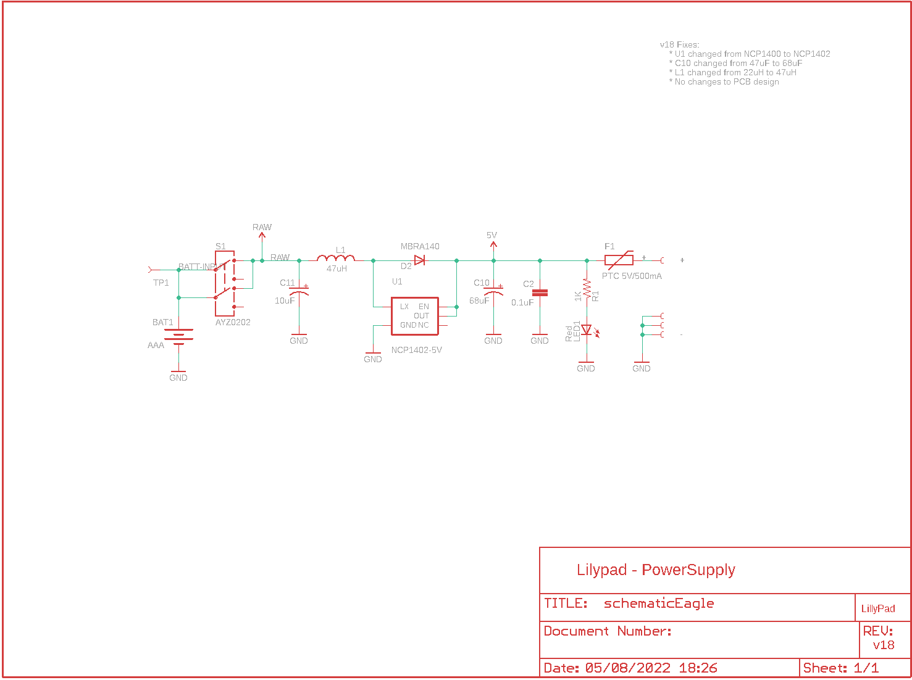
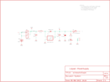

Contents
========

* [PRS11259 > Sparkfun](#prs11259--sparkfun)
	* [Schematic](#schematic)
	* [Interactive BOM](#interactive-bom)
	* [OOMP Parts](#oomp-parts)
	* [Images](#images)
	* [Tags](#tags)
  
![][im]
# PRS11259 > Sparkfun

- ID: PROJ-SPAR-11259-STAN-01
- Hex ID: PRS11259
- Name: Sparkfun
- Description: Sparkfun
- Long Link: [http://oom.lt/PROJ-SPAR-11259-STAN-01](http://oom.lt/PROJ-SPAR-11259-STAN-01)
- Short Link: [http://oom.lt/PRS11259](http://oom.lt/PRS11259)

## Schematic
  

## Interactive BOM

- Interactive BOM page: [ibom.html](https://htmlpreview.github.io/?https://github.com/oomlout/oomlout_OOMP_projects/blob/main/PROJ-SPAR-11259-STAN-01/kicad/bom/ibom.html)

## OOMP Parts
  

|OOMP Parts|
| :---: |
|BAT1,UNMATCHED-UNMATCHED-UNMATCHED-UNMATCHED-UNMATCHED,BAT1,AAA,BATTERYAAA,BATTERY-AAA,Battery Holders,,|
|C2,UNMATCHED-UNMATCHED-UNMATCHED-UNMATCHED-UNMATCHED,C2,0.1uF,CAP0603-CAP,0603-CAP,Capacitor,,|
|C10,UNMATCHED-UNMATCHED-UNMATCHED-UNMATCHED-UNMATCHED,C10,68uF,CAP_POL2,EIA3528-21,,,|
|C11,UNMATCHED-UNMATCHED-UNMATCHED-UNMATCHED-UNMATCHED,C11,10uF,CAP_POL1206,CPOL_1206,,,|
|D2,UNMATCHED-UNMATCHED-UNMATCHED-UNMATCHED-UNMATCHED,D2,MBRA140,DIODESMA,SMA-DIODE,,,|
|F1,UNMATCHED-UNMATCHED-UNMATCHED-UNMATCHED-UNMATCHED,F1,PTC 5V/500mA,PTCSMD,PTC-1206,Resettable Fuse PTC,,|
|L1,UNMATCHED-UNMATCHED-UNMATCHED-UNMATCHED-UNMATCHED,L1,47uH,INDUCTORCR54,CR54,Basic Inductor/Choke - 0603 and 1206,,|
|LED1,UNMATCHED-UNMATCHED-UNMATCHED-UNMATCHED-UNMATCHED,LED1,Red,LED1206,LED-1206,LEDs,,|
|R1,UNMATCHED-UNMATCHED-UNMATCHED-UNMATCHED-UNMATCHED,R1,1K,RESISTOR0603-RES,0603-RES,Resistor,,|
|S1,UNMATCHED-UNMATCHED-UNMATCHED-UNMATCHED-UNMATCHED,S1,AYZ0202,AYZ0202,AYZ0202,SPDT Slide Switch,,|
|TP1,UNMATCHED-UNMATCHED-UNMATCHED-UNMATCHED-UNMATCHED,TP1,,TEST-POINT3X5,PAD.03X.05,,,|
|U$1,UNMATCHED-UNMATCHED-UNMATCHED-UNMATCHED-UNMATCHED,U$1,SEWTAP10,SEWTAP10,PETAL-LONG-2-2SIDE,,,|
|U$2,UNMATCHED-UNMATCHED-UNMATCHED-UNMATCHED-UNMATCHED,U$2,SEWTAP10,SEWTAP10,PETAL-LONG-2-2SIDE,,,|
|U$4,UNMATCHED-UNMATCHED-UNMATCHED-UNMATCHED-UNMATCHED,U$4,SEWTAP10,SEWTAP10,PETAL-LONG-2-2SIDE,,,|
|U$5,UNMATCHED-UNMATCHED-UNMATCHED-UNMATCHED-UNMATCHED,U$5,SEWTAP10,SEWTAP10,PETAL-LONG-2-2SIDE,,,|
|U$7,UNMATCHED-UNMATCHED-UNMATCHED-UNMATCHED-UNMATCHED,U$7,LOGO-LPLP,LOGO-LPLP,LOGO-LILYPAD,,,|
|U1,UNMATCHED-UNMATCHED-UNMATCHED-UNMATCHED-UNMATCHED,U1,NCP1402-5V,V_REG_NCP1400SOT23-5,SOT23-5,Switching step-up voltage regulator,,|

## Images
  
  

|kicadPcb3d|kicadPcb3dFront|kicadPcb3dBack|eagleImage|eagleSchemImage|
| :---: | :---: | :---: | :---: | :---: |
||||||

## Tags

- hexID: PRS11259
- oompType: PROJ
- oompSize: SPAR
- oompColor: 11259
- oompDesc: STAN
- oompIndex: 01
- oompName: LilyPad Power Supply
- sources: All source files from https://github.com/sparkfun/LilyPad_Power_Supply (source licence details in srcLicense.md)
- linkBuyPage: https://www.sparkfun.com/products/11259
- oompID: PROJ-SPAR-11259-STAN-01
- oompParts: BAT1,UNMATCHED-UNMATCHED-UNMATCHED-UNMATCHED-UNMATCHED
- oompParts: C2,UNMATCHED-UNMATCHED-UNMATCHED-UNMATCHED-UNMATCHED
- oompParts: C10,UNMATCHED-UNMATCHED-UNMATCHED-UNMATCHED-UNMATCHED
- oompParts: C11,UNMATCHED-UNMATCHED-UNMATCHED-UNMATCHED-UNMATCHED
- oompParts: D2,UNMATCHED-UNMATCHED-UNMATCHED-UNMATCHED-UNMATCHED
- oompParts: F1,UNMATCHED-UNMATCHED-UNMATCHED-UNMATCHED-UNMATCHED
- oompParts: L1,UNMATCHED-UNMATCHED-UNMATCHED-UNMATCHED-UNMATCHED
- oompParts: LED1,UNMATCHED-UNMATCHED-UNMATCHED-UNMATCHED-UNMATCHED
- oompParts: R1,UNMATCHED-UNMATCHED-UNMATCHED-UNMATCHED-UNMATCHED
- oompParts: S1,UNMATCHED-UNMATCHED-UNMATCHED-UNMATCHED-UNMATCHED
- oompParts: TP1,UNMATCHED-UNMATCHED-UNMATCHED-UNMATCHED-UNMATCHED
- oompParts: U$1,UNMATCHED-UNMATCHED-UNMATCHED-UNMATCHED-UNMATCHED
- oompParts: U$2,UNMATCHED-UNMATCHED-UNMATCHED-UNMATCHED-UNMATCHED
- oompParts: U$4,UNMATCHED-UNMATCHED-UNMATCHED-UNMATCHED-UNMATCHED
- oompParts: U$5,UNMATCHED-UNMATCHED-UNMATCHED-UNMATCHED-UNMATCHED
- oompParts: U$7,UNMATCHED-UNMATCHED-UNMATCHED-UNMATCHED-UNMATCHED
- oompParts: U1,UNMATCHED-UNMATCHED-UNMATCHED-UNMATCHED-UNMATCHED
- rawParts: BAT1,AAA,BATTERYAAA,BATTERY-AAA,Battery Holders,,
- rawParts: C2,0.1uF,CAP0603-CAP,0603-CAP,Capacitor,,
- rawParts: C10,68uF,CAP_POL2,EIA3528-21,,,
- rawParts: C11,10uF,CAP_POL1206,CPOL_1206,,,
- rawParts: D2,MBRA140,DIODESMA,SMA-DIODE,,,
- rawParts: F1,PTC 5V/500mA,PTCSMD,PTC-1206,Resettable Fuse PTC,,
- rawParts: L1,47uH,INDUCTORCR54,CR54,Basic Inductor/Choke - 0603 and 1206,,
- rawParts: LED1,Red,LED1206,LED-1206,LEDs,,
- rawParts: R1,1K,RESISTOR0603-RES,0603-RES,Resistor,,
- rawParts: S1,AYZ0202,AYZ0202,AYZ0202,SPDT Slide Switch,,
- rawParts: TP1,,TEST-POINT3X5,PAD.03X.05,,,
- rawParts: U$1,SEWTAP10,SEWTAP10,PETAL-LONG-2-2SIDE,,,
- rawParts: U$2,SEWTAP10,SEWTAP10,PETAL-LONG-2-2SIDE,,,
- rawParts: U$4,SEWTAP10,SEWTAP10,PETAL-LONG-2-2SIDE,,,
- rawParts: U$5,SEWTAP10,SEWTAP10,PETAL-LONG-2-2SIDE,,,
- rawParts: U$7,LOGO-LPLP,LOGO-LPLP,LOGO-LILYPAD,,,
- rawParts: U1,NCP1402-5V,V_REG_NCP1400SOT23-5,SOT23-5,Switching step-up voltage regulator,,

[im]: kicadPcb3d_450.png
