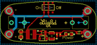
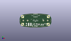
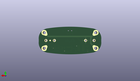
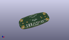

Contents
========

* [PROJ-SPAR-11259-STAN-01>LilyPad Power Supply](#proj-spar-11259-stan-01lilypad-power-supply)
	* [Images](#images)
	* [Interactive BOM](#interactive-bom)
	* [OOMP Parts](#oomp-parts)
	* [Tags](#tags)
  
![][im]
# PROJ-SPAR-11259-STAN-01>LilyPad Power Supply

- ID: PROJ-SPAR-11259-STAN-01
- Hex ID: PRS11259
- Name: LilyPad Power Supply
- Description: 

## Images
  
  

|eagleImage|kicadPcb3dFront|kicadPcb3dBack|kicadPcb3d|
| :---: | :---: | :---: | :---: |
|||||

## Interactive BOM

- Interactive BOM page: [ibom.html](kicad/bom/ibom.html)

## OOMP Parts
  

|OOMP Parts|
| :---: |
|UNMATCHED-UNMATCHED-X-UNMATCHED-01, BAT1, 0.0, 0.0, 180,BAT1, AAA, BATTERY-AAA, SparkFun, (0, 0), R180|
|<table><tr><td></td><td> C2</td><td>[CAPC-0603-X-NF100-V50 SMD (0603) 100 nF Capacitor (Ceramic) 50v](https://github.com/oomlout/oomlout_OOMP_parts/tree/main/CAPC-0603-X-NF100-V50/)</td><td>[C6N100](https://github.com/oomlout/oomlout_OOMP_parts/tree/main/CAPC-0603-X-NF100-V50/)</td></tr></table>|
|CAPE-UNMATCHED-X-UNMATCHED-01, C10, 2.000000064, -8.000000002, 180,C10, 68uF, EIA3528-21, SparkFun-Nate, (0.07874016, -0.31496063), R180|
|CAPC-UNMATCHED-X-UNMATCHED-01, C11, -16.000000004, -6.999999969999999, 180,C11, 10uF, CPOL_1206, SparkFun-Nate, (-0.62992126, -0.27559055), R180|
|UNMATCHED-UNMATCHED-X-UNMATCHED-01, D2, -3.000000096, -9.500000049999999, 0,D2, MBRA140, SMA-DIODE, SparkFun-Nate, (-0.11811024, -0.37401575), R0|
|ERROR, F1 PTC 5V/500mA, 0, 0, 0,F1, PTC, 5V/500mA, PTC-1206, SparkFun, (0.70866142, -0.23622047), R0|
|UNMATCHED-UNMATCHED-X-UNMATCHED-01, L1, -10.000000066, -6.999999969999999, 270,L1, 47uH, CR54, SparkFun-Nate, (-0.39370079, -0.27559055), R270|
|UNMATCHED-UNMATCHED-X-UNMATCHED-01, LED1, 11.999999875999999, -6.999999969999999, 0,LED1, Red, LED-1206, SparkFun, (0.47244094, -0.27559055), R0|
|RESE-0603-X-UNMATCHED-01, R1, 6.999999969999999, -6.999999969999999, 90,R1, 1K, 0603-RES, SparkFun, (0.27559055, -0.27559055), R90|
|UNMATCHED-UNMATCHED-X-UNMATCHED-01, S1, 0.0, 9.000000034, 180,S1, AYZ0202, AYZ0202, SparkFun, (0, 0.35433071), R180|
|UNMATCHED-UNMATCHED-X-UNMATCHED-01, U$1, 22.999999973999998, -6.999999969999999, 45,U$1, SEWTAP10, PETAL-LONG-2-2SIDE, LilyPad-Wearables, (0.90551181, -0.27559055), R45|
|UNMATCHED-UNMATCHED-X-UNMATCHED-01, U$2, -22.999999973999998, 6.999999969999999, 225,U$2, SEWTAP10, PETAL-LONG-2-2SIDE, LilyPad-Wearables, (-0.90551181, 0.27559055), R225|
|UNMATCHED-UNMATCHED-X-UNMATCHED-01, U$4, 22.999999973999998, 6.999999969999999, 135,U$4, SEWTAP10, PETAL-LONG-2-2SIDE, LilyPad-Wearables, (0.90551181, 0.27559055), R135|
|UNMATCHED-UNMATCHED-X-UNMATCHED-01, U$5, -22.999999973999998, -6.999999969999999, 315,U$5, SEWTAP10, PETAL-LONG-2-2SIDE, LilyPad-Wearables, (-0.90551181, -0.27559055), R315|
|UNMATCHED-UNMATCHED-X-UNMATCHED-01, U1, -3.000000096, -5.999999937999999, 90,U1, NCP1402-5V, SOT23-5, SparkFun, (-0.11811024, -0.23622047), R90|

## Tags

- hexID: PRS11259
- oompType: PROJ
- oompSize: SPAR
- oompColor: 11259
- oompDesc: STAN
- oompIndex: 01
- oompName: LilyPad Power Supply
- sources: All source files from https://github.com/sparkfun/LilyPad_Power_Supply (source licence details in srcLicense.md)
- linkBuyPage: https://www.sparkfun.com/products/11259
- oompPart: UNMATCHED-UNMATCHED-X-UNMATCHED-01, BAT1, 0.0, 0.0, 180
- oompPart: CAPC-0603-X-NF100-V50, C2, 4.999999905999999, -6.999999969999999, 270
- oompPart: CAPE-UNMATCHED-X-UNMATCHED-01, C10, 2.000000064, -8.000000002, 180
- oompPart: CAPC-UNMATCHED-X-UNMATCHED-01, C11, -16.000000004, -6.999999969999999, 180
- oompPart: UNMATCHED-UNMATCHED-X-UNMATCHED-01, D2, -3.000000096, -9.500000049999999, 0
- oompPart: ERROR, F1 PTC 5V/500mA, 0, 0, 0
- oompPart: UNMATCHED-UNMATCHED-X-UNMATCHED-01, L1, -10.000000066, -6.999999969999999, 270
- oompPart: UNMATCHED-UNMATCHED-X-UNMATCHED-01, LED1, 11.999999875999999, -6.999999969999999, 0
- oompPart: RESE-0603-X-UNMATCHED-01, R1, 6.999999969999999, -6.999999969999999, 90
- oompPart: UNMATCHED-UNMATCHED-X-UNMATCHED-01, S1, 0.0, 9.000000034, 180
- oompPart: SKIP-UNMATCHED-X-UNMATCHED-01, TP1, 17.779999999999998, 0.0, M0
- oompPart: UNMATCHED-UNMATCHED-X-UNMATCHED-01, U$1, 22.999999973999998, -6.999999969999999, 45
- oompPart: UNMATCHED-UNMATCHED-X-UNMATCHED-01, U$2, -22.999999973999998, 6.999999969999999, 225
- oompPart: UNMATCHED-UNMATCHED-X-UNMATCHED-01, U$4, 22.999999973999998, 6.999999969999999, 135
- oompPart: UNMATCHED-UNMATCHED-X-UNMATCHED-01, U$5, -22.999999973999998, -6.999999969999999, 315
- oompPart: UNMATCHED-UNMATCHED-X-UNMATCHED-01, U1, -3.000000096, -5.999999937999999, 90
- rawPart: BAT1, AAA, BATTERY-AAA, SparkFun, (0, 0), R180
- rawPart: C2, 0.1uF, 0603-CAP, SparkFun, (0.19685039, -0.27559055), R270
- rawPart: C10, 68uF, EIA3528-21, SparkFun-Nate, (0.07874016, -0.31496063), R180
- rawPart: C11, 10uF, CPOL_1206, SparkFun-Nate, (-0.62992126, -0.27559055), R180
- rawPart: D2, MBRA140, SMA-DIODE, SparkFun-Nate, (-0.11811024, -0.37401575), R0
- rawPart: F1, PTC, 5V/500mA, PTC-1206, SparkFun, (0.70866142, -0.23622047), R0
- rawPart: L1, 47uH, CR54, SparkFun-Nate, (-0.39370079, -0.27559055), R270
- rawPart: LED1, Red, LED-1206, SparkFun, (0.47244094, -0.27559055), R0
- rawPart: R1, 1K, 0603-RES, SparkFun, (0.27559055, -0.27559055), R90
- rawPart: S1, AYZ0202, AYZ0202, SparkFun, (0, 0.35433071), R180
- rawPart: TP1, PAD.03X.05, SparkFun, (0.7, 0), MR0
- rawPart: U$1, SEWTAP10, PETAL-LONG-2-2SIDE, LilyPad-Wearables, (0.90551181, -0.27559055), R45
- rawPart: U$2, SEWTAP10, PETAL-LONG-2-2SIDE, LilyPad-Wearables, (-0.90551181, 0.27559055), R225
- rawPart: U$4, SEWTAP10, PETAL-LONG-2-2SIDE, LilyPad-Wearables, (0.90551181, 0.27559055), R135
- rawPart: U$5, SEWTAP10, PETAL-LONG-2-2SIDE, LilyPad-Wearables, (-0.90551181, -0.27559055), R315
- rawPart: U1, NCP1402-5V, SOT23-5, SparkFun, (-0.11811024, -0.23622047), R90
- oompID: PROJ-SPAR-11259-STAN-01

[im]: kicadPcb3d_450.png
