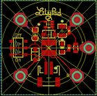
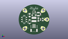
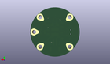
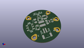

Contents
========

* [PROJ-SPAR-11260-STAN-01>LilyPad LiPower](#proj-spar-11260-stan-01lilypad-lipower)
	* [Images](#images)
	* [Interactive BOM](#interactive-bom)
	* [Tags](#tags)
  
![][im]
# PROJ-SPAR-11260-STAN-01>LilyPad LiPower

- ID: PROJ-SPAR-11260-STAN-01
- Hex ID: PRS11260
- Name: LilyPad LiPower
- Description: 

## Images
  
  

|eagleImage|kicadPcb3dFront|kicadPcb3dBack|kicadPcb3d|
| :---: | :---: | :---: | :---: |
|||||

## Interactive BOM

- Interactive BOM page: [ibom.html](kicad/bom/ibom.html)

## Tags

- hexID: PRS11260
- oompType: PROJ
- oompSize: SPAR
- oompColor: 11260
- oompDesc: STAN
- oompIndex: 01
- oompName: LilyPad LiPower
- sources: All source files from https://github.com/sparkfun/LilyPad_LiPower (source licence details in srcLicense.md)
- linkBuyPage: https://www.sparkfun.com/products/11260
- oompID: PROJ-SPAR-11260-STAN-01
- oompParts: 100MA,UNMATCHED-UNMATCHED-UNMATCHED-UNMATCHED-UNMATCHED
- oompParts: C2,UNMATCHED-UNMATCHED-UNMATCHED-UNMATCHED-UNMATCHED
- oompParts: C10,UNMATCHED-UNMATCHED-UNMATCHED-UNMATCHED-UNMATCHED
- oompParts: C11,UNMATCHED-UNMATCHED-UNMATCHED-UNMATCHED-UNMATCHED
- oompParts: D1,UNMATCHED-UNMATCHED-UNMATCHED-UNMATCHED-UNMATCHED
- oompParts: D2,UNMATCHED-UNMATCHED-UNMATCHED-UNMATCHED-UNMATCHED
- oompParts: JP1,UNMATCHED-UNMATCHED-UNMATCHED-UNMATCHED-UNMATCHED
- oompParts: L1,UNMATCHED-UNMATCHED-UNMATCHED-UNMATCHED-UNMATCHED
- oompParts: LED1,UNMATCHED-UNMATCHED-UNMATCHED-UNMATCHED-UNMATCHED
- oompParts: R1,UNMATCHED-UNMATCHED-UNMATCHED-UNMATCHED-UNMATCHED
- oompParts: S1,UNMATCHED-UNMATCHED-UNMATCHED-UNMATCHED-UNMATCHED
- oompParts: U$1,UNMATCHED-UNMATCHED-UNMATCHED-UNMATCHED-UNMATCHED
- oompParts: U$2,UNMATCHED-UNMATCHED-UNMATCHED-UNMATCHED-UNMATCHED
- oompParts: U$3,UNMATCHED-UNMATCHED-UNMATCHED-UNMATCHED-UNMATCHED
- oompParts: U$4,UNMATCHED-UNMATCHED-UNMATCHED-UNMATCHED-UNMATCHED
- oompParts: U$5,UNMATCHED-UNMATCHED-UNMATCHED-UNMATCHED-UNMATCHED
- oompParts: U$7,UNMATCHED-UNMATCHED-UNMATCHED-UNMATCHED-UNMATCHED
- oompParts: U1,UNMATCHED-UNMATCHED-UNMATCHED-UNMATCHED-UNMATCHED
- rawParts: 100MA,PTC,PTCSMD,PTC-1206,Resettable Fuse PTC,,
- rawParts: C2,0.1uF,CAP0603-CAP,0603-CAP,Capacitor,,
- rawParts: C10,47uF,CAP_POL2,EIA3528-21,,,
- rawParts: C11,10uF,CAP_POL1206,CPOL_1206,,,
- rawParts: D1,MBRA140,DIODESMA,SMA-DIODE,,,
- rawParts: D2,MBRA140,DIODESMA,SMA-DIODE,,,
- rawParts: JP1,LiPo,M02-JST-2MM-SMT,JST-2-SMD,Header 2,,
- rawParts: L1,22uH,INDUCTORCR54,CR54,Basic Inductor/Choke - 0603 and 1206,,
- rawParts: LED1,Red,LED1206,LED-1206,LEDs,,
- rawParts: R1,1K,RESISTOR0603-RES,0603-RES,Resistor,,
- rawParts: S1,AYZ0202,AYZ0202,AYZ0202,SPDT Slide Switch,,
- rawParts: U$1,SEWTAP10,SEWTAP10,PETAL-LONG-2-2SIDE,,,
- rawParts: U$2,SEWTAP10,SEWTAP10,PETAL-LONG-2-2SIDE,,,
- rawParts: U$3,SEWTAP10,SEWTAP10,PETAL-LONG-2-2SIDE,,,
- rawParts: U$4,SEWTAP10,SEWTAP10,PETAL-LONG-2-2SIDE,,,
- rawParts: U$5,SEWTAP10,SEWTAP10,PETAL-LONG-2-2SIDE,,,
- rawParts: U$7,LOGO-LPLP,LOGO-LPLP,LOGO-LILYPAD,,,
- rawParts: U1,NCP1400-5V,V_REG_NCP1400SOT23-5,SOT23-5,Switching step-up voltage regulator,,

[im]: kicadPcb3d_450.png
