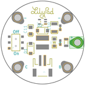
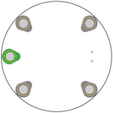
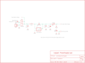

Contents
========

* [PRS11260 > LilyPad LiPower](#prs11260--lilypad-lipower)
	* [Schematic](#schematic)
	* [PCB](#pcb)
	* [Interactive BOM](#interactive-bom)
	* [OOMP Parts](#oomp-parts)
	* [Images](#images)
	* [Tags](#tags)
  
![][im]
# PRS11260 > LilyPad LiPower

- ID: PROJ-SPAR-11260-STAN-01
- Hex ID: PRS11260
- Name: Sparkfun
- Description: Sparkfun
- Long Link: [http://oom.lt/PROJ-SPAR-11260-STAN-01](http://oom.lt/PROJ-SPAR-11260-STAN-01)
- Short Link: [http://oom.lt/PRS11260](http://oom.lt/PRS11260)

## Schematic
  

## PCB
  

## Interactive BOM

- Interactive BOM page: [ibom.html](https://htmlpreview.github.io/?https://github.com/oomlout/oomlout_OOMP_projects/blob/main/PROJ-SPAR-11260-STAN-01/kicad/bom/ibom.html)

## OOMP Parts
  

|OOMP ID|Name|Identifier|
| :---: | :---: | :---: |
|REFU-1206-X-UNMATCHED-01||100MA|
|[CAPC-0603-X-NF100-V50](https://github.com/oomlout/oomlout_OOMP_parts/tree/main/CAPC-0603-X-NF100-V50/)|[SMD (0603) 100 nF Capacitor (Ceramic) 50v](https://github.com/oomlout/oomlout_OOMP_parts/tree/main/CAPC-0603-X-NF100-V50/)|[C2](https://github.com/oomlout/oomlout_OOMP_parts/tree/main/CAPC-0603-X-NF100-V50/)|
|CAPX-3528-X-UF47-01||C10|
|[CAPC-1206-X-UF10-V25](https://github.com/oomlout/oomlout_OOMP_parts/tree/main/CAPC-1206-X-UF10-V25/)|[SMD (1206) 10 uF Capacitor (Ceramic) 25v](https://github.com/oomlout/oomlout_OOMP_parts/tree/main/CAPC-1206-X-UF10-V25/)|[C11](https://github.com/oomlout/oomlout_OOMP_parts/tree/main/CAPC-1206-X-UF10-V25/)|
|DIOD-UNMATCHED-X-UNMATCHED-01||D1, D2|
|HEAD-I01-X-UNMATCHED-01||JP1|
|UNMATCHED-UNMATCHED-X-UNMATCHED-01||L1, S1|
|LEDS-1206-R-STAN-01||LED1|
|[RESE-0603-X-O102-01](https://github.com/oomlout/oomlout_OOMP_parts/tree/main/RESE-0603-X-O102-01/)|[SMD (0603) 1k Ohm Resistor](https://github.com/oomlout/oomlout_OOMP_parts/tree/main/RESE-0603-X-O102-01/)|[R1](https://github.com/oomlout/oomlout_OOMP_parts/tree/main/RESE-0603-X-O102-01/)|
|UNMATCHED-SO235-X-UNMATCHED-01||U1|

## Images
  
  

|bominteractivefront|bominteractiveback|kicadPcb3d|kicadPcb3dFront|kicadPcb3dBack|eagleImage|eagleSchemImage|
| :---: | :---: | :---: | :---: | :---: | :---: | :---: |
||||||||

## Tags

- hexID: PRS11260
- oompType: PROJ
- oompSize: SPAR
- oompColor: 11260
- oompDesc: STAN
- oompIndex: 01
- oompName: LilyPad LiPower
- sources: All source files from https://github.com/sparkfun/LilyPad_LiPower (source licence details in srcLicense.md)
- linkBuyPage: https://www.sparkfun.com/products/11260
- oompID: PROJ-SPAR-11260-STAN-01
- oompParts: 100MA,REFU-1206-X-UNMATCHED-01
- oompParts: C2,CAPC-0603-X-NF100-V50
- oompParts: C10,CAPX-3528-X-UF47-01
- oompParts: C11,CAPC-1206-X-UF10-V25
- oompParts: D1,DIOD-UNMATCHED-X-UNMATCHED-01
- oompParts: D2,DIOD-UNMATCHED-X-UNMATCHED-01
- oompParts: JP1,HEAD-I01-X-UNMATCHED-01
- oompParts: L1,UNMATCHED-UNMATCHED-X-UNMATCHED-01
- oompParts: LED1,LEDS-1206-R-STAN-01
- oompParts: R1,RESE-0603-X-O102-01
- oompParts: S1,UNMATCHED-UNMATCHED-X-UNMATCHED-01
- oompParts: U1,UNMATCHED-SO235-X-UNMATCHED-01
- rawParts: 100MA,PTC,PTCSMD,PTC-1206,Resettable Fuse PTC,,
- rawParts: C2,0.1uF,CAP0603-CAP,0603-CAP,Capacitor,,
- rawParts: C10,47uF,CAP_POL2,EIA3528-21,,,
- rawParts: C11,10uF,CAP_POL1206,CPOL_1206,,,
- rawParts: D1,MBRA140,DIODESMA,SMA-DIODE,,,
- rawParts: D2,MBRA140,DIODESMA,SMA-DIODE,,,
- rawParts: JP1,LiPo,M02-JST-2MM-SMT,JST-2-SMD,Header 2,,
- rawParts: L1,22uH,INDUCTORCR54,CR54,Basic Inductor/Choke - 0603 and 1206,,
- rawParts: LED1,Red,LED1206,LED-1206,LEDs,,
- rawParts: R1,1K,RESISTOR0603-RES,0603-RES,Resistor,,
- rawParts: S1,AYZ0202,AYZ0202,AYZ0202,SPDT Slide Switch,,
- rawParts: U$1,SEWTAP10,SEWTAP10,PETAL-LONG-2-2SIDE,,,
- rawParts: U$2,SEWTAP10,SEWTAP10,PETAL-LONG-2-2SIDE,,,
- rawParts: U$3,SEWTAP10,SEWTAP10,PETAL-LONG-2-2SIDE,,,
- rawParts: U$4,SEWTAP10,SEWTAP10,PETAL-LONG-2-2SIDE,,,
- rawParts: U$5,SEWTAP10,SEWTAP10,PETAL-LONG-2-2SIDE,,,
- rawParts: U$7,LOGO-LPLP,LOGO-LPLP,LOGO-LILYPAD,,,
- rawParts: U1,NCP1400-5V,V_REG_NCP1400SOT23-5,SOT23-5,Switching step-up voltage regulator,,

[im]: kicadPcb3d_450.png
