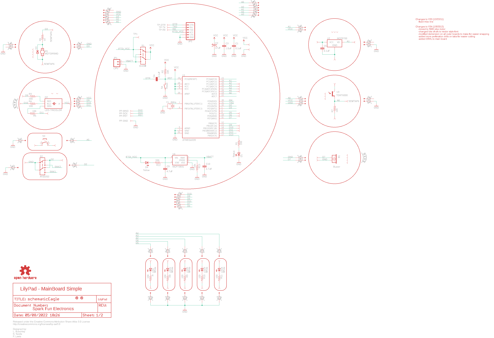
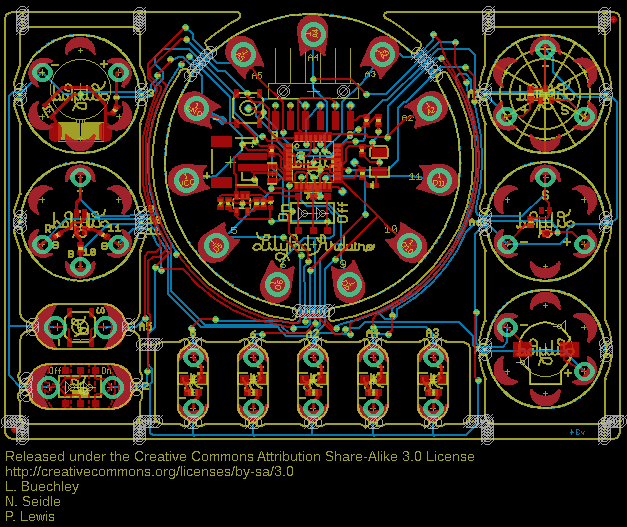
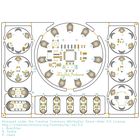
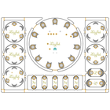
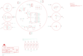

Contents
========

* [PRS11262 > ProtoSnap-LilyPad Development Board](#prs11262--protosnap-lilypad-development-board)
	* [Schematic](#schematic)
	* [PCB](#pcb)
	* [Interactive BOM](#interactive-bom)
	* [OOMP Parts](#oomp-parts)
	* [Images](#images)
	* [Tags](#tags)
  
![][im]
# PRS11262 > ProtoSnap-LilyPad Development Board

- ID: PROJ-SPAR-11262-STAN-01
- Hex ID: PRS11262
- Name: Sparkfun
- Description: Sparkfun
- Long Link: [http://oom.lt/PROJ-SPAR-11262-STAN-01](http://oom.lt/PROJ-SPAR-11262-STAN-01)
- Short Link: [http://oom.lt/PRS11262](http://oom.lt/PRS11262)

## Schematic
  

## PCB
  

## Interactive BOM

- Interactive BOM page: [ibom.html](https://htmlpreview.github.io/?https://github.com/oomlout/oomlout_OOMP_projects/blob/main/PROJ-SPAR-11262-STAN-01/kicad/bom/ibom.html)

## OOMP Parts
  

|OOMP Parts|
| :---: |
|UNMATCHED-UNMATCHED-X-UNMATCHED-01 B1, M1, PP-GND, PP-MISO, PP-RST, PP-SCK, S1, S2, S3, S4, TP-DTR, TP-RX, TP-TX, TP1, U1, U3, Y1|
|[CAPC-0402-X-NF100-V10  SMD (0402) 100 nF Capacitor (Ceramic) 10v  C1, C4](https://github.com/oomlout/oomlout_OOMP_parts/tree/main/CAPC-0402-X-NF100-V10/)|
|CAPX-3528-X-UF47-01 C2|
|CAPC-0402-X-UNMATCHED-01 C3|
|[CAPC-0603-X-NF100-V50  SMD (0603) 100 nF Capacitor (Ceramic) 50v  C5](https://github.com/oomlout/oomlout_OOMP_parts/tree/main/CAPC-0603-X-NF100-V50/)|
|[CAPC-0402-X-UF47D-V63D  SMD (0402) 4.7 uF Capacitor (Ceramic) 6.3v  C9, C10](https://github.com/oomlout/oomlout_OOMP_parts/tree/main/CAPC-0402-X-UF47D-V63D/)|
|[LEDS-0603-G-STAN-01  SMD (0603) Green LED  D1](https://github.com/oomlout/oomlout_OOMP_parts/tree/main/LEDS-0603-G-STAN-01/)|
|LEDS-UNMATCHED-G-STAN-01 D2|
|DIOD-S323-X-UNMATCHED-01 D3|
|[LEDS-0603-Y-STAN-01  SMD (0603) Yellow LED  D4](https://github.com/oomlout/oomlout_OOMP_parts/tree/main/LEDS-0603-Y-STAN-01/)|
|HEAD-I01-X-UNMATCHED-01 JP1|
|[HEAD-I01-X-PI06-01  2.54 mm 6 Pin Header  JP2](https://github.com/oomlout/oomlout_OOMP_parts/tree/main/HEAD-I01-X-PI06-01/)|
|LEDS-1206-G-STAN-01 LED, LED1, LED2, LED3, LED4|
|[RESE-0603-X-O101-01  SMD (0603) 100 Ohm Resistor  R, R8, R9, R10, R11](https://github.com/oomlout/oomlout_OOMP_parts/tree/main/RESE-0603-X-O101-01/)|
|RESE-0402-X-O331-01 R1, R12|
|[RESE-0402-X-O103-01  SMD (0402) 10k Ohm Resistor  R2, R7, R13](https://github.com/oomlout/oomlout_OOMP_parts/tree/main/RESE-0402-X-O103-01/)|
|RESE-0402-X-O201-01 R3|
|[RESE-0402-X-O101-01  SMD (0402) 100 Ohm Resistor  R4, R5](https://github.com/oomlout/oomlout_OOMP_parts/tree/main/RESE-0402-X-O101-01/)|
|RESE-0402-X-O330-01 R6|
|UNMATCHED-SO23-X-UNMATCHED-01 U2|
|UNMATCHED-SO235-X-UNMATCHED-01 U4|

## Images
  
  

|bominteractivefront|bominteractiveback|kicadPcb3d|kicadPcb3dFront|kicadPcb3dBack|eagleImage|eagleSchemImage|
| :---: | :---: | :---: | :---: | :---: | :---: | :---: |
||||||||

## Tags

- hexID: PRS11262
- oompType: PROJ
- oompSize: SPAR
- oompColor: 11262
- oompDesc: STAN
- oompIndex: 01
- oompName: ProtoSnap-LilyPad Development Board
- sources: All source files from https://github.com/sparkfun/ProtoSnap-LilyPad_Development_Board (source licence details in srcLicense.md)
- linkBuyPage: https://www.sparkfun.com/products/11262
- oompID: PROJ-SPAR-11262-STAN-01
- oompParts: B1,UNMATCHED-UNMATCHED-X-UNMATCHED-01
- oompParts: C1,CAPC-0402-X-NF100-V10
- oompParts: C2,CAPX-3528-X-UF47-01
- oompParts: C3,CAPC-0402-X-UNMATCHED-01
- oompParts: C4,CAPC-0402-X-NF100-V10
- oompParts: C5,CAPC-0603-X-NF100-V50
- oompParts: C9,CAPC-0402-X-UF47D-V63D
- oompParts: C10,CAPC-0402-X-UF47D-V63D
- oompParts: D1,LEDS-0603-G-STAN-01
- oompParts: D2,LEDS-UNMATCHED-G-STAN-01
- oompParts: D3,DIOD-S323-X-UNMATCHED-01
- oompParts: D4,LEDS-0603-Y-STAN-01
- oompParts: JP1,HEAD-I01-X-UNMATCHED-01
- oompParts: JP2,HEAD-I01-X-PI06-01
- oompParts: LED,LEDS-1206-G-STAN-01
- oompParts: LED1,LEDS-1206-G-STAN-01
- oompParts: LED2,LEDS-1206-G-STAN-01
- oompParts: LED3,LEDS-1206-G-STAN-01
- oompParts: LED4,LEDS-1206-G-STAN-01
- oompParts: M1,UNMATCHED-UNMATCHED-X-UNMATCHED-01
- oompParts: PP-GND,UNMATCHED-UNMATCHED-X-UNMATCHED-01
- oompParts: PP-MISO,UNMATCHED-UNMATCHED-X-UNMATCHED-01
- oompParts: PP-RST,UNMATCHED-UNMATCHED-X-UNMATCHED-01
- oompParts: PP-SCK,UNMATCHED-UNMATCHED-X-UNMATCHED-01
- oompParts: R,RESE-0603-X-O101-01
- oompParts: R1,RESE-0402-X-O331-01
- oompParts: R2,RESE-0402-X-O103-01
- oompParts: R3,RESE-0402-X-O201-01
- oompParts: R4,RESE-0402-X-O101-01
- oompParts: R5,RESE-0402-X-O101-01
- oompParts: R6,RESE-0402-X-O330-01
- oompParts: R7,RESE-0402-X-O103-01
- oompParts: R8,RESE-0603-X-O101-01
- oompParts: R9,RESE-0603-X-O101-01
- oompParts: R10,RESE-0603-X-O101-01
- oompParts: R11,RESE-0603-X-O101-01
- oompParts: R12,RESE-0402-X-O331-01
- oompParts: R13,RESE-0402-X-O103-01
- oompParts: S1,UNMATCHED-UNMATCHED-X-UNMATCHED-01
- oompParts: S2,UNMATCHED-UNMATCHED-X-UNMATCHED-01
- oompParts: S3,UNMATCHED-UNMATCHED-X-UNMATCHED-01
- oompParts: S4,UNMATCHED-UNMATCHED-X-UNMATCHED-01
- oompParts: TP-DTR,UNMATCHED-UNMATCHED-X-UNMATCHED-01
- oompParts: TP-RX,UNMATCHED-UNMATCHED-X-UNMATCHED-01
- oompParts: TP-TX,UNMATCHED-UNMATCHED-X-UNMATCHED-01
- oompParts: TP1,UNMATCHED-UNMATCHED-X-UNMATCHED-01
- oompParts: U1,UNMATCHED-UNMATCHED-X-UNMATCHED-01
- oompParts: U2,UNMATCHED-SO23-X-UNMATCHED-01
- oompParts: U3,UNMATCHED-UNMATCHED-X-UNMATCHED-01
- oompParts: U4,UNMATCHED-SO235-X-UNMATCHED-01
- oompParts: Y1,UNMATCHED-UNMATCHED-X-UNMATCHED-01
- rawParts: 1,SEWTAP-NOHOLE2,SEWTAP-NOHOLE2,PETAL-NOHOLE-2SIDE,,,
- rawParts: 2,SEWTAP-NOHOLE2,SEWTAP-NOHOLE2,PETAL-NOHOLE-2SIDE,,,
- rawParts: 3,SEWTAP-NOHOLE2,SEWTAP-NOHOLE2,PETAL-NOHOLE-2SIDE,,,
- rawParts: 4,SEWTAP-NOHOLE2,SEWTAP-NOHOLE2,PETAL-NOHOLE-2SIDE,,,
- rawParts: A2/16,SEWTAP9,SEWTAP9,PETAL-LONG-1-2SIDE,,,
- rawParts: A3/17,SEWTAP9,SEWTAP9,PETAL-LONG-1-2SIDE,,,
- rawParts: A4/18,SEWTAP9,SEWTAP9,PETAL-LONG-1-2SIDE,,,
- rawParts: A5/19,SEWTAP9,SEWTAP9,PETAL-LONG-1-2SIDE,,,
- rawParts: B1,Buzzer,BUZZERSMD2,BUZZER-CCV,Buzzer 12mm,,
- rawParts: BUTTON-,SEWTAP8,SEWTAP4,PETAL-SMALL,,,
- rawParts: BUTTONS,SEWTAP8,SEWTAP4,PETAL-SMALL,,,
- rawParts: C1,0.1uF,CAP0402-CAP,0402-CAP,Capacitor,,
- rawParts: C2,47uF,CAP_POL3528,EIA3528,Capacitor Polarized,,
- rawParts: C3,1.0uF,CAP0402-CAP,0402-CAP,Capacitor,,
- rawParts: C4,0.1uF,CAP0402-CAP,0402-CAP,Capacitor,,
- rawParts: C5,0.1uF,CAP0603-CAP,0603-CAP,Capacitor,,
- rawParts: C9,4.7uF,CAP0402-CAP,0402-CAP,Capacitor,,
- rawParts: C10,4.7uF,CAP0402-CAP,0402-CAP,Capacitor,,
- rawParts: D1,Status,LED0603,LED-0603,LEDs,,
- rawParts: D2,LED-TRICOLOR,LED-TRICOLOR,LED-TRICOLOR-SMD,Tri-Color LED SMD,,
- rawParts: D3,,DIODESOD,SOD-323,Diode,,
- rawParts: D4,Yellow,LED0603,LED-0603,LEDs,,
- rawParts: JP1,LiPo,M02-JST-2MM-SMT,JST-2-SMD,Header 2,,
- rawParts: JP2,,ARDUINO_SERIAL_PROGRAMSMD,1X06-SMD,,,
- rawParts: JP3,FIDUCIAL1X2,FIDUCIAL1X2,FIDUCIAL-1X2,Fiducial Alignment Points,,
- rawParts: JP4,FIDUCIAL1X2,FIDUCIAL1X2,FIDUCIAL-1X2,Fiducial Alignment Points,,
- rawParts: LED,White,LED1206,LED-1206,LEDs,,
- rawParts: LED+,SEWTAP6,SEWTAP6,PETAL-SMALL-2SIDE,,,
- rawParts: LED+1,SEWTAP6,SEWTAP6,PETAL-SMALL-2SIDE,,,
- rawParts: LED+2,SEWTAP6,SEWTAP6,PETAL-SMALL-2SIDE,,,
- rawParts: LED+3,SEWTAP6,SEWTAP6,PETAL-SMALL-2SIDE,,,
- rawParts: LED+4,SEWTAP6,SEWTAP6,PETAL-SMALL-2SIDE,,,
- rawParts: LED-,SEWTAP6,SEWTAP6,PETAL-SMALL-2SIDE,,,
- rawParts: LED-1,SEWTAP6,SEWTAP6,PETAL-SMALL-2SIDE,,,
- rawParts: LED-2,SEWTAP6,SEWTAP6,PETAL-SMALL-2SIDE,,,
- rawParts: LED-3,SEWTAP6,SEWTAP6,PETAL-SMALL-2SIDE,,,
- rawParts: LED-4,SEWTAP6,SEWTAP6,PETAL-SMALL-2SIDE,,,
- rawParts: LED1,White,LED1206,LED-1206,LEDs,,
- rawParts: LED2,White,LED1206,LED-1206,LEDs,,
- rawParts: LED3,White,LED1206,LED-1206,LEDs,,
- rawParts: LED4,White,LED1206,LED-1206,LEDs,,
- rawParts: LIGHT+,SEWTAP6,SEWTAP4,PETAL-SMALL,,,
- rawParts: LIGHT-,SEWTAP6,SEWTAP4,PETAL-SMALL,,,
- rawParts: LIGHT1,SEWTAP-NOHOLE2,SEWTAP-NOHOLE2,PETAL-NOHOLE-2SIDE,,,
- rawParts: LIGHT2,SEWTAP-NOHOLE2,SEWTAP-NOHOLE2,PETAL-NOHOLE-2SIDE,,,
- rawParts: LIGHT3,SEWTAP-NOHOLE2,SEWTAP-NOHOLE2,PETAL-NOHOLE-2SIDE,,,
- rawParts: LIGHTS,SEWTAP6,SEWTAP4,PETAL-SMALL,,,
- rawParts: LOGO,LOGO-LPLPA,LOGO-LPLPA,LOGO-LPA,,,
- rawParts: M1,MOTORSMD,MOTORSMD,VIBE-MOTOR-10MM-SMD,Vibration Motor,,
- rawParts: PP-GND,,TEST-POINT3X5,PAD.03X.05,,,
- rawParts: PP-MISO,,TEST-POINT3X5,PAD.03X.05,,,
- rawParts: PP-RST,,TEST-POINT3X5,PAD.03X.05,,,
- rawParts: PP-SCK,,TEST-POINT3X5,PAD.03X.05,,,
- rawParts: R,100,RESISTOR0603-RES,0603-RES,Resistor,,
- rawParts: R1,330,RESISTOR0402-RES,0402-RES,Resistor,,
- rawParts: R2,10K,RESISTOR0402-RES,0402-RES,Resistor,,
- rawParts: R3,200,RESISTOR0402-RES,0402-RES,Resistor,,
- rawParts: R4,100,RESISTOR0402-RES,0402-RES,Resistor,,
- rawParts: R5,100,RESISTOR0402-RES,0402-RES,Resistor,,
- rawParts: R6,33,RESISTOR0402-RES,0402-RES,Resistor,,
- rawParts: R7,10K,RESISTOR0402-RES,0402-RES,Resistor,,
- rawParts: R8,100,RESISTOR0603-RES,0603-RES,Resistor,,
- rawParts: R9,100,RESISTOR0603-RES,0603-RES,Resistor,,
- rawParts: R10,100,RESISTOR0603-RES,0603-RES,Resistor,,
- rawParts: R11,100,RESISTOR0603-RES,0603-RES,Resistor,,
- rawParts: R12,330,RESISTOR0402-RES,0402-RES,Resistor,,
- rawParts: R13,10k,RESISTOR0402-RES,0402-RES,Resistor,,
- rawParts: S1,On/Off,AYZ0202,AYZ0202,SPDT Slide Switch,,
- rawParts: S2,AYZ0202,AYZ0202,AYZ0202,SPDT Slide Switch,,
- rawParts: S3,,TAC_SWITCHSMD,TACTILE_SWITCH_SMD,Momentary Switch,,
- rawParts: S4,Reset,SWITCH-MOMENTARY-2SMD,TACTILE_SWITCH_SMD,,,
- rawParts: SLIDEOFF,SEWTAP8,SEWTAP4,PETAL-SMALL,,,
- rawParts: SLIDEON,SEWTAP8,SEWTAP4,PETAL-SMALL,,,
- rawParts: TEMP+,SEWTAP6,SEWTAP4,PETAL-SMALL,,,
- rawParts: TEMP-,SEWTAP6,SEWTAP4,PETAL-SMALL,,,
- rawParts: TEMP1,SEWTAP-NOHOLE2,SEWTAP-NOHOLE2,PETAL-NOHOLE-2SIDE,,,
- rawParts: TEMP2,SEWTAP-NOHOLE2,SEWTAP-NOHOLE2,PETAL-NOHOLE-2SIDE,,,
- rawParts: TEMP3,SEWTAP-NOHOLE2,SEWTAP-NOHOLE2,PETAL-NOHOLE-2SIDE,,,
- rawParts: TEMPS,SEWTAP6,SEWTAP4,PETAL-SMALL,,,
- rawParts: TP-DTR,,TEST-POINT3X5,PAD.03X.05,,,
- rawParts: TP-RX,,TEST-POINT3X5,PAD.03X.05,,,
- rawParts: TP-TX,,TEST-POINT3X5,PAD.03X.05,,,
- rawParts: TP1,,TEST-POINT3X5,PAD.03X.05,,,
- rawParts: U$1,SEWTAP9,SEWTAP9,PETAL-LONG-1-2SIDE,,,
- rawParts: U$2,MOUSE-BITE-2,MOUSE-BITE-2,MOUSE-BITE-2,,,
- rawParts: U$3,MOUSE-BITE-2,MOUSE-BITE-2,MOUSE-BITE-2,,,
- rawParts: U$4,SEWTAP9,SEWTAP9,PETAL-LONG-1-2SIDE,,,
- rawParts: U$5,MOUSE-BITE-2,MOUSE-BITE-2,MOUSE-BITE-2,,,
- rawParts: U$6,MOUSE-BITE-2,MOUSE-BITE-2,MOUSE-BITE-2,,,
- rawParts: U$7,MOUSE-BITE-66,MOUSE-BITE-66,MOUSE-BITE-6,,,
- rawParts: U$8,MOUSE-BITE-66,MOUSE-BITE-66,MOUSE-BITE-6,,,
- rawParts: U$10,MOUSE-BITE-12_HOLES,MOUSE-BITE-12_HOLES,MOUST-BITE-1-(2_HOLES),,,
- rawParts: U$11,MOUSE-BITE-12_HOLES,MOUSE-BITE-12_HOLES,MOUST-BITE-1-(2_HOLES),,,
- rawParts: U$12,MOUSE-BITE-12_HOLES,MOUSE-BITE-12_HOLES,MOUST-BITE-1-(2_HOLES),,,
- rawParts: U$13,MOUSE-BITE-12_HOLES,MOUSE-BITE-12_HOLES,MOUST-BITE-1-(2_HOLES),,,
- rawParts: U$14,MOUSE-BITE-12_HOLES,MOUSE-BITE-12_HOLES,MOUST-BITE-1-(2_HOLES),,,
- rawParts: U$15,MOUSE-BITE-12_HOLES,MOUSE-BITE-12_HOLES,MOUST-BITE-1-(2_HOLES),,,
- rawParts: U$16,MOUSE-BITE-12_HOLES,MOUSE-BITE-12_HOLES,MOUST-BITE-1-(2_HOLES),,,
- rawParts: U$17,MOUSE-BITE-12_HOLES,MOUSE-BITE-12_HOLES,MOUST-BITE-1-(2_HOLES),,,
- rawParts: U$18,MOUSE-BITE-12_HOLES,MOUSE-BITE-12_HOLES,MOUST-BITE-1-(2_HOLES),,,
- rawParts: U$19,MOUSE-BITE-12_HOLES,MOUSE-BITE-12_HOLES,MOUST-BITE-1-(2_HOLES),,,
- rawParts: U$20,MOUSE-BITE-4,MOUSE-BITE-4,MOUSE-BITE-4,,,
- rawParts: U$22,SEWTAP6,SEWTAP6,PETAL-SMALL-2SIDE,,,
- rawParts: U$23,SEWTAP6,SEWTAP6,PETAL-SMALL-2SIDE,,,
- rawParts: U$24,SEWTAP6,SEWTAP6,PETAL-SMALL-2SIDE,,,
- rawParts: U$25,SEWTAP6,SEWTAP6,PETAL-SMALL-2SIDE,,,
- rawParts: U$26,SEWTAP-NOHOLE2,SEWTAP-NOHOLE2,PETAL-NOHOLE-2SIDE,,,
- rawParts: U$27,SEWTAP-NOHOLE2,SEWTAP-NOHOLE2,PETAL-NOHOLE-2SIDE,,,
- rawParts: U$32,MOUSE-BITE-2,MOUSE-BITE-2,MOUSE-BITE-2,,,
- rawParts: U$32-,SEWTAP6,SEWTAP4,PETAL-SMALL,,,
- rawParts: U$33,MOUSE-BITE-3,MOUSE-BITE-3,MOUSE-BITE-3,,,
- rawParts: U$33+,SEWTAP6,SEWTAP4,PETAL-SMALL,,,
- rawParts: U$37,SEWTAP9,SEWTAP9,PETAL-LONG-1-2SIDE,,,
- rawParts: U$39,SEWTAP9,SEWTAP9,PETAL-LONG-1-2SIDE,,,
- rawParts: U$40,MOUSE-BITE-12_HOLES,MOUSE-BITE-12_HOLES,MOUST-BITE-1-(2_HOLES),,,
- rawParts: U$41,SEWTAP9,SEWTAP9,PETAL-LONG-1-2SIDE,,,
- rawParts: U$42,MOUSE-BITE-12_HOLES,MOUSE-BITE-12_HOLES,MOUST-BITE-1-(2_HOLES),,,
- rawParts: U$43,SEWTAP9,SEWTAP9,PETAL-LONG-1-2SIDE,,,
- rawParts: U$44,MOUSE-BITE-12_HOLES,MOUSE-BITE-12_HOLES,MOUST-BITE-1-(2_HOLES),,,
- rawParts: U$45,SEWTAP9,SEWTAP9,PETAL-LONG-1-2SIDE,,,
- rawParts: U$46,MOUSE-BITE-12_HOLES,MOUSE-BITE-12_HOLES,MOUST-BITE-1-(2_HOLES),,,
- rawParts: U$47,MOUSE-BITE-2,MOUSE-BITE-2,MOUSE-BITE-2,,,
- rawParts: U$48,MOUSE-BITE-3(NO_PADS),MOUSE-BITE-3(NO_PADS),MOUSE-BITE-3(NO_PADS),,,
- rawParts: U$49,MOUSE-BITE-3(NO_PADS),MOUSE-BITE-3(NO_PADS),MOUSE-BITE-3(NO_PADS),,,
- rawParts: U$51,MOUSE-BITE-66,MOUSE-BITE-66,MOUSE-BITE-6,,,
- rawParts: U$52,OSHW-LOGOS,OSHW-LOGOS,OSHW-LOGO-S,Open Source Hardware Logo This logo indicates the piece of hardware it is found on incorporates a OSHW license and/or adheres to the definition of open source hardware found here: http://freedomdefined.org/OSHW,,
- rawParts: U1,ATMEGA328,ATMEGA168,TQFP32-08,,,
- rawParts: U2,MCP9700,MCP9700SMD,SOT23-3,,,
- rawParts: U3,TEMT6000,TEMT6000,TEMT6000-SEN,Ambient Light Sensor,,
- rawParts: U4,MCP73831,MCP73831,SOT23-5,Microchips MCP73831,,
- rawParts: VIBE+,SEWTAP6,SEWTAP4,PETAL-SMALL,,,
- rawParts: VIBE-,SEWTAP6,SEWTAP4,PETAL-SMALL,,,
- rawParts: VIBE1,SEWTAP-NOHOLE2,SEWTAP-NOHOLE2,PETAL-NOHOLE-2SIDE,,,
- rawParts: VIBE2,SEWTAP-NOHOLE2,SEWTAP-NOHOLE2,PETAL-NOHOLE-2SIDE,,,
- rawParts: VIBE3,SEWTAP-NOHOLE2,SEWTAP-NOHOLE2,PETAL-NOHOLE-2SIDE,,,
- rawParts: VIBE4,SEWTAP-NOHOLE2,SEWTAP-NOHOLE2,PETAL-NOHOLE-2SIDE,,,
- rawParts: Y1,8MHz,RESONATORSMD,RESONATOR-SMD,Resonator,,

[im]: kicadPcb3d_450.png
