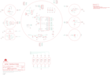

Contents
========

* [PRS11262 > Sparkfun](#prs11262--sparkfun)
	* [Schematic](#schematic)
	* [Interactive BOM](#interactive-bom)
	* [OOMP Parts](#oomp-parts)
	* [Images](#images)
	* [Tags](#tags)
  
![][im]
# PRS11262 > Sparkfun

- ID: PROJ-SPAR-11262-STAN-01
- Hex ID: PRS11262
- Name: Sparkfun
- Description: Sparkfun
- Long Link: [http://oom.lt/PROJ-SPAR-11262-STAN-01](http://oom.lt/PROJ-SPAR-11262-STAN-01)
- Short Link: [http://oom.lt/PRS11262](http://oom.lt/PRS11262)

## Schematic
  

## Interactive BOM

- Interactive BOM page: [ibom.html](https://htmlpreview.github.io/?https://github.com/oomlout/oomlout_OOMP_projects/blob/main/PROJ-SPAR-11262-STAN-01/kicad/bom/ibom.html)

## OOMP Parts
  

|OOMP Parts|
| :---: |
|1,UNMATCHED-UNMATCHED-UNMATCHED-UNMATCHED-UNMATCHED,1,SEWTAP-NOHOLE2,SEWTAP-NOHOLE2,PETAL-NOHOLE-2SIDE,,,|
|2,UNMATCHED-UNMATCHED-UNMATCHED-UNMATCHED-UNMATCHED,2,SEWTAP-NOHOLE2,SEWTAP-NOHOLE2,PETAL-NOHOLE-2SIDE,,,|
|3,UNMATCHED-UNMATCHED-UNMATCHED-UNMATCHED-UNMATCHED,3,SEWTAP-NOHOLE2,SEWTAP-NOHOLE2,PETAL-NOHOLE-2SIDE,,,|
|4,UNMATCHED-UNMATCHED-UNMATCHED-UNMATCHED-UNMATCHED,4,SEWTAP-NOHOLE2,SEWTAP-NOHOLE2,PETAL-NOHOLE-2SIDE,,,|
|A2/16,UNMATCHED-UNMATCHED-UNMATCHED-UNMATCHED-UNMATCHED,A2/16,SEWTAP9,SEWTAP9,PETAL-LONG-1-2SIDE,,,|
|A3/17,UNMATCHED-UNMATCHED-UNMATCHED-UNMATCHED-UNMATCHED,A3/17,SEWTAP9,SEWTAP9,PETAL-LONG-1-2SIDE,,,|
|A4/18,UNMATCHED-UNMATCHED-UNMATCHED-UNMATCHED-UNMATCHED,A4/18,SEWTAP9,SEWTAP9,PETAL-LONG-1-2SIDE,,,|
|A5/19,UNMATCHED-UNMATCHED-UNMATCHED-UNMATCHED-UNMATCHED,A5/19,SEWTAP9,SEWTAP9,PETAL-LONG-1-2SIDE,,,|
|B1,UNMATCHED-UNMATCHED-UNMATCHED-UNMATCHED-UNMATCHED,B1,Buzzer,BUZZERSMD2,BUZZER-CCV,Buzzer 12mm,,|
|BUTTON-,UNMATCHED-UNMATCHED-UNMATCHED-UNMATCHED-UNMATCHED,BUTTON-,SEWTAP8,SEWTAP4,PETAL-SMALL,,,|
|BUTTONS,UNMATCHED-UNMATCHED-UNMATCHED-UNMATCHED-UNMATCHED,BUTTONS,SEWTAP8,SEWTAP4,PETAL-SMALL,,,|
|C1,UNMATCHED-UNMATCHED-UNMATCHED-UNMATCHED-UNMATCHED,C1,0.1uF,CAP0402-CAP,0402-CAP,Capacitor,,|
|C2,UNMATCHED-UNMATCHED-UNMATCHED-UNMATCHED-UNMATCHED,C2,47uF,CAP_POL3528,EIA3528,Capacitor Polarized,,|
|C3,UNMATCHED-UNMATCHED-UNMATCHED-UNMATCHED-UNMATCHED,C3,1.0uF,CAP0402-CAP,0402-CAP,Capacitor,,|
|C4,UNMATCHED-UNMATCHED-UNMATCHED-UNMATCHED-UNMATCHED,C4,0.1uF,CAP0402-CAP,0402-CAP,Capacitor,,|
|C5,UNMATCHED-UNMATCHED-UNMATCHED-UNMATCHED-UNMATCHED,C5,0.1uF,CAP0603-CAP,0603-CAP,Capacitor,,|
|C9,UNMATCHED-UNMATCHED-UNMATCHED-UNMATCHED-UNMATCHED,C9,4.7uF,CAP0402-CAP,0402-CAP,Capacitor,,|
|C10,UNMATCHED-UNMATCHED-UNMATCHED-UNMATCHED-UNMATCHED,C10,4.7uF,CAP0402-CAP,0402-CAP,Capacitor,,|
|D1,UNMATCHED-UNMATCHED-UNMATCHED-UNMATCHED-UNMATCHED,D1,Status,LED0603,LED-0603,LEDs,,|
|D2,UNMATCHED-UNMATCHED-UNMATCHED-UNMATCHED-UNMATCHED,D2,LED-TRICOLOR,LED-TRICOLOR,LED-TRICOLOR-SMD,Tri-Color LED SMD,,|
|D3,UNMATCHED-UNMATCHED-UNMATCHED-UNMATCHED-UNMATCHED,D3,,DIODESOD,SOD-323,Diode,,|
|D4,UNMATCHED-UNMATCHED-UNMATCHED-UNMATCHED-UNMATCHED,D4,Yellow,LED0603,LED-0603,LEDs,,|
|JP1,UNMATCHED-UNMATCHED-UNMATCHED-UNMATCHED-UNMATCHED,JP1,LiPo,M02-JST-2MM-SMT,JST-2-SMD,Header 2,,|
|JP2,UNMATCHED-UNMATCHED-UNMATCHED-UNMATCHED-UNMATCHED,JP2,,ARDUINO_SERIAL_PROGRAMSMD,1X06-SMD,,,|
|LED,UNMATCHED-UNMATCHED-UNMATCHED-UNMATCHED-UNMATCHED,JP3,FIDUCIAL1X2,FIDUCIAL1X2,FIDUCIAL-1X2,Fiducial Alignment Points,,|
|LED+,UNMATCHED-UNMATCHED-UNMATCHED-UNMATCHED-UNMATCHED,JP4,FIDUCIAL1X2,FIDUCIAL1X2,FIDUCIAL-1X2,Fiducial Alignment Points,,|
|LED+1,UNMATCHED-UNMATCHED-UNMATCHED-UNMATCHED-UNMATCHED,LED,White,LED1206,LED-1206,LEDs,,|
|LED+2,UNMATCHED-UNMATCHED-UNMATCHED-UNMATCHED-UNMATCHED,LED+,SEWTAP6,SEWTAP6,PETAL-SMALL-2SIDE,,,|
|LED+3,UNMATCHED-UNMATCHED-UNMATCHED-UNMATCHED-UNMATCHED,LED+1,SEWTAP6,SEWTAP6,PETAL-SMALL-2SIDE,,,|
|LED+4,UNMATCHED-UNMATCHED-UNMATCHED-UNMATCHED-UNMATCHED,LED+2,SEWTAP6,SEWTAP6,PETAL-SMALL-2SIDE,,,|
|LED-,UNMATCHED-UNMATCHED-UNMATCHED-UNMATCHED-UNMATCHED,LED+3,SEWTAP6,SEWTAP6,PETAL-SMALL-2SIDE,,,|
|LED-1,UNMATCHED-UNMATCHED-UNMATCHED-UNMATCHED-UNMATCHED,LED+4,SEWTAP6,SEWTAP6,PETAL-SMALL-2SIDE,,,|
|LED-2,UNMATCHED-UNMATCHED-UNMATCHED-UNMATCHED-UNMATCHED,LED-,SEWTAP6,SEWTAP6,PETAL-SMALL-2SIDE,,,|
|LED-3,UNMATCHED-UNMATCHED-UNMATCHED-UNMATCHED-UNMATCHED,LED-1,SEWTAP6,SEWTAP6,PETAL-SMALL-2SIDE,,,|
|LED-4,UNMATCHED-UNMATCHED-UNMATCHED-UNMATCHED-UNMATCHED,LED-2,SEWTAP6,SEWTAP6,PETAL-SMALL-2SIDE,,,|
|LED1,UNMATCHED-UNMATCHED-UNMATCHED-UNMATCHED-UNMATCHED,LED-3,SEWTAP6,SEWTAP6,PETAL-SMALL-2SIDE,,,|
|LED2,UNMATCHED-UNMATCHED-UNMATCHED-UNMATCHED-UNMATCHED,LED-4,SEWTAP6,SEWTAP6,PETAL-SMALL-2SIDE,,,|
|LED3,UNMATCHED-UNMATCHED-UNMATCHED-UNMATCHED-UNMATCHED,LED1,White,LED1206,LED-1206,LEDs,,|
|LED4,UNMATCHED-UNMATCHED-UNMATCHED-UNMATCHED-UNMATCHED,LED2,White,LED1206,LED-1206,LEDs,,|
|LIGHT+,UNMATCHED-UNMATCHED-UNMATCHED-UNMATCHED-UNMATCHED,LED3,White,LED1206,LED-1206,LEDs,,|
|LIGHT-,UNMATCHED-UNMATCHED-UNMATCHED-UNMATCHED-UNMATCHED,LED4,White,LED1206,LED-1206,LEDs,,|
|LIGHT1,UNMATCHED-UNMATCHED-UNMATCHED-UNMATCHED-UNMATCHED,LIGHT+,SEWTAP6,SEWTAP4,PETAL-SMALL,,,|
|LIGHT2,UNMATCHED-UNMATCHED-UNMATCHED-UNMATCHED-UNMATCHED,LIGHT-,SEWTAP6,SEWTAP4,PETAL-SMALL,,,|
|LIGHT3,UNMATCHED-UNMATCHED-UNMATCHED-UNMATCHED-UNMATCHED,LIGHT1,SEWTAP-NOHOLE2,SEWTAP-NOHOLE2,PETAL-NOHOLE-2SIDE,,,|
|LIGHTS,UNMATCHED-UNMATCHED-UNMATCHED-UNMATCHED-UNMATCHED,LIGHT2,SEWTAP-NOHOLE2,SEWTAP-NOHOLE2,PETAL-NOHOLE-2SIDE,,,|
|LOGO,UNMATCHED-UNMATCHED-UNMATCHED-UNMATCHED-UNMATCHED,LIGHT3,SEWTAP-NOHOLE2,SEWTAP-NOHOLE2,PETAL-NOHOLE-2SIDE,,,|
|M1,UNMATCHED-UNMATCHED-UNMATCHED-UNMATCHED-UNMATCHED,LIGHTS,SEWTAP6,SEWTAP4,PETAL-SMALL,,,|
|PP-GND,UNMATCHED-UNMATCHED-UNMATCHED-UNMATCHED-UNMATCHED,LOGO,LOGO-LPLPA,LOGO-LPLPA,LOGO-LPA,,,|
|PP-MISO,UNMATCHED-UNMATCHED-UNMATCHED-UNMATCHED-UNMATCHED,M1,MOTORSMD,MOTORSMD,VIBE-MOTOR-10MM-SMD,Vibration Motor,,|
|PP-RST,UNMATCHED-UNMATCHED-UNMATCHED-UNMATCHED-UNMATCHED,PP-GND,,TEST-POINT3X5,PAD.03X.05,,,|
|PP-SCK,UNMATCHED-UNMATCHED-UNMATCHED-UNMATCHED-UNMATCHED,PP-MISO,,TEST-POINT3X5,PAD.03X.05,,,|
|R,UNMATCHED-UNMATCHED-UNMATCHED-UNMATCHED-UNMATCHED,PP-RST,,TEST-POINT3X5,PAD.03X.05,,,|
|R1,UNMATCHED-UNMATCHED-UNMATCHED-UNMATCHED-UNMATCHED,PP-SCK,,TEST-POINT3X5,PAD.03X.05,,,|
|R2,UNMATCHED-UNMATCHED-UNMATCHED-UNMATCHED-UNMATCHED,R,100,RESISTOR0603-RES,0603-RES,Resistor,,|
|R3,UNMATCHED-UNMATCHED-UNMATCHED-UNMATCHED-UNMATCHED,R1,330,RESISTOR0402-RES,0402-RES,Resistor,,|
|R4,UNMATCHED-UNMATCHED-UNMATCHED-UNMATCHED-UNMATCHED,R2,10K,RESISTOR0402-RES,0402-RES,Resistor,,|
|R5,UNMATCHED-UNMATCHED-UNMATCHED-UNMATCHED-UNMATCHED,R3,200,RESISTOR0402-RES,0402-RES,Resistor,,|
|R6,UNMATCHED-UNMATCHED-UNMATCHED-UNMATCHED-UNMATCHED,R4,100,RESISTOR0402-RES,0402-RES,Resistor,,|
|R7,UNMATCHED-UNMATCHED-UNMATCHED-UNMATCHED-UNMATCHED,R5,100,RESISTOR0402-RES,0402-RES,Resistor,,|
|R8,UNMATCHED-UNMATCHED-UNMATCHED-UNMATCHED-UNMATCHED,R6,33,RESISTOR0402-RES,0402-RES,Resistor,,|
|R9,UNMATCHED-UNMATCHED-UNMATCHED-UNMATCHED-UNMATCHED,R7,10K,RESISTOR0402-RES,0402-RES,Resistor,,|
|R10,UNMATCHED-UNMATCHED-UNMATCHED-UNMATCHED-UNMATCHED,R8,100,RESISTOR0603-RES,0603-RES,Resistor,,|
|R11,UNMATCHED-UNMATCHED-UNMATCHED-UNMATCHED-UNMATCHED,R9,100,RESISTOR0603-RES,0603-RES,Resistor,,|
|R12,UNMATCHED-UNMATCHED-UNMATCHED-UNMATCHED-UNMATCHED,R10,100,RESISTOR0603-RES,0603-RES,Resistor,,|
|R13,UNMATCHED-UNMATCHED-UNMATCHED-UNMATCHED-UNMATCHED,R11,100,RESISTOR0603-RES,0603-RES,Resistor,,|
|S1,UNMATCHED-UNMATCHED-UNMATCHED-UNMATCHED-UNMATCHED,R12,330,RESISTOR0402-RES,0402-RES,Resistor,,|
|S2,UNMATCHED-UNMATCHED-UNMATCHED-UNMATCHED-UNMATCHED,R13,10k,RESISTOR0402-RES,0402-RES,Resistor,,|
|S3,UNMATCHED-UNMATCHED-UNMATCHED-UNMATCHED-UNMATCHED,S1,On/Off,AYZ0202,AYZ0202,SPDT Slide Switch,,|
|S4,UNMATCHED-UNMATCHED-UNMATCHED-UNMATCHED-UNMATCHED,S2,AYZ0202,AYZ0202,AYZ0202,SPDT Slide Switch,,|
|SLIDEOFF,UNMATCHED-UNMATCHED-UNMATCHED-UNMATCHED-UNMATCHED,S3,,TAC_SWITCHSMD,TACTILE_SWITCH_SMD,Momentary Switch,,|
|SLIDEON,UNMATCHED-UNMATCHED-UNMATCHED-UNMATCHED-UNMATCHED,S4,Reset,SWITCH-MOMENTARY-2SMD,TACTILE_SWITCH_SMD,,,|
|TEMP+,UNMATCHED-UNMATCHED-UNMATCHED-UNMATCHED-UNMATCHED,SLIDEOFF,SEWTAP8,SEWTAP4,PETAL-SMALL,,,|
|TEMP-,UNMATCHED-UNMATCHED-UNMATCHED-UNMATCHED-UNMATCHED,SLIDEON,SEWTAP8,SEWTAP4,PETAL-SMALL,,,|
|TEMP1,UNMATCHED-UNMATCHED-UNMATCHED-UNMATCHED-UNMATCHED,TEMP+,SEWTAP6,SEWTAP4,PETAL-SMALL,,,|
|TEMP2,UNMATCHED-UNMATCHED-UNMATCHED-UNMATCHED-UNMATCHED,TEMP-,SEWTAP6,SEWTAP4,PETAL-SMALL,,,|
|TEMP3,UNMATCHED-UNMATCHED-UNMATCHED-UNMATCHED-UNMATCHED,TEMP1,SEWTAP-NOHOLE2,SEWTAP-NOHOLE2,PETAL-NOHOLE-2SIDE,,,|
|TEMPS,UNMATCHED-UNMATCHED-UNMATCHED-UNMATCHED-UNMATCHED,TEMP2,SEWTAP-NOHOLE2,SEWTAP-NOHOLE2,PETAL-NOHOLE-2SIDE,,,|
|TP-DTR,UNMATCHED-UNMATCHED-UNMATCHED-UNMATCHED-UNMATCHED,TEMP3,SEWTAP-NOHOLE2,SEWTAP-NOHOLE2,PETAL-NOHOLE-2SIDE,,,|
|TP-RX,UNMATCHED-UNMATCHED-UNMATCHED-UNMATCHED-UNMATCHED,TEMPS,SEWTAP6,SEWTAP4,PETAL-SMALL,,,|
|TP-TX,UNMATCHED-UNMATCHED-UNMATCHED-UNMATCHED-UNMATCHED,TP-DTR,,TEST-POINT3X5,PAD.03X.05,,,|
|TP1,UNMATCHED-UNMATCHED-UNMATCHED-UNMATCHED-UNMATCHED,TP-RX,,TEST-POINT3X5,PAD.03X.05,,,|
|U$1,UNMATCHED-UNMATCHED-UNMATCHED-UNMATCHED-UNMATCHED,TP-TX,,TEST-POINT3X5,PAD.03X.05,,,|
|U$2,UNMATCHED-UNMATCHED-UNMATCHED-UNMATCHED-UNMATCHED,TP1,,TEST-POINT3X5,PAD.03X.05,,,|
|U$3,UNMATCHED-UNMATCHED-UNMATCHED-UNMATCHED-UNMATCHED,U$1,SEWTAP9,SEWTAP9,PETAL-LONG-1-2SIDE,,,|
|U$4,UNMATCHED-UNMATCHED-UNMATCHED-UNMATCHED-UNMATCHED,U$2,MOUSE-BITE-2,MOUSE-BITE-2,MOUSE-BITE-2,,,|
|U$5,UNMATCHED-UNMATCHED-UNMATCHED-UNMATCHED-UNMATCHED,U$3,MOUSE-BITE-2,MOUSE-BITE-2,MOUSE-BITE-2,,,|
|U$6,UNMATCHED-UNMATCHED-UNMATCHED-UNMATCHED-UNMATCHED,U$4,SEWTAP9,SEWTAP9,PETAL-LONG-1-2SIDE,,,|
|U$7,UNMATCHED-UNMATCHED-UNMATCHED-UNMATCHED-UNMATCHED,U$5,MOUSE-BITE-2,MOUSE-BITE-2,MOUSE-BITE-2,,,|
|U$8,UNMATCHED-UNMATCHED-UNMATCHED-UNMATCHED-UNMATCHED,U$6,MOUSE-BITE-2,MOUSE-BITE-2,MOUSE-BITE-2,,,|
|U$10,UNMATCHED-UNMATCHED-UNMATCHED-UNMATCHED-UNMATCHED,U$7,MOUSE-BITE-66,MOUSE-BITE-66,MOUSE-BITE-6,,,|
|U$11,UNMATCHED-UNMATCHED-UNMATCHED-UNMATCHED-UNMATCHED,U$8,MOUSE-BITE-66,MOUSE-BITE-66,MOUSE-BITE-6,,,|
|U$12,UNMATCHED-UNMATCHED-UNMATCHED-UNMATCHED-UNMATCHED,U$10,MOUSE-BITE-12_HOLES,MOUSE-BITE-12_HOLES,MOUST-BITE-1-(2_HOLES),,,|
|U$13,UNMATCHED-UNMATCHED-UNMATCHED-UNMATCHED-UNMATCHED,U$11,MOUSE-BITE-12_HOLES,MOUSE-BITE-12_HOLES,MOUST-BITE-1-(2_HOLES),,,|
|U$14,UNMATCHED-UNMATCHED-UNMATCHED-UNMATCHED-UNMATCHED,U$12,MOUSE-BITE-12_HOLES,MOUSE-BITE-12_HOLES,MOUST-BITE-1-(2_HOLES),,,|
|U$15,UNMATCHED-UNMATCHED-UNMATCHED-UNMATCHED-UNMATCHED,U$13,MOUSE-BITE-12_HOLES,MOUSE-BITE-12_HOLES,MOUST-BITE-1-(2_HOLES),,,|
|U$16,UNMATCHED-UNMATCHED-UNMATCHED-UNMATCHED-UNMATCHED,U$14,MOUSE-BITE-12_HOLES,MOUSE-BITE-12_HOLES,MOUST-BITE-1-(2_HOLES),,,|
|U$17,UNMATCHED-UNMATCHED-UNMATCHED-UNMATCHED-UNMATCHED,U$15,MOUSE-BITE-12_HOLES,MOUSE-BITE-12_HOLES,MOUST-BITE-1-(2_HOLES),,,|
|U$18,UNMATCHED-UNMATCHED-UNMATCHED-UNMATCHED-UNMATCHED,U$16,MOUSE-BITE-12_HOLES,MOUSE-BITE-12_HOLES,MOUST-BITE-1-(2_HOLES),,,|
|U$19,UNMATCHED-UNMATCHED-UNMATCHED-UNMATCHED-UNMATCHED,U$17,MOUSE-BITE-12_HOLES,MOUSE-BITE-12_HOLES,MOUST-BITE-1-(2_HOLES),,,|
|U$20,UNMATCHED-UNMATCHED-UNMATCHED-UNMATCHED-UNMATCHED,U$18,MOUSE-BITE-12_HOLES,MOUSE-BITE-12_HOLES,MOUST-BITE-1-(2_HOLES),,,|
|U$22,UNMATCHED-UNMATCHED-UNMATCHED-UNMATCHED-UNMATCHED,U$19,MOUSE-BITE-12_HOLES,MOUSE-BITE-12_HOLES,MOUST-BITE-1-(2_HOLES),,,|
|U$23,UNMATCHED-UNMATCHED-UNMATCHED-UNMATCHED-UNMATCHED,U$20,MOUSE-BITE-4,MOUSE-BITE-4,MOUSE-BITE-4,,,|
|U$24,UNMATCHED-UNMATCHED-UNMATCHED-UNMATCHED-UNMATCHED,U$22,SEWTAP6,SEWTAP6,PETAL-SMALL-2SIDE,,,|
|U$25,UNMATCHED-UNMATCHED-UNMATCHED-UNMATCHED-UNMATCHED,U$23,SEWTAP6,SEWTAP6,PETAL-SMALL-2SIDE,,,|
|U$26,UNMATCHED-UNMATCHED-UNMATCHED-UNMATCHED-UNMATCHED,U$24,SEWTAP6,SEWTAP6,PETAL-SMALL-2SIDE,,,|
|U$27,UNMATCHED-UNMATCHED-UNMATCHED-UNMATCHED-UNMATCHED,U$25,SEWTAP6,SEWTAP6,PETAL-SMALL-2SIDE,,,|
|U$32,UNMATCHED-UNMATCHED-UNMATCHED-UNMATCHED-UNMATCHED,U$26,SEWTAP-NOHOLE2,SEWTAP-NOHOLE2,PETAL-NOHOLE-2SIDE,,,|
|U$32-,UNMATCHED-UNMATCHED-UNMATCHED-UNMATCHED-UNMATCHED,U$27,SEWTAP-NOHOLE2,SEWTAP-NOHOLE2,PETAL-NOHOLE-2SIDE,,,|
|U$33,UNMATCHED-UNMATCHED-UNMATCHED-UNMATCHED-UNMATCHED,U$32,MOUSE-BITE-2,MOUSE-BITE-2,MOUSE-BITE-2,,,|
|U$33+,UNMATCHED-UNMATCHED-UNMATCHED-UNMATCHED-UNMATCHED,U$32-,SEWTAP6,SEWTAP4,PETAL-SMALL,,,|
|U$37,UNMATCHED-UNMATCHED-UNMATCHED-UNMATCHED-UNMATCHED,U$33,MOUSE-BITE-3,MOUSE-BITE-3,MOUSE-BITE-3,,,|
|U$39,UNMATCHED-UNMATCHED-UNMATCHED-UNMATCHED-UNMATCHED,U$33+,SEWTAP6,SEWTAP4,PETAL-SMALL,,,|
|U$40,UNMATCHED-UNMATCHED-UNMATCHED-UNMATCHED-UNMATCHED,U$37,SEWTAP9,SEWTAP9,PETAL-LONG-1-2SIDE,,,|
|U$41,UNMATCHED-UNMATCHED-UNMATCHED-UNMATCHED-UNMATCHED,U$39,SEWTAP9,SEWTAP9,PETAL-LONG-1-2SIDE,,,|
|U$42,UNMATCHED-UNMATCHED-UNMATCHED-UNMATCHED-UNMATCHED,U$40,MOUSE-BITE-12_HOLES,MOUSE-BITE-12_HOLES,MOUST-BITE-1-(2_HOLES),,,|
|U$43,UNMATCHED-UNMATCHED-UNMATCHED-UNMATCHED-UNMATCHED,U$41,SEWTAP9,SEWTAP9,PETAL-LONG-1-2SIDE,,,|
|U$44,UNMATCHED-UNMATCHED-UNMATCHED-UNMATCHED-UNMATCHED,U$42,MOUSE-BITE-12_HOLES,MOUSE-BITE-12_HOLES,MOUST-BITE-1-(2_HOLES),,,|
|U$45,UNMATCHED-UNMATCHED-UNMATCHED-UNMATCHED-UNMATCHED,U$43,SEWTAP9,SEWTAP9,PETAL-LONG-1-2SIDE,,,|
|U$46,UNMATCHED-UNMATCHED-UNMATCHED-UNMATCHED-UNMATCHED,U$44,MOUSE-BITE-12_HOLES,MOUSE-BITE-12_HOLES,MOUST-BITE-1-(2_HOLES),,,|
|U$47,UNMATCHED-UNMATCHED-UNMATCHED-UNMATCHED-UNMATCHED,U$45,SEWTAP9,SEWTAP9,PETAL-LONG-1-2SIDE,,,|
|U$48,UNMATCHED-UNMATCHED-UNMATCHED-UNMATCHED-UNMATCHED,U$46,MOUSE-BITE-12_HOLES,MOUSE-BITE-12_HOLES,MOUST-BITE-1-(2_HOLES),,,|
|U$49,UNMATCHED-UNMATCHED-UNMATCHED-UNMATCHED-UNMATCHED,U$47,MOUSE-BITE-2,MOUSE-BITE-2,MOUSE-BITE-2,,,|
|U$51,UNMATCHED-UNMATCHED-UNMATCHED-UNMATCHED-UNMATCHED,U$48,MOUSE-BITE-3(NO_PADS),MOUSE-BITE-3(NO_PADS),MOUSE-BITE-3(NO_PADS),,,|
|U$52,UNMATCHED-UNMATCHED-UNMATCHED-UNMATCHED-UNMATCHED,U$49,MOUSE-BITE-3(NO_PADS),MOUSE-BITE-3(NO_PADS),MOUSE-BITE-3(NO_PADS),,,|
|U1,UNMATCHED-UNMATCHED-UNMATCHED-UNMATCHED-UNMATCHED,U$51,MOUSE-BITE-66,MOUSE-BITE-66,MOUSE-BITE-6,,,|
|U2,UNMATCHED-UNMATCHED-UNMATCHED-UNMATCHED-UNMATCHED,U$52,OSHW-LOGOS,OSHW-LOGOS,OSHW-LOGO-S,Open Source Hardware Logo This logo indicates the piece of hardware it is found on incorporates a OSHW license and/or adheres to the definition of open source hardware found here: http://freedomdefined.org/OSHW,,|
|U3,UNMATCHED-UNMATCHED-UNMATCHED-UNMATCHED-UNMATCHED,U1,ATMEGA328,ATMEGA168,TQFP32-08,,,|
|U4,UNMATCHED-UNMATCHED-UNMATCHED-UNMATCHED-UNMATCHED,U2,MCP9700,MCP9700SMD,SOT23-3,,,|
|VIBE+,UNMATCHED-UNMATCHED-UNMATCHED-UNMATCHED-UNMATCHED,U3,TEMT6000,TEMT6000,TEMT6000-SEN,Ambient Light Sensor,,|
|VIBE-,UNMATCHED-UNMATCHED-UNMATCHED-UNMATCHED-UNMATCHED,U4,MCP73831,MCP73831,SOT23-5,Microchips MCP73831,,|
|VIBE1,UNMATCHED-UNMATCHED-UNMATCHED-UNMATCHED-UNMATCHED,VIBE+,SEWTAP6,SEWTAP4,PETAL-SMALL,,,|
|VIBE2,UNMATCHED-UNMATCHED-UNMATCHED-UNMATCHED-UNMATCHED,VIBE-,SEWTAP6,SEWTAP4,PETAL-SMALL,,,|
|VIBE3,UNMATCHED-UNMATCHED-UNMATCHED-UNMATCHED-UNMATCHED,VIBE1,SEWTAP-NOHOLE2,SEWTAP-NOHOLE2,PETAL-NOHOLE-2SIDE,,,|
|VIBE4,UNMATCHED-UNMATCHED-UNMATCHED-UNMATCHED-UNMATCHED,VIBE2,SEWTAP-NOHOLE2,SEWTAP-NOHOLE2,PETAL-NOHOLE-2SIDE,,,|
|Y1,UNMATCHED-UNMATCHED-UNMATCHED-UNMATCHED-UNMATCHED,VIBE3,SEWTAP-NOHOLE2,SEWTAP-NOHOLE2,PETAL-NOHOLE-2SIDE,,,|

## Images
  
  

|kicadPcb3d|kicadPcb3dFront|kicadPcb3dBack|eagleImage|eagleSchemImage|
| :---: | :---: | :---: | :---: | :---: |
||||||

## Tags

- hexID: PRS11262
- oompType: PROJ
- oompSize: SPAR
- oompColor: 11262
- oompDesc: STAN
- oompIndex: 01
- oompName: ProtoSnap-LilyPad Development Board
- sources: All source files from https://github.com/sparkfun/ProtoSnap-LilyPad_Development_Board (source licence details in srcLicense.md)
- linkBuyPage: https://www.sparkfun.com/products/11262
- oompID: PROJ-SPAR-11262-STAN-01
- oompParts: 1,UNMATCHED-UNMATCHED-UNMATCHED-UNMATCHED-UNMATCHED
- oompParts: 2,UNMATCHED-UNMATCHED-UNMATCHED-UNMATCHED-UNMATCHED
- oompParts: 3,UNMATCHED-UNMATCHED-UNMATCHED-UNMATCHED-UNMATCHED
- oompParts: 4,UNMATCHED-UNMATCHED-UNMATCHED-UNMATCHED-UNMATCHED
- oompParts: A2/16,UNMATCHED-UNMATCHED-UNMATCHED-UNMATCHED-UNMATCHED
- oompParts: A3/17,UNMATCHED-UNMATCHED-UNMATCHED-UNMATCHED-UNMATCHED
- oompParts: A4/18,UNMATCHED-UNMATCHED-UNMATCHED-UNMATCHED-UNMATCHED
- oompParts: A5/19,UNMATCHED-UNMATCHED-UNMATCHED-UNMATCHED-UNMATCHED
- oompParts: B1,UNMATCHED-UNMATCHED-UNMATCHED-UNMATCHED-UNMATCHED
- oompParts: BUTTON-,UNMATCHED-UNMATCHED-UNMATCHED-UNMATCHED-UNMATCHED
- oompParts: BUTTONS,UNMATCHED-UNMATCHED-UNMATCHED-UNMATCHED-UNMATCHED
- oompParts: C1,UNMATCHED-UNMATCHED-UNMATCHED-UNMATCHED-UNMATCHED
- oompParts: C2,UNMATCHED-UNMATCHED-UNMATCHED-UNMATCHED-UNMATCHED
- oompParts: C3,UNMATCHED-UNMATCHED-UNMATCHED-UNMATCHED-UNMATCHED
- oompParts: C4,UNMATCHED-UNMATCHED-UNMATCHED-UNMATCHED-UNMATCHED
- oompParts: C5,UNMATCHED-UNMATCHED-UNMATCHED-UNMATCHED-UNMATCHED
- oompParts: C9,UNMATCHED-UNMATCHED-UNMATCHED-UNMATCHED-UNMATCHED
- oompParts: C10,UNMATCHED-UNMATCHED-UNMATCHED-UNMATCHED-UNMATCHED
- oompParts: D1,UNMATCHED-UNMATCHED-UNMATCHED-UNMATCHED-UNMATCHED
- oompParts: D2,UNMATCHED-UNMATCHED-UNMATCHED-UNMATCHED-UNMATCHED
- oompParts: D3,UNMATCHED-UNMATCHED-UNMATCHED-UNMATCHED-UNMATCHED
- oompParts: D4,UNMATCHED-UNMATCHED-UNMATCHED-UNMATCHED-UNMATCHED
- oompParts: JP1,UNMATCHED-UNMATCHED-UNMATCHED-UNMATCHED-UNMATCHED
- oompParts: JP2,UNMATCHED-UNMATCHED-UNMATCHED-UNMATCHED-UNMATCHED
- oompParts: LED,UNMATCHED-UNMATCHED-UNMATCHED-UNMATCHED-UNMATCHED
- oompParts: LED+,UNMATCHED-UNMATCHED-UNMATCHED-UNMATCHED-UNMATCHED
- oompParts: LED+1,UNMATCHED-UNMATCHED-UNMATCHED-UNMATCHED-UNMATCHED
- oompParts: LED+2,UNMATCHED-UNMATCHED-UNMATCHED-UNMATCHED-UNMATCHED
- oompParts: LED+3,UNMATCHED-UNMATCHED-UNMATCHED-UNMATCHED-UNMATCHED
- oompParts: LED+4,UNMATCHED-UNMATCHED-UNMATCHED-UNMATCHED-UNMATCHED
- oompParts: LED-,UNMATCHED-UNMATCHED-UNMATCHED-UNMATCHED-UNMATCHED
- oompParts: LED-1,UNMATCHED-UNMATCHED-UNMATCHED-UNMATCHED-UNMATCHED
- oompParts: LED-2,UNMATCHED-UNMATCHED-UNMATCHED-UNMATCHED-UNMATCHED
- oompParts: LED-3,UNMATCHED-UNMATCHED-UNMATCHED-UNMATCHED-UNMATCHED
- oompParts: LED-4,UNMATCHED-UNMATCHED-UNMATCHED-UNMATCHED-UNMATCHED
- oompParts: LED1,UNMATCHED-UNMATCHED-UNMATCHED-UNMATCHED-UNMATCHED
- oompParts: LED2,UNMATCHED-UNMATCHED-UNMATCHED-UNMATCHED-UNMATCHED
- oompParts: LED3,UNMATCHED-UNMATCHED-UNMATCHED-UNMATCHED-UNMATCHED
- oompParts: LED4,UNMATCHED-UNMATCHED-UNMATCHED-UNMATCHED-UNMATCHED
- oompParts: LIGHT+,UNMATCHED-UNMATCHED-UNMATCHED-UNMATCHED-UNMATCHED
- oompParts: LIGHT-,UNMATCHED-UNMATCHED-UNMATCHED-UNMATCHED-UNMATCHED
- oompParts: LIGHT1,UNMATCHED-UNMATCHED-UNMATCHED-UNMATCHED-UNMATCHED
- oompParts: LIGHT2,UNMATCHED-UNMATCHED-UNMATCHED-UNMATCHED-UNMATCHED
- oompParts: LIGHT3,UNMATCHED-UNMATCHED-UNMATCHED-UNMATCHED-UNMATCHED
- oompParts: LIGHTS,UNMATCHED-UNMATCHED-UNMATCHED-UNMATCHED-UNMATCHED
- oompParts: LOGO,UNMATCHED-UNMATCHED-UNMATCHED-UNMATCHED-UNMATCHED
- oompParts: M1,UNMATCHED-UNMATCHED-UNMATCHED-UNMATCHED-UNMATCHED
- oompParts: PP-GND,UNMATCHED-UNMATCHED-UNMATCHED-UNMATCHED-UNMATCHED
- oompParts: PP-MISO,UNMATCHED-UNMATCHED-UNMATCHED-UNMATCHED-UNMATCHED
- oompParts: PP-RST,UNMATCHED-UNMATCHED-UNMATCHED-UNMATCHED-UNMATCHED
- oompParts: PP-SCK,UNMATCHED-UNMATCHED-UNMATCHED-UNMATCHED-UNMATCHED
- oompParts: R,UNMATCHED-UNMATCHED-UNMATCHED-UNMATCHED-UNMATCHED
- oompParts: R1,UNMATCHED-UNMATCHED-UNMATCHED-UNMATCHED-UNMATCHED
- oompParts: R2,UNMATCHED-UNMATCHED-UNMATCHED-UNMATCHED-UNMATCHED
- oompParts: R3,UNMATCHED-UNMATCHED-UNMATCHED-UNMATCHED-UNMATCHED
- oompParts: R4,UNMATCHED-UNMATCHED-UNMATCHED-UNMATCHED-UNMATCHED
- oompParts: R5,UNMATCHED-UNMATCHED-UNMATCHED-UNMATCHED-UNMATCHED
- oompParts: R6,UNMATCHED-UNMATCHED-UNMATCHED-UNMATCHED-UNMATCHED
- oompParts: R7,UNMATCHED-UNMATCHED-UNMATCHED-UNMATCHED-UNMATCHED
- oompParts: R8,UNMATCHED-UNMATCHED-UNMATCHED-UNMATCHED-UNMATCHED
- oompParts: R9,UNMATCHED-UNMATCHED-UNMATCHED-UNMATCHED-UNMATCHED
- oompParts: R10,UNMATCHED-UNMATCHED-UNMATCHED-UNMATCHED-UNMATCHED
- oompParts: R11,UNMATCHED-UNMATCHED-UNMATCHED-UNMATCHED-UNMATCHED
- oompParts: R12,UNMATCHED-UNMATCHED-UNMATCHED-UNMATCHED-UNMATCHED
- oompParts: R13,UNMATCHED-UNMATCHED-UNMATCHED-UNMATCHED-UNMATCHED
- oompParts: S1,UNMATCHED-UNMATCHED-UNMATCHED-UNMATCHED-UNMATCHED
- oompParts: S2,UNMATCHED-UNMATCHED-UNMATCHED-UNMATCHED-UNMATCHED
- oompParts: S3,UNMATCHED-UNMATCHED-UNMATCHED-UNMATCHED-UNMATCHED
- oompParts: S4,UNMATCHED-UNMATCHED-UNMATCHED-UNMATCHED-UNMATCHED
- oompParts: SLIDEOFF,UNMATCHED-UNMATCHED-UNMATCHED-UNMATCHED-UNMATCHED
- oompParts: SLIDEON,UNMATCHED-UNMATCHED-UNMATCHED-UNMATCHED-UNMATCHED
- oompParts: TEMP+,UNMATCHED-UNMATCHED-UNMATCHED-UNMATCHED-UNMATCHED
- oompParts: TEMP-,UNMATCHED-UNMATCHED-UNMATCHED-UNMATCHED-UNMATCHED
- oompParts: TEMP1,UNMATCHED-UNMATCHED-UNMATCHED-UNMATCHED-UNMATCHED
- oompParts: TEMP2,UNMATCHED-UNMATCHED-UNMATCHED-UNMATCHED-UNMATCHED
- oompParts: TEMP3,UNMATCHED-UNMATCHED-UNMATCHED-UNMATCHED-UNMATCHED
- oompParts: TEMPS,UNMATCHED-UNMATCHED-UNMATCHED-UNMATCHED-UNMATCHED
- oompParts: TP-DTR,UNMATCHED-UNMATCHED-UNMATCHED-UNMATCHED-UNMATCHED
- oompParts: TP-RX,UNMATCHED-UNMATCHED-UNMATCHED-UNMATCHED-UNMATCHED
- oompParts: TP-TX,UNMATCHED-UNMATCHED-UNMATCHED-UNMATCHED-UNMATCHED
- oompParts: TP1,UNMATCHED-UNMATCHED-UNMATCHED-UNMATCHED-UNMATCHED
- oompParts: U$1,UNMATCHED-UNMATCHED-UNMATCHED-UNMATCHED-UNMATCHED
- oompParts: U$2,UNMATCHED-UNMATCHED-UNMATCHED-UNMATCHED-UNMATCHED
- oompParts: U$3,UNMATCHED-UNMATCHED-UNMATCHED-UNMATCHED-UNMATCHED
- oompParts: U$4,UNMATCHED-UNMATCHED-UNMATCHED-UNMATCHED-UNMATCHED
- oompParts: U$5,UNMATCHED-UNMATCHED-UNMATCHED-UNMATCHED-UNMATCHED
- oompParts: U$6,UNMATCHED-UNMATCHED-UNMATCHED-UNMATCHED-UNMATCHED
- oompParts: U$7,UNMATCHED-UNMATCHED-UNMATCHED-UNMATCHED-UNMATCHED
- oompParts: U$8,UNMATCHED-UNMATCHED-UNMATCHED-UNMATCHED-UNMATCHED
- oompParts: U$10,UNMATCHED-UNMATCHED-UNMATCHED-UNMATCHED-UNMATCHED
- oompParts: U$11,UNMATCHED-UNMATCHED-UNMATCHED-UNMATCHED-UNMATCHED
- oompParts: U$12,UNMATCHED-UNMATCHED-UNMATCHED-UNMATCHED-UNMATCHED
- oompParts: U$13,UNMATCHED-UNMATCHED-UNMATCHED-UNMATCHED-UNMATCHED
- oompParts: U$14,UNMATCHED-UNMATCHED-UNMATCHED-UNMATCHED-UNMATCHED
- oompParts: U$15,UNMATCHED-UNMATCHED-UNMATCHED-UNMATCHED-UNMATCHED
- oompParts: U$16,UNMATCHED-UNMATCHED-UNMATCHED-UNMATCHED-UNMATCHED
- oompParts: U$17,UNMATCHED-UNMATCHED-UNMATCHED-UNMATCHED-UNMATCHED
- oompParts: U$18,UNMATCHED-UNMATCHED-UNMATCHED-UNMATCHED-UNMATCHED
- oompParts: U$19,UNMATCHED-UNMATCHED-UNMATCHED-UNMATCHED-UNMATCHED
- oompParts: U$20,UNMATCHED-UNMATCHED-UNMATCHED-UNMATCHED-UNMATCHED
- oompParts: U$22,UNMATCHED-UNMATCHED-UNMATCHED-UNMATCHED-UNMATCHED
- oompParts: U$23,UNMATCHED-UNMATCHED-UNMATCHED-UNMATCHED-UNMATCHED
- oompParts: U$24,UNMATCHED-UNMATCHED-UNMATCHED-UNMATCHED-UNMATCHED
- oompParts: U$25,UNMATCHED-UNMATCHED-UNMATCHED-UNMATCHED-UNMATCHED
- oompParts: U$26,UNMATCHED-UNMATCHED-UNMATCHED-UNMATCHED-UNMATCHED
- oompParts: U$27,UNMATCHED-UNMATCHED-UNMATCHED-UNMATCHED-UNMATCHED
- oompParts: U$32,UNMATCHED-UNMATCHED-UNMATCHED-UNMATCHED-UNMATCHED
- oompParts: U$32-,UNMATCHED-UNMATCHED-UNMATCHED-UNMATCHED-UNMATCHED
- oompParts: U$33,UNMATCHED-UNMATCHED-UNMATCHED-UNMATCHED-UNMATCHED
- oompParts: U$33+,UNMATCHED-UNMATCHED-UNMATCHED-UNMATCHED-UNMATCHED
- oompParts: U$37,UNMATCHED-UNMATCHED-UNMATCHED-UNMATCHED-UNMATCHED
- oompParts: U$39,UNMATCHED-UNMATCHED-UNMATCHED-UNMATCHED-UNMATCHED
- oompParts: U$40,UNMATCHED-UNMATCHED-UNMATCHED-UNMATCHED-UNMATCHED
- oompParts: U$41,UNMATCHED-UNMATCHED-UNMATCHED-UNMATCHED-UNMATCHED
- oompParts: U$42,UNMATCHED-UNMATCHED-UNMATCHED-UNMATCHED-UNMATCHED
- oompParts: U$43,UNMATCHED-UNMATCHED-UNMATCHED-UNMATCHED-UNMATCHED
- oompParts: U$44,UNMATCHED-UNMATCHED-UNMATCHED-UNMATCHED-UNMATCHED
- oompParts: U$45,UNMATCHED-UNMATCHED-UNMATCHED-UNMATCHED-UNMATCHED
- oompParts: U$46,UNMATCHED-UNMATCHED-UNMATCHED-UNMATCHED-UNMATCHED
- oompParts: U$47,UNMATCHED-UNMATCHED-UNMATCHED-UNMATCHED-UNMATCHED
- oompParts: U$48,UNMATCHED-UNMATCHED-UNMATCHED-UNMATCHED-UNMATCHED
- oompParts: U$49,UNMATCHED-UNMATCHED-UNMATCHED-UNMATCHED-UNMATCHED
- oompParts: U$51,UNMATCHED-UNMATCHED-UNMATCHED-UNMATCHED-UNMATCHED
- oompParts: U$52,UNMATCHED-UNMATCHED-UNMATCHED-UNMATCHED-UNMATCHED
- oompParts: U1,UNMATCHED-UNMATCHED-UNMATCHED-UNMATCHED-UNMATCHED
- oompParts: U2,UNMATCHED-UNMATCHED-UNMATCHED-UNMATCHED-UNMATCHED
- oompParts: U3,UNMATCHED-UNMATCHED-UNMATCHED-UNMATCHED-UNMATCHED
- oompParts: U4,UNMATCHED-UNMATCHED-UNMATCHED-UNMATCHED-UNMATCHED
- oompParts: VIBE+,UNMATCHED-UNMATCHED-UNMATCHED-UNMATCHED-UNMATCHED
- oompParts: VIBE-,UNMATCHED-UNMATCHED-UNMATCHED-UNMATCHED-UNMATCHED
- oompParts: VIBE1,UNMATCHED-UNMATCHED-UNMATCHED-UNMATCHED-UNMATCHED
- oompParts: VIBE2,UNMATCHED-UNMATCHED-UNMATCHED-UNMATCHED-UNMATCHED
- oompParts: VIBE3,UNMATCHED-UNMATCHED-UNMATCHED-UNMATCHED-UNMATCHED
- oompParts: VIBE4,UNMATCHED-UNMATCHED-UNMATCHED-UNMATCHED-UNMATCHED
- oompParts: Y1,UNMATCHED-UNMATCHED-UNMATCHED-UNMATCHED-UNMATCHED
- rawParts: 1,SEWTAP-NOHOLE2,SEWTAP-NOHOLE2,PETAL-NOHOLE-2SIDE,,,
- rawParts: 2,SEWTAP-NOHOLE2,SEWTAP-NOHOLE2,PETAL-NOHOLE-2SIDE,,,
- rawParts: 3,SEWTAP-NOHOLE2,SEWTAP-NOHOLE2,PETAL-NOHOLE-2SIDE,,,
- rawParts: 4,SEWTAP-NOHOLE2,SEWTAP-NOHOLE2,PETAL-NOHOLE-2SIDE,,,
- rawParts: A2/16,SEWTAP9,SEWTAP9,PETAL-LONG-1-2SIDE,,,
- rawParts: A3/17,SEWTAP9,SEWTAP9,PETAL-LONG-1-2SIDE,,,
- rawParts: A4/18,SEWTAP9,SEWTAP9,PETAL-LONG-1-2SIDE,,,
- rawParts: A5/19,SEWTAP9,SEWTAP9,PETAL-LONG-1-2SIDE,,,
- rawParts: B1,Buzzer,BUZZERSMD2,BUZZER-CCV,Buzzer 12mm,,
- rawParts: BUTTON-,SEWTAP8,SEWTAP4,PETAL-SMALL,,,
- rawParts: BUTTONS,SEWTAP8,SEWTAP4,PETAL-SMALL,,,
- rawParts: C1,0.1uF,CAP0402-CAP,0402-CAP,Capacitor,,
- rawParts: C2,47uF,CAP_POL3528,EIA3528,Capacitor Polarized,,
- rawParts: C3,1.0uF,CAP0402-CAP,0402-CAP,Capacitor,,
- rawParts: C4,0.1uF,CAP0402-CAP,0402-CAP,Capacitor,,
- rawParts: C5,0.1uF,CAP0603-CAP,0603-CAP,Capacitor,,
- rawParts: C9,4.7uF,CAP0402-CAP,0402-CAP,Capacitor,,
- rawParts: C10,4.7uF,CAP0402-CAP,0402-CAP,Capacitor,,
- rawParts: D1,Status,LED0603,LED-0603,LEDs,,
- rawParts: D2,LED-TRICOLOR,LED-TRICOLOR,LED-TRICOLOR-SMD,Tri-Color LED SMD,,
- rawParts: D3,,DIODESOD,SOD-323,Diode,,
- rawParts: D4,Yellow,LED0603,LED-0603,LEDs,,
- rawParts: JP1,LiPo,M02-JST-2MM-SMT,JST-2-SMD,Header 2,,
- rawParts: JP2,,ARDUINO_SERIAL_PROGRAMSMD,1X06-SMD,,,
- rawParts: JP3,FIDUCIAL1X2,FIDUCIAL1X2,FIDUCIAL-1X2,Fiducial Alignment Points,,
- rawParts: JP4,FIDUCIAL1X2,FIDUCIAL1X2,FIDUCIAL-1X2,Fiducial Alignment Points,,
- rawParts: LED,White,LED1206,LED-1206,LEDs,,
- rawParts: LED+,SEWTAP6,SEWTAP6,PETAL-SMALL-2SIDE,,,
- rawParts: LED+1,SEWTAP6,SEWTAP6,PETAL-SMALL-2SIDE,,,
- rawParts: LED+2,SEWTAP6,SEWTAP6,PETAL-SMALL-2SIDE,,,
- rawParts: LED+3,SEWTAP6,SEWTAP6,PETAL-SMALL-2SIDE,,,
- rawParts: LED+4,SEWTAP6,SEWTAP6,PETAL-SMALL-2SIDE,,,
- rawParts: LED-,SEWTAP6,SEWTAP6,PETAL-SMALL-2SIDE,,,
- rawParts: LED-1,SEWTAP6,SEWTAP6,PETAL-SMALL-2SIDE,,,
- rawParts: LED-2,SEWTAP6,SEWTAP6,PETAL-SMALL-2SIDE,,,
- rawParts: LED-3,SEWTAP6,SEWTAP6,PETAL-SMALL-2SIDE,,,
- rawParts: LED-4,SEWTAP6,SEWTAP6,PETAL-SMALL-2SIDE,,,
- rawParts: LED1,White,LED1206,LED-1206,LEDs,,
- rawParts: LED2,White,LED1206,LED-1206,LEDs,,
- rawParts: LED3,White,LED1206,LED-1206,LEDs,,
- rawParts: LED4,White,LED1206,LED-1206,LEDs,,
- rawParts: LIGHT+,SEWTAP6,SEWTAP4,PETAL-SMALL,,,
- rawParts: LIGHT-,SEWTAP6,SEWTAP4,PETAL-SMALL,,,
- rawParts: LIGHT1,SEWTAP-NOHOLE2,SEWTAP-NOHOLE2,PETAL-NOHOLE-2SIDE,,,
- rawParts: LIGHT2,SEWTAP-NOHOLE2,SEWTAP-NOHOLE2,PETAL-NOHOLE-2SIDE,,,
- rawParts: LIGHT3,SEWTAP-NOHOLE2,SEWTAP-NOHOLE2,PETAL-NOHOLE-2SIDE,,,
- rawParts: LIGHTS,SEWTAP6,SEWTAP4,PETAL-SMALL,,,
- rawParts: LOGO,LOGO-LPLPA,LOGO-LPLPA,LOGO-LPA,,,
- rawParts: M1,MOTORSMD,MOTORSMD,VIBE-MOTOR-10MM-SMD,Vibration Motor,,
- rawParts: PP-GND,,TEST-POINT3X5,PAD.03X.05,,,
- rawParts: PP-MISO,,TEST-POINT3X5,PAD.03X.05,,,
- rawParts: PP-RST,,TEST-POINT3X5,PAD.03X.05,,,
- rawParts: PP-SCK,,TEST-POINT3X5,PAD.03X.05,,,
- rawParts: R,100,RESISTOR0603-RES,0603-RES,Resistor,,
- rawParts: R1,330,RESISTOR0402-RES,0402-RES,Resistor,,
- rawParts: R2,10K,RESISTOR0402-RES,0402-RES,Resistor,,
- rawParts: R3,200,RESISTOR0402-RES,0402-RES,Resistor,,
- rawParts: R4,100,RESISTOR0402-RES,0402-RES,Resistor,,
- rawParts: R5,100,RESISTOR0402-RES,0402-RES,Resistor,,
- rawParts: R6,33,RESISTOR0402-RES,0402-RES,Resistor,,
- rawParts: R7,10K,RESISTOR0402-RES,0402-RES,Resistor,,
- rawParts: R8,100,RESISTOR0603-RES,0603-RES,Resistor,,
- rawParts: R9,100,RESISTOR0603-RES,0603-RES,Resistor,,
- rawParts: R10,100,RESISTOR0603-RES,0603-RES,Resistor,,
- rawParts: R11,100,RESISTOR0603-RES,0603-RES,Resistor,,
- rawParts: R12,330,RESISTOR0402-RES,0402-RES,Resistor,,
- rawParts: R13,10k,RESISTOR0402-RES,0402-RES,Resistor,,
- rawParts: S1,On/Off,AYZ0202,AYZ0202,SPDT Slide Switch,,
- rawParts: S2,AYZ0202,AYZ0202,AYZ0202,SPDT Slide Switch,,
- rawParts: S3,,TAC_SWITCHSMD,TACTILE_SWITCH_SMD,Momentary Switch,,
- rawParts: S4,Reset,SWITCH-MOMENTARY-2SMD,TACTILE_SWITCH_SMD,,,
- rawParts: SLIDEOFF,SEWTAP8,SEWTAP4,PETAL-SMALL,,,
- rawParts: SLIDEON,SEWTAP8,SEWTAP4,PETAL-SMALL,,,
- rawParts: TEMP+,SEWTAP6,SEWTAP4,PETAL-SMALL,,,
- rawParts: TEMP-,SEWTAP6,SEWTAP4,PETAL-SMALL,,,
- rawParts: TEMP1,SEWTAP-NOHOLE2,SEWTAP-NOHOLE2,PETAL-NOHOLE-2SIDE,,,
- rawParts: TEMP2,SEWTAP-NOHOLE2,SEWTAP-NOHOLE2,PETAL-NOHOLE-2SIDE,,,
- rawParts: TEMP3,SEWTAP-NOHOLE2,SEWTAP-NOHOLE2,PETAL-NOHOLE-2SIDE,,,
- rawParts: TEMPS,SEWTAP6,SEWTAP4,PETAL-SMALL,,,
- rawParts: TP-DTR,,TEST-POINT3X5,PAD.03X.05,,,
- rawParts: TP-RX,,TEST-POINT3X5,PAD.03X.05,,,
- rawParts: TP-TX,,TEST-POINT3X5,PAD.03X.05,,,
- rawParts: TP1,,TEST-POINT3X5,PAD.03X.05,,,
- rawParts: U$1,SEWTAP9,SEWTAP9,PETAL-LONG-1-2SIDE,,,
- rawParts: U$2,MOUSE-BITE-2,MOUSE-BITE-2,MOUSE-BITE-2,,,
- rawParts: U$3,MOUSE-BITE-2,MOUSE-BITE-2,MOUSE-BITE-2,,,
- rawParts: U$4,SEWTAP9,SEWTAP9,PETAL-LONG-1-2SIDE,,,
- rawParts: U$5,MOUSE-BITE-2,MOUSE-BITE-2,MOUSE-BITE-2,,,
- rawParts: U$6,MOUSE-BITE-2,MOUSE-BITE-2,MOUSE-BITE-2,,,
- rawParts: U$7,MOUSE-BITE-66,MOUSE-BITE-66,MOUSE-BITE-6,,,
- rawParts: U$8,MOUSE-BITE-66,MOUSE-BITE-66,MOUSE-BITE-6,,,
- rawParts: U$10,MOUSE-BITE-12_HOLES,MOUSE-BITE-12_HOLES,MOUST-BITE-1-(2_HOLES),,,
- rawParts: U$11,MOUSE-BITE-12_HOLES,MOUSE-BITE-12_HOLES,MOUST-BITE-1-(2_HOLES),,,
- rawParts: U$12,MOUSE-BITE-12_HOLES,MOUSE-BITE-12_HOLES,MOUST-BITE-1-(2_HOLES),,,
- rawParts: U$13,MOUSE-BITE-12_HOLES,MOUSE-BITE-12_HOLES,MOUST-BITE-1-(2_HOLES),,,
- rawParts: U$14,MOUSE-BITE-12_HOLES,MOUSE-BITE-12_HOLES,MOUST-BITE-1-(2_HOLES),,,
- rawParts: U$15,MOUSE-BITE-12_HOLES,MOUSE-BITE-12_HOLES,MOUST-BITE-1-(2_HOLES),,,
- rawParts: U$16,MOUSE-BITE-12_HOLES,MOUSE-BITE-12_HOLES,MOUST-BITE-1-(2_HOLES),,,
- rawParts: U$17,MOUSE-BITE-12_HOLES,MOUSE-BITE-12_HOLES,MOUST-BITE-1-(2_HOLES),,,
- rawParts: U$18,MOUSE-BITE-12_HOLES,MOUSE-BITE-12_HOLES,MOUST-BITE-1-(2_HOLES),,,
- rawParts: U$19,MOUSE-BITE-12_HOLES,MOUSE-BITE-12_HOLES,MOUST-BITE-1-(2_HOLES),,,
- rawParts: U$20,MOUSE-BITE-4,MOUSE-BITE-4,MOUSE-BITE-4,,,
- rawParts: U$22,SEWTAP6,SEWTAP6,PETAL-SMALL-2SIDE,,,
- rawParts: U$23,SEWTAP6,SEWTAP6,PETAL-SMALL-2SIDE,,,
- rawParts: U$24,SEWTAP6,SEWTAP6,PETAL-SMALL-2SIDE,,,
- rawParts: U$25,SEWTAP6,SEWTAP6,PETAL-SMALL-2SIDE,,,
- rawParts: U$26,SEWTAP-NOHOLE2,SEWTAP-NOHOLE2,PETAL-NOHOLE-2SIDE,,,
- rawParts: U$27,SEWTAP-NOHOLE2,SEWTAP-NOHOLE2,PETAL-NOHOLE-2SIDE,,,
- rawParts: U$32,MOUSE-BITE-2,MOUSE-BITE-2,MOUSE-BITE-2,,,
- rawParts: U$32-,SEWTAP6,SEWTAP4,PETAL-SMALL,,,
- rawParts: U$33,MOUSE-BITE-3,MOUSE-BITE-3,MOUSE-BITE-3,,,
- rawParts: U$33+,SEWTAP6,SEWTAP4,PETAL-SMALL,,,
- rawParts: U$37,SEWTAP9,SEWTAP9,PETAL-LONG-1-2SIDE,,,
- rawParts: U$39,SEWTAP9,SEWTAP9,PETAL-LONG-1-2SIDE,,,
- rawParts: U$40,MOUSE-BITE-12_HOLES,MOUSE-BITE-12_HOLES,MOUST-BITE-1-(2_HOLES),,,
- rawParts: U$41,SEWTAP9,SEWTAP9,PETAL-LONG-1-2SIDE,,,
- rawParts: U$42,MOUSE-BITE-12_HOLES,MOUSE-BITE-12_HOLES,MOUST-BITE-1-(2_HOLES),,,
- rawParts: U$43,SEWTAP9,SEWTAP9,PETAL-LONG-1-2SIDE,,,
- rawParts: U$44,MOUSE-BITE-12_HOLES,MOUSE-BITE-12_HOLES,MOUST-BITE-1-(2_HOLES),,,
- rawParts: U$45,SEWTAP9,SEWTAP9,PETAL-LONG-1-2SIDE,,,
- rawParts: U$46,MOUSE-BITE-12_HOLES,MOUSE-BITE-12_HOLES,MOUST-BITE-1-(2_HOLES),,,
- rawParts: U$47,MOUSE-BITE-2,MOUSE-BITE-2,MOUSE-BITE-2,,,
- rawParts: U$48,MOUSE-BITE-3(NO_PADS),MOUSE-BITE-3(NO_PADS),MOUSE-BITE-3(NO_PADS),,,
- rawParts: U$49,MOUSE-BITE-3(NO_PADS),MOUSE-BITE-3(NO_PADS),MOUSE-BITE-3(NO_PADS),,,
- rawParts: U$51,MOUSE-BITE-66,MOUSE-BITE-66,MOUSE-BITE-6,,,
- rawParts: U$52,OSHW-LOGOS,OSHW-LOGOS,OSHW-LOGO-S,Open Source Hardware Logo This logo indicates the piece of hardware it is found on incorporates a OSHW license and/or adheres to the definition of open source hardware found here: http://freedomdefined.org/OSHW,,
- rawParts: U1,ATMEGA328,ATMEGA168,TQFP32-08,,,
- rawParts: U2,MCP9700,MCP9700SMD,SOT23-3,,,
- rawParts: U3,TEMT6000,TEMT6000,TEMT6000-SEN,Ambient Light Sensor,,
- rawParts: U4,MCP73831,MCP73831,SOT23-5,Microchips MCP73831,,
- rawParts: VIBE+,SEWTAP6,SEWTAP4,PETAL-SMALL,,,
- rawParts: VIBE-,SEWTAP6,SEWTAP4,PETAL-SMALL,,,
- rawParts: VIBE1,SEWTAP-NOHOLE2,SEWTAP-NOHOLE2,PETAL-NOHOLE-2SIDE,,,
- rawParts: VIBE2,SEWTAP-NOHOLE2,SEWTAP-NOHOLE2,PETAL-NOHOLE-2SIDE,,,
- rawParts: VIBE3,SEWTAP-NOHOLE2,SEWTAP-NOHOLE2,PETAL-NOHOLE-2SIDE,,,
- rawParts: VIBE4,SEWTAP-NOHOLE2,SEWTAP-NOHOLE2,PETAL-NOHOLE-2SIDE,,,
- rawParts: Y1,8MHz,RESONATORSMD,RESONATOR-SMD,Resonator,,

[im]: kicadPcb3d_450.png
