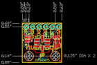
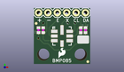
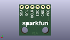
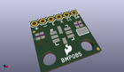

Contents
========

* [PROJ-SPAR-11282-STAN-01>BMP085 Breakout](#proj-spar-11282-stan-01bmp085-breakout)
	* [Images](#images)
	* [Interactive BOM](#interactive-bom)
	* [OOMP Parts](#oomp-parts)
	* [Tags](#tags)
  
![][im]
# PROJ-SPAR-11282-STAN-01>BMP085 Breakout

- ID: PROJ-SPAR-11282-STAN-01
- Hex ID: PRS11282
- Name: BMP085 Breakout
- Description: 

## Images
  
  

|eagleImage|kicadPcb3dFront|kicadPcb3dBack|kicadPcb3d|
| :---: | :---: | :---: | :---: |
|||||

## Interactive BOM

- Interactive BOM page: [ibom.html](kicad/bom/ibom.html)

## OOMP Parts
  

|OOMP Parts|
| :---: |
|CAPC-0402-X-NF100-V50, C1, 2.54, 9.2075, 90,C1, 0.1uF, 0402-CAP, SparkFun, (0.1, 0.3625), R90|
|CAPC-0402-X-NF100-V50, C2, 1.27, 9.2075, 90,C2, 0.1uF, 0402-CAP, SparkFun, (0.05, 0.3625), R90|
|<table><tr><td></td><td> JP1</td><td>[HEAD-I01-X-PI06-01 2.54 mm 6 Pin Header](https://github.com/oomlout/oomlout_OOMP_parts/tree/main/HEAD-I01-X-PI06-01/)</td><td>[H06](https://github.com/oomlout/oomlout_OOMP_parts/tree/main/HEAD-I01-X-PI06-01/)</td></tr></table>|
|RESE-0402-X-UNMATCHED-01, R1, 13.97, 9.2075, 270,R1, 4.7k, 0402-RES, SparkFun, (0.55, 0.3625), R270|
|RESE-0402-X-UNMATCHED-01, R2, 12.7, 9.2075, 270,R2, 4.7k, 0402-RES, SparkFun, (0.5, 0.3625), R270|
|UNMATCHED-UNMATCHED-X-UNMATCHED-01, U1, 7.619999999999999, 7.619999999999999, 0,U1, BMP085, BMP085, SparkFun, (0.3, 0.3), R0|

## Tags

- hexID: PRS11282
- oompType: PROJ
- oompSize: SPAR
- oompColor: 11282
- oompDesc: STAN
- oompIndex: 01
- oompName: BMP085 Breakout
- sources: All source files from https://github.com/sparkfun/BMP085_Breakout (source licence details in srcLicense.md)
- linkBuyPage: https://www.sparkfun.com/products/11282
- oompPart: CAPC-0402-X-NF100-V50, C1, 2.54, 9.2075, 90
- oompPart: CAPC-0402-X-NF100-V50, C2, 1.27, 9.2075, 90
- oompPart: HEAD-I01-X-PI06-01, JP1, 1.27, 13.97, 0
- oompPart: SKIP-UNMATCHED-X-UNMATCHED-01, JP3, 0.635, 11.049, 0
- oompPart: SKIP-UNMATCHED-X-UNMATCHED-01, JP4, 14.604999999999999, 0.635, 0
- oompPart: RESE-0402-X-UNMATCHED-01, R1, 13.97, 9.2075, 270
- oompPart: RESE-0402-X-UNMATCHED-01, R2, 12.7, 9.2075, 270
- oompPart: SKIP-UNMATCHED-X-UNMATCHED-01, SJ1, 13.334999999999999, 6.6674999999999995, 0
- oompPart: UNMATCHED-UNMATCHED-X-UNMATCHED-01, U1, 7.619999999999999, 7.619999999999999, 0
- rawPart: C1, 0.1uF, 0402-CAP, SparkFun, (0.1, 0.3625), R90
- rawPart: C2, 0.1uF, 0402-CAP, SparkFun, (0.05, 0.3625), R90
- rawPart: JP1, 1X06, SparkFun, (0.05, 0.55), R0
- rawPart: JP3, FIDUCIALUFIDUCIAL, MICRO-FIDUCIAL, SparkFun-Aesthetics, (0.025, 0.435), R0
- rawPart: JP4, FIDUCIALUFIDUCIAL, MICRO-FIDUCIAL, SparkFun-Aesthetics, (0.575, 0.025), R0
- rawPart: R1, 4.7k, 0402-RES, SparkFun, (0.55, 0.3625), R270
- rawPart: R2, 4.7k, 0402-RES, SparkFun, (0.5, 0.3625), R270
- rawPart: SJ1, SJ_3_PASTE1&2&3, mike-temp, (0.525, 0.2625), R0
- rawPart: U1, BMP085, BMP085, SparkFun, (0.3, 0.3), R0
- oompID: PROJ-SPAR-11282-STAN-01

[im]: kicadPcb3d_450.png
