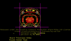
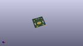

Contents
========

* [PROJ-SPAR-11285-STAN-01>LilyPad Coin Cell Battery Holder-Switched](#proj-spar-11285-stan-01lilypad-coin-cell-battery-holder-switched)
	* [Images](#images)
	* [Interactive BOM](#interactive-bom)
	* [Tags](#tags)
  
![][im]
# PROJ-SPAR-11285-STAN-01>LilyPad Coin Cell Battery Holder-Switched

- ID: PROJ-SPAR-11285-STAN-01
- Hex ID: PRS11285
- Name: LilyPad Coin Cell Battery Holder-Switched
- Description: 

## Images
  
  

|eagleImage|kicadPcb3dFront|kicadPcb3dBack|kicadPcb3d|
| :---: | :---: | :---: | :---: |
|||||

## Interactive BOM

- Interactive BOM page: [ibom.html](kicad/bom/ibom.html)

## Tags

- hexID: PRS11285
- oompType: PROJ
- oompSize: SPAR
- oompColor: 11285
- oompDesc: STAN
- oompIndex: 01
- oompName: LilyPad Coin Cell Battery Holder-Switched
- sources: All source files from https://github.com/sparkfun/LilyPad_Coin_Cell_Battery_Holder-Switched (source licence details in srcLicense.md)
- linkBuyPage: https://www.sparkfun.com/products/11285
- oompID: PROJ-SPAR-11285-STAN-01
- oompParts: BAT1,UNMATCHED-UNMATCHED-UNMATCHED-UNMATCHED-UNMATCHED
- oompParts: BATB-,UNMATCHED-UNMATCHED-UNMATCHED-UNMATCHED-UNMATCHED
- oompParts: BATB-2,UNMATCHED-UNMATCHED-UNMATCHED-UNMATCHED-UNMATCHED
- oompParts: BATT+,UNMATCHED-UNMATCHED-UNMATCHED-UNMATCHED-UNMATCHED
- oompParts: BATT+2,UNMATCHED-UNMATCHED-UNMATCHED-UNMATCHED-UNMATCHED
- oompParts: FRAME1,UNMATCHED-UNMATCHED-UNMATCHED-UNMATCHED-UNMATCHED
- oompParts: LOGO1,UNMATCHED-UNMATCHED-UNMATCHED-UNMATCHED-UNMATCHED
- oompParts: LOGO2,UNMATCHED-UNMATCHED-UNMATCHED-UNMATCHED-UNMATCHED
- oompParts: S1,UNMATCHED-UNMATCHED-UNMATCHED-UNMATCHED-UNMATCHED
- oompParts: U$1,UNMATCHED-UNMATCHED-UNMATCHED-UNMATCHED-UNMATCHED
- rawParts: BAT1,20mm coincell,BATTERY20MM_4LEGS,BATTCON_20MM_4LEGS,Battery Holders,BATT-10373,,20mm coincell,
- rawParts: BATB-,SEWTAP6,SEWTAP6,PETAL-SMALL-2SIDE,Sew Taps for LilyPad Boards.,,,,
- rawParts: BATB-2,SEWTAP6,SEWTAP6,PETAL-SMALL-2SIDE,Sew Taps for LilyPad Boards.,,,,
- rawParts: BATT+,SEWTAP6,SEWTAP6,PETAL-SMALL-2SIDE,Sew Taps for LilyPad Boards.,,,,
- rawParts: BATT+2,SEWTAP6,SEWTAP6,PETAL-SMALL-2SIDE,Sew Taps for LilyPad Boards.,,,,
- rawParts: FD1,FIDUCIALUFIDUCIAL,FIDUCIALUFIDUCIAL,MICRO-FIDUCIAL,Fiducial Alignment Points,,,,
- rawParts: FD2,FIDUCIALUFIDUCIAL,FIDUCIALUFIDUCIAL,MICRO-FIDUCIAL,Fiducial Alignment Points,,,,
- rawParts: FRAME1,FRAME-LETTER,FRAME-LETTER,CREATIVE_COMMONS,Schematic Frame,,,,
- rawParts: LOGO1,SFE_LOGO_FLAME.1_INCH,SFE_LOGO_FLAME.1_INCH,SFE_LOGO_FLAME_.1,SFE Logo, flame only,,,,
- rawParts: LOGO2,OSHW-LOGOS,OSHW-LOGOS,OSHW-LOGO-S,Open Source Hardware Logo,,,,
- rawParts: S1,,SWITCH-SPDTSMD,AYZ0202,SPDT Switch,SWCH-08179,COM-00597,,
- rawParts: U$1,REVISION,REVISION,REVISION,,,,,

[im]: kicadPcb3d_450.png
