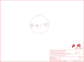

Contents
========

* [PRS11285 > Sparkfun](#prs11285--sparkfun)
	* [Schematic](#schematic)
	* [Interactive BOM](#interactive-bom)
	* [OOMP Parts](#oomp-parts)
	* [Images](#images)
	* [Tags](#tags)
  
![][im]
# PRS11285 > Sparkfun

- ID: PROJ-SPAR-11285-STAN-01
- Hex ID: PRS11285
- Name: Sparkfun
- Description: Sparkfun
- Long Link: [http://oom.lt/PROJ-SPAR-11285-STAN-01](http://oom.lt/PROJ-SPAR-11285-STAN-01)
- Short Link: [http://oom.lt/PRS11285](http://oom.lt/PRS11285)

## Schematic
  

## Interactive BOM

- Interactive BOM page: [ibom.html](https://htmlpreview.github.io/?https://github.com/oomlout/oomlout_OOMP_projects/blob/main/PROJ-SPAR-11285-STAN-01/kicad/bom/ibom.html)

## OOMP Parts
  

|OOMP Parts|
| :---: |
|BAT1,UNMATCHED-UNMATCHED-UNMATCHED-UNMATCHED-UNMATCHED,BAT1,20mm coincell,BATTERY20MM_4LEGS,BATTCON_20MM_4LEGS,Battery Holders,BATT-10373,,20mm coincell,|
|BATB-,UNMATCHED-UNMATCHED-UNMATCHED-UNMATCHED-UNMATCHED,BATB-,SEWTAP6,SEWTAP6,PETAL-SMALL-2SIDE,Sew Taps for LilyPad Boards.,,,,|
|BATB-2,UNMATCHED-UNMATCHED-UNMATCHED-UNMATCHED-UNMATCHED,BATB-2,SEWTAP6,SEWTAP6,PETAL-SMALL-2SIDE,Sew Taps for LilyPad Boards.,,,,|
|BATT+,UNMATCHED-UNMATCHED-UNMATCHED-UNMATCHED-UNMATCHED,BATT+,SEWTAP6,SEWTAP6,PETAL-SMALL-2SIDE,Sew Taps for LilyPad Boards.,,,,|
|BATT+2,UNMATCHED-UNMATCHED-UNMATCHED-UNMATCHED-UNMATCHED,BATT+2,SEWTAP6,SEWTAP6,PETAL-SMALL-2SIDE,Sew Taps for LilyPad Boards.,,,,|
|FRAME1,UNMATCHED-UNMATCHED-UNMATCHED-UNMATCHED-UNMATCHED,FD1,FIDUCIALUFIDUCIAL,FIDUCIALUFIDUCIAL,MICRO-FIDUCIAL,Fiducial Alignment Points,,,,|
|LOGO1,UNMATCHED-UNMATCHED-UNMATCHED-UNMATCHED-UNMATCHED,FD2,FIDUCIALUFIDUCIAL,FIDUCIALUFIDUCIAL,MICRO-FIDUCIAL,Fiducial Alignment Points,,,,|
|LOGO2,UNMATCHED-UNMATCHED-UNMATCHED-UNMATCHED-UNMATCHED,FRAME1,FRAME-LETTER,FRAME-LETTER,CREATIVE_COMMONS,Schematic Frame,,,,|
|S1,UNMATCHED-UNMATCHED-UNMATCHED-UNMATCHED-UNMATCHED,LOGO1,SFE_LOGO_FLAME.1_INCH,SFE_LOGO_FLAME.1_INCH,SFE_LOGO_FLAME_.1,SFE Logo, flame only,,,,|
|U$1,UNMATCHED-UNMATCHED-UNMATCHED-UNMATCHED-UNMATCHED,LOGO2,OSHW-LOGOS,OSHW-LOGOS,OSHW-LOGO-S,Open Source Hardware Logo,,,,|

## Images
  
  

|kicadPcb3d|kicadPcb3dFront|kicadPcb3dBack|eagleImage|eagleSchemImage|
| :---: | :---: | :---: | :---: | :---: |
||||||

## Tags

- hexID: PRS11285
- oompType: PROJ
- oompSize: SPAR
- oompColor: 11285
- oompDesc: STAN
- oompIndex: 01
- oompName: LilyPad Coin Cell Battery Holder-Switched
- sources: All source files from https://github.com/sparkfun/LilyPad_Coin_Cell_Battery_Holder-Switched (source licence details in srcLicense.md)
- linkBuyPage: https://www.sparkfun.com/products/11285
- oompID: PROJ-SPAR-11285-STAN-01
- oompParts: BAT1,UNMATCHED-UNMATCHED-UNMATCHED-UNMATCHED-UNMATCHED
- oompParts: BATB-,UNMATCHED-UNMATCHED-UNMATCHED-UNMATCHED-UNMATCHED
- oompParts: BATB-2,UNMATCHED-UNMATCHED-UNMATCHED-UNMATCHED-UNMATCHED
- oompParts: BATT+,UNMATCHED-UNMATCHED-UNMATCHED-UNMATCHED-UNMATCHED
- oompParts: BATT+2,UNMATCHED-UNMATCHED-UNMATCHED-UNMATCHED-UNMATCHED
- oompParts: FRAME1,UNMATCHED-UNMATCHED-UNMATCHED-UNMATCHED-UNMATCHED
- oompParts: LOGO1,UNMATCHED-UNMATCHED-UNMATCHED-UNMATCHED-UNMATCHED
- oompParts: LOGO2,UNMATCHED-UNMATCHED-UNMATCHED-UNMATCHED-UNMATCHED
- oompParts: S1,UNMATCHED-UNMATCHED-UNMATCHED-UNMATCHED-UNMATCHED
- oompParts: U$1,UNMATCHED-UNMATCHED-UNMATCHED-UNMATCHED-UNMATCHED
- rawParts: BAT1,20mm coincell,BATTERY20MM_4LEGS,BATTCON_20MM_4LEGS,Battery Holders,BATT-10373,,20mm coincell,
- rawParts: BATB-,SEWTAP6,SEWTAP6,PETAL-SMALL-2SIDE,Sew Taps for LilyPad Boards.,,,,
- rawParts: BATB-2,SEWTAP6,SEWTAP6,PETAL-SMALL-2SIDE,Sew Taps for LilyPad Boards.,,,,
- rawParts: BATT+,SEWTAP6,SEWTAP6,PETAL-SMALL-2SIDE,Sew Taps for LilyPad Boards.,,,,
- rawParts: BATT+2,SEWTAP6,SEWTAP6,PETAL-SMALL-2SIDE,Sew Taps for LilyPad Boards.,,,,
- rawParts: FD1,FIDUCIALUFIDUCIAL,FIDUCIALUFIDUCIAL,MICRO-FIDUCIAL,Fiducial Alignment Points,,,,
- rawParts: FD2,FIDUCIALUFIDUCIAL,FIDUCIALUFIDUCIAL,MICRO-FIDUCIAL,Fiducial Alignment Points,,,,
- rawParts: FRAME1,FRAME-LETTER,FRAME-LETTER,CREATIVE_COMMONS,Schematic Frame,,,,
- rawParts: LOGO1,SFE_LOGO_FLAME.1_INCH,SFE_LOGO_FLAME.1_INCH,SFE_LOGO_FLAME_.1,SFE Logo, flame only,,,,
- rawParts: LOGO2,OSHW-LOGOS,OSHW-LOGOS,OSHW-LOGO-S,Open Source Hardware Logo,,,,
- rawParts: S1,,SWITCH-SPDTSMD,AYZ0202,SPDT Switch,SWCH-08179,COM-00597,,
- rawParts: U$1,REVISION,REVISION,REVISION,,,,,

[im]: kicadPcb3d_450.png
