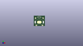

Contents
========

* [PROJ-SPAR-11285-STAN-01>LilyPad Coin Cell Battery Holder-Switched](#proj-spar-11285-stan-01lilypad-coin-cell-battery-holder-switched)
	* [Images](#images)
	* [Interactive BOM](#interactive-bom)
	* [OOMP Parts](#oomp-parts)
	* [Tags](#tags)
  
![][im]
# PROJ-SPAR-11285-STAN-01>LilyPad Coin Cell Battery Holder-Switched

- ID: PROJ-SPAR-11285-STAN-01
- Hex ID: PRS11285
- Name: LilyPad Coin Cell Battery Holder-Switched
- Description: 

## Images
  
  

|eagleImage|kicadPcb3dFront|kicadPcb3dBack|kicadPcb3d|
| :---: | :---: | :---: | :---: |
|||||

## Interactive BOM

- Interactive BOM page: [ibom.html](kicad/bom/ibom.html)

## OOMP Parts
  

|OOMP Parts|
| :---: |
|ERROR, BAT1 20mm coincell, 0, 0, 0,BAT1, 20mm, coincell, BATTCON_20MM_4LEGS, SparkFun-Electromechanical, (0.63, 0.445), R0|
|UNMATCHED-UNMATCHED-X-UNMATCHED-01, BATB-, 7.543799999999999, 2.413, 0,BATB-, SEWTAP6, PETAL-SMALL-2SIDE, LilyPad-Wearables, (0.297, 0.095), R0|
|UNMATCHED-UNMATCHED-X-UNMATCHED-01, BATB-2, 25.1714, 2.413, 0,BATB-2, SEWTAP6, PETAL-SMALL-2SIDE, LilyPad-Wearables, (0.991, 0.095), R0|
|UNMATCHED-UNMATCHED-X-UNMATCHED-01, BATT+, 5.588, 23.241, 245,BATT+, SEWTAP6, PETAL-SMALL-2SIDE, LilyPad-Wearables, (0.22, 0.915), R245|
|UNMATCHED-UNMATCHED-X-UNMATCHED-01, BATT+2, 26.593799999999998, 23.241, 115,BATT+2, SEWTAP6, PETAL-SMALL-2SIDE, LilyPad-Wearables, (1.047, 0.915), R115|
|UNMATCHED-UNMATCHED-X-UNMATCHED-01, S1, 16.002, 26.034999999999997, 180,S1, AYZ0202, SparkFun-Electromechanical, (0.63, 1.025), R180|

## Tags

- hexID: PRS11285
- oompType: PROJ
- oompSize: SPAR
- oompColor: 11285
- oompDesc: STAN
- oompIndex: 01
- oompName: LilyPad Coin Cell Battery Holder-Switched
- sources: All source files from https://github.com/sparkfun/LilyPad_Coin_Cell_Battery_Holder-Switched (source licence details in srcLicense.md)
- linkBuyPage: https://www.sparkfun.com/products/11285
- oompPart: ERROR, BAT1 20mm coincell, 0, 0, 0
- oompPart: UNMATCHED-UNMATCHED-X-UNMATCHED-01, BATB-, 7.543799999999999, 2.413, 0
- oompPart: UNMATCHED-UNMATCHED-X-UNMATCHED-01, BATB-2, 25.1714, 2.413, 0
- oompPart: UNMATCHED-UNMATCHED-X-UNMATCHED-01, BATT+, 5.588, 23.241, 245
- oompPart: UNMATCHED-UNMATCHED-X-UNMATCHED-01, BATT+2, 26.593799999999998, 23.241, 115
- oompPart: SKIP-UNMATCHED-X-UNMATCHED-01, FD1, 29.784040507999997, 17.31518127, 0
- oompPart: SKIP-UNMATCHED-X-UNMATCHED-01, FD2, 4.752340508, 5.12571873, 0
- oompPart: UNMATCHED-UNMATCHED-X-UNMATCHED-01, S1, 16.002, 26.034999999999997, 180
- rawPart: BAT1, 20mm, coincell, BATTCON_20MM_4LEGS, SparkFun-Electromechanical, (0.63, 0.445), R0
- rawPart: BATB-, SEWTAP6, PETAL-SMALL-2SIDE, LilyPad-Wearables, (0.297, 0.095), R0
- rawPart: BATB-2, SEWTAP6, PETAL-SMALL-2SIDE, LilyPad-Wearables, (0.991, 0.095), R0
- rawPart: BATT+, SEWTAP6, PETAL-SMALL-2SIDE, LilyPad-Wearables, (0.22, 0.915), R245
- rawPart: BATT+2, SEWTAP6, PETAL-SMALL-2SIDE, LilyPad-Wearables, (1.047, 0.915), R115
- rawPart: FD1, FIDUCIALUFIDUCIAL, MICRO-FIDUCIAL, SparkFun-Aesthetics, (1.17260002, 0.68170005), R0
- rawPart: FD2, FIDUCIALUFIDUCIAL, MICRO-FIDUCIAL, SparkFun-Aesthetics, (0.18710002, 0.20179995), R0
- rawPart: S1, AYZ0202, SparkFun-Electromechanical, (0.63, 1.025), R180
- oompID: PROJ-SPAR-11285-STAN-01

[im]: kicadPcb3d_450.png
